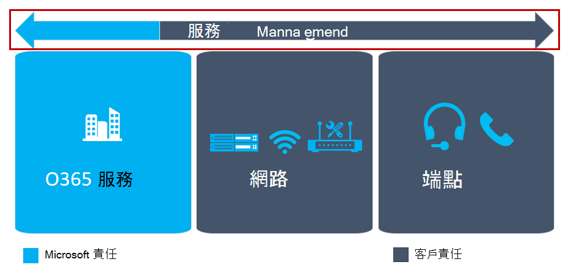

# 規劃我的服務管理Plan my service management

本文概述傳送和維護高品質 Microsoft 團隊部署所需的需求。This article gives an overview of the requirements that are necessary to deliver and maintain a high-quality Microsoft Teams deployment. 您可以在進行第一次試驗或生產部署前，在構想階段規劃服務管理和品質，以協助確保順利進行部署。You can help ensure a successful deployment by planning for service management and quality during the Envision phase, before your first pilot or production deployment.

## 團隊的服務管理Service management for Teams

服務管理是一個廣泛的主題，涵蓋在部署並為使用者啟用 Microsoft 團隊服務之後的日常作業。Service management is a broad topic that covers day-to-day operations of the Microsoft Teams service after it has been deployed and enabled for users. [團隊服務] 包含 Microsoft Office 365 和部署于內部部署的基礎結構元件（例如 [網路]）。The Teams service encompasses Microsoft Office 365 and the infrastructure components that are deployed on-premises (for example, networking).

服務管理的概念很可能不是大多陣列織的新概念。The notion of service management is most likely not a new concept for most organizations. 您可能已經實現與現有服務相關聯的進程和工作。You probably have already implemented processes and tasks that are associated with existing services. 如此一來，您可能會在規劃服務管理時補充所需的內容，以備日後支援 Microsoft 團隊。That said, you can probably augment what you have in place when you plan for service management today to support Microsoft Teams in the future.

服務管理包括管理 Microsoft 團隊端到端的所有活動與程式。Service management encompasses all the activities and processes involved in managing Microsoft Teams end to end. 服務管理的部分元件（由 Office 365 服務本身所組成的基礎結構元件）是 Microsoft 的責任，而客戶對其使用者負責管理團隊、網路和的各個方面。其提供的端點。Some components of service management—the infrastructure components that the Office 365 service itself comprises—are Microsoft’s responsibility, whereas the customer is accountable to its users to manage the various aspects of Teams, the network, and endpoints they provide.
如需團隊服務管理的客戶責任以及其與 underpin 使用者體驗品質的關鍵元件的完整討論，請參閱[規劃服務管理和品質](https://docs.microsoft.com/MicrosoftTeams/prepare-network)。For a complete discussion of the customer responsibility for Teams service management and how it relates to the key components that underpin the quality of the user experience, see [Plan for service management and quality](https://docs.microsoft.com/MicrosoftTeams/prepare-network).

<!--ENDOFSECTION-->

## 操作指南簡介Introduction to the Operations Guide 

**何謂**、**誰**，以及**如何**在服務管理方面需要解答的三個重要問題。**What**, **Who**, and **How** are three important questions that need to be answered when it comes to service management.

您可以使用 [[操作指南](https://docs.microsoft.com/MicrosoftTeams/1-drive-value-operate-my-service)] 協助您解決這三個問題。You can use the [Operations Guide](https://docs.microsoft.com/MicrosoftTeams/1-drive-value-operate-my-service) to help you address all three of these questions. 本指南提供每日、每週、每月以及視需要執行的活動清單。The guide provides a list of activities to be performed on a daily, weekly, monthly, and as-needed basis. 這些活動和工作對於維護高品質的小組部署而言是至關重要的。These activities and tasks are critical for maintaining a high-quality Teams deployment. 決定要在服務管理中執行特定活動的人員，是規劃的一個重要層面，您需要儘早在 Envision 階段進行，以確保順利進行部署。Determining who will be responsible for performing specific activities in service management is a critical aspect of your planning that you need to do early in the Envision phase to ensure a successful deployment. 在您發現任務和活動之後，必須先瞭解這些工作和活動，然後再按您指派給他們的群組或人員。After you’ve figured out the tasks and activities, they need to be understood and followed by the groups or individuals that you assign to them. 本操作指南針對如何執行每項工作以及/或外部內容的參考，提供相關知識與指導方針。The Operations Guide provides knowledge and guidance for how to perform each of the tasks, and/or references to outside content.

## 規劃操作角色對應Plan for operational role mapping

儘早規劃服務管理是一個重要的里程碑，因為「操作階段」是在第一個試驗使用者啟用時開始。Planning for service management early is a critical milestone, because the operations phase begins when the first pilot users are enabled. 專案小組必須審查並同意所需的工作與活動，找出負責每個作業任務的小組，然後從各個小組取得承諾並登出。The project team must review and agree on the tasks and activities required, identify the team that’s responsible for each operational task, and then get a commitment and sign-off from each respective team.

登出完成後，負責的小組必須開始 operationalizing 這些角色和職責。After sign-off is complete, the responsible team must then start operationalizing these roles and responsibilities. 這可能包括訓練與準備、更新人力資源模型，或確保外部合作夥伴已準備好交付。This might include training and readiness, updating the staffing model, or ensuring that external partners are ready to deliver.

在 Envision 階段的初期對應運營角色，可讓所有團隊在試驗和加速作業期間開始其運作工作，並確保部署開始之後一切都已準備好。Mapping operational roles early in the Envision phase enables all teams to start their operational tasks during the pilot and ramp up operations and make sure that everything is ready after the deployment starts.

本操作指南提供對應至一般角色的一般工作清單，這些工作應該在大多數情況下都有效。The Operations Guide provides a list of common tasks mapped to typical roles that should be valid in most scenarios. 您必須自訂這些職責，才能為您的組織作業。You need to customize these responsibilities to work for your organization.

>[!TIP]
>下列是一個範本範例，可將您執行以支援此專案的操作角色對應練習的結果進行記錄。The following is an example of a template to document the result of operational roles mapping exercise that you performed to support this project.

|操作角色Operational Role |描述Description |團隊Team |連絡人詳細資料Contact Details |
|---------|---------|---------|---------|
|服務擁有者Service Owner|服務擁有者、公司分部介面、戰略Service owner, interface to business divisions, strategy|TBATBA|TBATBA|
|音訊會議作業Audio Conferencing Operations|每日作業、使用者和裝置帳戶移動/新增/變更、監控Daily operations, user and device account move/add/change, monitoring|TBATBA| TBATBA| 
|租使用者管理員Tenant Admin|變更整個租使用者的設定、啟用新功能Change tenant-wide settings, enable new features|TBATBA|TBATBA|
|技術支援中心Help Desk|使用者取得支援的介面Interface for users to get support|TBATBA|TBATBA|
|網路作業Network Operations|執行局域網、WAN、Wi-fi 和網際網路存取Run LAN, WAN, Wi-Fi, and internet access|TBATBA|TBATBA|
|用戶端 & 端點小組Client & Endpoints Team|管理桌面部署Manage desktop deployments|TBATBA|TBATBA|
|身分識別作業Identity Operations|管理身分識別結構（Active Directory、Active Directory Federation Services、Azure AD）Manage identity infrastructure (Active Directory, Active Directory Federation Services, Azure AD)|TBATBA|TBATBA|
|採納/變更管理Adoption/Change Management|管理解決方案的意識、訓練及採納Manage awareness, training, and adoption for the solution|TBATBA|TBATBA|
|Exchange 操作Exchange Operations|管理 Exchange 環境Manage the Exchange environment|TBATBA|TBATBA|
|電話作業Telephony Operations|管理 SBC 和電話號碼Manage the SBC's and the phone numbers|TBATBA|TBATBA|

<!--ENDOFSECTION-->

## 品質擁護者角色The Quality Champion role

群組或個人需要負責所有組織中的品質。A group or individual needs to be accountable for quality in all organizations.
這是服務管理中最重要的角色。This is the most important role in service management. 品質擁護者是指派給人員或群組的客戶角色，他們會熱情他們的使用者經驗。The quality champion is a customer role that's assigned to a person or group who is passionate about their users' experience. 這個角色需要技能來識別環境中的趨勢，以及與其他團隊合作來促進修正的贊助。This role requires the skills to identify trends in the environment and the sponsorship to work with other teams to drive remediation.
品質擁護者的最佳候選方案通常是客戶服務擁有者，他們可以根據組織的大小與複雜性而定，誰是熱情使用者體驗的人員或群組。The best candidate for the quality champion is typically the customer service owner, who—depending on the organization’s size and complexity—could be any person or group who is passionate about user experience.

[品質擁護者] 利用現有的工具與已記錄的程式，例如 [通話品質儀表板] （CQD）和 [品質體驗檢查指南]，以監控使用者體驗、識別品質趨勢，以及在必要時進行磁片磁碟機修正。The quality champion leverages existing tools and documented processes, such as the Call Quality Dashboard (CQD) and the Quality Experience Review Guide, to monitor user experience, identify quality trends, and drive remediation where needed. 品質擁護者與各個小組合作，以促進修正動作，向指導委員會報告其進度和開啟的問題。The quality champion works with the respective teams to drive remediation actions, reporting to a steering committee on their progress and open issues.

[作業指南] 中記錄了與角色相關聯的工作和活動。The tasks and activities associated with the role are documented in the Operations Guide. 這個角色應該在構想階段中儘早指派。This role should be assigned early in the Envision phase. Operationalizing 品質擁護者角色的主要步驟是取得該角色所需的知識，並確保準備好要提供該工作所需的預備作業。A key step in operationalizing the role of Quality Champion is gaining the knowledge required for the role and ensuring the prerequisites are in place to deliver on the tasks. 此角色的主要工作是執行定期品質體驗審查。A key task for this role is running a regular Quality Experience Review.

<!--ENDOFSECTION-->

## [品質體驗回顧指南] 簡介Introduction to the Quality Experience Review Guide

[品質體驗檢查指南] 中有一組活動，可針對改善使用者體驗的主要區域評估並提供修正指導方針，如下圖所示。The Quality Experience Review Guide has a set of activities that assess and provide remediation guidance in key areas that have the greatest impact for improving user experience, as shown in the figure below.

透過不斷評估與修正本檔中所述的區域，您可以減少對使用者經驗造成負面影響的可能性。By continually assessing and remediating the areas described in this document, you can reduce their potential to negatively affect user experience. 在部署中遇到的大多數使用者體驗問題，都可以分為下列類別：Most user-experience problems encountered in a deployment can be grouped into the following categories:

-   防火牆或 proxy 配置不完整Incomplete firewall or proxy configuration

-   低 wi-fi 覆蓋範圍Poor Wi-Fi coverage

-   頻寬不足Insufficient bandwidth

-   點對點VPN

-   使用未優化或內建的音訊裝置Use of unoptimized or built-in audio devices

-   有問題的子網或網路裝置Problematic subnets or network devices

[品質體驗回顧指南] 中所提供的指導方針主要是使用 [通話品質儀表板（CQD）] 作為主要工具來報告和調查所述的每個區域，並將焦點放在音訊上以最大化採納與影響。The guidance provided in the Quality Experience Review Guide focuses on using Call Quality Dashboard (CQD) Online as the primary tool to report and investigate each area described, with a focus on audio to maximize adoption and impact. 針對網路所做的任何優化，以改善音訊體驗，也會直接翻譯成影片和桌面共用的改良功能。Any optimizations made to the network to improve the audio experience will also directly translate to improvements in video and desktop sharing.

我們強烈建議您提前提名品質擁護者。We highly recommend that you nominate the quality champion early on. 命名之後，他們應該開始熟悉[品質體驗回顧指南](https://aka.ms/qerguide)中的內容。After being nominated, they should start to familiarize themselves with the content in the [Quality Experience Review Guide](https://aka.ms/qerguide).

<table>
<tr><td>  決策點Decision points</td><td><ul><li>決定誰負責貴組織中的雲端語音作業。Decide who is accountable for cloud voice operations in your organization.</li></ol></td></tr>
<tr><td> 後續步驟Next steps</td><td><ul><li>下載 [服務管理的規劃] 完整指南。Download the Planning for Service Management full guide.</li><li>下載 [品質體驗回顧指南]。Download the Quality Experience Review guide.</li><li>完整回顧 [操作指南]。Review the Operations Guide in full.</li><li>將所有指南提供給每個作業小組成員，以進行審查並熟悉作業需求。Provide all guides to every operations team members to review and be familiar with operations requirements.</li></ol></td></tr>
</table>

<!--ENDOFSECTION-->