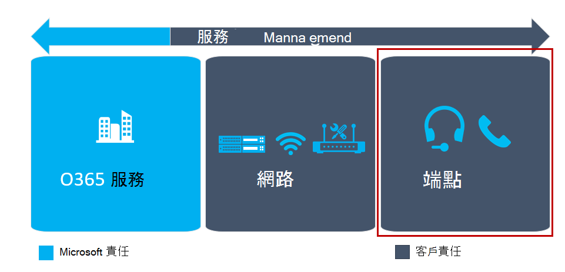

# 規劃我的使用者體驗Plan my users’ experience

本文概述正確識別您的雲端語音服務部署元素的需求，這些專案會直接影響您的使用者體驗。This article gives an overview of the requirements for properly identifying the elements of your cloud voice services deployment that directly affect your users’ experience. 在部署之前先準備好這些專案，就能增加成功為使用者提供高品質、可靠體驗的機會。By preparing for these items before deployment, you’ll increase your chances of successfully delivering a high-quality, reliable experience for users. 

## 用戶端部署Client deployment

Microsoft 團隊擁有可供 web、桌面（Windows 和 Mac）及行動裝置（Android 與 iOS）使用的用戶端。Microsoft Teams has clients available for web, desktop (Windows and Mac), and mobile (Android and iOS). 如需如何安裝桌面（Windows 和 Mac）與行動用戶端的其他詳細資料，請參閱[取得 Microsoft 團隊的用戶端](https://docs.microsoft.com/microsoftteams/get-clients)。For additional details about how the desktop (Windows and Mac) and mobile clients are installed, see [Get clients for Microsoft Teams](https://docs.microsoft.com/microsoftteams/get-clients).

## 用戶端更新Client updates

團隊的其中一個主要優點是，用戶端會自動保持為最新狀態。One of the key benefits of Teams is that the client is kept up to date automatically. PC 和 Mac 上的用戶端會使用背景處理常式來更新，在 app 空閒時檢查新的組建並下載新的用戶端。The clients on the PC and Mac are updated by using a background process that checks for new builds and downloads the new client when the app is idle.

<!--ENDOFSECTION-->

## 規劃端點品質Plan for endpoint quality

在下圖中您可以看到，端點是提供使用者品質體驗的重要組建區塊。As you can see from the diagram below, endpoints are an important building block in providing a quality experience for users.

團隊端點可以在許多裝置上執行，包括 Pc、Mac、平板電腦和行動裝置。Teams endpoints can run on many devices, including PCs, Macs, tablets, and mobile devices. 部分體驗不僅包括裝置，而且使用者如何連線到裝置，例如使用裝置內建的麥克風/喇叭、earbuds 或優化的耳機。Part of the experience not only encompasses the device, but how a user connects to the device—for example, using the device’s built-in mic/speaker, earbuds, or an optimized headset. 使用優化的耳機可豐富整體使用者體驗。Using an optimized headset can enrich the overall user experience.

下列針對端點規劃的指導方針可協助您確保貴組織成功地使用團隊加入了您的組織。The following guidance on endpoint planning will help you ensure your organization has a successful onboarding experience with Teams.

## 端點功能Endpoint capability

規劃中的第一個部分是確保貴組織中的所有電腦和其他裝置都能執行團隊。The first part of planning is to ensure all the PCs and other devices in your organization can run Teams. 這涉及不只是查看硬體需求，還需要瞭解電腦在背景執行的其他動作。This involves not just looking at the hardware requirements, but also understanding what else the PC is doing in the background. 許多組織會執行其他軟體，包括入侵偵測系統和反惡意程式碼，這可能會影響裝置的基本效能。Many organizations run other software, including intrusion detection systems and antimalware software, which can affect the base performance of a device.

如需每個平臺（網頁、桌面及行動裝置）上團隊用戶端軟體需求的相關資訊，請參閱[取得 Microsoft 團隊的用戶端](https://docs.microsoft.com/microsoftteams/get-clients)。For information about the software requirements for Teams clients on each platform (web, desktop, and mobile), see [Get clients for Microsoft Teams](https://docs.microsoft.com/microsoftteams/get-clients).

## 端點防火牆Endpoint firewalls

用戶端防火牆對使用者體驗的影響可能會有很大的影響。Client-side firewalls can have a significant impact on the user experience.
用戶端防火牆可能會影響通話品質，除了可防止通話的建立。Client-side firewalls can affect call quality in addition to preventing a call from being established. 根據[Office 365 url 和 IP 位址範圍](https://aka.ms/o365ips)中的資訊，在用戶端防火牆上設定適當的排除。Configure the appropriate exclusions on the client firewall based on the information in [Office 365 URLs and IP address ranges](https://aka.ms/o365ips). 您的協力廠商廠商將提供有關如何建立排除項的特定指導方針。Your third-party vendor will have specific guidance on how to create the exclusions.

>[!NOTE]
> Microsoft 團隊會自動使用適當的防火牆設定來更新 Windows 防火牆。Microsoft Teams will automatically update the Windows Firewall with an appropriate firewall configuration.

## 端點的 wi-fi 建議Wi-Fi recommendations for endpoints

需要進行大量規劃，才能部署已優化的 Wi-fi 網路，以支援 Microsoft 團隊中的即時工作負載。It takes significant planning to deploy an optimized Wi-Fi network to support real-time workloads in Microsoft Teams. 下列各節提供一些一般指導方針，可協助您在規劃端點時避免常見的錯誤。The following sections provide some general guidance that can help you avoid common pitfalls when planning for endpoints.

### Wi-fi 驅動程式Wi-Fi drivers

某些 Wi-fi 驅動程式可能會造成問題。Some Wi-Fi drivers can be problematic. 例如，驅動程式在存取點之間可能會有非常嚴格的漫遊行為，導致通話品質不佳。As an example, a driver might have very aggressive roaming behaviors between access points, causing poor call quality.
這不是常見的情況，但請務必確保電腦上的 Wi-fi 驅動程式已在部署之前更新並經過測試。This isn’t a common occurrence, but it’s important to ensure that Wi-Fi drivers on the PC have been updated and tested prior to deployment.

### Wi-fi 區段Wi-Fi bands

目前在 Wi-fi 裝置、2.4 GHz 和 5.0 GHz 中，主要使用兩種類型的區段。There are primarily two types of bands used in Wi-Fi equipment today, 2.4 GHz and 5.0 GHz. 如果您的組織同時提供兩個頻帶，您應該將您的驅動程式設定設定為優先使用 5.0 GHz 區段。If your organization provides both bands, you should configure your driver settings to prefer the 5.0 GHz band. 此區段在輸送量方面是很大的 denser，而且受到 2.4 GHz 區段干擾的影響較小。This band is much denser in terms of throughput and is less affected by the interference seen in the 2.4 GHz band.
此建議假設您已正確優化 5.0 GHz 網路區段。This recommendation assumes that you’ve properly optimized the 5.0 GHz network band.

### Wi-fi 無線電類型Wi-Fi radio type

規劃支援新版 Wi-fi 無線電類型的裝置。Plan for devices that support the newer Wi-Fi radio types. 如果您在您所設定的裝置上，利用 802.11 ac 或更新版本，就能取得良好的 Wi-fi 效能。You can get very good Wi-Fi performance if you leverage 802.11ac or newer on the devices you provision.

### 無線回避Wireless avoidance

有些組織傾向于完全避免使用 Wi-fi。Some organizations prefer to avoid Wi-Fi altogether. 在某些情況下，此指導方針是透過將使用者直接連線至有線網路的建議提供的。Sometimes this guidance is provided through a recommendation to users to connect directly to a wired network. 在某些情況下，網路系結順序可能會有最佳的無線連線，而且即使電腦已連接至有線連線，仍會繼續使用該連線。In some cases, the network binding order might have the wireless connection preferred and continue to use that connection even though the PC is connected to the wired connection. 若要避免此意外行為，請設定系結順序來避免這種情況。To avoid this unintended behavior, configure the binding order to avoid this scenario.

### 802.11 省電通訊協定802.11 Power Save protocol

如果您的組織使用的無線存取點或路由器不支援802.11 節能通訊協定，在 Windows 裝置上執行的 Microsoft 團隊中，您可能會遇到通話中斷或太差的通話品質。If your organization uses wireless access points or routers that don’t support the 802.11 Power Save protocol, you might experience dropped calls or poor call quality in Microsoft Teams running on Windows devices. 如果無法升級您的無線存取點或路由器，您應該在以電池電源執行的裝置上更新 Windows 電源配置設定。If it’s not possible to upgrade your wireless access point or routers, you should update Windows Power Plan settings on devices that run on battery power. 下列[支援文章](https://support.microsoft.com/help/928152/you-may-experience-connectivity-issues-or-performance-issues-when-you)中提供了進一步的詳細資訊和設定指導方針。Further detail and configuration guidance is provided in the following [support article](https://support.microsoft.com/help/928152/you-may-experience-connectivity-issues-or-performance-issues-when-you).

<table>
<tr><td>  決策點Decision points</td><td><ul><li>貴組織中將部署哪些團隊用戶端？What Teams clients will be deployed in your organization?</li><li>您要如何開始將團隊用戶端部署到您的使用者？How will you initially deploy Teams clients to your users?</li><li>誰負責評估端點和裝置，以驗證他們是否符合品質體驗的小組需求？Who is responsible for evaluating endpoints and devices to validate they meet Teams requirements for a quality experience?</li></ul></td></tr>
<tr><td> 後續步驟Next steps</td><td><ul><li>記錄部署團隊用戶端所遵循的步驟。Document the process that will be followed to deploy Teams clients.</li><li>評估端點和裝置，並需要執行與修正。Evaluate endpoints and devices and perform and remediation required.</li></ul></td></tr>
</table>

<!--ENDOFSECTION-->

## 團隊裝置Devices for Teams

Microsoft 團隊可以用於會議或作為電話系統。Microsoft Teams can be used for meetings or as a phone system. 使用這些功能時，小組所用的介面裝置在使用者體驗中起著重要的作用。When using these features, the interface device that is used for Teams plays an important role in the user experience.

如果您使用的是內建電腦喇叭和麥克風，擁有該設定的使用者就可能會聽到聲音。Using a built-in PC speaker and microphone might sound acceptable to the user who has that configuration. 但一般來說，這些裝置並未針對雜訊取消進行優化，而且任何類型的環境干擾都可能對通話中其他人產生下游影響。But typically, those devices aren’t optimized for noise cancellation, and any type of ambient noise can have a downstream impact on others on the call. 利用針對這些案例優化的裝置將有助於確保高品質的體驗。Leveraging devices optimized for these scenarios will help ensure a high-quality experience.

每個裝置都必須符合您的使用者需求。Each device needs to meet the needs of your users. 您必須針對貴組織中的不同角色和使用案例，調整裝置（例如耳機）。You’ll need to tailor devices such as headsets for the different personas and use cases in your organization.
在規劃程式中應完成角色對裝置的對應練習。A persona-to-device mapping exercise should be completed as part of the planning process.

選取裝置之後，請將它們包含在最終驗證的試驗測試方案中。After you’ve selected the devices, include them in the pilot test plan for final validation. 在試驗期間利用調查來收集意見反應，以確保您的裝置策略是最佳的。Leverage surveys during the pilot to collect feedback to ensure your device strategy is optimal.

> [!NOTE]
> 目前，我們建議使用透過商務用 Skype 認證計畫認證的音訊裝置。At this time, we recommend using audio devices that were certified through the Skype for Business Certification program. 若要尋找此程式下認證的裝置，請參閱[Microsoft 團隊裝置](https://products.office.com/en-us/microsoft-teams/across-devices/devices)和[USB 音訊與視頻裝置](https://docs.microsoft.com/SkypeForBusiness/certification/devices-usb-devices)。To find devices certified under this program, see the [Microsoft Teams devices](https://products.office.com/en-us/microsoft-teams/across-devices/devices) and [USB audio and video devices](https://docs.microsoft.com/SkypeForBusiness/certification/devices-usb-devices).

<table>
<tr><td>  決策點Decision points</td><td><ul><li>決定您組織的整體裝置策略，以取得使用者和會議室的體驗。Decide on your organization’s overall device strategy for user and meeting room experiences.</li></ul></td></tr>
<tr><td> 後續步驟Next steps</td><td><ul><li>針對您的組織完成角色對裝置對應練習。Complete a persona-to-device mapping exercise for your organization.</li><li>記錄為使用者和會議室取得裝置的程式。Document the process for obtaining devices for users and meeting rooms.</li><li>為使用者和會議室的部署和設定裝置記錄程式。Document the process for deploying and configuration devices for users and meeting rooms.</li><li>購買初始裝置以開始您的部署。Procure initial devices to begin your deployment.</li></ul></td></tr>
</table>

<!--ENDOFSECTION-->
