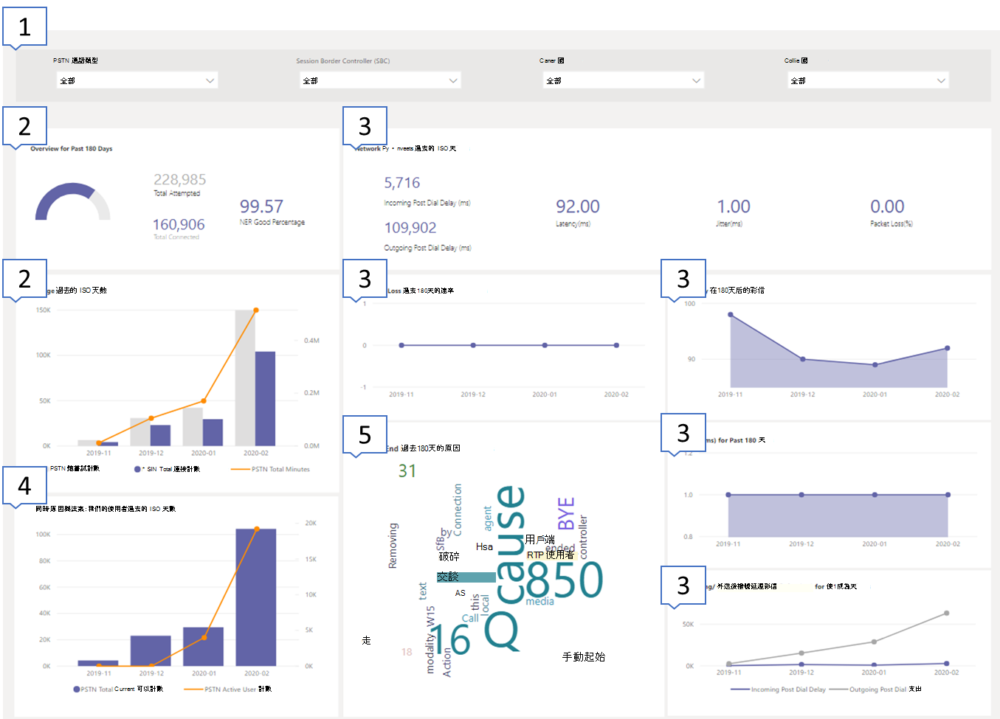
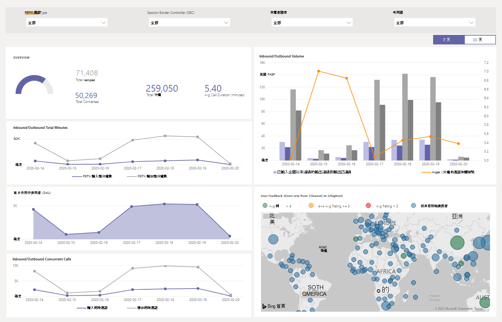
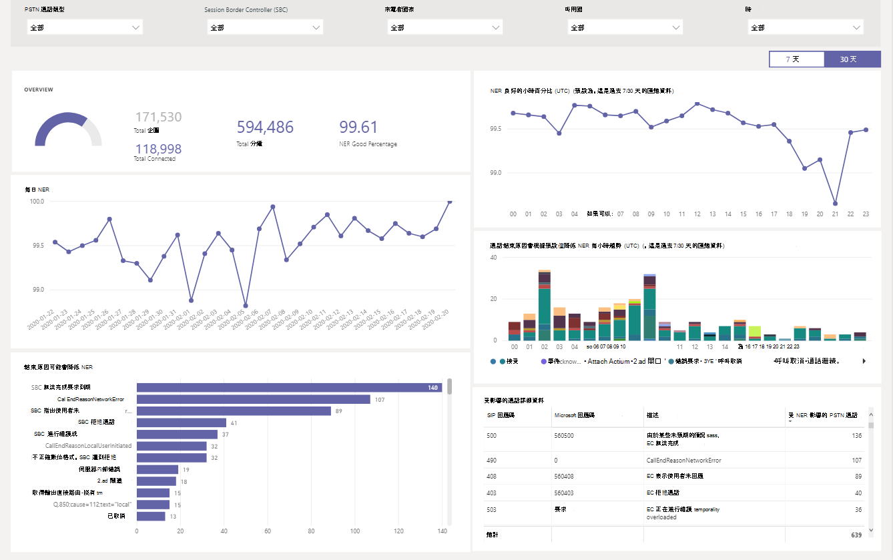
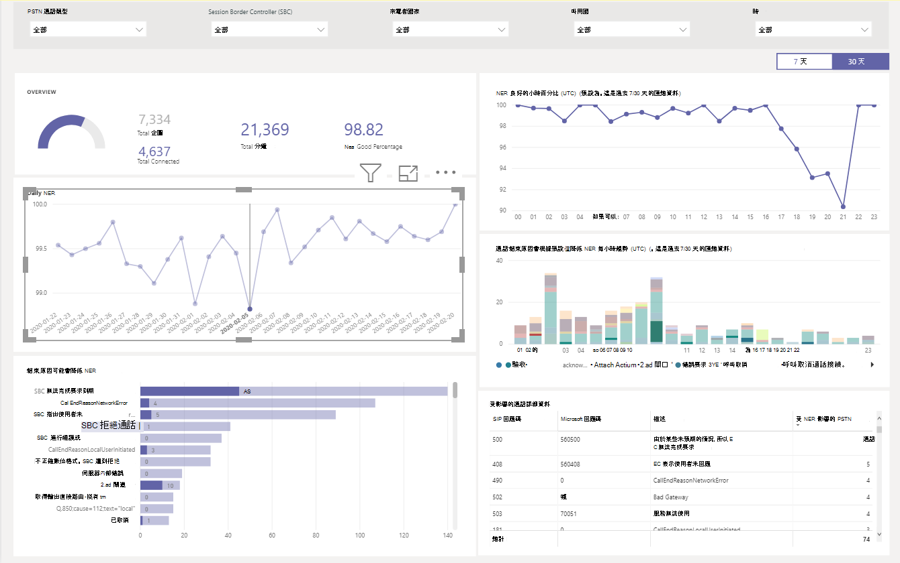
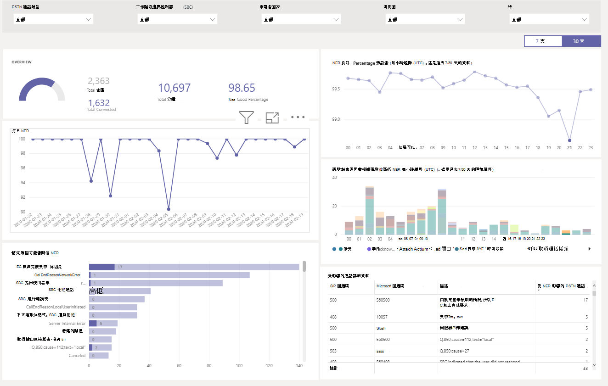
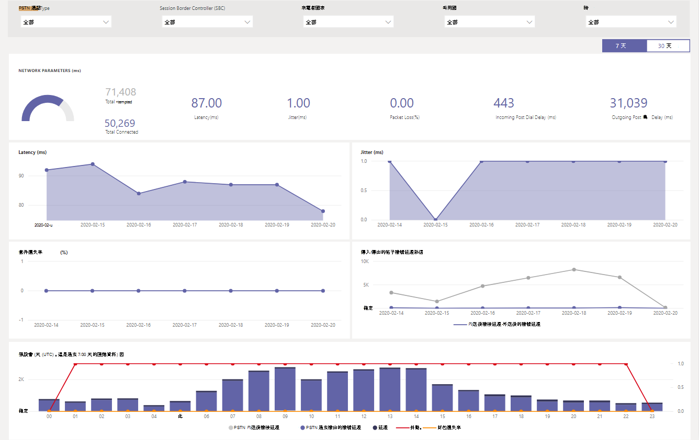

# 使用 CQD PSTN Direct 路由報告

2020年3月的新功能我們已新增 Microsoft 團隊通話品質儀表板（CQD） PSTN 直接路由報告至我們供您下載[的 POWER BI 查詢範本以進行 CQD](https://github.com/MicrosoftDocs/OfficeDocs-SkypeForBusiness/blob/live/Teams/downloads/CQD-Power-BI-query-templates.zip?raw=true)。 

CQD PSTN Direct 路由報告（CQD PSTN 直向路由報告 pbit）可協助您瞭解 PSTN 服務的使用模式與品質。 使用此報告可監視服務使用方式、會話邊界控制器（SBC）、電話語音、網路參數及網路效能比率詳細資料的相關資訊。 此資訊可協助您找出問題，包括中斷通話的原因。 例如，您可以看到 [音量下降]，或多少通話受到影響，以及原因。

CQD PSTN Direct 路由報告有四個區段：

  - [PSTN 概述](#pstn-overview)

  - [服務詳細資料](#service-details)

  - [網路效能比率](#network-effectiveness-ratio)

  - [網路參數](#network-parameters)

## 顯著

1. 依呼叫類型、SBC、來電者和被叫方國家/地區分析

   CQD PSTN Direct 路由報告會針對最近7、30或180天（6個月）的所有半形在您的租使用者上匯總可靠性和使用方式度量單位。 您可以依呼叫類型、SBC、來電者和被叫方國家/地區來分析資料。 如果您對特定的 SBC 或國家/地區感興趣，您可以在選取的時間範圍內，找出趨勢的變更。
   :::image type="content" source="media/CQD-PSTN-report8.png" alt-text="CQD PSTN Direct 路由報告中可用之篩選的螢幕擷取畫面":::
   
2. 追蹤趨勢

    當您嘗試瞭解服務使用方式及可靠性時，趨勢分析是必要的。 每小時趨勢都提供近時間的外觀，可協助您找出即時事件。 每日趨勢可讓您從長期角度查看您的服務健康情況。 在這兩種模式間移動必須具備適當的資料細微性，這一點很重要。 CQD PSTN Direct 路由報告提供6個月的趨勢概覽、7天和30天的每日趨勢，以及每小時趨勢，讓您在每個層面上分析效能。
    :::image type="content" source="media/CQD-PSTN-report9.png" alt-text="CQD PSTN Direct 路由報告中趨勢圖的螢幕擷取畫面":::

3. 鑽取至 SBC 或使用者層級

   我們已在 CQD 的許多資料類別中建立鑽取功能，可讓您快速瞭解 SBC 或使用者層級的使用或可靠性發佈。 透過使用 [鑽取]，您可以快速 poinpoint 問題，並瞭解實際的使用者影響。 CQD PSTN Direct 路由報告功能會在服務詳細資料和網路效能比率指標之間向下切入。 按一下您感興趣的資料點，以流覽至 SBC 或使用者層級的詳細資料。
   :::image type="content" source="media/CQD-PSTN-report10.png" alt-text="顯示資料點上的鑽取功能的螢幕擷取畫面":::

## PSTN 概述

CQD PSTN Direct 路由報告提供下列與服務的整體健康情況相關的資訊（在過去的180天內）。

例如，如果您對透過 SBC abc.bca.adatum.biz 進行的所有撥出電話的整體使用量和健康情況感興趣，我們就是內部國家/地區：

| **撥出** | **描述**                                                                                                                                                 |
| ------------ | --------------------------------------------------------------------------------------------------------------------------------------------------------------- |
| 1            | 您可以使用上方的篩選來向下切入，然後選取 [ByotIn] 作為 [呼叫類型]、abc.bca.contoso.com [會話 Boarder 控制器]，以及 [美國] 作為內部國家/地區。 |
| 2            | 過去180天的使用量趨勢。 您可以在服務詳細資料頁面找到使用狀況詳細資料包告。                                                                     |
| 3            | 過去180天后的撥號延遲、延遲、抖動及資料包遺失趨勢。 您可以在 [網路參數] 頁面上找到 [詳細資料包表]。                           |
| 4            | 過去180天的同時通話和每日作用中使用者趨勢。 此圖表可協助您瞭解服務的最大數量。                            |
| 500            | 上個通話結束原因在過去的180天中受影響的服務品質。 您可以在 [網路有效比率（NER）] 頁面上找到服務健康情況詳細資料。                    |

## 服務詳細資料

此頁面提供每天的服務使用趨勢，以及依地理位置的使用者意見反應細分。

  - **總嘗試通話–** 總嘗試在該時間範圍內呼叫，包括成功和失敗的通話

  - **已連線的通話總數-** 該時間範圍內的連線通話總數

  - **總分鐘數–** 該時間範圍內的總分鐘使用量

  - **每日作用中的使用者（DAU）-** 一天中至少進行一個連線通話的每日作用中使用者計數

  - **同時通話–** 一分鐘內同時進行中的通話最大值

  - **使用者意見反應–**「對我的通話打分」分數來自使用者。 3-5 被視為良好的通話。 1-2 被視為不正確的呼叫。

例如：

1.  如果您在02/14/2020 看到 [平均通話持續時間] 為0，您可以先檢查通話量看起來是否正常，並查看總的連線通話與總嘗試通話之間是否有很大的差異。 然後移至 [網路效能比率] 頁面，以投資撥打電話失敗的原因。

2.  如果您在 [使用者意見反應圖] 中看到增加紅色斑點，您可以移至 [網路效能比率] 頁面和 [網路] 參數，查看是否有任何不確定，您可以使用 MS 服務台來提升票證。

## 網路效能比率

這就是顯示在整體健康情況儀表板上的相同指標。 您可以在每小時網路效能比率中，查看含有受影響通話路線的每小時 NER 數的通話指示（入站/出站），並在下方加上通話結束原因圖表。

  - **NER** -功能（%）透過測量傳送給收件者的呼叫數與傳送給收件者的呼叫次數來傳送通話的網路。

  - **SIP 回應程式碼**-三位數的整數回應代碼會顯示通話狀態。

  - **Microsoft 回應代碼**-從 Microsoft 元件發出回應代碼。

  - **描述**：與 SIP 回應代碼及 Microsoft 回應程式碼相對應的原因階段。

  - **受影響的通話數量**-在所選時間範圍內，通話總數量會受到影響。

> 
> 
例如：

如果 [每日 NER] 在02/05/2020 上有一個 dip，您可以按一下日期，其他圖表就會縮放至該特定日期。

從 NER 良好的每小時趨勢，您可以找出在21:00 周圍發生的 dip。 然後再次按一下以調整為小時21，並查看受影響的通話詳細資料，查看該小時內的通話失敗多少，以及通話結束的原因。 如果問題不與 SBC 有關，您可以從任何 SBC 問題或向服務台取得報告，開始進行自我疑難排解。

## 網路參數

所有網路參數都是從直接路由介面到會話邊界控制器的測量。 如需建議值的相關資訊，請參閱為[Microsoft 團隊準備貴組織的網路](prepare-network.md)，並查看客戶邊緣至 microsoft Edge 的建議值。

  - **抖動**：是在使用 RTCP （RTP 控制通訊協定）的兩個端點之間計算之網路傳播延遲時間變化的毫秒測量。

  - **資料包遺失**-是一種無法送達資料包的量度，它是在兩個端點之間計算。

  - **滯後**時間（也稱為往返行程時間）是傳送信號所需的時間長度，加上接收該信號所需的確認時間長度。 此時間延遲是由兩個信號點之間的傳播時間所組成。

> 

例如：

如果您在四個圖表的任何一個（延遲、抖動、套件遺失率、Post 延遲）中看到一個峰值，請在02/14/2020 上按一下該日期點。 而底部的每小時趨勢圖將會重新整理，以顯示小時數。 您可以檢查 SBCs，或使用 MS 服務台來提升票證。

## 相關主題

[使用 Power BI 來分析 Microsoft 團隊的 CQD 資料](CQD-PSTN-report.md)

[Teams 疑難排解](https://docs.microsoft.com/MicrosoftTeams/troubleshoot/teams)