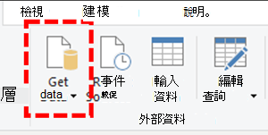
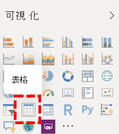
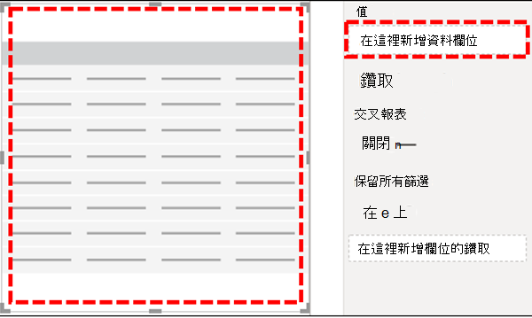
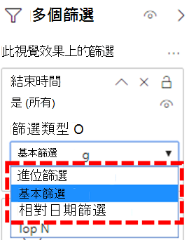
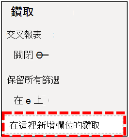
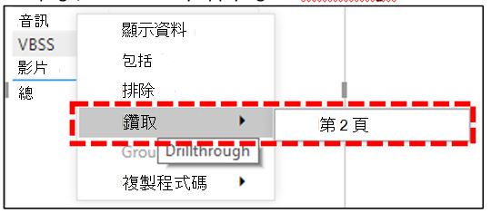

# 安裝 Power BI 連接器以使用 CQD 查詢範本Install Power BI Connector to use CQD query templates

在您可以使用 Microsoft 團隊通話品質儀表板（CQD）的 Power BI 查詢範本（.PBIX 檔案）之前，您必須先安裝適用于 Microsoft CQD 的 Power BI 連接器，並使用[下載](https://github.com/MicrosoftDocs/OfficeDocs-SkypeForBusiness/blob/live/Teams/downloads/CQD-Power-BI-query-templates.zip?raw=true)中包含的*MicrosoftCallQuality. pqx*檔案。Before you can use the Power BI query templates (PBIX files) for Microsoft Teams Call Quality Dashboard (CQD), you'll need to install the Power BI Connector for Microsoft CQD, using the *MicrosoftCallQuality.pqx* file included in the [download](https://github.com/MicrosoftDocs/OfficeDocs-SkypeForBusiness/blob/live/Teams/downloads/CQD-Power-BI-query-templates.zip?raw=true).

已閱讀 [[使用 POWER BI] 來分析團隊的 CQD 資料](CQD-Power-BI-query-templates.md)，以瞭解這些範本。Read [Use Power BI to analyze CQD data for Teams](CQD-Power-BI-query-templates.md) to learn about these templates.

請確定您擁有正確的[CQD 存取角色](https://docs.microsoft.com/microsoftteams/turning-on-and-using-call-quality-dashboard#assign-roles-for-accessing-cqd)，才能存取 Power BI 報表。Make sure you have the right [CQD access role](https://docs.microsoft.com/microsoftteams/turning-on-and-using-call-quality-dashboard#assign-roles-for-accessing-cqd) to access the Power BI reports.

## 安裝Installation

[POWER BI 檔](https://docs.microsoft.com/power-bi/desktop-connector-extensibility)中詳細說明安裝自訂連接器與調整安全性以啟用連接器的程式。The process for installing a custom connector and adjusting security to enable use of the connector is described in detail in the [Power BI documentation](https://docs.microsoft.com/power-bi/desktop-connector-extensibility). 為了簡單起見，以下是一個快速說明：For the sake of simplicity, here's a quick explanation:

1. 檢查您的電腦是否已有\* \[ \] \\ Power BI desktop \\ 自訂連接器\*   資料夾。Check to see if your computer already has a *\[Documents\]\\Power BI Desktop\\Custom Connectors* folder. 如果不是，請建立此資料夾。1If not, create this folder.1

2. 下載連接器檔案（ \* \* mez*或* \* pqx*檔案），並將它放在 [*自訂連接器\*] 目錄中。Download the connector file (either a *\*.mez* or *\*.pqx* file) and place it in the *Custom Connectors* directory.

3. **如果連接器檔案是* \* mez*檔案，\*\* 您也必須按照[自訂連接器設定檔](https://docs.microsoft.com/power-bi/desktop-connector-extensibility#data-extension-security)中的說明調整您的安全性設定。**If the connector file is a *\*.mez* file,** you will also need to adjust your security settings as described in the [custom connector setup documentation](https://docs.microsoft.com/power-bi/desktop-connector-extensibility#data-extension-security).

如果已發行此 Microsoft 團隊的 Power BI 連接器新版本，只要將*自訂連接器*目錄中的舊連接器檔案取代成新的檔案即可。If a new version of this Power BI Connector for Microsoft Teams is released, simply replace the old connector file in the *Custom Connectors* directory with the new file.

## Setup.exeSetup

若要建立報表並執行查詢，您必須先連線到 CQD 資料來源。In order to build a report and run queries, you will first need to connect to the CQD data source. 請依照下列步驟來連接：Follow the steps below in order to connect:

1. 在 Power BI 桌面的 [常用] 索引標籤中，按一下 [*取得資料*]。In the Home tab of Power BI Desktop, click on *Get Data*.

    

2. 此時應該會出現 [*取得資料*] 視窗。The *Get Data* window should appear at this point. 流覽至 [*線上服務*]，然後選取 [ *Microsoft 通話品質（Beta）* ]，然後按一下 *[連線]*。Navigate to *Online Services*, then select *Microsoft Call Quality (Beta)* and hit *Connect*.

    

3. 接著系統會提示您登入 [下一步]。You will be prompted to login next. 使用您用於 CQD 的相同認證。2Use the same credentials that you use for CQD.2

4. 下一個提示會提供兩種*資料連線模式*之間的選項。The next prompt will give you the option between two *Data Connectivity modes*. 選取 [ *DirectQuery* ]，然後按一下 *[確定]*。Select *DirectQuery* and hit *OK*.

5. 最後，您會得到最終提示，顯示 CQD 的整個資料模型。Finally, you will be given a final prompt showing you the entire data model for CQD. 此時將不會顯示任何資料，只會顯示 CQD 的資料模型。No data will be visible at this point, only the data model for CQD. 選取 [*載入*] 以完成設定程式。Select *Load* to complete the setup process.

6. 此時，Power BI 會將資料模型載入到視窗右側。At this point, Power BI will load the data model onto the right side of the window. 頁面將會保留為空白，且預設不會載入任何查詢。The page will remain otherwise blank, and no queries will be loaded by default. 若要建立查詢並傳回資料，請繼續進行下列**建立查詢**。Proceed to **Building Queries** below in order to build a query and return data.

如果您在此設定過程中的任何步驟沒有完全明確，您可以[在此找到](https://docs.microsoft.com/power-bi/desktop-quickstart-connect-to-data)更詳細的程式說明。If any of the steps during this setup process were not completely clear, a more detailed explanation of the process can be found [here](https://docs.microsoft.com/power-bi/desktop-quickstart-connect-to-data).

## 建立查詢Building Queries

安裝完成後，您應該會在 [*欄位*] 窗格中看到 [幾百個維度] 和 [量值載入] 的名稱。Once setup is complete, you should see the names of several hundred dimensions and measures load in the *Fields* pane. 從此處構造實際查詢很簡單，只要選取您想要的查詢尺寸和量值，然後將其拖放到頁面上即可。Constructing actual queries from here is simple, just select the dimensions and measures you want for your query, then drag and drop them onto the page. 以下是更詳細的說明，有一個簡單的範例：Here's a more detailed explanation, with a simple example:

1. 從 [*視覺*效果] 窗格中選取您要使用的視覺效果。Select the visualization you want to use from the *Visualizations* pane. 該視覺效果的空白版本應該會出現在頁面上。A blank version of that visualization should appear on the page. 針對此範例的用途，我們將使用*表格*視覺效果。For the purposes of this example, we will be using the *Table* visualization.

    

2. 判斷您想要用於查詢的維度和量值（依其名稱所代表），然後手動選取它們並拖曳到黑色視覺效果。Determine which dimensions and measures (denoted by an aggregation symbol by their name) you wish to use for your query, then manually select them and drag them onto the black visualization. 或者，將它們拖曳到 [視覺效果] 選項底下的 [*值*] 欄位。Alternately, drag them onto the *Values* field beneath the visualization options.

    

    > [!IMPORTANT]
    > [通話品質儀表板] 需要執行任何查詢的測量。Call Quality Dashboard requires a measure for any query to run. 無法將度量值新增至查詢，會造成該查詢失敗。Failure to add a measure to a query will cause that query to fail.

3. 接著，選取您要篩選的任何尺寸，然後將其拖曳到 [*篩選*] 窗格中*這個視覺欄位上*的 [篩選]。Next, select any dimensions you want to filter on and drag them to the *Filters on this visual* field in the *Filters* pane. CQD Power BI 連接器目前支援*基本篩選*（從可能維度值的清單中選取值）、*高級篩選*（手動指定要篩選的值與運算元，類似于 [高級] CQD），以及*相對日期篩選*（僅適用于 [*結束時間*] 和 [*開始時間*] 尺寸）。The CQD Power BI Connector currently supports *Basic filtering* (select values from a list of possible dimension values), *Advanced filtering* (manually specify values and operands to filter on, similar to Advanced CQD), and *Relative date filtering* (only available for the *End Time* and *Start Time* dimensions). CQD 不支援根據*Top N*進行篩選。Filtering according to *Top N* is not supported by CQD.

    

4. 最後，選取 [*視覺效果*] 窗格中的 [*格式*] 索引標籤來設定查詢的樣式和格式。Finally, select the *Format* tab within the *Visualizations* pane to style and format your query.

    > [!NOTE]
    > CQD 查詢至少需要一個量值，才能執行。CQD queries require at least one measure in order to run. 如果您的查詢未載入，請再次檢查您是否已在查詢中包含量值。If your query does not load, double check that you have included a measure in the query.

## 建立鑽研報表Creating a Drillthrough Report

[POWER BI 中的 [鑽取](https://docs.microsoft.com/power-bi/desktop-drillthrough)] 可讓您建立焦點報表，您可以使用其他報表的值做為內容快速篩選。[Drillthrough in Power BI](https://docs.microsoft.com/power-bi/desktop-drillthrough) allows you to create focused reports that you can quickly filter using the values of other reports as context. 當您知道如何使用 CQD 連接器建立您的第一個查詢之後，建立鑽取變得更簡單。Once you know how to create your first query with the CQD Connector, creating a drillthrough is even simpler.

1. 為焦點報表建立另一個頁面，然後將您的查詢新增至該頁面。Create another page for the focused report, and then add your queries to that page.

2. 選取您要用來做為鑽取篩選的維，然後將其拖曳到 [*視覺效果*] 窗格中的 [*鑽取*] 欄位。Select the dimension you want to use as a drillthrough filter and drag them onto the *Drillthrough* field under on the *Visualizations* pane.

    

3. **就是這樣\!****That's it\!** 其他使用該維度之頁面的任何其他查詢現在都可以鑽取至該頁面，自動將鑽取維度的值套用為篩選器。Any other query on another page that uses that dimension can now drillthrough to that page, automatically applying the drillthrough dimension's value as a filter.

    

與 [高級 CQD] 不同，Power BI 支援非順序式鑽取。Unlike Advanced CQD, Power BI supports non-sequential drillthrough. 只要查詢包含必要的維度，就可以對任何其他頁面進行鑽取。So long as a query includes the necessary dimension, it can drillthrough to any other page.

### 最佳做法Best practice

通話品質連接器查詢的設計應考慮使用鑽取功能。Call Quality connector queries should be designed with drillthrough functionality in mind. 不要嘗試一次載入所有資料，然後再使用篩選來向下切入、從較廣的基數查詢開始，並向下切入至高基數查詢。Instead of trying to load all the data at once, and then slicing down with filters, start with broader, low-cardinality queries and drill down to high-cardinality queries. 例如，當您嘗試診斷哪些子網最能貢獻品質問題時，請先找出對問題有影響的地區和國家，然後向下切入該地區或國家/地區的子網。For instance, when attempting to diagnose which subnets contribute most to quality issues, it's helpful to first identify those regions and countries which contribute to the problem, then drill down to the subnets in that region or country. 通話品質連接器範本是以這種方式設計，以做為範例。The Call Quality connector templates have been designed in this manner in order to act as an example.

## 有限Limitations

雖然使用 Power BI，但並非所有的 Power BI 功能都是由 CQD 連接器所支援，就是由於 CQD 資料模型或 DirectQuery 連接器上的限制所導致。Despite making use of Power BI, not all Power BI functionality is support by the CQD Connector, either as a result of limitations on CQD data model or on DirectQuery connectors in general. 下表列出一些連接器更值得注意的限制，但不應將這個清單視為完整的：The list below notes some of the Connector's more noteworthy limitations, but this list should not be considered exhaustive:

1. **計算結果欄–** 在 Power BI 中，DirectQuery 連接器一般都有限支援計算資料行。**Calculated Columns –** DirectQuery connectors in general have limited support for calculated columns in Power BI. 雖然某些計算結果欄可能會與連接器搭配使用，但它們應該視為例外狀況。While some calculated columns may work with the Connector, these should be considered exceptions. 一般來說，計算結果欄將無法運作。As a general rule, calculated columns will not function.

2. **聚合-** CQD 資料模型是以立方體模型為基礎，也就是說，測度的形式已支援匯總。**Aggregations –** The CQD data model is built on a cube model, meaning that aggregations are already supported in the form of measures. 嘗試手動將聚合新增到不同的維度，或變更量值的聚合類型將無法搭配連接器使用，而且通常會導致錯誤。Attempting to manually add aggregations to different dimensions or changing the aggregation type of a measure will not work with the Connector, and it will generally result in an error.

3. **自訂視覺效果–** 雖然 CQD 連接器會與自訂視覺效果搭配運作，但我們無法保證與所有自訂視覺效果相容。**Custom Visuals –** While the CQD Connector does work with a range of custom visuals, we are unable to guarantee compatibility with all custom visuals. 許多自訂視覺效果都依賴于使用計算結果欄或匯入資料，而 DirectQuery 連接器不支援這些資料。Many custom visuals rely on the use of calculated columns or imported data, neither or which are supported by DirectQuery connectors.

4. 參照快取的**資料-** Power BI 目前不支援以任何方式參照 DirectQuery 連接器中的快取資料。**Referencing Cached Data –** Power BI currently does not support referencing cached data from a DirectQuery connector in any way. 任何參照查詢結果的嘗試都會產生新的查詢。Any attempt to reference the results of a query will result in a new query.

5. **相對資料篩選–** 在 CQD 連接器中受到支援，但僅限 [*開始時間*] 和 [*結束時間*] 維度。**Relative Data Filtering –** Is supported in the CQD Connector, but only with the *Start Time* and *End Time* dimensions. 雖然 [*日期*] 維度可能是相對日期篩選的明顯選擇，但*date*並不會儲存為日期時間物件，因此不支援 Power BI 中的相對日期篩選。Although the *Date* dimension may be the obvious choice for relative date filtering, *Date* is not stored as a date time object and thus does not support relative date filtering in Power BI.

6. **政府社區雲端（GCC）支援-** 針對 GCC 環境中的客戶，使用 Power BI Desktop 時，CQD Power BI 連接器就會運作。**Government Community Cloud (GCC) Support –** For customers in the GCC environment, the CQD Power BI Connector will work when using Power BI Desktop. CQD Power BI 連接器目前與適用于 GCC 客戶的 Power BI 服務不相容。The CQD Power BI connector is not currently compatible with the Power BI service for GCC customers.

這些問題大多都是在 Power BI 中對 DirectQuery 連接器設計的限制，或針對 CQD 資料模型設計的基礎。Most of these issues are either restrictions to DirectQuery connector design in Power BI or fundamental to the design of the CQD data model.

## 疑難排解Troubleshooting

### 我嘗試將 [日期] 資料行做為日期交叉分析篩選器。I'm trying to use the Date column as a Date slicer. 當我將此資料行的資料類型轉換為 [日期] 後，就會出現此錯誤As soon as I convert the data type of this column to Date, I get this error

> **無法載入此視覺效果的資料**： OLE DB 或 ODBC 錯誤： [Expression. 錯誤] 無法將運算式折向資料來源。**Couldn't load the data for this visual**: OLE DB or ODBC error: [Expression.Error] We couldn't fold the expression to the data source. 請嘗試比較簡單的運算式。Please try a simpler expression.

Power BI 連接器不支援日期交叉分析篩選器。Date slicers aren't supported with the Power BI Connector. 若要指定日期範圍，請將兩個篩選套用至報表，並指定小於和大於日期。To specify a date range, apply two filters to the report, specifying a less than and greater than date.

或者，如果您想要查看的日期是 [最近]，請套用相對日期篩選器，只顯示過去 N 天/周/月的資料。Alternatively, if the dates you want to view are recent, apply a relative date filter to show only data for the last N days/weeks/months.

## 錯誤碼Error Codes

因為 CQD Power BI 連接器的受限制性低於您可以建立之查詢類型的瀏覽器應用程式，所以在建立查詢時，有時候可能會遇到許多錯誤。Because the CQD Power BI Connector is less restricted than the browser app in terms of kinds of queries you can construct, you may occasionally encounter a number of errors while building your queries. 在您收到「CQDError」類型的錯誤訊息的事件中。In the event that you receive an error message of the type "CQDError. RunQuery –查詢執行錯誤 "，請參照以下清單及所提供的 ErrorType 數位，以便針對查詢的可能問題進行疑難排解。RunQuery – Query Execution Error", reference the list below with the ErrorType number provided in order to troubleshoot the possible issue with the query. 下列是您可能會遇到的 CQD Power BI 連接器最常見的錯誤類型代碼：The following are the most common Error Type codes you may encounter with the CQD Power BI Connector:

- **ErrorType 1-查詢結構錯誤：** 查詢結構錯誤通常是由於連接器無法建立格式正確的查詢所造成。**ErrorType 1 - Query Structure Error:** A query structure error is typically caused by the Connector failing to build a properly formatted query. 這通常會在使用不支援的功能時（如上述限制所指定）的情況下發生。This happens most often when using unsupported functionality, as specified in the Limitations above. 請仔細檢查您不是使用任何計算結果欄或該查詢的自訂視覺效果。Double check that you are not using any calculated columns or custom visuals for that query.

  - **ErrorType 2-查詢建立錯誤：** CQD 連接器無法正確解析您嘗試建立的查詢，導致查詢產生錯誤。**ErrorType 2 - Query Building Error:** A query building error is caused by the CQD Connector being unable to properly parse the query you are attempting to build. 這通常會在使用不支援的功能時（如上述限制所指定）的情況下發生。This happens most often when using unsupported functionality, as specified in the Limitations above. 請仔細檢查您不是使用任何計算結果欄或該查詢的自訂視覺效果。Double check that you are not using any calculated columns or custom visuals for that query.

  - **ErrorType 5-執行超時值：** 查詢在超時前已達到可能的最大執行時間。嘗試在查詢中加入更多篩選器，以限制其範圍。**ErrorType 5 - Execution Timeout:** The query has reached the maximum possible runtime before timing out. Try adding more filters to the query in order to limit its scope. 收縮資料範圍通常是達到此目的最有效的方式。Narrowing the data range is often the most effective way to achieve this.

  - **ErrorType 7-無測量錯誤：** CQD 查詢需要一個量值，才能正常運作。**ErrorType 7 - No Measurements Error:** CQD queries require a measure in order to function. 仔細檢查您的查詢是否包含量值。Double check that your query includes measure. CQD 連接器中的量值是由 [匯總（sum）] 符號來表示它們的名稱。Measures in the CQD Connector are denoted by the aggregation (sum) symbol before their name.

如果您在此範圍外遇到任何其他錯誤，請通知 CQD 小組，讓我們可以協助您解決問題，並視需要更新檔。If you encounter any additional errors outside of this scope, please notify the CQD team so that we can help troubleshoot the issue and update the documentation as appropriate.

## 批註Footnotes

**1** 某些程式和應用程式（例如 OneDrive）可能會導致您的檔根資料夾變更;確認*POWER BI 桌面 \\ 自訂連接器*目錄位於目前的根資料夾檔資料夾中。**1** Certain processes and apps (e.g., OneDrive) may cause your Documents root folder to change; make sure that the *Power BI Desktop\\Custom Connectors* directory is placed inside of the current root folder Documents folder.

**2** 您用於 CQD 的登入認證*不*需要是您用來登入 Power BI 傳統型應用程式本身的認證。**2** The login credentials you use for CQD *do not* need to be the same credentials you use for logging into the Power BI Desktop app itself.

## 常見問題集Frequently asked questions

### Power BI 連接器何時會從「Beta」狀態更新When will the Power BI Connector be updated from "Beta" status

雖然使用 Beta 版標記，Power BI 的通話品質連接器是連接器的發行版本本，且已由 Power BI 小組以正式安全性簽署來反映此情況。Despite the Beta tag, the Call Quality Connector for Power BI is the release version of the connector and has been officially security signed by the Power BI team to reflect this. 要移除該 Beta 標記的認證程式是一個龐大的程式，而且需要 Power BI 團隊的承諾，也能提供連接器的直接支援。The certification process to remove that Beta tag is an extensive one and requires a commitment from the Power BI team to provide direct support to the connector as well. 由於時間限制，Power BI 小組目前無法提供該支援及更廣泛的認證，但仍準備好證明 Microsoft 通話品質連接器的安全性、真實性及一般功能。Due to time constraints, the Power BI team is currently unable to provide that support and broader certification, but is still prepared to attest to the security, authenticity, and general functionality of the Microsoft Call Quality connector.

### 為什麼相對於瀏覽器中的 [高級 CQD]，連接器看起來會變慢？Why does the connector seem slower compared to Advanced CQD in the browser? 我可以執行哪些動作來改善效能What can I do to improve performance

在瀏覽器和連接器中，各種範本的查詢效能實際上都是相同的。Query performance for the various templates is actually the same in both the browser and in the connector.  就像任何其他獨立 app 一樣，Power BI 會將其驗證與轉譯時間新增到我們的效能。Just like any other standalone app, Power BI adds its authentication and rendering time to our performance. 此外，差異則是同時執行的併發查詢數目。In addition, the difference comes in the number of concurrent queries being run. 因為瀏覽器版本的 CQD 已開發出良好且資訊密集的視覺效果選項，所以我們的大部分報表只能一次載入2-3 查詢。Because the in-browser version of CQD had less well-developed and information-dense visualization options, most of our reports were limited to loading 2-3 queries at a time. 另一方面，連接器範本通常會顯示 20 + 併發查詢。On the other hand, the connector templates often display 20+ concurrent queries. 如果您想要建立與您曾經使用過的舊版報告的回應性，請嘗試針對每個索引標籤建立不超過2-3 個查詢的報表。If you wish to build reports that are just as responsive as the older ones you were used to, try creating reports with no more than 2-3 queries per tab.

如需詳細資訊，請參閱下列文章：For more information, see the following articles:

- [Power BI 的優化指南Optimization guide for Power BI](https://docs.microsoft.com/power-bi/guidance/power-bi-optimization)
- [DirectQuery 模型指南DirectQuery model guidance](https://docs.microsoft.com/power-bi/guidance/directquery-model-guidance)

### 當您執行查詢時，我發現經常會遇到10000列限制。I find that I routinely run into the 10,000-row limit when running queries. 如何取得連接器傳回10000列以上How can I get the connector to return more than 10,000 rows

10000列限制實際上是在 API 端指定，它旨在協助您大幅提升效能，並減少因記憶體不足而導致的查詢執行錯誤風險。The 10,000-row limit is actually specified on the API end, and it is designed to help significantly improve performance and reduce the risk of query execution errors resulting from low memory conditions.

最好是依據連接器最佳做法來重組報表，而不是嘗試增加結果列計數。Instead of attempting to increase the result row count, it is best to restructure your reports according to connector best practices. 我們隨附的範本是專為示範這些最佳做法而設計。The templates we have included are designed to demonstrate these best practices. 如有可能，請先使用較廣的基數維度（例如 [月]、[年]、[日期]、[地區]、[年月] 等等）來查看您的 Kpi。您可以從該處深化到較高基數的維度。Where possible, start by looking at your KPIs using broader, lower-cardinality dimensions, such as Month, Year, Date, Region, Country, etc. From there, you can drill down into increasingly higher-cardinality dimensions. [技術支援人員] 和 [位置改良的報表] 都提供此深入分析工作流程的良好範例。The Helpdesk and Location-Enhanced Reports both provide good examples of this drill down workflow.

## 相關主題Related topics

[使用 Power BI 來分析團隊的 CQD 資料Use Power BI to analyze CQD data for Teams](CQD-Power-BI-query-templates.md)
