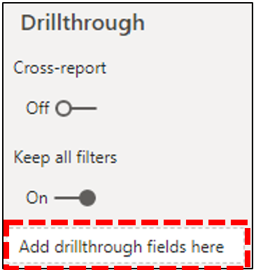

# 安裝 Power BI 連接器以使用 CQD 查詢範本

您必須先安裝適用于 Microsoft CQD 的 power BI 連接器，才能使用 CQD （.PBIX 檔案）的 Power BI 連接器，請使用[下載](https://github.com/MicrosoftDocs/OfficeDocs-SkypeForBusiness/blob/live/Teams/downloads/CQD-Power-BI-query-templates.zip?raw=true)中包含的*MicrosoftCallQuality. pqx*檔案。 

已閱讀 [[使用 POWER BI] 來分析團隊的 CQD 資料](CQD-Power-BI-query-templates.md)，以瞭解這些範本。

## 安裝

[POWER BI 檔](https://docs.microsoft.com/power-bi/desktop-connector-extensibility)中詳細說明安裝自訂連接器與調整安全性以啟用連接器的程式。 為了簡單起見，以下是一個快速說明：

1.  檢查 您的* \[ \] \\電腦是否已有 Power BI desktop\\自訂連接器*資料夾。 如果不是，請建立此資料夾。1

2.  下載連接器檔案（ * \*mez*或* \*pqx*檔案），並將它放在 [*自訂連接器*] 目錄中。

3.  **如果連接器檔案是* \*mez*檔案，** 您也必須按照[自訂連接器設定檔](https://docs.microsoft.com/power-bi/desktop-connector-extensibility#data-extension-security)中的說明調整您的安全性設定。

如果已發行此 Microsoft 團隊的 Power BI 連接器新版本，只要將*自訂連接器*目錄中的舊連接器檔案取代成新的檔案即可。

## Setup.exe

若要建立報表並執行查詢，您必須先連線到 CQD 資料來源。 請依照下列步驟來連接：

1.  在 Power BI 桌面的 [常用] 索引標籤中，按一下 [*取得資料*]。

    

2.  此時應該會出現 [*取得資料*] 視窗。 流覽至 [*線上服務*]，然後選取 [ *Microsoft 通話品質（Beta）* ]，然後按一下 *[連線]*。

    

3.  接著系統會提示您登入 [下一步]。 使用您用於 CQD 的相同認證。2

4.  下一個提示會提供兩種*資料連線模式*之間的選項。 選取 [ *DirectQuery* ]，然後按一下 *[確定]*。

5.  最後，您會得到最終提示，顯示 CQD 的整個資料模型。 此時將不會顯示任何資料，只會顯示 CQD 的資料模型。 選取 [*載入*] 以完成設定程式。

6.  此時，Power BI 會將資料模型載入到視窗右側。 頁面將會保留為空白，且預設不會載入任何查詢。 若要建立查詢並傳回資料，請繼續進行下列**建立查詢**。

如果您在此設定過程中的任何步驟沒有完全明確，您可以[在此找到](https://docs.microsoft.com/power-bi/desktop-quickstart-connect-to-data)更詳細的程式說明。

## 建立查詢

安裝完成後，您應該會在 [*欄位*] 窗格中看到 [幾百個維度] 和 [量值載入] 的名稱。 從此處構造實際查詢很簡單，只要選取您想要的查詢尺寸和量值，然後將其拖放到頁面上即可。 以下是更詳細的說明，有一個簡單的範例：

1.  從 [*視覺*效果] 窗格中選取您要使用的視覺效果。 該視覺效果的空白版本應該會出現在頁面上。 針對此範例的用途，我們將使用*表格*視覺效果。

    

2.  判斷您想要用於查詢的維度和量值（依其名稱所代表），然後手動選取它們並拖曳到黑色視覺效果。 或者，將它們拖曳到 [視覺效果] 選項底下的 [*值*] 欄位。

    

**重要注意事項：**[通話品質儀表板] 需要執行任何查詢的測量。 無法將度量值新增至查詢，會造成該查詢失敗。

3.  接著，選取您要篩選的任何尺寸，然後將其拖曳到 [*篩選*] 窗格中*這個視覺欄位上*的 [篩選]。 CQD Power BI 連接器目前支援*基本篩選*（從可能維度值的清單中選取值）、*高級篩選*（手動指定要篩選的值與運算元，類似于 [高級] CQD），以及*相對日期篩選*（僅適用于 [*結束時間*] 和 [*開始時間*] 尺寸）。 CQD 不支援根據*Top N*進行篩選。

    

4.  最後，選取 [*視覺效果*] 窗格中的 [*格式*] 索引標籤來設定查詢的樣式和格式。

**注意：** CQD 查詢至少需要一個量值，才能執行。 如果您的查詢未載入，請再次檢查您是否已在查詢中包含量值。

## 建立鑽研報表

[POWER BI 中的 [鑽取](https://docs.microsoft.com/power-bi/desktop-drillthrough)] 可讓您建立焦點報表，您可以使用其他報表的值做為內容快速篩選。 當您知道如何使用 CQD 連接器建立您的第一個查詢之後，建立鑽取變得更簡單。

1.  為焦點報表建立另一個頁面，然後將您的查詢新增至該頁面。

2.  選取您要用來做為鑽取篩選的維，然後將其拖曳到 [*視覺效果*] 窗格中的 [*鑽取*] 欄位。

    

3.  **就是這樣\!** 其他使用該維度之頁面的任何其他查詢現在都可以鑽取至該頁面，自動將鑽取維度的值套用為篩選器。

    

與 [高級 CQD] 不同，Power BI 支援非順序式鑽取。 只要查詢包含必要的維度，就可以對任何其他頁面進行鑽取。

## 有限

雖然使用 Power BI，但並非所有的 Power BI 功能都是由 CQD 連接器所支援，就是由於 CQD 資料模型或 DirectQuery 連接器上的限制所導致。 下表列出一些連接器更值得注意的限制，但不應將這個清單視為完整的：

1.  **計算結果欄–** 在 Power BI 中，DirectQuery 連接器一般都有限支援計算資料行。 雖然某些計算結果欄可能會與連接器搭配使用，但它們應該視為例外狀況。 一般來說，計算結果欄將無法運作。

2.  **聚合-** CQD 資料模型是以立方體模型為基礎，也就是說，測度的形式已支援匯總。 嘗試手動將聚合新增到不同的維度，或變更量值的聚合類型將無法搭配連接器使用，而且通常會導致錯誤。

3.  **自訂視覺效果–** 雖然 CQD 連接器會與自訂視覺效果搭配運作，但我們無法保證與所有自訂視覺效果相容。 許多自訂視覺效果都依賴于使用計算結果欄或匯入資料，而 DirectQuery 連接器不支援這些資料。

4.  參照快取的**資料-** Power BI 目前不支援以任何方式參照 DirectQuery 連接器中的快取資料。 任何參照查詢結果的嘗試都會產生新的查詢。 

5.  **相對資料篩選–** 在 CQD 連接器中受到支援，但僅限 [*開始時間*] 和 [*結束時間*] 維度。 雖然 [*日期*] 維度可能是相對日期篩選的明顯選擇，但*date*並不會儲存為日期時間物件，因此不支援 Power BI 中的相對日期篩選。

請注意，雖然連接器是在預覽中，但在最終發行連接器時，這些限制可能不會變更。 這些問題大多都是在 Power BI 中對 DirectQuery 連接器設計的限制，或針對 CQD 資料模型設計的基礎。

## 疑難排解

### 我嘗試將 [日期] 資料行做為日期交叉分析篩選器。 當我將此資料行的資料類型轉換為 [日期] 後，就會出現這個錯誤：

  **無法載入此視覺效果的資料**： OLE DB 或 ODBC 錯誤： [Expression. 錯誤] 無法將運算式折向資料來源。 請嘗試比較簡單的運算式。 

Power BI 連接器不支援日期交叉分析篩選器。 若要指定日期範圍，請將兩個篩選套用至報表，並指定小於和大於日期。

或者，如果您想要查看的日期是 [最近]，請套用相對日期篩選器，只顯示過去 N 天/周/月的資料。

## 錯誤碼

因為 CQD Power BI 連接器的受限制性低於您可以建立之查詢類型的瀏覽器應用程式，所以在建立查詢時，有時候可能會遇到許多錯誤。 在您收到「CQDError」類型的錯誤訊息的事件中。 RunQuery –查詢執行錯誤 "，請參照以下清單及所提供的 ErrorType 數位，以便針對查詢的可能問題進行疑難排解。 下列是您可能會遇到的 CQD Power BI 連接器最常見的錯誤類型代碼：

  - **ErrorType 1-查詢結構錯誤：** 查詢結構錯誤通常是由於連接器無法建立格式正確的查詢所造成。 這通常會在使用不支援的功能時（如上述限制所指定）的情況下發生。 請仔細檢查您不是使用任何計算結果欄或該查詢的自訂視覺效果。

  - **ErrorType 2-查詢建立錯誤：** CQD 連接器無法正確解析您嘗試建立的查詢，導致查詢產生錯誤。 這通常會在使用不支援的功能時（如上述限制所指定）的情況下發生。 請仔細檢查您不是使用任何計算結果欄或該查詢的自訂視覺效果。

  - **ErrorType 5-執行超時值：** 查詢在超時前已達到可能的最大執行時間。嘗試在查詢中加入更多篩選器，以限制其範圍。 收縮資料範圍通常是達到此目的最有效的方式。

  - **ErrorType 7-無測量錯誤：** CQD 查詢需要一個量值，才能正常運作。 仔細檢查您的查詢是否包含量值。 CQD 連接器中的量值是由 [匯總（sum）] 符號來表示它們的名稱。

如果您在此範圍外遇到任何其他錯誤，請通知 CQD 小組，讓我們可以協助您解決問題，並視需要更新檔。

## 批註

**1** 某些程式和應用程式（例如 OneDrive）可能會導致您的 [檔] 根資料夾變更;確認*POWER BI 桌面\\自訂連接器*目錄位於目前的根資料夾檔資料夾中。

**2** 您用於 CQD 的登入認證*不*需要是您用來登入 Power BI 傳統型應用程式本身的認證。

## 相關主題

[使用 Power BI 來分析團隊的 CQD 資料](CQD-Power-BI-query-templates.md)