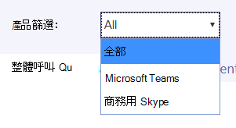
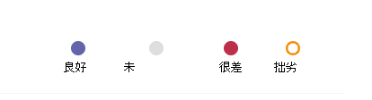

# <a name="data-and-reports-in-call-quality-dashboard-cqd"></a>通話品質儀表板和 CQD (中的資料和) 

Microsoft 通話品質儀表板 (CQD) 使用接近即時的 NRT (NRT) 資料。 通話記錄可在通話結束的 30 分鐘內以 CQD 提供。 NRT 管道的通話記錄只能在從資料集中移除前幾個月使用。 


## <a name="many-ways-to-access-cqd-data"></a>存取 CQD 資料的多種方式

您可以用數種不同的方式存取 CQD 資料。 挑選最符合您需求的產品：

|&nbsp;|&nbsp;|
|---------|---------|
|Teams系統管理[中心 (https://admin.teams.microsoft.com) ](https://admin.teams.microsoft.com)    | CQD 資料會包含在系統管理中心的 Teams 頁面上，以易於閱讀的格式顯示您所需的最常見資料。 您無法自訂在 使用者 下找到的 CQD **資料**。  |
|CQD[入口網站 (https://cqd.teams.microsoft.com) ](https://cqd.teams.microsoft.com)     | 使用深入篩選功能，提供符合大多數需求的強大的摘要和詳細報表。 您也可以在 CQD 入口網站中自訂報表。 <br><br>取得 [兩個 CQD 報表範本](#import-the-cqd-report-templates) ，可協助您分析 CQD 入口網站的資料。       |
|Power BI     | 使用直接查詢在範本中Power BI CQD 資料Power BI[範本](CQD-Power-BI-query-templates.md)。 [下載 Power BI CQD 的查詢範本](https://github.com/MicrosoftDocs/OfficeDocs-SkypeForBusiness/blob/live/Teams/downloads/CQD-Power-BI-query-templates.zip?raw=true)。<br><br>您也可以使用[REST API 存取 CQD](/skypeforbusiness/management-tools/call-quality-dashboard/data-api)資料，Power BI。 如果您想要下載 CQD 資料，以便離線處理，請使用此方法。 使用此方法的好處是提升性能，尤其適用于在線上時Power BI大型資料集。       |
|Graph API     | 使用 API 來自己存取通話品質[Graph資料](/graph/api/resources/callrecords-api-overview)。 這是最複雜的方法，但能讓您在分析通話品質資料時擁有最大的控制權與彈性。 例如，如果您需要將其加入貴組織的其他資料，您可以使用 Graph API 來建立資料模型併合並通話品質資料。        |

## <a name="import-the-cqd-report-templates"></a>輸入 CQD 報表範本

在所有網路和受管理網路 (下載兩個已策劃的 [CQD](https://aka.ms/qertemplates) 報表範本) 可協助您快速使用 CQD。 所有網路範本雖然已優化處理建築物資料檔案，但可在您收集建築物資訊並上傳至 CQD 時使用，如下一節所述。

**若要將範本 (。CQDX) into CQD**

1. 在 CQD 中， **從** 頁面頂端的功能表選取詳細報告。

2. 在左側面板中 **，選取** 流覽至第一個 CQDX 範本， **然後選取** 開啟 。

3. 範本上傳後，快顯視窗會顯示「報表成功輸入」訊息。 

4. 針對第二個 CQD 範本重複步驟 2 和 3。

   > [!NOTE]
   > 每個使用者都必須將 CQD 範本導入其 CQD 實例。 


## <a name="euii-data"></a>EUII 資料

基於合規性考慮，使用者標識資訊 (EUII) 資料 (也稱為個人識別資訊或 PII) 只會保留 28 天。 當 NRT 資料跨過 28 天標記時，會清除包含 EUII 的欄位，產生不含 EUII 的 NRT 資料。 包含 EUII 資料的欄位為：

- 完整 IP 位址
- MAC (媒體存取控制) 位址
- 基本服務組識別元 (BSSID) 
- 只有 URI (SIP) 會話初始 (商務用 Skype協定) 
- 使用者主體名稱 (UPN) 
- 電腦端點名稱
- 使用者逐字記錄意見
- 物件識別碼 (端點使用者識別碼的 Active Directory 物件識別碼) 

### <a name="admin-roles-with-and-without-euii-access"></a>具有或不含 EUII 存取的系統管理員角色

這些 [RBAC](/azure/role-based-access-control/overview) 角色 **DO** 具有 EUII 存取權：
- 全域系統管理員
- Teams服務系統管理員
- Teams通訊系統管理員
- Teams 通訊支援工程師
- 全域閱讀程式
- 商務用 Skype管理

這些 RBAC **角色沒有** EUII 存取權：
- 報表閱讀程式
- Teams通訊支援專家


## <a name="date-controls"></a>日期控制項

CQD 支援下列滾動趨勢類型：

- 5 天
- 7 天
- 30 天
- 60 天
- 90 天

URL Date 參數接受 Day 欄位。 滾動日報表使用以 YYYY-MM-DD 格式指定的日期做為趨勢的最後一天。 URL Date 參數 "00" 表示 「今天」。

|URL| 捲動日趨勢的結束日期|
|:---|:---|
|<span>HTTPs:// \<cqdv3> /spd/#/Dashboard/ \<reportid> /2019-02/</span>   |2019 年 2 月目前的一天|
|<span>HTTPs:// \<cqdv3> /spd/#/Dashboard/ \<reportid> /2019-02-15/</span>|2019 年 2 月 15 日|
|<span>HTTPs:// \<cqdv3> /spd/#/Dashboard/ \<reportid> /00/</span>        |目前日|
|||

根據預設，當月中的目前天會做為捲動日趨勢的最後一天。


## <a name="data-available-in-cqd-reports"></a>CQD 報告中提供的資料

您只需要預設摘要和詳細的 CQD 報告，就只需要管理貴組織通話品質。如果需要，您可以建立 [自訂報表](#create-custom-detailed-reports)。 

如果您想要使用 Power BI分析您的 CQD 資料，請參閱使用 Power BI 分析[CQD 資料以Teams。](CQD-Power-BI-query-templates.md)

|功能|摘要報告|詳細報告|
|:--- |:--- |:--- |
|應用程式共用度量 | 否 | 是 |
|客戶建立資訊支援 | 是 | 是 |
|用戶端點資訊支援 | 只有在 <span> cqd.teams.microsoft.com<span/> | 只有在 <span> cqd.teams.microsoft.com<span/> |
|向下切入分析支援   | 否   | 是   |
|媒體可靠性度量   | 否   | 是   |
|開箱就地報告   | 是   | 是   |
|概觀報告   | 是   | 是   |
|每個使用者報表集   | 否   | 是   |
|報表集自訂 (新增、刪除、修改報告)    | 否   | 是   |
|影片型螢幕共用量值   | 否   | 是   |
|影片度量   | 否   | 是   |
|可用的資料量   | 過去 12 個月   | 過去 12 個月   |
|Microsoft Teams資料   | 是   | 是   |
| | | |


 
### <a name="select-product-data-to-see-in-reports"></a>選取產品資料以在報告中查看

在摘要與Location-Enhanced中，您可以使用產品篩選下拉式清單來顯示所有產品資料、僅顯示Microsoft Teams資料，或商務用 Skype線上資料。

> [!div class="mx-imgBorder"]
> 
  
在詳細報告中，您可以使用 Is **Teams** 維度來篩選資料，Microsoft Teams或商務用 Skype線上資料。

## <a name="summary-reports"></a>摘要報告

這些是當您第一次登錄 CQD 時，在 CQD 儀表板上會看到的報告。 它們提供您每日、每月和表格報表的品質趨勢概覽，以協助識別品質不佳的子網。 

| 選項 卡 | 描述 |
|---------|---------|
|整體通話品質     | 其他 3 個定位停駐點的匯總。       |
|伺服器 —用戶端     |伺服器和用戶端端點之間的資料流程詳細資料。        |
|用戶端 -用戶端     |兩個用戶端端點之間的資料流程詳細資料。        |
|語音品質 SLA     |包含在語音品質 SLA 商務用 Skype[通話的資訊](https://go.microsoft.com/fwlink/p/?linkid=846252)。        |

### <a name="overall-call-quality-tab"></a>整體通話品質選項卡

使用此選項卡上的資料，根據串流計數和不佳的百分比來評估通話品質狀態和趨勢。 右上角的圖例顯示哪些色彩和視覺元素代表這些度量。

> [!div class="mx-imgBorder"]
> 
  
資料流程分為三個群組：良好、差和未分類。 此外，也有計算 *結果的 Poor %* 值，提供分類為"差" 的資料流程與總分類串流計數的比例。 由於 Poor % = (資料流程+ 良好資料流程 *) * 100，* 因此 Poor *%*  不會受到多個未分類 *資料流程的目前*  狀態影響。 若要瞭解將資料流程分類為不佳或良好，請參閱通話品質儀表板 [中的](stream-classification-in-call-quality-dashboard.md)[串流分類> 。
  
使用左側的縮放比例來測量串流計數值。

> [!div class="mx-imgBorder"]
> 
  
使用右邊的刻度來測量差 % 值。

> [!div class="mx-imgBorder"]
> 
  
您也可以將滑鼠游標停留在長條上，以取得實際的數值。
  
> [!NOTE]
> 下列範例來自非常小的範例資料集，而值在實際部署中並不實際。

> [!div class="mx-imgBorder"]
> 
  
整體串流音量可協助判斷計算得的差百分比相關性。 整體資料流程的音量越小，報告的差百分比值越不可靠。
  
### <a name="server-client-tab-and-client-client-tabs"></a>Server-Client和Client-Client欄

這兩個定位停駐點提供其端點到端點案例的資料流程詳細資料。 該Server-Client有四個可壓縮的節，代表媒體資料流程在四個案例下流動。
  
- 內線
- 有線外部
- 內部 WiFi
- WiFi 外部

同樣地，Client-Client有五個可折疊的節：

- 內部有線 - 內接
- 內部有線 - 外部有線
- 有線外部 - 外部有線
- 內部有線 - 內部 WiFi
- 內部有線 - 外部 WiFi

#### <a name="inside-versus-outside"></a>內部與外部

CQD 會使用建築物資訊將資料流程分類為 [內部」 或 [外部資料串流若存在的話）。 每個資料流程的端點都與子網位址相關聯。 如果子網位於上傳的建築物資訊中標示為 InsideCorp 的子網清單中，則它視為 *內部 。* 如果尚未上傳 [建房資訊>，則內部測試會一直將資料流程分類為 *[外部*）。 

此案例的內部測試Server-Client用戶端端點。 由於伺服器從使用者的角度而言一直位於外部，因此在測試中不會說明這一點。
  
#### <a name="wired-versus-wifi"></a>有線與 WiFi

如名稱所指出，分類準則是以用戶端連線類型為基礎。 伺服器一直是有線的，而且不會包含在計算中。 在給定的資料流程中，如果兩個端點之一已連接到 WiFi 網路，則 CQD 會分類為 WiFi。

> [!NOTE]
> 如果兩個端點之一已連接到 WiFi 網路，則串流會分類為 CQD 中的 WiFi。
  
  
## <a name="tenant-data-information"></a>租使用者資料資訊

CQD 摘要報表儀表板包含租使用者 **資料** Upload頁面，從右上角的設定功能表選取Upload租使用者資料以存取。 此頁面供系統管理員用來上傳自己的資訊，例如：

- IP 位址和地理資訊的地圖。
- 每個無線 AP 及其 MAC 位址的地圖。
- 端點到端點製作/模型/類型等的地圖。
  
我們建議您上傳租使用者、建築物和位置資料，讓 CQD 將這項資訊納入您的報告中。 如果您尚未上傳此資料，請閱讀租使用者Upload[及建築物資料](CQD-upload-tenant-building-data.md)。 


## <a name="detailed-reports"></a>詳細報告

| 名稱 | 描述 |
|---------|---------|
|Location-Enhanced報表     |根據位置資訊顯示品質趨勢。 只有在您上傳租使用者資料時，才能 [顯示此報表](CQD-upload-tenant-building-data.md)。        |
|可靠性報告     |包含音訊、視視、視 (VBSS) ，以及應用程式共用報告。        |
|體驗品質報告     |所有用戶端和裝置的音訊品質和可靠性，包括會議室。 這些報告是可下載 [CQD](https://aka.ms/QERtemplates)範本的「精簡」版本，著重于分析音訊品質和可靠性的重要區域。         |
|品質向下切入報表     | 向下向下切入：按地區、位置、子網、小時和使用者的日期。        |
|失敗向下切入報表     | 向下向下切入：按地區、位置、子網、小時和使用者的日期。        |
|為我的通話報告評分     |根據地區、位置或使用者來分析使用者通話分級。 包含逐字意見回饋。         |
|技術支援台報告     |服務台報告會查看個別使用者、使用者群組或所有人的通話和會議資料。 這些報告結合建築物和 EUII 資料，可依據網路位置、會議詳細資料、裝置或固件，協助找出可能的系統問題。         |
|用戶端版本報告     |用戶端版本摘要：查看每個用戶端應用程式版本的會話和使用者計數<br><br>使用者用戶端版本：查看每個用戶端應用程式版本的使用者名稱 <br><br>針對產品與用戶端類型預先建立篩選有助於將版本焦點放在特定用戶端。         |
|端點報表     |顯示電腦端點與電腦 (通話品質，以及) 。 這些報表包含建築物資料 ，如果您已經上傳資料。         |


## <a name="create-custom-detailed-reports"></a>建立自訂的詳細報表

如果預設的 CQD 報表不符合您的需求，請使用這些指示來建立自訂報表。 或者 (2020 年 1 月[) ，Power BI CQD 報表使用](cqd-power-bi-query-templates.md)資料。

從登入時顯示之畫面頂端的報表下拉式清單中，選取摘要 \( 報表畫面選取詳細報表 \) ，然後選取 **新增**。 按一下 **報告中** 的 [編輯>，以查看查詢編輯器。 每個報表都由查詢備份到 Cube 中。 報表是查詢所返回資料的視覺效果。 查詢編輯器可協助編輯這些查詢和報表的顯示選項。

> [!IMPORTANT]
> 網路範圍可用來代表一個超網路， (多個子網的組合，以及單一路由首碼) 。 所有新建築物上傳都會檢查是否有重迭範圍。 如果您先前上傳過建置檔案，您應該先下載目前的檔案，然後重新上傳，找出任何重迭之處並修正問題，然後再重新上傳。 先前上傳檔案的任何重迭都可能會導致報告中子網與建築物的相互比對錯誤。 某些 VPN 的實現無法正確報告子網資訊。 建議在建築物檔案中新增 VPN 子網時，不要為子網新增一個專案，而是將 VPN 子網中每個位址的個別專案新增為個別的 32 位網路。 每一列都可以有相同的建築物中繼資料。 例如，您應該有 256 列，而不是 172.16.18.0/24 的一列，每個位址在 172.16.18.0/32 和 172.16.18.255/32 之間各有一列，包括。
>
> VPN 欄為選擇性，預設為 0。  如果 VPN 欄的值設為 1，該列所代表的子網將會完全展開，以符合子網內的所有 IP 位址。  請謹慎且僅適用于 VPN 子網，因為完全展開這些子網會對建立資料之查詢的查詢時間造成負面影響。

指向報告中的橫條圖和趨勢線以顯示詳細值。 焦點報表會顯示動作功能表：編輯、複製、**刪除**、**下載** 及 **匯出報表樹**。 


## <a name="query-filters"></a>查詢篩選

查詢篩選是使用 CQD 中的查詢編輯器來執行的。 這些篩選是用來減少 CQD 所返回的記錄數目，因此將報表的整體大小和查詢時間最小化。 這項功能對於篩選出未管理的網路特別有用。 下表所列的篩選會使用正則運算式 (RegEx) 。


| Filter         | 描述          | CQD 查詢篩選範例      |
|----------------|----------------------|-------------------------------|
| 無空白值   | 有些篩選沒有篩選空白值的選項。 若要手動篩選空白值，請使用空白運算式，並視您的需求將篩選設定為等於或不等於。      | 第二個建築物 \<\> \^ \\ 名稱 s\*\$                       |
| 排除一般子網 | 如果沒有有效的建築物檔案來將系統管理與未管理網路分開，則報告會包含家用網路。 這些家用子網不在 IT 控制範圍內，而且可以快速排除在報表之外。 本指南定義的常見子網為 10.0.0.0、192.168.1.0 和 192.168.0.0。 | 第二子網 \<\> 10.0.0.0 \| 192.168.0.0 \| 192.168.1.0 |
| 僅內部查看  | 用來篩選報表， (外部) 管理 (管理) 。 受管理的 CQD 範本已預配置這些篩選。       | 第二個內部公司 = 內部        |

## <a name="report-filters"></a>報表篩選

使用 CQD 報表篩選來縮小調查的焦點。 在查詢編輯器或直接在報表的呈現報表新增篩選，以使用報表篩選。 下列報表篩選會用於 [整個 CQD 範本](https://aka.ms/QERtemplates)。


| Filter     | 描述                            | CQD 報表篩選範例         |
|------------|----------------------------------------|-----------------------------------|
| 月      | 首先從年份開始，然後從月份開始。 | 2017-10                           |
| 字母 | 篩選任何字母字元。 | [a-z]                             |
| 數位    | 篩選任何數值字元。    | [0-9]                             |
| 百分比 | 篩選百分比。              |  ([3-9] \\ \| .)  ([3-9])  ([1-9][0-9]) \| |


### <a name="drill-down-filters"></a>向下拉式篩選

CQD 報告具有數種向下切取篩選，是縮小通話品質調查焦點的強大工具。 如果您選取向下切取欄位，報表會自動開啟適當的定位停駐點，並篩選選取的值。 如果該定位停駐點有它自己的向下切入欄位，且已選取其中一個欄位，則兩組篩選會套用，逐漸縮小產生的資料集。


#### <a name="adding-and-editing-drill-down-fields"></a>新增和編輯向下拉式欄位

編輯報表時，您可以選擇使用查詢編輯器指定您自己的向下切入欄位。

首先按一下 **...** 針對您想要編輯的報告，然後選取 **編輯**。


從查詢編輯器左側的清單選取維度。 接著，按一下 [流覽至卷標」 下方的下拉式清單，然後選取您希望該維度向下切入的定位點和展開器群組。 注意：目前，向下向下拉式功能只能流覽至不同的定位點。 稍後會新增深入到特定展開器的支援。 最後，按一下 **[關閉** 以將變更儲存到維度，然後按一下 [ **儲存** 並關閉查詢編輯器。


### <a name="multi-select-filters"></a>多重選取篩選

除了向下切取功能之外，CQD 也支援指定具有多個值的篩選 (或篩選) 。

若要選取多個篩選值，請從新增篩選到報表開始。 按一下 [篩選標籤的旁邊，輸入您想要使用的尺寸名稱， **+** 然後按一下 [**新增**。


然後按一下 [ **搜尋** (新篩選清單旁的放大鏡) 。 您會看到一個文字欄位，以及一些選項，包括 **選取全部** 和 **反相**。 輸入值，然後按一下 **該欄位旁的** [搜尋以搜尋。 或者，將文字欄位保留空白，然後按一下 [ **搜尋** 以查看最多前 100 個選項。

```powershell
/filter/[AllStreams].[Second Tenant Id]\|[YOUR TENANT ID HERE]
```

範例：  


### <a name="dashboard-level-filters"></a>儀表板層級篩選
某些 CQD 報表會新增儀表板層級篩選，方便您根據一般參數進行篩選。 這些篩選會出現在一般報表選項卡外，且直接在產品篩選下方，並適用于儀表板中的所有篩選。


```powershell
/filter/[AllStreams].[Is Teams]|[TRUE | FALSE]
```

### <a name="url-filters"></a>URL 篩選

CQD 支援新增篩選至 URL。 這可輕鬆地共用 CQD 查詢或將查詢加入書簽。 您可以在 URL 中定義參數，例如趨勢月、租使用者識別碼或語言。 您也可以在 URL 中新增產品或儀表板層級篩選。
當您補救受管理的建築物或網路時，從 CQD 報表排除聯合資料會很有用，因為聯合端點可能會影響報表。

若要新增篩選，請附加下列內容至 URL 結尾：

```console
/filter/[AllStreams].[Second Tenant Id]\|[YOUR TENANT ID HERE]
```

範例：  

`https://cqd.teams.microsoft.com/cqd/#/1234567/2018-08/filter/[AllStreams].[Second Tenant Id]|[TENANTID]`

若要新增儀表板層級篩選至 URL，該篩選必須存在於 CQD 中，做為產品或儀表板層級篩選。 在熱門月份之後，以及 URL 參數之前，將這些篩選新增到 URL：

`filter/DATA_MODEL_NAME|VALUE`

例如，若要將產品篩選值Microsoft Teams，您可以新增下列專案：

`filter/[AllStreams].[Is%20Teams]|[True]`

您的整個 URL 看起來像這樣：

`https://cqd.teams.microsoft.com/spd/#/Dashboard/2624085/2018-9/filter/[AllStreams].[Is%20Teams]|[True]`

若要使用多重選取值來申請 URL 篩選，請以管道或管道分隔 ( |) 字元。 例如：

`filter/[AllStreams].[Media%20Type]|[Video]|[Audio]|[VBSS]`

如果您指定不正確名稱或值，將不會使用 URL 篩選。


您可以使用 URL 篩選來篩選特定維度的每一個報表。 最常見的 URL 篩選是用來篩選報表以排除聯合參與者遙測，或只專注于Teams或商務用 Skype線上。 當您補救受管理的建築物或網路時，從 CQD 報表排除聯合資料會很有用，因為聯合端點可能會影響報表。

| Filter         | 描述          | CQD 查詢篩選範例      |
|----------------|----------------------|-------------------------------|
| 無空白值   | 有些篩選沒有篩選空白值的選項。 若要手動篩選空白值，請使用空白運算式，並視您的需求將篩選設定為等於或不等於。      | 第二個建築物 \<\> \^ \\ 名稱 s\*\$                       |
| 排除一般子網 | 如果沒有有效的建築物檔案來將系統管理與未管理網路分開，則報告會包含家用網路。 這些家用子網不在 IT 控制範圍內，而且可以快速排除在報表之外。 本文定義的常見子網為 10.0.0.0、192.168.1.0 和 192.168.0.0。 | 第二子網 \<\> 10.0.0.0 \| 192.168.0.0 \| 192.168.1.0 |
| 僅內部查看  | 用來篩選報表， (外部) 管理 (管理) 。 受管理的 CQD 範本已預配置這些篩選。       | 第二個內部公司 = 內部        |


#### <a name="how-to-find-your-tenant-id"></a>如何尋找您的租使用者識別碼

CQD 中的租使用者識別碼會對應到 Azure 中的目錄識別碼。 如果您不知道您的目錄識別碼，您可以在 Azure 入口網站找到它：

1.  請Microsoft Azure入口網站：<https://portal.azure.com>

2.  選取 **Azure Active Directory**。

3.  在 **管理下**，選取 **屬性**。 您的租使用者識別碼位於 **目錄識別碼** 方塊中。

您也可以使用 PowerShell 尋找租使用者識別碼： 

```powershell
Login-AzureRmAccount
```

## <a name="comparing-teams-and-skype-for-business-cqd-data"></a>比較 Teams 商務用 Skype CQD 資料

當您查看資料時，您可能會看到資料與Teams商務用 Skype。 原因如下：
- 確保績效和可靠性機制的差異：
  - Teams自動重新連接並快速漫遊。 商務用 Skype沒有。
  - Teams動態頻寬管理。 商務用 Skype沒有。
- IP 位址[的差異在 Teams](Office-365-URLs-IP-address-ranges.md)和 商務用 Skype。 IP Teams範圍較新，可能會導致防火牆的連接問題。


## <a name="related-topics"></a>相關主題

[改善及監控通話品質Teams](monitor-call-quality-qos.md)

[什麼是 CQD？](CQD-what-is-call-quality-dashboard.md)

[設定通話品質儀表板 (CQD) ](turning-on-and-using-call-quality-dashboard.md)

[Upload租使用者和建築物資料](CQD-upload-tenant-building-data.md)

[使用 CQD 管理通話和會議品質](quality-of-experience-review-guide.md)

[CQD 中可用的維度和度量](dimensions-and-measures-available-in-call-quality-dashboard.md)

[CQD 中的資料流程分類](stream-classification-in-call-quality-dashboard.md)

[使用 Power BI分析 CQD 資料](CQD-Power-BI-query-templates.md)
