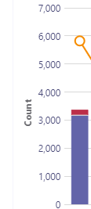
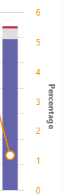
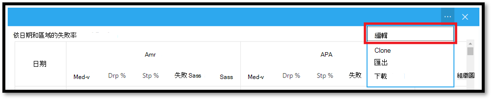
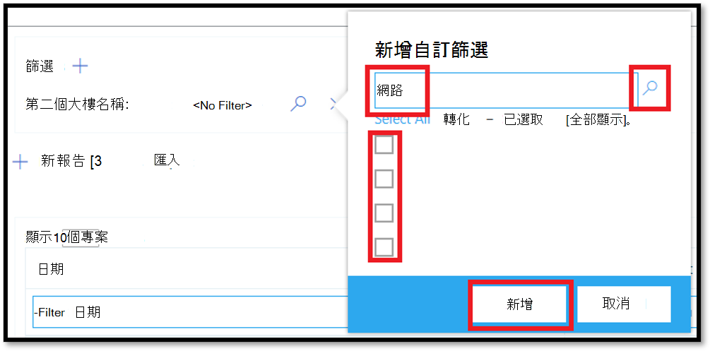
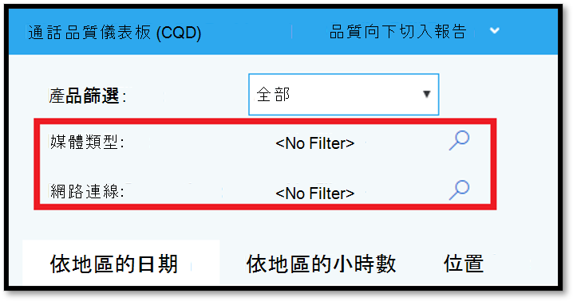

# <a name="data-and-reports-in-call-quality-dashboard-cqd"></a>通話品質儀表板中的資料和報表 (CQD) 

Microsoft 通話品質儀表板 (CQD) 使用近乎即時 (NRT) 資料摘要。 通話記錄可在通話結束之30分鐘內的 CQD 中取得。 從資料集移除 NRT 管線中的記錄前，只能有幾個月提供給它。 


## <a name="many-ways-to-access-cqd-data"></a>許多存取 CQD 資料的方式

您可以透過幾種不同的途徑存取 CQD 資料。 挑選一個最符合您需求的專案：

|  |  |
|---------|---------|
|團隊系統管理中心[ (https://admin.teams.microsoft.com) ](https://admin.teams.microsoft.com)    | CQD 資料包含在團隊系統管理中心的 [ **使用者** ] 頁面上，以易於閱讀的格式顯示最常需要的資料。 您無法自訂您在 [ **使用者**] 下找到的 CQD 資料。  |
|CQD 入口[網站 https://cqd.teams.microsoft.com) (](https://cqd.teams.microsoft.com)     | 利用鑽取篩選功能，提供符合大部分需求的穩健摘要及詳細報告。 您也可以在 CQD 入口網站中自訂報表。 <br><br>取得兩個 [CQD 報表範本](#import-the-cqd-report-templates) ，協助您分析 CQD 入口網站中的資料。       |
|Power BI     | 使用直接查詢在 Power BI 中使用 [可自訂的 POWER bi 範本](CQD-Power-BI-query-templates.md)來查看您的 CQD 資料。 [下載 POWER BI 查詢範本以進行 CQD](https://github.com/MicrosoftDocs/OfficeDocs-SkypeForBusiness/blob/live/Teams/downloads/CQD-Power-BI-query-templates.zip?raw=true)。<br><br>您也可以 [使用 REST API 來透過 POWER BI 存取 CQD 資料](https://docs.microsoft.com/skypeforbusiness/management-tools/call-quality-dashboard/data-api) 。 如果您想要下載 CQD 資料以供離線使用，請使用這個方法。 使用這個方法的優點是取得較佳的效能，對於您線上時在 Power BI 中 bog 的大型資料集，特別有用。       |
|Graph API     | 使用 [圖形 API](https://docs.microsoft.com/graph/api/resources/callrecords-api-overview?view=graph-rest-beta)存取自己的通話品質資料。 這是最複雜的方法，但它能在分析通話品質資料時提供最大的控制能力和靈活性。 例如，如果您需要將組織的其他資料加入其他資料，您可以使用圖形 API 來建立資料模型，並納入通話品質資料。        |

## <a name="import-the-cqd-report-templates"></a>匯入 CQD 報表範本

下載 [兩個策劃 CQD 報表範本](https://aka.ms/qertemplates) (所有的網路和受管理的) 網路，以協助您快速掌握 CQD。 [所有網路] 範本（雖然經過優化，可搭配建立資料檔案使用），但您可以在向 CQD 中進行收集及上傳資訊時使用，如下一節所述。

**若要匯入 [範本] (。CQDX) 到 CQD**

1. 在 CQD 中，從頁面頂端的功能表中選取 [ **詳細報表** ]。

2. 在左面板中，選取 [匯 **入**]。 流覽至第一個 CQDX 範本，然後選取 [ **開啟**]。

3. 在上傳範本之後，會出現一個快顯視窗，顯示「已成功匯入報告」訊息。 

4. 針對第二個 CQD 範本重複步驟2和3。

   > [!NOTE]
   > 每個使用者都必須將 CQD 範本匯入其 CQD 實例。 


## <a name="euii-data"></a>EUII 資料

針對合規性原因， (EUII) 資料的使用者身分識別資訊 (也稱為個人身分識別資訊或 PII) 只會保留28天。 隨著 NRT 資料與28日標記的交叉，包含 EUII 的欄位會被清除，從而產生 EUII 免費 NRT 資料。 包含 EUII 資料的欄位如下：

- 完整 IP 位址
- 媒體存取控制 (MAC) 位址
- 基本服務設定識別碼 (BSSID) 
- 會話初始通訊協定 (SIP) URI (僅適用于商務用 Skype) 
- 使用者主體名稱 (UPN) 
- 電腦端點名稱
- 使用者逐字的意見反應
- [物件識別碼] (端點使用者的 Active Directory 物件識別碼) 

### <a name="admin-roles-with-and-without-euii-access"></a>擁有及不含 EUII 存取權的管理員角色

這些 [RBAC](https://docs.microsoft.com/azure/role-based-access-control/overview) 角色 **有** EUII 存取權：
- 全域系統管理員
- 團隊服務管理員
- 團隊溝通系統管理員
- Teams 通訊支援工程師
- 全域閱讀程式
- 商務用 Skype 系統管理員

這些 RBAC 角色 **沒有** EUII 存取權：
- 報表閱讀程式
- 團隊溝通支援專家


## <a name="date-controls"></a>日期控制項

CQD 支援下列滾動趨勢類型：

- 5天
- 7天
- 30天
- 60-日
- 90-日

URL 日期參數會接受 Day 欄位。 [日常報告] 使用 YYYY MM 格式中指定的日期做為趨勢的最後一天。 URL 日期參數 "00" 代表 "today"。

|網址| 滾動日趨勢的結束日期|
|:---|:---|
|<span>HTTPs:// <cqdv3> /spd/#/Dashboard/ <reportid> /2019-02/</span>   |2019年2月的目前日期|
|<span>HTTPs:// <cqdv3> /spd/#/Dashboard/ <reportid> /2019-02-15/</span>|2019年2月15日|
|<span>HTTPs:// <cqdv3> /spd/#/Dashboard/ <reportid> /00/</span>        |當天|
|||

根據預設，月份的目前日期是作為滾動日期趨勢的最後一天。


## <a name="data-available-in-cqd-reports"></a>CQD 報表中的可用資料

預設摘要和詳細的 CQD 報表可能是您管理組織通話品質所需的全部。如有需要，您可以 [建立自訂報表](#create-custom-detailed-reports)。 

如果您想要使用 Power BI 來分析 CQD 資料，請參閱 [使用 POWER bi 來分析團隊的 CQD 資料](CQD-Power-BI-query-templates.md)。

|功能|摘要報告|詳細報告|
|:--- |:--- |:--- |
|應用程式共用躍點數 | 否 | 是 |
|客戶建立資訊支援 | 是 | 是 |
|用戶端點資訊支援 | 僅限 <span> cqd.teams.microsoft.com<span/> | 僅限 <span> cqd.teams.microsoft.com<span/> |
|深化分析支援   | 否   | 是   |
|媒體可靠性度量單位   | 否   | 是   |
|外框報告   | 是   | 是   |
|[總覽] 報表   | 是   | 是   |
|每個使用者的報表集   | 否   | 是   |
|報表集自訂 (新增、刪除、修改報告)    | 否   | 是   |
|以影片為基礎的畫面共用規格   | 否   | 是   |
|影片度量單位   | 否   | 是   |
|可用的資料量   | 過去12個月   | 過去12個月   |
|Microsoft 團隊資料   | 是   | 是   |
| | | |


 
### <a name="select-product-data-to-see-in-reports"></a>選取要在報表中查看的產品資料

在摘要和位置增強的報表中，您可以使用 [ **產品篩選** ] 下拉式清單來顯示所有產品資料、只顯示 Microsoft 團隊資料，或只顯示商務用 Skype Online 資料。
  
![螢幕擷取畫面：顯示 [產品] 篩選控制項選項](media/206ad818-0f72-4c8e-b25e-3cc8fcfbef05.png)
  
在 [詳細報告] 中，您可以使用 [ **成為團隊** 維度] 來篩選資料至 Microsoft 團隊或商務用 Skype Online 資料。

## <a name="summary-reports"></a>摘要報告

這些是您在第一次登入 CQD 時，在 CQD 儀表板上看到的報表。 它們能讓您一目了然，透過每天、每月和表格報告來查看品質趨勢，以協助識別品質較差的子網。 

| Tab | 說明 |
|---------|---------|
|整體通話品質     | [其他 3] 索引標籤的匯總。       |
|伺服器-用戶端     |伺服器與用戶端端點之間的資料流程詳細資料。        |
|用戶端-用戶端     |兩個用戶端端點之間的資料流程詳細資料。        |
|語音品質 SLA     |商務用 Skype 語音品質 [SLA](https://go.microsoft.com/fwlink/p/?linkid=846252)中所包含通話的相關資訊。        |

### <a name="overall-call-quality-tab"></a>[整體通話品質] 索引標籤

使用此索引標籤上的資料來評估通話品質狀態，以及根據串流數與較差百分比的趨勢。 右上角的圖例會顯示哪些色彩和視覺元素代表這些度量單位。
  
![螢幕擷取畫面：顯示 [通話品質] 索引標籤](media/c8d183b1-6592-49b0-a81d-35cc0568d5f0.png)
  
串流分為三個群組： [完好]、[差] 和 [未分類]。 此外，也會計算出  *較差的%*  值，可讓您將資料流程分類為不 *佳*  至總分類資料流程計數的比例。 由於 *差% = 無法正確的資料流程/ (資料流程 + 良好的資料流程) * 100*， *糟糕的%*  不會受到多個未 *分類*  資料流程的存在影響。 若要查看如何將串流分類為不良或良好，請參閱 [通話品質儀表板中的資料流程分類](stream-classification-in-call-quality-dashboard.md)。
  
使用左邊的刻度來測量串流計數值。
  

  
使用右側的刻度來測量較差的% 值。
  

  
您也可以將滑鼠游標停留在列上方，以取得實際數值。
  
> [!NOTE]
> 下列範例是來自非常小的範例資料集，且這些值對於實際部署而言並不切合實際。
  

  
整個串流大量可協助判斷計算出的低百分比。 總體資料流程的數量越小，報告的低百分比值就越不可靠。
  
### <a name="server-client-tab-and-client-client-tabs"></a>[伺服器-用戶端] 索引標籤和用戶端用戶端索引標籤

這兩個索引標籤提供在其端點對端點案例中所發生之資料流程的詳細資料。 [伺服器-用戶端] 索引標籤有四個可折迭的區段，分別代表媒體資料流程流向的四種案例。
  
- 有線內
- 外有線
- 內部 WiFi
- WiFi 外

同樣地，[用戶端-用戶端] 索引標籤有五個可折疊區段：

- 有線內-內側-有線
- 有線內-向外佈線
- 有線外-有線外側
- 內側無線內-WiFi 內側
- 內側無線-WiFi 外

#### <a name="inside-versus-outside"></a>內部與外部

CQD 使用建築物資訊（如果有的話）將串流分類為  *內部*  或 *外部*  。 每個串流的端點都會與子網位址產生關聯。 如果子網位於已上傳的建築物資訊中標示為 InsideCorp 的子網清單中，則會被視為 *內部*。 如果建築物資訊尚未上傳，請在測試中永遠將串流分類為 *外部*。 

伺服器用戶端案例的內部測試只會考慮用戶端端點。 因為伺服器永遠都不是從使用者的角度來看，所以在測試中並不考慮。
  
#### <a name="wired-versus-wifi"></a>有線與 WiFi

如名稱所指出，分類準則是以用戶端連線的類型為基礎。 伺服器一直是有線的，不會包含在計算中。 在指定的資料流程中，如果兩個端點中有一個連接至 WiFi 網路，則 CQD 會將它分類為 WiFi。

> [!NOTE]
> 如果有一個資料流程，如果兩個端點中有一個連接至 WiFi 網路，則會在 CQD 中分類為 WiFi。
  
  
## <a name="tenant-data-information"></a>租使用者資料資訊

CQD 摘要報告儀表板包含 **租使用者資料上傳** 頁面，方法是從右上角的 [設定] 功能表中選取 [ **租使用者資料上傳** ]。 此頁面可供系統管理員上傳自己的資訊，例如：

- IP 位址與地理位置資訊的地圖。
- 每個無線 AP 及其 MAC 位址的地圖。
- 端點和模型/類型等的端點地圖。
  
我們建議您上傳您的租使用者、組建及位置資料，好讓 CQD 可在報表中包含這項資訊。 如果您尚未上傳這些資料，請閱讀 [上傳租使用者及組建資料](CQD-upload-tenant-building-data.md)。 


## <a name="detailed-reports"></a>詳細報告

| 名稱 | 說明 |
|---------|---------|
|位置改進的報表     |根據位置資訊顯示品質趨勢。 只有在您 [上傳租使用者資料](CQD-upload-tenant-building-data.md)後，才會顯示此報告。        |
|可靠性報告     |包括音訊、影片、影片畫面共用 (VBSS) 及應用程式共用報表。        |
|經驗品質報告     |所有用戶端和裝置的音訊品質與可靠性，包括會議室。 這些報告是一種「slimmed」的可下載 [CQD 範本](https://aka.ms/QERtemplates)版本，側重在分析音訊品質與可靠性的重要區域上。         |
|品質深入分析報表     | 深化：依地區、位置、子網、小時與使用者的日期。        |
|深入分析報表     | 深化：依地區、位置、子網、小時與使用者的日期。        |
|評價我的通話報告     |依地區、位置或使用者分析使用者通話評等。 包括原義的意見反應。         |
|技術支援中心報告     |問訊台報告：針對個別使用者、使用者群組或每個人，查看通話與會議資料。 這些報告結合了建立與 EUII 資料，可協助根據網路位置、會議詳細資料、裝置或固件來識別可能的系統問題。         |
|用戶端版本報告     |用戶端版本摘要：針對每個用戶端 app 版本，查看會話與使用者計數<br><br>用戶端版本（依使用者）：查看每個用戶端 app 版本的使用者名稱 <br><br>針對產品和用戶端類型預先建立的篩選，可協助將版本集中到特定的用戶端。         |
|端點報告     |依電腦 (電腦與模型) 顯示通話品質。 這些報表包括建立資料（如果您已上傳）。         |


## <a name="create-custom-detailed-reports"></a>建立自訂的詳細報告

如果預設的 CQD 報表不符合您的需求，請使用這些指示來建立自訂報表。 或 (從2020年1月起，) 改為 [使用 POWER BI CQD 報表 ](cqd-power-bi-query-templates.md)。

從 [登入摘要報告] 畫面所顯示之畫面頂端的 [報告] 下拉式清單中， \( **Summary Reports** \) 選取 [**詳細報告**]，然後選取 [**新增**]。 按一下報表中的 [ **編輯** ]，即可查看 [查詢編輯器]。 每個報告都會以查詢的方式支援到立方體中。 報表是其查詢所傳回資料的視覺效果。 [查詢編輯器] 可協助您編輯這些查詢和報表的顯示選項。

> [!IMPORTANT]
> 網路範圍可以用來代表幾個子網的 (supernet 組合，) 的單一路由前置詞。 所有新的建築物上傳都會被檢查，以取得任何重迭的範圍。 如果您先前上傳的是組建檔案，您應該下載目前的檔案，然後重新上傳以找出任何重疊，並修正問題，然後再重新上傳。 先前上傳的檔案中的任何交疊，可能會導致無法正確地將子網對應至報表中的建築物。 某些 VPN 實現不會精確地報告子網資訊。 建議將 VPN 子網新增至組建檔案，而不是子網的一個專案時，會針對 VPN 子網中的每個位址，為個別的32位網路新增個別專案。 每個資料列都可以有相同的建築物中繼資料。 例如，172.16.18.0/24 不只一列，您應該有256列，每個位址都有一個資料列，其中每個位址都在 172.16.18.0/32 和 172.16.18.255/32 之間（含）。
>
> [VPN] 欄是選擇性的，預設為0。  如果 VPN 欄的值設為1，則該資料列所代表的子網將會完全展開，以符合子網中的所有 IP 位址。  請謹慎使用這個方式，然後只針對 VPN 子網，因為完全擴充這些子網會對涉及建立資料之查詢的查詢時間造成負面影響。

指向報表中的 [橫條圖] 和 [趨勢線]，以顯示詳細值。 具有焦點的報表會顯示 [動作] 功能表： [ **編輯**]、[ **克隆**]、[ **刪除**]、[ **下載**] 和 [ **匯出] 報表樹**。


## <a name="query-filters"></a>查詢篩選

查詢篩選是透過使用 CQD 中的 [查詢編輯器] 來實現。 這些篩選可用來減少 CQD 傳回的記錄數，從而將報表的整體大小和查詢時間降至最低。 這對於篩選掉未受管理的網路特別有用。 下表所列的篩選使用正則運算式 (RegEx) 。


| Filter         | 說明          | CQD 查詢篩選範例      |
|----------------|----------------------|-------------------------------|
| 沒有空白值   | 有些篩選沒有選項可篩選空白值。 若要手動篩選空白值，請根據您的需求，使用空白運算式，並將篩選設定為 [等於] 或 [不等於]。      | 第二個建築物名稱 \<\> \^ \\ s\*\$                       |
| 排除常見子網 | 若沒有有效的組建檔案，無法從非託管網路個別管理，就會將 [家用網路] 包含在報告中。 這些 home 子網不在其控制範圍內，而且可以從報表中快速排除。 在本指南中定義的常見子網是10.0.0.0、192.168.1.0 和192.168.0.0。 | 第二個子網 \<\> 10.0.0.0 \| 192.168.0.0 \| 192.168.1。0 |
| 僅限內部查看  | 用來在) 以外的) 或非託管 (中篩選受管理 (的報表。 受管理的 CQD 範本已預先設定了這些篩選器。       | Corp = 內部的秒數        |

## <a name="report-filters"></a>報表篩選

使用 CQD 報表篩選來縮小調查的重點。 您可以在 [查詢編輯器] 或直接在報表中，將篩選新增至所轉譯的報表中，以使用報表篩選。 下列報表篩選是在整個 [CQD 範本](https://aka.ms/QERtemplates)中使用。


| Filter     | 說明                            | CQD 報表篩選範例         |
|------------|----------------------------------------|-----------------------------------|
| 月      | 首先從年份開始，然後從月份開始。 | 2017-10                           |
| 字母 | 篩選任何字母字元。 | [a-z]                             |
| 小數    | 篩選任何數位字元。    | [0-9]                             |
| 百分 | 篩選百分比。              |  ( [3-9] \\ . ) \| ( [3-9] ) \| ( [1-9] [0-9] )  |


### <a name="drill-down-filters"></a>深化篩選

CQD 報表功能有數個向下切入篩選，這些篩選是可縮小通話品質調查焦點的強大工具。 如果您選取 [向下切入] 欄位，報告會自動開啟適當的索引標籤，並篩選選取的值。 如果該索引標籤有自己的向下切入欄位，而其中一個是選取的，則會套用這兩組篩選，並逐漸縮小產生的資料集。


#### <a name="adding-and-editing-drill-down-fields"></a>新增及編輯向下切入欄位

編輯報表時，您可以選擇使用 [查詢編輯器] 來指定您自己的深化欄位。

首先按一下 **...** 針對您要編輯的報表，然後選取 [ **編輯**]。



從 [查詢編輯器] 左側的清單中選取維度。 然後按一下 [ **流覽至** 標籤] 底下的下拉式清單，然後選取您要該尺寸向下切入至其中的索引標籤和展開器群組。 注意：目前只有流覽至不同的索引標籤，才能使用 [深化] 功能。 稍後會新增對特定展開器進行鑽取的支援。 最後，按一下 [ **關閉** ]，儲存您對維度所做的變更，然後按一下 [ **儲存** ] 以儲存並關閉 [查詢編輯器]。

![在 [查詢編輯器] 中選取維度的螢幕擷取畫面](media/qerguide-image-selectquerydimension.png)

### <a name="multi-select-filters"></a>多重選取篩選

除了向下切入功能之外，CQD 也支援指定包含多個值 (或) 篩選器的篩選器。

若要選取多個篩選值，請先將新篩選新增至報表。 按一下 **+** [ **篩選** ] 標籤旁的 [輸入您要使用的維度名稱]，然後按一下 [ **新增**]。


接著，按一下 [ **搜尋** ] (新篩選) 旁邊的放大鏡圖示。 您會看到一個 [文字] 欄位及許多選項，包括 [ **全選** ] 和 [ **反相**]。 輸入一個值，然後按一下該欄位旁邊的 [ **搜尋** ] 進行搜尋。 或者，將 [文字] 欄位保留空白，然後按一下 [ **搜尋** ] 以查看前100個選項。

```powershell
/filter/[AllStreams].[Second Tenant Id]\|[YOUR TENANT ID HERE]
```

範例  



### <a name="dashboard-level-filters"></a>儀表板層級篩選
某些 CQD 報表會將儀表板層級篩選新增到其中，讓您可以輕鬆地依一般參數進行篩選。 這些篩選會出現在一般報表索引標籤之外，且直接位於 [產品] 篩選器下方，且適用于儀表板中的所有篩選器。


```powershell
/filter/[AllStreams].[Is Teams]|[TRUE | FALSE]
```

### <a name="url-filters"></a>URL 篩選

CQD 支援將篩選新增至 URL。 這可讓您輕鬆共用或為 CQD 查詢加上書簽。 您可以在 URL 中定義參數，例如 [趨勢月份]、[租使用者識別碼] 或 [語言]。 您也可以將產品或儀表板層級篩選新增至 URL。
如果您要修正受管理的建築物或網路（其中的同盟端點可能會影響您的報表），則從 CQD 報告排除同盟資料就很有用。

若要新增篩選，請將下列專案附加到 URL 的結尾：

```console
/filter/[AllStreams].[Second Tenant Id]\|[YOUR TENANT ID HERE]
```

範例  

`https://cqd.teams.microsoft.com/cqd/#/1234567/2018-08/filter/[AllStreams].[Second Tenant Id]|[TENANTID]`

若要將儀表板層級篩選新增至 URL，該篩選必須以 [產品] 或 [儀表板層級] 篩選器存在於 CQD 中。 在趨勢月份之後及 URL 參數之前，將這些篩選新增至 URL：

`filter/DATA_MODEL_NAME|VALUE`

例如，若要套用 Microsoft 團隊的產品篩選值，您必須加入下列專案：

`filter/[AllStreams].[Is%20Teams]|[True]`

整個 URL 看起來會像這樣：

`https://cqd.teams.microsoft.com/spd/#/Dashboard/2624085/2018-9/filter/[AllStreams].[Is%20Teams]|[True]`

若要使用多重選取值來套用 URL 篩選，請使用管道 ( 來分隔每個值 |) 字元。 例如：

`filter/[AllStreams].[Media%20Type]|[Video]|[Audio]|[VBSS]`

如果您指定不正確名稱或值，就不會套用 URL 篩選。


您可以使用 URL 篩選來篩選特定維度的每個報表。 最常見的 URL 篩選是用來篩選報告，以排除同盟參與者遙測，或只將焦點集中在團隊或商務用 Skype Online 上。 如果您要修正受管理的建築物或網路（其中的同盟端點可能會影響您的報表），則從 CQD 報告排除同盟資料就很有用。

| Filter         | 說明          | CQD 查詢篩選範例      |
|----------------|----------------------|-------------------------------|
| 沒有空白值   | 有些篩選沒有選項可篩選空白值。 若要手動篩選空白值，請根據您的需求，使用空白運算式，並將篩選設定為 [等於] 或 [不等於]。      | 第二個建築物名稱 \<\> \^ \\ s\*\$                       |
| 排除常見子網 | 若沒有有效的組建檔案，無法從非託管網路個別管理，就會將 [家用網路] 包含在報告中。 這些 home 子網不在其控制範圍內，而且可以從報表中快速排除。 如本文所定義，常見的子網是10.0.0.0、192.168.1.0 和192.168.0.0。 | 第二個子網 \<\> 10.0.0.0 \| 192.168.0.0 \| 192.168.1。0 |
| 僅限內部查看  | 用來在) 以外的) 或非託管 (中篩選受管理 (的報表。 受管理的 CQD 範本已預先設定了這些篩選器。       | Corp = 內部的秒數        |


#### <a name="how-to-find-your-tenant-id"></a>如何尋找您的租使用者識別碼

CQD 中的租使用者識別碼會對應到 Azure 中的目錄 ID。 如果您不知道您的目錄識別碼，您可以在 Azure 入口網站中找到：

1.  登入 Microsoft Azure 入口網站： <https://portal.azure.com>

2.  選取 [ **Azure Active Directory**]。

3.  在 [ **管理**] 底下，選取 [ **屬性**]。 您的租使用者識別碼位於 [ **目錄識別碼** ] 方塊中。

您也可以使用 PowerShell 來尋找您的租使用者識別碼： 

```powershell
Login-AzureRmAccount
```

## <a name="comparing-teams-and-skype-for-business-cqd-data"></a>比較團隊與商務用 Skype CQD 資料

即使在最新的 CQD (cqd.teams.microsoft.com) 中，您也會看到團隊與商務用 Skype 之間資料的差異。 原因如下：
- 確保效能與可靠性的機制差異：
  - 團隊已自動重新連線並快速漫遊。 商務用 Skype 不會。
  - 團隊有動態頻寬管理。 商務用 Skype 不會。
- 團隊與商務用 Skype 之間 [IP 位址範圍](Office-365-URLs-IP-address-ranges.md) 的差異。 團隊 IP 範圍較新，可能會導致防火牆出現連線問題。

## <a name="open-cqd-from-the-skype-for-business-legacy-portal"></a>從商務用 Skype 傳統版入口網站開啟 CQD

**使用商務用 skype 傳統版入口網站**的商務用 skype 標誌圖示

1. 使用系統管理員帳戶登入您的 Office 365 組織，然後選取 [系統 **管理** ] 磚以開啟系統管理中心。

2. 在左窗格中的 [系統 **管理中心**] 底下，選取 [ **Microsoft 團隊** ] 以開啟團隊系統管理中心。

3. 在團隊管理中心中，選取左窗格中的 [ **舊版入口網站** ]，選取 [ **工具**]，然後選取 [ **商務用 Skype Online 通話品質儀表板**]。

   ![螢幕擷取畫面：選取 [通話品質] 儀表板](media/6cc7f80f-b8e2-4a9b-aab8-ac871d07a261.png)

4. 在開啟的頁面上，使用您的全域系統管理員帳戶登入，然後在出現提示時提供該帳戶的認證。

第一次登入時，CQD 會開始收集及處理資料。 

> [!IMPORTANT]
> 從2019年12月之後，您仍然可以存取舊版的 CQD (cqd.lync.com) ，不過舊版入口網站提供了最新 CQD (cqd.teams.microsoft.com) 的連結。 最後，將會解除舊版的 CQD。 從2020年7月1日起，較舊版本的 CQD 會從新的 CQD (存取資料 https://CQD.teams.microsoft.com) ，而且您無法再匯出建立及報告資料。 在後期2020中，我們會關閉舊的 CQD，您將無法再存取它。


## <a name="related-topics"></a>相關主題

[改善及監視團隊的通話品質](monitor-call-quality-qos.md)

[什麼是 CQD？](CQD-what-is-call-quality-dashboard.md)

[設定通話品質儀表板 (CQD) ](turning-on-and-using-call-quality-dashboard.md)

[上傳租使用者及組建資料](CQD-upload-tenant-building-data.md)

[使用 CQD 管理通話與會議品質](quality-of-experience-review-guide.md)

[CQD 中可用的維度與量值](dimensions-and-measures-available-in-call-quality-dashboard.md)

[CQD 中的資料流程分類](stream-classification-in-call-quality-dashboard.md)

[使用 Power BI 來分析 CQD 資料](CQD-Power-BI-query-templates.md)
