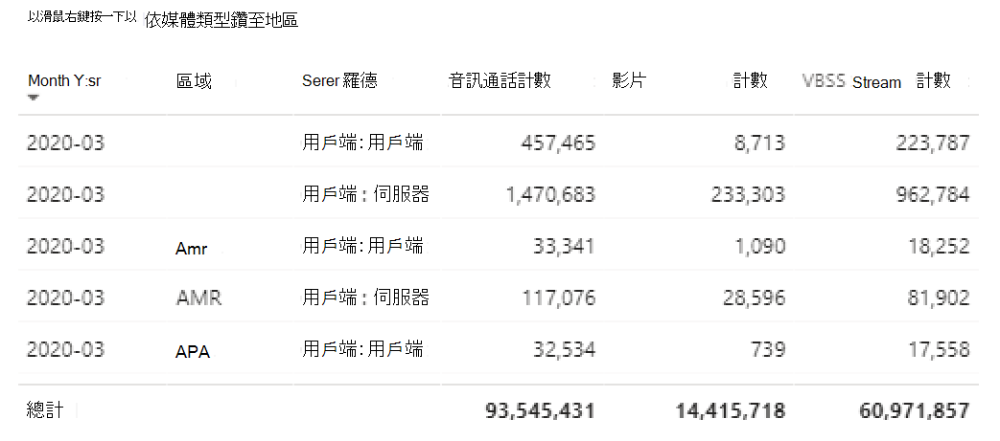

# 在 Power BI 中使用 CQD 資料來查看 Microsoft 團隊利用率View Microsoft Teams utilization in Power BI using CQD data

我們新增了2020年3月的新功能，我們已將 [團隊利用率] 報告新增至可下載[的 POWER BI 查詢範本以供 CQD](https://github.com/MicrosoftDocs/OfficeDocs-SkypeForBusiness/blob/live/Teams/downloads/CQD-Power-BI-query-templates.zip?raw=true)使用。New in March 2020, we've added a Teams Utilization report to our downloadable [Power BI query templates for CQD](https://github.com/MicrosoftDocs/OfficeDocs-SkypeForBusiness/blob/live/Teams/downloads/CQD-Power-BI-query-templates.zip?raw=true). 

這個新的團隊利用率報告可讓您查看使用者使用 Microsoft 團隊的方式（以及多少）。This new Teams Utilization reports lets you see how (and how much) your users are using Microsoft Teams. 這些報告是要成為集中位置，管理員與企業領導人都可以快速移至此資料。These reports are intended to be a centralized location that both administrators and business leaders can quickly go to for this data.

[團隊利用率 Power BI] 報表包含兩個主要的報表： [**[通話計數摘要](#call-count-summary-report)**] 和 [**[音訊分鐘摘要](#audio-minutes-summary-report)**]。The Teams Utilization Power BI report consists of two primary reports: **[Call Count Summary](#call-count-summary-report)** and **[Audio Minutes Summary](#audio-minutes-summary-report)**. [每日使用量](#daily-usage)、[地區音訊詳細資料](#regional-audio-details)、[會議詳細資料](#conference-details)和[使用者清單](#user-list)報告在使用者利用 [向下切入] 報告（如下所述）中時，就會開始播放。The [Daily Usage](#daily-usage), [Regional Audio Details](#regional-audio-details), [Conference Details](#conference-details) and [User List](#user-list) reports come into play when a user takes advantage of the drill-down reports, noted in the descriptions below.

> [!NOTE]
> 必須填入建立和子網資料，才能提供區域和網路篩選功能。Building and subnet data must be populated to provide regional and network filtering capabilities.

## [通話計數摘要] 報告Call Count Summary Report

主頁面（[通話計數摘要]）會立即提供最近30和90天的音訊、影片和螢幕共用會話數目，如章節標題中所述。The main page (Call Count Summary) immediately provides the number of audio, video and screen sharing sessions over the last 30 and 90 days as noted in the section title. 最初顯示的資料是針對組織而言，您可以使用頁面左側的 [交叉分析篩選器] 下拉式清單選項加以篩選。The data initially displayed is for the organization as a whole and can be filtered using the slicer dropdown options on the left side of the page.

1. 在交叉分析篩選器下拉式清單的右側，依媒體類型進行的呼叫數量會在過去30天內細分為內部/外部視圖。To the right of the slicer dropdowns, the number of calls by media type is broken down to an internal/external view over the past thirty days. 我們可以透過上述螢幕擷取畫面來查看更多來自外部組織位置的呼叫，從而讓您考慮目前的全域環境。We can see through the above screenshot that there are more calls happening from outside organizational locations, which makes sense considering the current global environment.
  

1. 在 [媒體類型計數] 方塊的右邊，我們有 [每月通話計數依據媒體類型]，最後90天。To the right of the media type count box, we have the Monthly Call Count by Media Type for the last 90 days. 每個資料行和媒體類型都可以進行懸停，以顯示前一月或目前月份的計數，以提供使用趨勢資訊。Each column and media type can be hovered over to display the count for a previous month or the current month to date, providing usage trend information.
  
 

1. 中間圖形的運作方式就是90天的圖表，但它提供過去30天的每日使用狀況視圖，並允許使用者以滑鼠右鍵按一下，並向下切入特定日期的詳細資料。The middle graph functions as the 90-day graph does, however it provides a daily usage view for the past 30 days and allows a user to right click and drill down into details for a specific day.
  

在頁面左下方，您會發現一個表格，提供過去一年每個媒體類型的總計值。On the bottom left section of the page, you'll find a table providing total values for each media type over the past year. 
         

在表格右側，橫條圖會顯示過去30天內最常使用（通話/串流）的用戶端。To the right of the table, a bar chart shows clients with the most use (calls/streams) for the past 30 days.
   

此頁面的最後一組圖表會分別顯示每個媒體類型，以及顯示會議與 P2P 使用方式的細目分類。The last set of charts for this page show each media type individually, with a breakdown showing conference and P2P usage. 下表顯示與 P2P 相比，有明顯較高的會議使用量。The charts below show that there is a significantly higher number of conference usage as compared to P2P.
  

## 音訊分鐘摘要報告Audio Minutes Summary Report

在 [音訊分鐘使用方式] 報告中，會透過幾種不同的視圖提供總分鐘使用量。On the Audio Minutes usage report, the total minute usage is provided through a few different views. 

我們會在交叉分析篩選器旁顯示三十天的使用方式摘要，輕鬆地使用文字方塊。We have the thirty-day usage summary shown next to the slicers as easy to consume text boxes. [最大值] 會顯示三十天的總計，並在其下方加上內部和外部細目。The top number shows the thirty-day total, with internal and external breakdowns below that.

右上方橫條圖提供會議音訊使用量的 yearlong。The top right bar graph provides a yearlong view of conference audio usage. 將游標暫留在月份上以顯示會議音訊分鐘數。Hover over the month to show the conference audio minutes.

若要在 P2P 與會議音訊中顯示差異，左下角圖表會取得過去一年的所有音訊，並在這兩種類型之間分割。To show the difference in P2P and conference audio, the bottom left chart takes all audio for the past year and breaks it up between the two types.

[音訊分鐘] 頁面的最後一個圖表會顯示全域地圖疊加上的音訊分鐘使用量。The last chart for the Audio minutes page shows audio minute usage on a global map overlay. 只有在建立和子網資料上傳到租使用者時，才能使用此圖表。This chart will only work if building and subnet data is uploaded to the tenant. 在地圖上重迭的圓形圖可以深化到其中，進而提供區域音訊使用量。The pie chart overlay on the map can be drilled into, subsequently providing regional audio usage.

## 鑽取功能Drill-through capabilities

如先前所述，使用者可以深入探索每日和地區使用方式報告。As previously noted, users can drill into the daily and regional usage reports.

### 每日使用量Daily Usage

每日使用方式報告可讓系統管理員透過一天的時間來識別高峰期消耗量。The Daily Usage report allows an administrator to identify peak consumption periods through the course of a day. 除了用法之外，我們還能捕獲該日的整體使用者觀點和意見反應。In addition to usage, we are also able to capture overall user sentiment and feedback for that day.

[每日使用方式] 報告會顯示所選日期的音訊、影片和螢幕共用的數目，並增加內部和外部連線性的功能。The Daily usage report displays the number of Audio, Video and Screen shares for the selected day with the added ability to differentiate between internal and external connectivity. 會議和對等細目細目分類是直接位於 [您的 [一份] [總] 方塊的右側。A Conference and Peer to Peer breakdown is to the immediate right of the modality total box. 報表的右上角提供一份清單，其中包含其相關聯的識別碼以及當天的參與者。The top right of the report provides a list of conferences with their associated ID and participants for the day. 您也可以在會議清單中進一步向下流覽至 [會議詳細資料] 報告。The conference list provides an additional drill down to the Conference Details report as well. 取代圖形REPLACE GRAPHIC

[中央區域] 中的 [橫條圖] 可讓使用者透過一天的時間來識別高峰期消耗量。The bar graph in the center area allows the user to identify peak consumption periods through the course of a day. 使用者可向下切入圖中所代表的小時，這將會在每小時顯示一份使用者清單報告。Users may drill down into the hour represented on the graph which will present the User List report for the hour.

在 [橫條圖] 的右側，使用者的意見反應會以視覺格式呈現。To the right of the bar graph, User Feedback is presented in a visual format. 在使用者觀點可以是主觀的情況下，它會提供可用於識別潛在問題的洞察力。While user sentiment can be subjective, it does provide insight that can be used to identify potential issues.

下表提供一系列的度量單位。The bottom table provides a range of metrics for the day. 較差的百分比以及失敗率可提供具有潛在改善區域的系統管理員。Poor percentages along with failure rates can provide an administrator with potential areas of improvement. 您也可以個別選取每個小時，如下所示。Each hour can also be selected individually as shown below.

這個資料可用來找出在高峰期內遇到問題的區域。This data can be used to identify regions having problems during peak consumption times.

按一下該日期的欄，即可顯示該小時的度量單位。Click on the column for that day to display metrics for that hour.

  
  1.  圖表下方的表格會顯示該小時的度量單位。The table below the chart will display the metrics for that hour. 這可以依據任何欄標題來排序;不過，我們很樂意找出有問題的區域。This can be sorted by any column header; however, we would be interested in finding problematic areas.  
    
    
  2.  我們在此期間看到 IND 區域在會議中遇到較差的視頻效能。We see that the IND region is experiencing poor video performance in conferences during this time frame. 接著，您可以使用 CQD QER Microsoft 報表來縮小有問題的位置，因為已識別出區域和時間範圍。Subsequently, the CQD QER Microsoft reports can be used to narrow down the problematic location as the region and time frame has been identified.

### 會議詳細資料Conference Details

[會議詳細資料] 報告可提供從出席者清單到在會話期間使用的媒體類型等其他會議的深入見解。The Conference Details report provides additional insight for meetings, from an attendee list, to the media types used during the session.

以滑鼠右鍵按一下會議的 [會議 ID] 圖表中的參與者列，以深入瞭解會議詳細資料。Right click a conference the participant bar in the conference ID chart on the Daily usage page to drill down into the conference details.

  

我們可以在會議中看到參與者，並將所有相關資訊移至 [資料包遺失] 和 [抖動]，協助您在底部表格中進行可能的疑難排解工作。We can see the participants in the conference as well as all the pertinent information down to packet loss and jitter to assist with potential troubleshooting efforts in the bottom table.

### 地區音訊詳細資料Regional Audio Details

[地區音訊詳細資料] 向下切入特別顯示所選區域的音訊分鐘使用量。The Regional Audio Details drill down specifically shows the audio minute usage for the selected region. 擁有 CQD 存取權的使用者可以查看所選區域內 P2P 與會議音訊的使用方式趨勢。Users with access to CQD can see usage trends for both P2P and conference audio within the selected region.

1.  在 [通話計數摘要] 頁面上，透過資料表以特定區域為依據。On the Call Count Summary page, drill-through to as specific region through the table.
  

2.  選取需要其他區域資訊的那一列。Select the row with the region additional information is needed for.
  

3.  資料趨勢會顯示在內部網路上所使用的大量分鐘數，以及會議最超越 P2P 的使用方式。The data trends show a significant number of minutes being used on the internal network, with conferencing far surpassing P2P use.
  

地區音訊趨勢可以用來顯示使用者如何受到世界各地的影響。The regional audio trend can be used to show how users are impacted by external influences in the world. 具體來說，我們會預期您會看到 EMEA 與 APAC 區域的外部使用方式，讓人員能在遠端作業時增加。Specifically, right now, we would expect to see the external usage for the EMEA and APAC regions to increase with people being asked to work remotely.

### 使用者清單User List

使用者清單 [向下切入] 會根據預期，提供查看報表之人員所選取之特定小時的使用者特定資訊。The User List drill down provides, as one might expect, user specific information for a specific hour selected by the person viewing the report. 您可以透過 [每日使用量] 報告上的 [每小時趨勢] 圖形中的向下切入來存取使用者清單報告。The User List report is accessible through a drill down in the Hourly Trends graph on the Daily Usage report. 以滑鼠右鍵按一下需要額外資訊，然後選取 [鑽取] 和 [使用者清單]，如下所示。Right click on the hour additional information is needed for and select Drill through and User List, as shown below.

[使用者清單] 報表會透過頁面頂端中心的環圈圖顯示內部/外部連線性。The User List report shows internal/external connectivity through the doughnut chart in the top center of the page. 我們可以在下方影像中看到有大量參與公司網路外部的人員。We can see that there is a large amount of participation from Outside the corporate network in the below image.

圖表右上角顯示在該小時內每個使用者所做的通話次數。The top right of the graph shows the number of calls made by each user within that hour.

下表提供每位使用者在該時間內參與之會話的詳細資訊。The bottom table provides detailed information for the sessions each user participated in during that hour. [失敗類型] 欄可用於判斷導致呼叫下降的原因。The Failure Type column is useful in determining what caused a call to drop. [捕獲] 和 [轉譯裝置] 欄可用於識別為什麼來電報告品質不佳的原因。The Capture and Render Device columns are useful in identifying why a call was reported having poor quality.

## 相關主題Related topics

[通話品質儀表板中提供的維度和量值Dimensions and measures available in Call Quality Dashboard](dimensions-and-measures-available-in-call-quality-dashboard.md)

[通話品質儀表板中的資料流分類Stream Classification in Call Quality Dashboard](stream-classification-in-call-quality-dashboard.md)

[設定商務用 Skype 通話分析Set up Skype for Business Call Analytics](set-up-call-analytics.md)

[使用通話分析來疑難排解不良通話品質Use Call Analytics to troubleshoot poor call quality](use-call-analytics-to-troubleshoot-poor-call-quality.md)

[通話分析和通話品質儀表板Call Analytics and Call Quality Dashboard](difference-between-call-analytics-and-call-quality-dashboard.md)
 