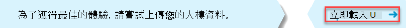

# Upload通話品質儀表板中建立租使用者和 (CQD) Upload tenant and building data in Call Quality Dashboard (CQD)

若要在 CQD (中) 通話品質儀表板，建議您上傳租使用者和建築物資料。To get the most out of Call Quality Dashboard (CQD), we recommend that you upload your tenant and building data. 有 2 種類型的租使用者資料檔案，[建築物和](#upload-building-data-file)[端點](#endpoint-data-file)。There are 2 types of tenant data files, [Building](#upload-building-data-file) and [Endpoint](#endpoint-data-file).

您可以在這裡下載範例租使用者資料 [範本](https://github.com/MicrosoftDocs/OfficeDocs-SkypeForBusiness/blob/live/Teams/downloads/locations-template.zip?raw=true)。You can download a sample tenant data template [here](https://github.com/MicrosoftDocs/OfficeDocs-SkypeForBusiness/blob/live/Teams/downloads/locations-template.zip?raw=true). 若要瞭解建立地圖的協助，請參閱建立 [CQD 的建築物地圖](CQD-building-mapping.md)。For help with building mapping, read [Create a building map for CQD](CQD-building-mapping.md).

從 CQD 摘要報表儀表板中，選取 CQD Upload 功能表中的設定 租使用者資料 (CQD 功能表頂端的齒輪圖示) 。From the CQD Summary Reports dashboard, select **Tenant Data Upload** from the CQD **Settings** menu (a gear icon at the top of CQD). 管理員可以從這裡上傳其組織的建築物和端點資訊，例如 IP 位址和地理資訊的映射、每個無線存取點及其 MAC 位址的映射等。From here, admins can upload their organization's building and endpoint information, such as mapping of IP addresses and geographical information, mapping each wireless access point and its MAC address, etc.

1. 從 (Teams 系統管理中心或) 開啟 CQD 圖示，然後選取右上角的齒輪圖示，然後從摘要報表頁面選擇 Upload 租使用者資料。 [https://cqd.teams.microsoft.com](https://cqd.teams.microsoft.com)  Open CQD (from the Teams admin center, or at [https://cqd.teams.microsoft.com](https://cqd.teams.microsoft.com)), then select the gear icon in the upper-right corner and choose **Tenant Data Upload** from the **Summary Reports** page.

   
    
2. 或者，如果這是您第一次流覽 CQD，系統將會要求您上傳建築物資料。Alternatively, if this is your first time visiting CQD, you'll be asked to upload building data. 您可以選取 Upload **立即** 流覽至租使用者 **資料Upload** 頁面。You can select **Upload Now** to quickly navigate to the **Tenant Data Upload** page.

   

3. 在租 **使用者資料Upload** 頁面上，選取 **流覽** 以選擇資料檔案。On the **Tenant Data Upload** page, select **Browse** to choose a data file.

4. 選取資料檔案之後，請指定 **開始日期** ，也可以指定結束日期。After selecting a data file, specify **Start date** and, optionally, specify an end date.

5. 選取開始日期 **之後**，選取 **Upload** 檔案上傳到 CQD。After selecting **Start date**, select **Upload** to upload the file to CQD.   在上傳檔案之前，檔案會經過驗證。Before the file is uploaded, it's validated. 如果驗證失敗，會顯示錯誤訊息，要求您更正檔案。If validation fails, an error message is displayed requesting that you correct the file. 下圖顯示資料檔案中的欄數不正確時發生錯誤。The following figure shows an error occurring when the number of columns in the data file is incorrect.

   
 
6. 如果在驗證期間未發生錯誤，檔案上傳將會成功。If no errors occur during validation, the file upload will succeed. 接著，您可以在我的上傳資料表中看到上傳的資料檔案，顯示該頁面底部目前租使用者所有上傳檔案的完整清單。You can then see the uploaded data file in the **My uploads** table, which shows the full list of all uploaded files for the current tenant at the bottom of that page.

> [!NOTE]
> 最多可能需要四小時才能完成建築物檔案的處理。It can take up to four hours to finish processing the building file.    如果您已經上傳建築物檔案，而且需要新增可能錯過或排除的子網，請新增新的子網來修改原始檔案、移除目前的檔案，然後重新上傳新編輯的檔案。If you've already uploaded a building file and need to add subnets that might have been missed or excluded, modify the original file by adding the new subnets, remove the current file, and re-upload the newly edited file. CQD 中只能有一個使用中的建築物資料檔案。There can be only one active building data file in CQD. 

## Upload建資料檔案Upload building data file

CQD 中第一種類型的租使用者資料檔案 **是建築物資料檔案** 。The first type of tenant data file in CQD is the **Building** data file. 子網資料行是展開 Network+NetworkRange 資料行，然後將子網資料行加入通話記錄的第一個子網或第二個子網資料行，以顯示建築物、城市、國家/地區或地區資訊。The Subnet column is derived by expanding the Network+NetworkRange column, then joining the Subnet column to the call record’s First Subnet or Second Subnet column to show Building, City, Country, or Region information. 您上傳的資料檔案格式必須符合下列準則，才能在上傳前通過驗證檢查：The format of the data file you upload must meet the following criteria to pass the validation check before upload:
  
- 檔案必須是 .tsv 檔案， (欄必須以 TAB) 分隔.csv或 (欄以逗號分隔) 。The file must be either a .tsv file (columns are separated by a TAB) or a .csv file (columns are separated by a comma).

- 資料檔案不包含表格標題列。The data file doesn't include a table header row. 資料檔案的第一行應該是實際資料，而不是標題標籤 ，例如「網路」。The first line of the data file is expected to be real data, not header labels like "Network".

- 檔案中的資料類型只能是 String、Integer 或布林值。Data types in the file can only be String, Integer, or Boolean. 對於整數資料類型，值必須是數值。For the  Integer data type, the value must be a numeric value. 布林值必須是 0 或 1。Boolean values must be either 0 or 1.

- 如果欄使用 String 資料類型，則資料欄位可以是空白的，但仍必須以索引鍵或逗號分隔。If a column uses the String data type, a data field can be empty but must still be separated by a tab or comma. 空白資料欄位只指派空的 String 值。An empty data field just assigns an empty String value.

- 每個租使用者資料檔案有 1，000，000 個展開列數限制。There is a 1,000,000 expanded row limit per tenant data file.

- 每一列必須有 15 個欄，每一欄都必須有適當的資料類型，而且欄的順序必須按照下表 (逗號或定位字元分隔) ：There must be 15 columns for each row, each column must have the appropriate data type, and the columns must be in the order listed in the following table (comma or tab delimited):

  **建立資料檔案格式****Building data file format**
  
  | 欄名稱Column name        | 資料類型Data type | 範例Example                   | 指導方針Guidance              |
  |--------------------|-----------|---------------------------|-----------------------|
  | NetworkIPNetworkIP          | StringString    | 192.168.1.0192.168.1.0               | 必要Required              |
  | NetworkNameNetworkName        | StringString    | USA/Seattle/SEATTLE-SEA-1USA/Seattle/SEATTLE-SEA-1 | 需要1Required1  |
  | NetworkRangeNetworkRange       | 數量Number    | 2626                        | 必要Required              |
  | BuildingNameBuildingName       | StringString    | 西雅圖-SEA-1SEATTLE-SEA-1             | 需要1Required1  |
  | OwnershipTypeOwnershipType      | StringString    | ContosoContoso                   | 選用Optional              |
  | BuildingTypeBuildingType       | StringString    | IT 終止IT Termination            | 選用Optional              |
  | BuildingOfficeTypeBuildingOfficeType | StringString    | 工程Engineering               | 選用Optional              |
  | 城市City               | StringString    | 西雅圖Seattle                   | 推薦Recommended           |
  | 郵遞區號ZipCode            | StringString    | 9800198001                     | 推薦Recommended           |
  | 國家Country            | StringString    | 我們US                        | 推薦Recommended           |
  | 狀態State              | StringString    | 窪WA                        | 推薦Recommended           |
  | 地區Region             | StringString    | MSUSMSUS                      | 推薦Recommended           |
  | InsideCorp2InsideCorp2         | BoolBool      | 11             | 必要Required              |
  | ExpressRoute3ExpressRoute3       | BoolBool      | 00             | 必要Required              |
  | VpnVPN                | BoolBool      | 00                         | 選用Optional              |

  1 雖然 CQD 不需要，但範本已配置為顯示建築物和網路名稱。1 While not required by CQD, the templates are configured to display Building and Network name.

  2 此設定可用來反映子網是否位於公司網路內。2 This setting can be used to reflect whether or not the subnet is inside the corporate network. 您可以自訂其他用途的使用量。You can customize usage for other purposes.

  3 此設定可用來反映網路是否使用 Azure ExpressRoute。3 This setting can be used to reflect whether or not the network uses Azure ExpressRoute. 您可以自訂其他用途的使用量。You can customize usage for other purposes.  

  **範例列：****Sample row:**

  `192.168.1.0,USA/Seattle/SEATTLE-SEA-1,26,SEATTLE-SEA-1,Contoso,IT Termination,Engineering,Seattle,98001,US,WA,MSUS,1,0,0`

> [!IMPORTANT]
> 網路範圍可用來代表一個超網路， (多個子網的組合，以及單一路由首碼) 。The network range can be used to represent a supernet (combination of several subnets with a single routing prefix). 所有新建築物上傳都會檢查任何重迭範圍。All new building uploads will be checked for any overlapping ranges. 如果您先前上傳過建置檔案，您應該先下載目前的檔案，然後重新上傳檔案，找出任何重迭之處並修正問題，然後再重新上傳。If you have previously uploaded a building file, you should download the current file and re-upload it to identify any overlaps and fix the issue before uploading again. 先前上傳檔案的任何重迭都可能會導致子網與報告中建築物的相互比對錯誤。Any overlap in previously uploaded files may result in the wrong mappings of subnets to buildings in the reports. 某些 VPN 的實現無法正確報告子網資訊。Certain VPN implementations do not accurately report the subnet information. 
>
> VPN 欄為選擇性，預設為 0。The VPN column is optional and will default to 0. 如果 VPN 欄的值設為 1，該列所代表的子網將會完全展開，以符合子網內的所有 IP 位址。If the VPN column’s value is set to 1, the subnet represented by that row will be fully expanded to match all IP addresses within the subnet. 請謹慎且僅適用于 VPN 子網，因為完全展開這些子網會對建立資料之查詢的查詢時間造成負面影響。Please use this sparingly and only for VPN subnets since fully expanding these subnets will have a negative impact on query times for queries involving building data. 如果子網的擴充導致超過 1，000，000 的擴充列限制，系統將不會接受建房檔案。If the expansion of the subnet results in the expansion row limit of 1,000,000 being exceeded, the building file will not be accepted.

### 超網路Supernetting

您可以使用超網路，通常稱為無Inter-Domain路由 (CIDR，) 定義每個子網。You can use supernetting, commonly called Classless Inter-Domain Routing (CIDR,) in place of defining each subnet. 超 *網路* 是多個共用單一路由首碼的子網組合。A *supernet* is a combination of several subnets that share a single routing prefix. 您可以不使用每個子網新增專案，而是使用超網路位址。Instead of adding an entry for each subnet, you can use the supernetted address. 支援超網路，但我們不建議使用它。Supernetting is supported, but we don't recommend using it.

例如，Contoso 的行銷大樓是由下列子網所建立：For example, Contoso's marketing building is made up of the subnets below:

-   10.1.0.0/24 -一樓10.1.0.0/24—first floor
-   10.1.1.0/24-二樓10.1.1.0/24—second floor
-   10.1.2.0/24 -三樓10.1.2.0/24—third floor
-   10.1.3.0/24 -四樓10.1.3.0/24—fourth floor

您可以不使用每個子網新增專案，而是使用超網路位址 ，在此範例中為 10.1.0.0/22。Instead of adding an entry for each subnet, you can use the supernetted address—in this example, 10.1.0.0/22.

-   Network = 10.1.0.0Network = 10.1.0.0
-   網路範圍 = 22Network Range = 22

以下是在實行超網路之前，請考慮的一些專案：Here are a few things to consider before you implement supernetting:

-   超網路只能用於具有 8 位到 28 位元遮罩的子網映射。Supernetting can only be used in a subnet mapping with 8-bit to 28-bit mask.

-   超網路佔用較少的前置時間，但代價是降低資料的豐富性。Supernetting takes less time up front, but it comes at the cost of reducing the richness of your data. 假設子網 10.1.2.0 發生品質問題。Let's say there's a quality problem involving subnet 10.1.2.0. 如果您實行超網路化，您不會知道子網在建築物中的位置，或網路類型 (例如實驗室) 。If you implemented supernetting, you won't know where in the building the subnet is located or what type of network it is (for example, a lab). 如果您已經定義建築物的所有子網和上傳的樓面位置資訊，就能看到這一區別。If you'd defined all the subnets for a building and uploaded floor location information, you'd be able to see that distinction.

-   請確保超網路位址正確無誤，而且不會捕獲不想要的子網。It's important to ensure that the supernetted address is correct and isn't catching unwanted subnets.

-   在資料中尋找 192.168.0.0 是相當常見的。It's quite common to find 192.168.0.0 in data. 對於許多組織來說，這表示使用者在家中。For many organizations, this indicates that the user is at home. 對其他人來說，這是衛星辦公室的 IP 位址方案。For others, this is the IP address scheme for a satellite office. 如果貴組織有使用此配置的辦公室，請勿將其納入您的建房檔案中，因為使用常見的子網難以區分家用和內部 [網路](quality-of-experience-review-guide.md#common-subnets)。If your organization does have offices that use this configuration, don't include it in your building file because it's difficult to distinguish between home and internal networks by using [common subnets](quality-of-experience-review-guide.md#common-subnets). 

> [!IMPORTANT]
> 網路範圍可用來代表超網路。The network range can be used to represent a supernet. 所有新的建築物資料檔案上傳都會檢查是否有重迭的範圍。All new building data file uploads will be checked for any overlapping ranges. 如果您先前上傳過建置檔案，您應該下載目前的檔案並再次上傳，以找出任何重迭之處並修正問題。If you've previously uploaded a building file, you should download the current file and upload it again to identify any overlaps and fix the issue. 先前上傳檔案的任何重迭都可能會導致子網與報告中建築物的相互映射錯誤。Any overlap in previously uploaded files might result in the wrong mappings of subnets to buildings in the reports.

### VpnVPN

QoE (qoE) 用戶端傳送至 Microsoft 365 或 Office 365 的資料 -這是 CQD 資料的來源地 -包含 VPN 標號。The quality of experience (QoE) data that clients send to Microsoft 365 or Office 365—which is where CQD data is sourced from—includes a VPN flag. CQD 會視此為第一個 VPN 和第二個 VPN 維度。CQD will see this as the First VPN and Second VPN dimensions. 不過，此標號仰賴 VPN 廠商向 Windows註冊的 VPN 網路介面卡是遠端存取介面卡的報告。However, this flag relies on VPN vendors' reporting to Windows that the VPN network adapter registered is a Remote Access adapter. 並非所有 VPN 廠商都正確註冊遠端存取介面卡。Not all VPN vendors properly register Remote Access adapters. 因此，您可能無法使用內建的 VPN 查詢篩選。Because of this, you might not be able to use the built-in VPN query filters. 使用上述的 VPN 資料行來正確標記和識別 VPN 子網。Use the VPN column discussed above to accurately mark and identify VPN subnets. 此外，為 VPN 網路貼上標籤也是很好的做法，方便您識別報表。It is also good practice to label your VPN networks for easy identification in your reports. 以下是如何標示 VPN 子網的兩個範例：Below are two examples of how to label your VPN subnets:

- 在 **VPN 子網的** 此欄位中輸入 「VPN」以定義網路名稱。Define a **Network Name** by entering "VPN" in this field for VPN subnets.

  

- 在 VPN **子網的** 此欄位中輸入 「VPN」，以定義建築物名稱。Define a **Building Name** by entering "VPN" in this field for VPN subnets.

  

> [!NOTE]
> 已知 VPN 連接在基礎連接為無線時，會誤認為網路連接類型為有線。VPN connections have been known to misidentify the network connection type as wired when the underlying connection is wireless. 當您在 VPN 連接上查看品質時，無法假設已正確識別連線類型。When looking at quality over VPN connections, you can't assume that the connection type has been accurately identified.

## 端點資料檔案Endpoint data file

另一種類型的 CQD 租使用者資料檔案是 **端點** 資料檔案。The other type of CQD tenant data file is the **Endpoint** data file. 資料行值會用於通話記錄的第一個用戶端端點名稱或第二個用戶端端點名稱欄，以顯示端點建立、模型或類型資訊。The column values are used in the call record’s First Client Endpoint Name or Second Client Endpoint Name column to show Endpoint Make, Model, or Type information. 您上傳的資料檔案格式必須符合下列準則，才能在上傳前通過驗證檢查：The format of the data file you upload must meet the following criteria to pass the validation check before upload:

- 檔案必須是 .tsv 檔案， (欄必須以 TAB) 分隔.csv或 (欄以逗號分隔) 。The file must be either a .tsv file (columns are separated by a TAB) or a .csv file (columns are separated by a comma).

- 資料檔案的內容不包含表格標題。The content of the data file doesn't include table headers. 資料檔案的第一行應該是實際資料，而不是標題標籤 ，例如「端點名稱」。The first line of the data file is expected to be real data, not a header label like "EndpointName".

- 所有七欄都只會使用 String 資料類型。All seven columns use the String data type only. 允許的長度上限為 64 個字元。The maximum allowed length is 64 characters.

- 資料欄位可以是空白的，但仍必須以定位字元或逗號分隔。A data field can be empty but must still be separated by a tab or comma. 空白資料欄位只指派空的 String 值。An empty data field just assigns an empty String value.

- 端點名稱必須是唯一的，否則上傳失敗。EndpointName must be unique, otherwise the upload fails. 如果有重複的列或兩列使用相同的端點名稱，衝突將導致不正確的聯入。If there is a duplicate row or two rows that use the same EndpointName the conflict will  cause incorrect joining.

- EndpointLabel1、EndpointLabel2 和 EndpointLabel3 是可自訂的標籤。EndpointLabel1, EndpointLabel2, and EndpointLabel3 are customizable labels. 它們可以是空白的字串或值，例如「IT 部門指定的 2018 膝上型電腦」或「資產標記 5678」。They can be empty Strings or values such as “IT Department designated 2018 Laptop” or “Asset Tag 5678”.

- 每一列必須有七欄，而且欄的順序必須如下：There must be seven columns for each row and the columns must be in the following order:

  **域順序：****Field order:**

  端點名稱、端點模型、端點模型、端點類型、端點標籤1、端點標籤2、端點標籤3EndpointName, EndpointMake, EndpointModel, EndpointType, EndpointLabel1, EndpointLabel2,  EndpointLabel3

  **範例列：****Sample row:**

  `1409W3534, Fabrikam, Model 123, Laptop, IT designated 2018 Laptop, Asset Tag 5678, Purchase 2018`

## 更新建築物檔案Update a building file

在收集建築物和子網資訊時，系統管理員通常會在一段時間的多次反覆運算中上傳建築物檔案，並新增新的子網及其建築物資訊。While gathering building and subnet information, administrators will often upload the building file in multiple iterations over time, adding new subnets and their building information as it becomes available. 發生這種情況時，您必須重新上傳建築物檔案。When this occurs, you'll need to re-upload your building file. 此程式與上一節所述的初始上傳類似，但下列一節所述的一些例外情況除外。This process is like the initial upload as described in the previous section, with a few exceptions as noted in the following section.

> [!Important]
> 一次只能使用一個建築物檔案。Only one building file can be active at a time. 多個建築物檔案不會累加。Multiple building files aren't cumulative.

## 新增淨新子網Add net new subnets

有時候，您需要在 CQD 中新增網路新子網，這些子網原本不是網路拓撲的一部分。There are times when you'll need to add net new subnets to CQD that weren't originally part of your network topology. 若要新增淨新子網，請從 CQD 的租使用者資料 **Upload頁面執行** 下列操作：To add net new subnets, do the following from the **Tenant Data Upload** page in CQD:

1.  如果您還沒有最新版本的檔案，請下載原始檔案。Download the original file, if you don't already have an up-to-date copy.

1.  移除 CQD 中的目前檔案。Remove the current file in CQD.

1.  編輯原始建築物檔案，並提供在取得新子網之前至少一天的結束日期。Edit the original building file and provide an end date that occurs at least one day before the net new subnets were acquired.

1.  將淨新子網附加到原始建築物檔案。Append the net new subnets to the original building file.

1.  Upload新修改的建築物檔案，並設定前一個建築物檔案結束後一天的開始日期。Upload the newly modified building file, and set the start date for one day after the previous building file ends.

## 新增遺失的子網Add missing subnets

上傳受管理網路的建築物資訊之後，每個受管理網路都應該有建築物關聯。After you upload building information for managed networks, every managed network should have a building association. 不過，情況不一定一定如此;通常會漏接幾個子網。However, this won't always be the case; typically, a few subnets are missed. 若要尋找這些遺失的網路，請檢閱 CQD 中體驗品質 **報告頁面上的** 遺失子網報告。To find these missing networks, review the **Missing Subnet Report** on the **Quality of Experience Reports** page in CQD. 這會以 10 或更多音訊資料流程呈現所有子網，這些音訊流未在建房資料檔案中定義，且標示為外部。This presents all the subnets with 10 or more audio streams that aren't defined in the building data file and are being marked as outside. 請在此清單中確保沒有受管理網路。Ensure that there are no managed networks in this list. 如果子網遺失，請使用下列程式更新原始建築物資料檔案，然後重新上傳至 CQD。If subnets are missing, use the following procedure to update the original building data file and re-upload it to CQD.

1. 前往 CQD **Upload** 租使用者資料頁面。Go to the **Tenant Data Upload** page in CQD.

1. 如果您還沒有最新版本的檔案，請下載原始檔案。Download the original file, if you don't already have an up-to-date copy.

1. 移除 CQD 中的目前檔案。Remove the current file in CQD.

1. 將新的子網附加到原始檔案。Append the new subnets to the original file.

1. Upload建立檔案。Upload the building file. 請務必將開始日期設定為至少八個月之前，讓 CQD 處理歷史資料。Be sure to set the start date to at least eight months prior so that CQD will process historical data.

> [!IMPORTANT]
> 您必須將租使用者識別碼新增為第二個租使用者識別碼的查詢篩選，才能篩選報表，只查看貴組織的租使用者資料。You'll need to add your tenant ID as a query filter for **Second Tenant ID** to this report to filter the report to view only your organization's tenant data. 否則，報表會顯示聯盟子網。Otherwise, the report will show federated subnets.

> [!NOTE] 
> 請務必將月年報表篩選調整為目前月份。Be sure to adjust the Month Year report filter to the current month. 選取 **編輯**，然後調整月 **年** 報表篩選以儲存新的預設月份。Select **Edit**, and adjust the **Month Year** report filter to save the new default month.

## 相關主題Related topics

[建立 CQD 的建築物地圖Create a building map for CQD](CQD-building-mapping.md)

[改善及監控通話品質TeamsImprove and monitor call quality for Teams](monitor-call-quality-qos.md)

[什麼是 CQD？What is CQD?](CQD-what-is-call-quality-dashboard.md)

[設定通話品質儀表板 (CQD) Set up Call Quality Dashboard (CQD)](turning-on-and-using-call-quality-dashboard.md)

[CQD 資料和報表CQD data and reports](CQD-data-and-reports.md)

[使用 CQD 管理通話和會議品質Use CQD to manage call and meeting quality](quality-of-experience-review-guide.md)

[CQD 中可用的維度和度量Dimensions and measures available in CQD](dimensions-and-measures-available-in-call-quality-dashboard.md)

[CQD 中的資料流程分類Stream Classification in CQD](stream-classification-in-call-quality-dashboard.md)

[使用 Power BI分析 CQD 資料Use Power BI to analyze CQD data](CQD-Power-BI-query-templates.md)
