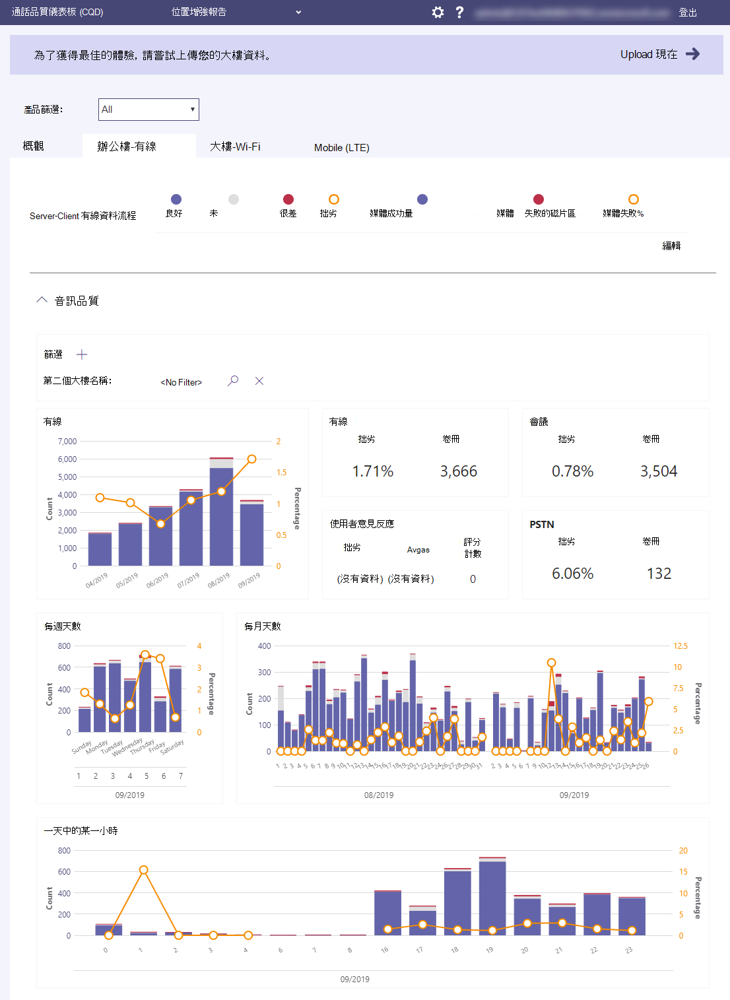

# 什麼是通話品質儀表板 (CQD) ？

Microsoft 通話品質儀表板 (CQD) [https://cqd.teams.microsoft.com](https://cqd.teams.microsoft.com) - - 顯示 Microsoft Teams、商務用Skype Online 和商務用 Skype Server 2019 全組織層級的通話和會議品質。 

  
最新版本的 CQD 具有接近即時 [的 (NRT) ](CQD-data-and-reports.md)資料摘要，這表示通話記錄可在通話結束的 30 分鐘內在 CQD 中提供。

無論 CQD 包含使用者標識資訊 ([EUII) 資料，](CQD-data-and-reports.md#euii-data)其管理方式與 [整個 Microsoft 365](/office365/Enterprise/office-365-data-retention-deletion-and-destruction-overview)的 EUII 相同。

CQD 是專為協助 Teams 系統管理員、商務用 Skype 系統管理員和網路工程師監控全組織層級的通話和會議品質所設計。 您將使用 CQD 來協助 **優化您的網路** ，以提升績效品質。 當您需要查看特定使用者的通話和會議資訊時，請使用CQD 資料與每個使用者的通話[分析](use-call-analytics-to-troubleshoot-poor-call-quality.md)。

例如，使用 CQD，您可以判斷使用者使用每個使用者通話分析 (所觀察到的通話品質不佳) 是因為網路問題也會影響到許多其他使用者。 CQD 會同時取得使用 Teams 或商務用 Skype 進行之通話的個人通話體驗和整體品質。 有了 CQD，整體模式可能會變得明顯，因此網路工程師可以做出明智的通話品質評定。 CQD 提供通話品質度量報告，可深入瞭解整體通話品質、伺服器-用戶端資料流程、用戶端-用戶端資料流程和語音品質[SLA。](https://go.microsoft.com/fwlink/p/?linkid=846252) 
  

在 CQD 中，我們鼓勵您上傳建築物和端點資訊，讓您使用 Location-Enhanced 報表來分析使用者建築物內的通話品質和可靠性。 您可以評估資料，以判斷問題是否與單一使用者隔離，或影響較大的使用者區段。 若要在 CQD 中開啟建築物或端點特定視圖，系統管理員必須在 CQD **租** 使用者資料上傳頁面上上傳建築物或端點資訊。

請勿錯過我們的管理通話和會議 [品質](quality-of-experience-review-guide.md) 文章，本文為負責在 Teams 中管理服務品質的 Teams 系統管理員或支援工程師提供深入指引。

## 舊版 CQD (CQD.lync.com) 

目前版本的 CQD (https://CQD.Teams.microsoft.com) 已取代舊版 CQD https://CQD.lync.com) (。 您仍可使用 CQD.lync.com (商務用 Skype 系統管理中心) 提供的資料，但自 2020 年 7 月 1 日起，它使用的是 CQD 的資料。Teams.microsoft.com，您無法再從舊的 CQD 資料表來查看或修改建築物或查詢 (CQD.lync.com) 。 如果您尚未從資料庫移 CQD.lync.com，請記錄支援票證。

> [!IMPORTANT]
> 自 2021 年 7 月 31 日起，我們將淘汰舊版 CQD (CQD.lync.com) 。 之後，系統會自動將您重新導向至 CQD。Teams.microsoft.com 存取 CQD.lync.com，任何未匯出建築物或查詢資料都會遺失。

## 使用 Power BI 分析 CQD 資料

2020 年 1 月新增： [下載 CQD 的 Power BI](https://github.com/MicrosoftDocs/OfficeDocs-SkypeForBusiness/blob/live/Teams/downloads/CQD-Power-BI-query-templates.zip?raw=true)查詢範本。 您可以使用可自訂的 Power BI 範本來分析及報告您的 CQD 資料。

請閱讀 [使用 Power BI 分析 CQD 資料](CQD-Power-BI-query-templates.md) 以深入瞭解。

## 相關主題

[改善及監控 Teams 的通話品質](monitor-call-quality-qos.md)

[設定通話品質儀表板 (CQD) ](turning-on-and-using-call-quality-dashboard.md)

[上傳租使用者和建築物資料](CQD-upload-tenant-building-data.md)

[CQD 資料和報表](CQD-data-and-reports.md)

[使用 CQD 管理通話和會議品質](quality-of-experience-review-guide.md)

[CQD 中可用的維度和度量](dimensions-and-measures-available-in-call-quality-dashboard.md)

[CQD 中的資料流程分類](stream-classification-in-call-quality-dashboard.md)

[使用 Power BI 分析 CQD 資料](CQD-Power-BI-query-templates.md)

[Teams 疑難排解](/MicrosoftTeams/troubleshoot/teams)
