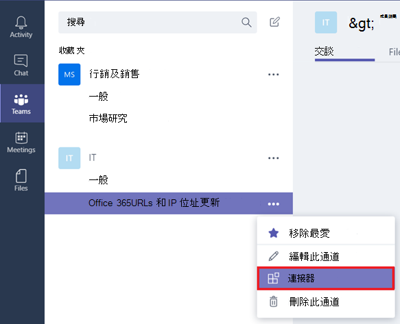
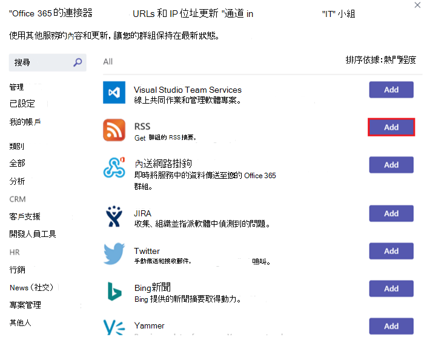
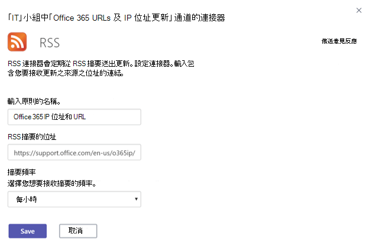
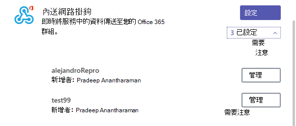
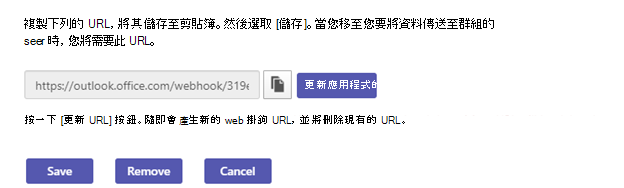
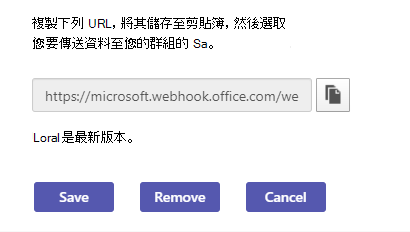

在 Microsoft 團隊中使用 Microsoft 365 和自訂連接器Use Microsoft 365 and custom connectors in Microsoft Teams
=======================================================

連接器可將經常使用的內容和服務更新直接傳送到頻道，讓您的團隊保持在最新狀態。Connectors keep your team current by delivering frequently used content and service updates directly into a channel. 透過連接器，您的 Microsoft 團隊使用者可以在其小組中的聊天串流內，從流行服務（例如 Trello、Wunderlist、GitHub 及 Azure DevOps 服務）接收更新。With connectors, your Microsoft Teams users can receive updates from popular services such as Trello, Wunderlist, GitHub, and Azure DevOps Services within the chat stream in their team.

如果小組許可權允許，小組中的任何成員都可以將其小組與流行的雲端服務連線，而且所有小組成員都會收到來自該服務的活動通知。Any member of a team can connect their team to popular cloud services with the connectors if the team permissions allow, and all team members are notified of activities from that service. 連接器在最初設定連接器的成員已離開之後，仍能繼續運作。Connectors will continue to function even after the member who has initially setup the connector has left. 任何擁有 add\remove 許可權的小組成員都可以修改其他成員的連接器設定。Any team member with the permissions to add\remove can modify connectors setup by other members.

Microsoft 365 連接器可搭配 Microsoft 團隊和 Microsoft 365 群組使用，讓所有成員都能更輕鬆地保持同步並快速接收相關資訊。Microsoft 365 connectors can be used with both Microsoft Teams and Microsoft 365 groups, making it easier for all members stay in sync and receive relevant information quickly. Microsoft 團隊和 Exchange 都使用相同的連接器模型，這可讓您在這兩個平臺中使用相同的連接器。Both Microsoft Teams and Exchange use the same connector model, which allows you to use the same connectors within both platforms. 不過，請注意，停用小組所依賴的 Microsoft 365 群組的連接器將會停用為該小組建立連接器的能力。It is worth noting, however, that disabling connectors for the Microsoft 365 group that a team is dependent upon will disable the ability to create connectors for that team as well.

在頻道中新增連接器Add a connector to a channel
----------------------------

目前，您可以使用 Microsoft 團隊桌面與網頁用戶端來新增連接器。Currently, you can add connectors by using Microsoft Teams desktop and web clients. 不過，您可以在 **所有用戶端** （包括行動裝置）上查看透過這些連接器發佈的資訊。However, information posted by these connectors can be viewed in **all clients** including mobile.

1. 若要新增連接器至頻道，請按一下頻道名稱右側的 **省略號 ( ... )** ]，然後按一下 [ **連接器**]。To add a connector to a channel, click the **ellipses (…),** on the right of a channel name, then click **Connectors**.

    > [!div class="mx-imgBorder"]
    > ![已選取 [連接器] 選項的 [小組介面] 螢幕擷取畫面。](media/Use_Office_365_and_custom_connectors_in_Microsoft_Teams_image1.png)

2. 您可以從各種可用的連接器中進行選取，然後按一下 [ **新增**]。You can select from a variety of available connectors, and then click **Add**.

    > [!div class="mx-imgBorder"]
    > ![顯示可用連接器之 [連接器] 對話方塊的螢幕擷取畫面。](media/Use_Office_365_and_custom_connectors_in_Microsoft_Teams_image2.png)

3. 填入所選連接器所需的資訊，然後按一下 [ **儲存**]。Fill in the required information of the selected connector and click **Save**. 每個連接器都需要一組不同的資訊才能正常運作，而某些可能需要您使用連接器設定頁面上提供的連結登入服務。Each connector requires a diverse set of information to function properly, and some may require you to sign in to the service using the links provided on the connector configuration page.

    > [!div class="mx-imgBorder"]
    > ![RSS 連接器之 [設定] 頁面的螢幕擷取畫面。](media/Use_Office_365_and_custom_connectors_in_Microsoft_Teams_image3.png)

4. 連接器所提供的資料會自動發佈到頻道。Data provided by the connector is automatically posted to the channel.

    > [!div class="mx-imgBorder"]
    > ![[團隊] 介面的螢幕擷取畫面，顯示頻道中的交談。](media/Use_Office_365_and_custom_connectors_in_Microsoft_Teams_image4.png)

<!---Delete this section after customer migration to new Webhook URL is complete--->
> [!IMPORTANT]
> **連接器 URL 更新通知****Connector URL update notification**
>
> 團隊連接器會轉換成新的 URL，以增強安全性。The Teams connectors are transitioning to a new URL to enhance security. 在此轉場期間，您會收到一些通知，以更新您設定的連接器以使用新的 URL。During the course of this transition, you will receive certain notifications to update your configured connector to use the new URL. 強烈建議您立即更新連接器，以避免任何對連接器服務的中斷。It is strongly recommended that you update your connector immediately to prevent any disruption to connector services. 若要更新 URL，必須遵循下列步驟：The following steps need to be followed to update the URL:
> 1. 在 [連接器設定] 頁面上，[注意事項] 訊息會顯示在需要更新之連線的 [管理] 按鈕底下。In the connectors configuration page, an "Attention Required" message will be displayed under the "Manage" button for the connections that need to be updated.
> ![[注意事項] 訊息的螢幕擷取畫面。](media/Teams_Attention_Required_message.png)
> 2. 對於內向 webhook 連接器，使用者只要選取 [ **更新 URL** ] 並使用新產生的 webhook URL，即可重新建立連線。For incoming webhook connectors, users can recreate the connection by simply selecting **Update URL** and using the newly generated webhook URL.
> ![[更新 URL] 按鈕的螢幕擷取畫面。](media/Teams_update_URL_button.png)
> 3. 針對其他連接器類型，使用者必須移除連接器，然後重新建立連接器設定。For other connector types, the user would need to remove the connector and recreate the connector configuration.
> 4. 成功更新 URL 之後，您會看到「URL 是最新的」訊息。You will see a message "URL is up-to-date" after the URL has been successfully updated.
> ![[URL 是最新的] 訊息的螢幕擷取畫面。](media/Teams_URL_up_to_date.png)

開發自訂連接器Develop custom connectors
----------------------------

您也可以建立自訂連接器，以及接收和外寄 webhooks。You can also build custom connectors, as well as incoming and outgoing webhooks. 如需詳細資訊，請參閱我們的[開發人員文件](/microsoftteams/platform/webhooks-and-connectors/what-are-webhooks-and-connectors)。See our [developer documentation](/microsoftteams/platform/webhooks-and-connectors/what-are-webhooks-and-connectors) for more information.
