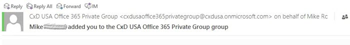

在 Exchange Online 中新增 Microsoft 團隊 SMTP 網域作為允許的寄件者網域Add the Microsoft Teams SMTP domain as an allowed sender domain in Exchange Online 
=============================================================================

無論您是在系統管理主控台中建立 Microsoft 365 群組，還是使用 Outlook，都會使用 Exchange Online 傳送小組成員新增至群組的通知。Whether you create a Microsoft 365 Group in the admin console or by using Outlook, Exchange Online is used to send notifications of a team member being added to a Group. 這些訊息是從您的租使用者產生的，因為它們代表您的預設網域 SMTP FQDN。These messages are generated from your tenant as they represent your default domain SMTP FQDN.

小組也會使用 Microsoft Exchange Online 來傳送通知給小組成員（如果已新增）。Teams uses Microsoft Exchange Online as well to send notifications to team members when they've been added. 這是 SMTP 郵件網域 FQDN 的差異 @email 為「teams.microsoft.com」（針對商業/商業租使用者）和「@GCC-email.teams.com」（適用于政府租使用者），並可透過垃圾郵件篩選功能來捕獲。The difference being the domain FQDN of the SMTP message is "@email.teams.microsoft.com" for Commercial/Business tenants and "@GCC-email.teams.com" for Government tenants and could be caught by spam filtering.

為了獲得最佳結果和無縫操作，請考慮將 Microsoft 團隊 SMTP 網域新增至 Exchange Online 垃圾郵件設定中的 [允許的寄件者網域] 清單：For best result and seamless operation, consider adding the Microsoft Teams SMTP domain to your "allowed sender domains" list in your Exchange Online spam configuration:

![垃圾郵件設定設定的 [允許清單] 區段的螢幕擷取畫面](media/Add_the_Microsoft_Teams_SMTP_domain_as_an_accepted_domain_in_Exchange_Online_image3.png)
