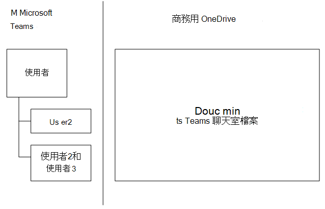

# SharePoint Online 與商務用 OneDrive 與 Microsoft 團隊互動的方式How SharePoint Online and OneDrive for Business interact with Microsoft Teams

> [!Tip]
> 請觀看下列會話，瞭解團隊與 Azure Active Directory （AAD）、Office 365 群組、Exchange、SharePoint 和商務用 OneDrive 的互動方式： [Microsoft 團隊的基礎](https://aka.ms/teams-foundations)Watch the following session to learn how Teams interacts with Azure Active Directory (AAD), Office 365 Groups, Exchange, SharePoint and OneDrive for Business: [Foundations of Microsoft Teams](https://aka.ms/teams-foundations)

Microsoft 團隊中的每個小組在 SharePoint Online 中都有小組網站，小組中的每個頻道都在預設的小組網站文件庫中取得一個資料夾。Each team in Microsoft Teams has a team site in SharePoint Online, and each channel in a team gets a folder within the default team site document library. 在交談中共用的檔案會自動新增至文件庫，SharePoint 中設定的許可權和檔案安全性選項會自動反映在小組中。Files shared within a conversation are automatically added to the document library, and permissions and file security options set in SharePoint are automatically reflected within Teams.

私人聊天檔案會儲存在寄件者的商務用 OneDrive 資料夾中，而許可權會自動授與所有參與者，做為檔案共用程式的一部分。Private chat files are stored in the sender’s OneDrive for Business folder, and permissions are automatically granted to all participants as part of the file sharing process.

如果使用者未使用 SharePoint Online 授權指派及啟用，他們在 Office 365 中就沒有商務用 OneDrive 儲存空間。If users aren't assigned and enabled with SharePoint Online licenses, they don't have OneDrive for Business storage in Office 365. 檔案共用功能會繼續在頻道中運作，但是使用者無法在 Office 365 中的商務用 OneDrive 儲存空間中共用檔案。File sharing will continue to work in channels, but users won't be able to share files in chats without OneDrive for Business storage in Office 365.

透過將檔案儲存在 SharePoint Online 文件庫和商務用 OneDrive 中，就會遵循在租使用者層級設定的所有合規性規則。By storing the files in the SharePoint Online document library and OneDrive for Business, all compliance rules configured at the tenant level will be followed. 

> [!NOTE]
> 目前 Microsoft 團隊不支援與 SharePoint 內部部署的整合。Integration with SharePoint On-premises is not supported for Microsoft Teams at this time.

下列是團隊、頻道與文件庫之間的關聯性範例。The following is the example of relationships between team, channel, and document library.

針對每個小組，都會建立一個 SharePoint 網站，而 [**共用文件**] 資料夾則是為該小組建立的預設資料夾。For every team, a SharePoint site is created, and the **Shared Documents** folder is the default folder created for the team. 每個頻道，包括**一般**頻道（每個小組的預設頻道）在 [**共用檔**] 中都有一個資料夾。Each channel, including the **General** channel (the default channel for each team) has a folder in **Shared Documents**.

![SharePoint Online 中的 [共用文件] 資料夾圖表。](media/Understand_how_SharePoint_Online_and_OneDrive_for_Business_interact_with_Microsoft_Teams_image1.png)

> [!NOTE]
> 目前無法將預設的 SharePoint 網站與文件庫取代為其他人。It's not currently possible to replace the default SharePoint site and document library with another one. 我們已聽取您想要的內容，我們正在考慮。We've heard from you that you want it, and we're considering it. 檢查 [[團隊藍圖](https://aka.ms/teamsroadmap)] 或 [[團隊 UserVoice](https://aka.ms/TeamsUserVoice) ]，掌握即將推出的功能。Check the [Teams Roadmap](https://aka.ms/teamsroadmap) or [Teams UserVoice](https://aka.ms/TeamsUserVoice) to stay on top of upcoming features.

> [!TIP]
> 若要將索引標籤新增至您的小組，以連結至現有的 SharePoint 網站頁面或現有的 SharePoint 文件庫：To add a tab to your team that links to an existing SharePoint site page or to your existing SharePoint document library:
> 1. 選取索引標籤旁的加號。Select the  plus sign next to the tabs.
> 2. 針對現有的文件庫，選取任一**sharepoint**的現有 sharepoint 網站頁面或**文件庫**。Select either **SharePoint** for an existing SharePoint site page or **Document Library** for an existing document library.
> 3. 選取適當的頁面或文件庫。Select the appropriate page or document library.

針對每位使用者， **Microsoft 團隊聊天**檔案是用來儲存在私人聊天中與其他使用者共用的所有檔案（1:1 或1：許多），並自動設定許可權，以限制只有預定使用者才能存取。For every user, the OneDrive folder **Microsoft Teams Chat Files** is used to store all files shared within private chats with other users (1:1 or 1:many), with permissions configured automatically to restrict access to the intended user only.

## [頻道檔案] 索引標籤Channel Files tab

> [!INCLUDE [new feature coming soon](includes/new-feature-coming-soon-section.md)]

團隊中的 [檔案] 索引標籤會與 [SharePoint**檔**] 視圖密切類似。The **Files** tab in Teams closely resembles the SharePoint documents view. **在 [檔案**] 索引標籤上，使用者可以：On the **Files** tab, users can:

- 請參閱 [**新增**檔案] 功能表中的其他選項。See additional options in the **New** file menu.
- 將檔案同步處理到其本機磁片磁碟機。Sync files to their local drive.
- 在 [**所有檔**] 功能表上，從 [**清單**] 視圖切換至 [將**清單壓縮**至 [**磚**] 視圖。On the **All Documents** menu, switch from **List** view to **Compact list** to **Tiles** view.
- 找出需要注意或有惡意程式碼的檔案。Identify files that need attention or have malware.
- 立即查看檔案是唯讀或取出。Immediately see whether a file is read-only or checked out.
- 取出和存回檔案。Check out and check in files.
- 釘選、解除固定及變更檔的排序次序。Pin, unpin, and change the sort order of files.
- 找出需要中繼資料的檔案Identify which files need metadata
- 從許多其他篩選選項中進行選擇。Choose from many more filter options.
- 根據欄標題來分組檔案。Group files based on column headings.
- 修改欄設定（向左或向右移動、隱藏）和欄寬。Modify column settings (move left or right, hide) and column width.

## 預設連結類型設定Default link type setting

SharePoint 和 OneDrive 擁有管理員設定，可指定為檔案建立之連結的預設連結類型。SharePoint and OneDrive have an admin setting for specifying the default link type for links that are created for a file. 團隊會重複使用系統管理員針對 SharePoint 和 OneDrive 設定的設定，採用相同的方法。Teams is adopting that same approach by reusing the settings that the admin sets for SharePoint and OneDrive. 如需有關此方法的詳細資訊，[請參閱變更使用者取得共用連結時的預設連結類型](https://docs.microsoft.com/sharepoint/change-default-sharing-link)。More details about this approach are described in [Change the default link type when users get links for sharing](https://docs.microsoft.com/sharepoint/change-default-sharing-link). 

## 其他資訊More information

如需 SharePoint 與團隊搭配運作方式的詳細資訊，請參閱[sharepoint 與團隊：更好搭配](https://techcommunity.microsoft.com/t5/Microsoft-SharePoint-Blog/SharePoint-and-Teams-Better-Together/ba-p/189593)使用。For more information about how SharePoint works with Teams, see [SharePoint and Teams: better together](https://techcommunity.microsoft.com/t5/Microsoft-SharePoint-Blog/SharePoint-and-Teams-Better-Together/ba-p/189593).

若要深入瞭解團隊中的來賓體驗，請閱讀[來賓體驗](guest-experience.md)。To learn more about the guest experience in Teams, read [What the guest experience is like](guest-experience.md).

