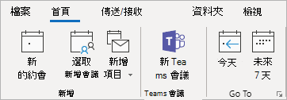

# 在 Outlook 中使用 Teams 會議增益集

此文章詳述您的終端使用者 Teams 會議增益集的驗證需求和功能。 它也會顯示使用者如何在「孤島模式」中啟用私人會議及調整原則設定。 如果您有增益集的問題，請參閱我們[最新的疑難排解指導方針](/MicrosoftTeams/troubleshoot/meetings/resolve-teams-meeting-add-in-issues)。

Teams 會議增益集可讓使用者從 Outlook 安排 Teams 會議。 您可以在 Windows、Mac、Web 和行動裝置上使用此增益集。

## 在 Windows 版 Outlook 中使用 Teams 會議增益集

如果使用者在 Windows 電腦上安裝了 Microsoft Teams 及 Office 2013、Office 2016,、Office 2019 或 Office 2021，則系統就會自動為他們安裝 Teams 會議增益集。使用者會在 Outlook 行事曆功能區上看到 Teams 會議增益集。

> [!NOTE]
>
>
> - **沒有直接的 URL** 可連結至 Teams 增益集。
> - 如果貴組織同時執行 Teams 和商務用 Skype 兩者，則有其他考量。 在某些情況下，Outlook 中不提供 Teams 增益集。 如需詳細資訊，請參閱[從商務用 Skype 升級至 Teams](upgrade-to-Teams-on-prem-tools.md) (部分機器翻譯)。
> - 若要在電腦上安裝 Teams 會議增益集，使用者必須具備執行 Regsvr32 .exe 檔案的權限。
> - 如果使用者沒有看到 Teams 會議增益集，請指示他們關閉 Outlook 和 Teams，然後重新啟動 Teams 用戶端並登入 Teams，接著重新啟動 Outlook 用戶端 (須遵循特定順序)。
> - 如果您使用的是 Microsoft Store 提供的 Office Outlook 安裝，則不支援 Teams 會議增益集。 針對需要此增益集的使用者，建議您安裝隨選即用的 Office，如 [Windows 10 S 模式上的 Office](https://support.office.com/article/faq-office-on-windows-10-in-s-mode-717193b5-ff9f-4388-84c0-277ddf07fe3f)一文中所述。
> - 需要 [Webview2](/microsoft-edge/webview2/concepts/distribution) 和 .Net 4.8 安裝，以避免 Teams 會議增益集的使用體驗降級。

## 在 Mac 版 Outlook 中使用 Teams 會議增益集

如果 Outlook 執行的是生產組建 16.24.414.0 及更新版本，且已透過 Microsoft 365 或 Office 365 用戶端訂閱啟用，則 Mac 版 Outlook 的 [Teams 會議] 按鈕會出現在 Mac 版 Outlook 的功能區中。

當使用者按一下 [傳送] 之後，會議座標 (Teams 的加入連結和撥入號碼) 將會新增至會議邀請。  

## 在 Outlook Web App 中使用 Teams 會議增益集

如果使用者使用最新 Outlook 網頁版的早期版本，則 Outlook Web App 中的 Teams 會議按鈕將會在建立新事件時顯示。 請參閱 [Outlook 部落格](https://techcommunity.microsoft.com/t5/Outlook-Blog/Designed-to-be-fast-The-Outlook-on-the-web-user-experience-gets/ba-p/234909?utm_source=t.co&utm_medium=referral)，了解使用者如何試用最新 Outlook 網頁版的早期版本。

當使用者按一下 [傳送] 之後，會議座標 (Teams 的加入連結和撥入號碼) 將會新增至會議邀請。  

## Outlook Mobile (iOS 和 Android) 中的 Teams 會議增益集

Teams 會議按鈕會顯示在 Outlook iOS 和 Android 應用程式的最新組建中。

當使用者按一下 [傳送] 之後，會議座標 (Teams 的加入連結和撥入號碼) 將會新增至會議邀請。  

## Teams 會議增益集和適用於 Outlook 的 FindTime

FindTime 是 Outlook 的增益集，可協助使用者在跨公司會議的時間安排上達成共識。 當會議受邀者提供其偏好的時間後，FindTime 就會代表使用者傳送會議邀請。 如果 FindTime 中已選取 [線上會議] 選項，則 FindTime 會安排商務用 Skype 或 Microsoft Teams 會議。 (FindTime 會使用由您組織設定的任何項目作為預設的線上會議頻道)。

> [!NOTE]  
> 如果您已在 [FindTime 儀表板](https://findtime.microsoft.com/UserDashboard)中儲存商務用 Skype 的設定，FindTime 就會使用該設定，而不是使用 Microsoft Teams。 如果您想要使用 Microsoft Teams，請刪除儀表板中的商務用 Skype 設定。

如需詳細資訊，請參閱[使用 FindTime 排程會議](https://support.office.com/article/scheduling-meetings-with-findtime-4dc806ed-fde3-4ea7-8c5e-b5d1fddab4a6)。

## 驗證需求

Teams 會議增益集需要使用者使用新式驗證來登入 Teams。 如果使用者不是使用此方法登入，他們仍然可以使用 Teams 用戶端，但是無法使用 Outlook 增益集來排程 [Teams 線上會議](https://www.microsoft.com/microsoft-teams/online-meetings)。 若要修正此問題，請執行下列其中一項操作：

- 如果您的組織未設定新式驗證，則您應設定新式驗證。
- 如果已設定新式驗證，但在對話方塊中將其取消，您應指示使用者使用多重要素驗證再次登入。

若要深入了解如何設定驗證，請參閱 [Microsoft Teams 中的身分識別模型與驗證](identify-models-authentication.md)。

## 啟用私人會議

必須在 Microsoft Teams 系統管理中心啟用 [允許私人會議排程]，才能部署此增益集。 在系統管理中心中，移至 [會議] > [會議原則]，並在 [一般] 區段中，將 [允許私人會議排程] 切換為 [開啟]。

Teams 用戶端會藉由判斷使用者需要 32 位元或 64 位元版本，來安裝正確的增益集。

> [!NOTE]
> 在安裝或升級 Teams 之後，使用者可能需要重新啟動 Outlook，才能取得最新的增益集。

## Teams 升級原則和適用於 Outlook 的 Teams 會議增益集

客戶可以[選擇從商務用 Skype 升級到 Teams 的作業過程](upgrade-and-coexistence-of-skypeforbusiness-and-teams.md)。 租用戶系統管理員可以使用 Teams 共存模式來為使用者定義此過程。 租用戶系統管理員可以選擇讓使用者並行使用 Teams 和商務用 Skype (離島模式)。

當使用離島模式的使用者在 Outlook 中安排會議時，他們通常能夠選擇要安排商務用 Skype 或 Teams 會議。 在 Outlook 網頁版、Outlook Windows 和 Outlook Mac 中，使用者預設可在離島模式中看到商務用 Skype 和 Teams 增益集。 您可以設定 [Teams 會議原則] 設定，控制 [離島] 模式中的使用者只能使用 [Teams 會議] 增益集，或是可同時使用 [Teams 會議] 和 [商務用 Skype 會議] 增益集。

由於初次發行時的特定限制，Outlook Mobile 只能支援建立商務用 Skype **或** Teams 會議。請參閱下列資料表以取得詳細資料。

| Teams 系統管理中心的共存模式 | Outlook Mobile 中的預設會議提供者 |
| --------------------------------------|---------------------------------------------|
| 離島 | 商務用 Skype |
| 僅商務用 Skype | 商務用 Skype |
| 商務用 Skype 搭配 Teams 共同作業 | 商務用 Skype |
| 商務用 Skype 搭配 Teams 共同作業和會議 | Teams |
| 僅 Teams | Teams |

### 設定 [離島] 模式中的使用者只能使用 [Teams 會議] 增益集，或是可同時使用 [Teams 會議] 和 [商務用 Skype 會議] 增益集

身為系統管理員，您可以設定 [Teams 會議原則] 設定，控制 *「處於離島模式的使用者」* 可使用的 Outlook 會議增益集。 您可以指定使用者只能使用 [Teams 會議] 增益集，或是可同時使用 [Teams 會議] 和 [商務用 Skype 會議] 增益集在 Outlook 中排程會議。

您只能將此原則套用到處於離島模式的使用者，並在其 Teams 會議原則中將 **AllowOutlookAddIn** 參數設定為 **True**。 如需設定此原則的步驟，請參閱[會議原則設定 - 一般](meeting-policies-in-teams-general.md#meeting-provider-for-islands-mode)。

## 其他考量事項

Teams 會議增益集是仍在建置的功能，因此請注意下列事項：

- Teams 會議增益集需要一個 Exchange 信箱，讓主要使用者排程會議。 請確定您在 Outlook 設定檔中至少設定了一個 Exchange 信箱，並使用該信箱透過增益集來排程 Teams 會議。 如需 Exchange 需求，請參閱 [Exchange 與 Teams 如何互動](./exchange-teams-interact.md) (部分機器翻譯)。
- 此增益集適用於具有特定參與者的排程會議 (不適用於頻道中的會議)。 頻道會議必須從 Teams 內排程。
- 如果 [驗證 Proxy] 位於使用者電腦與 Teams 服務的網路路徑，則增益集將無法運作。
- 使用者無法從 Outlook 中安排即時活動。 請移至 Teams 以安排即時活動。 如需詳細資訊，請參閱[什麼是 Microsoft Teams 即時活動？](teams-live-events/what-are-teams-live-events.md)。

深入了解 [Microsoft Teams 中的會議和通話](https://support.office.com/article/Meetings-and-calls-d92432d5-dd0f-4d17-8f69-06096b6b48a8)。

## 相關主題

- [Teams 疑難排解](/MicrosoftTeams/troubleshoot/teams)

- [從 Outlook 排程 Teams 會議](https://support.microsoft.com/office/schedule-a-teams-meeting-from-outlook-883cc15c-580f-441a-92ea-0992c00a9b0f)
