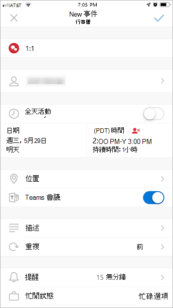

在 Outlook 中使用 [團隊會議] 增益集
=======================================

[團隊會議] 增益集可讓使用者從 Outlook 排程團隊會議。 您可以在 Windows 版、Mac 版、web 版和行動裝置上使用該增益集。

## Windows 版 Outlook 中的團隊會議增益集

[團隊會議] 增益集會自動安裝在 Windows 電腦上安裝 Microsoft 團隊以及 Office 2010、Office 2013 或 Office 2016 的使用者。 使用者會在 Outlook 行事曆功能區上看到 [團隊會議] 增益集。

![Outlook 功能區上 [團隊會議] 增益集的螢幕擷取畫面](media/Teams-add-in-for-Outlook.png)

> [!NOTE]
> - 如果使用者沒有看到 [團隊會議] 增益集, 請指示他們關閉 Outlook 和團隊, 然後先重新開機團隊用戶端, 然後登入小組, 然後以該特定順序重新開機 Outlook 用戶端。
> - Windows 7 使用者必須在 Windows 的 windows 中安裝[通用 C 執行時間更新](https://support.microsoft.com/help/2999226/update-for-universal-c-runtime-in-windows), 小組會議增益集才能正常運作。

## Mac 版 Outlook 中的團隊會議增益集

如果 Outlook 執行 [生產組建16.24.414.0 及更新版本], Mac 版 Outlook 中的 [小組會議] 按鈕就會出現在 Mac 版 Outlook 功能區中。

使用者按一下 [**傳送**] 之後, 會議座標 (團隊加入連結和撥入號碼) 就會新增到會議邀請中。  

## Outlook Web App 中的團隊會議增益集

如果使用者是在新版 Outlook 網頁版上, Outlook Web App 中的 [小組會議] 按鈕就會顯示為新的事件建立的一部分。 若要瞭解使用者如何試用新版 Outlook 網頁版的相關資訊, 請參閱[Outlook 博客](https://techcommunity.microsoft.com/t5/Outlook-Blog/Designed-to-be-fast-The-Outlook-on-the-web-user-experience-gets/ba-p/234909?utm_source=t.co&utm_medium=referral)。

使用者按一下 [**傳送**] 之後, 會議座標 (團隊加入連結和撥入號碼) 就會新增到會議邀請中。  

## Outlook mobile 中的團隊會議增益集 (iOS 版和 Android 版)

[團隊會議] 按鈕會顯示在最新的 Outlook iOS 和 Android 應用程式組建中。

使用者按一下 [**傳送**] 之後, 會議座標 (團隊加入連結和撥入號碼) 就會新增到會議邀請中。  

## Outlook 中的團隊會議增益集與 FindTime
FindTime 是 Outlook 的增益集, 可協助使用者在整個公司的會議時間達成共識。 一旦會議受邀者提供其喜好的時間, FindTime 就會代表使用者傳送會議邀請。 如果您已在 FindTime 中選取 [**線上會議**] 選項, FindTime 將會安排商務用 Skype 或 Microsoft 團隊會議。 (FindTime 將使用貴組織設定為預設線上會議頻道的任何人)。

> [!NOTE]  
> 如果您已在[Findtime 儀表板](https://findtime.microsoft.com/UserDashboard)中儲存商務用 Skype 設定, Findtime 將會使用, 而不是 Microsoft 團隊。 如果您想要使用 Microsoft 團隊, 請刪除儀表板中的 [商務用 Skype] 設定。

如需詳細資訊, 請參閱[使用 FindTime 排程會議](https://support.office.com/article/scheduling-meetings-with-findtime-4dc806ed-fde3-4ea7-8c5e-b5d1fddab4a6)。

## 驗證需求

團隊會議增益集需要使用者使用新式驗證登入小組。 如果使用者不使用此方法登入, 他們仍能使用團隊用戶端, 但無法使用 Outlook 增益集來排程小組線上會議。 您可以執行下列其中一項操作來修正此問題:

- 如果您的組織未設定新式驗證, 您應該設定新式驗證。
- 如果已設定新式驗證, 但它們在對話方塊中取消, 您應該指示使用者使用多重要素驗證重新登入。

若要深入瞭解如何設定驗證, 請參閱[Microsoft 團隊中的身分識別模型和驗證](identify-models-authentication.md)。

## 啟用私人會議

[**允許針對私人會議進行排程**] 必須在 Microsoft [團隊管理中心] 中啟用, 才能部署該增益集。 在系統管理中心中, 移至 [**會議** > **會議原則**], 然後在 [一般] 區段中, 切換到 **[** **允許將私人會議排程**至]。)

團隊用戶端可決定使用者是否需要32位或64位版本, 以安裝正確的增益集。

> [!NOTE]
> 在安裝或升級小組之後, 使用者可能需要重新開機 Outlook, 才能取得最新的增益集。

## 團隊升級原則與適用于 Outlook 的小組會議增益集

客戶可以[選擇從商務用 Skype 升級到團隊](upgrade-and-coexistence-of-skypeforbusiness-and-teams.md)。 租使用者管理員可以使用 [團隊共存] 模式來為使用者定義這種旅程。 租使用者系統管理員可以選擇讓使用者在商務用 Skype (孤島模式) 中使用團隊。 

當以孤島模式在 Outlook 中排程會議的使用者, 他們通常會希望能夠選擇要排程商務用 Skype 或團隊會議。 在 Outlook 網頁版、Outlook 視窗和 Outlook Mac 版中, 使用者會在孤島模式中同時看到 [商務用 Skype] 和 [團隊] 增益集。 由於初次發行中的某些限制, Outlook mobile 只支援建立商務用 Skype**或**團隊會議。 如需詳細資訊, 請參閱下表。

| [團隊管理中心] 中的共存模式 | Outlook mobile 中的預設會議提供者 |
| --------------------------------------|---------------------------------------------|
| 索羅門群島 | 商務用 Skype |
| 僅適用于商務用 Skype | 商務用 Skype |
| 商務用 Skype 與團隊共同作業 | 商務用 Skype |
| 商務用 Skype 與團隊共同作業與會議 | 協同 |
| 僅限團隊 | 協同 |

## 其他考慮

[團隊會議] 增益集仍在建立功能, 因此請注意下列事項:

- 該增益集是針對特定參與者的排程會議, 而不是頻道中的會議。 頻道會議必須在小組內排程。
- 如果驗證 Proxy 位於使用者的電腦和團隊服務的網路路徑中, 增益集將無法運作。
- 使用者無法在 Outlook 中排程即時事件。 移至 [小組], 排程即時事件。 如需詳細資訊, 請參閱[什麼是 Microsoft 團隊即時事件？](teams-live-events/what-are-teams-live-events.md)。

## 疑難排解

如果您無法取得供 Outlook 安裝的小組會議增益集, 請嘗試這些疑難排解步驟。

- 確保已套用所有適用于 Outlook 桌面用戶端的更新。
- 重新開機團隊桌面用戶端。
- 登出, 然後重新登入小組桌面用戶端。
- 重新開機 Outlook 桌面用戶端。 (請確定 Outlook 未在系統管理員模式下執行)。
- 請確認登入的使用者帳戶名稱不包含空格。 (這是已知的問題, 將于未來更新中修正。)
- 請確定已啟用單一登入 (SSO)。

如果您的系統管理員已設定 Microsoft Exchange 來[控制 Exchange Web Server (EWS) 的存取權](https://docs.microsoft.com/en-us/exchange/client-developer/exchange-web-services/how-to-control-access-to-ews-in-exchange), 則代理人將無法代表老闆排程小組會議。 此設定的解決方案位於開發階段, 未來將會發佈。 

如需如何停用增益集的一般指導方針, 請參閱[在 Office 程式中查看、管理及安裝增益集](https://support.office.com/article/View-manage-and-install-add-ins-in-Office-programs-16278816-1948-4028-91E5-76DCA5380F8D)。

深入瞭解[Microsoft 團隊中的會議和通話](https://support.office.com/article/Meetings-and-calls-d92432d5-dd0f-4d17-8f69-06096b6b48a8)。
