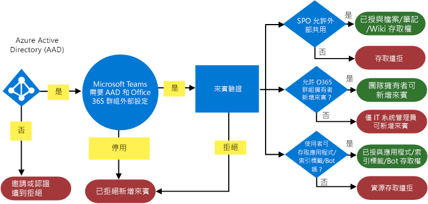
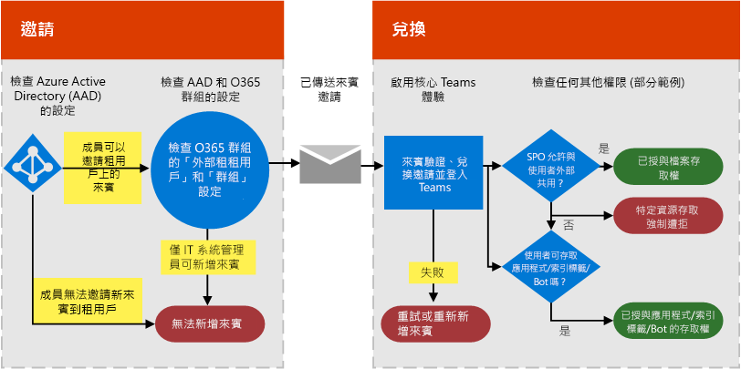

# 在 Microsoft Teams 中授權來賓存取Authorize guest access in Microsoft Teams

為了滿足貴組織的需求，您可以透過四種不同的授權層級管理團隊來賓存取的功能和功能。To satisfy your organization's requirements, you can manage Teams guest access features and capabilities through four different levels of authorization. 所有授權等級都適用于您的 Microsoft 365 組織。All the authorization levels apply to your Microsoft 365 organization. 每個授權等級控制的來賓體驗如下所示：Each authorization level controls the guest experience as shown below:

- **Azure Active Directory** ：團隊中的來賓存取權依賴 Azure AD 企業對企業 (B2B) 平臺。**Azure Active Directory** : Guest access in Teams relies on the Azure AD business-to-business (B2B) platform. 此授權等級控制目錄、租用戶和應用程式層級的來賓體驗。This authorization level controls the guest experience at the directory, tenant, and application level.
- **團隊** ：只控制團隊中的來賓體驗。**Teams** : Controls the guest experience in Teams only.
- **Microsoft 365 群組** ：控制 Microsoft 365 群組和團隊中的來賓體驗。**Microsoft 365 Groups** : Controls the guest experience in Microsoft 365 Groups and Teams.
- **Sharepoint 和 OneDrive** ：控制 Sharepoint、OneDrive、Microsoft 365 群組和團隊中的來賓體驗。**SharePoint and OneDrive** : Controls the guest experience in SharePoint, OneDrive, Microsoft 365 Groups, and Teams.

這些不同的授權等級能夠讓您彈性設定貴組織的來賓存取。These different authorization levels provide you with flexibility in how you set up guest access for your organization. 例如，如果您不想允許團隊中的來賓使用者，但想要讓您的組織全部擁有，只要關閉小組中的來賓存取。For example, if you don't want to allow guest users in Teams but want to allow it overall in your organization, just turn off guest access in Teams. 另一個範例：您可以在 Azure AD、團隊和群組階層啟用來賓存取，但在選取的小組中， [停用與一個或多個準則相符的來賓使用者（例如，資料分類等於 [機密](https://docs.microsoft.com/microsoft-365/compliance/sensitivity-labels-teams-groups-sites)]）。Another example: You could enable guest access at the Azure AD, Teams, and Groups levels, but then [disable the addition of guest users on selected teams that match one or more criteria such as data classification equals confidential](https://docs.microsoft.com/microsoft-365/compliance/sensitivity-labels-teams-groups-sites). SharePoint 和 OneDrive 有自己的來賓存取設定，而不依賴 Microsoft 365 群組。SharePoint and OneDrive have their own guest access settings that don't rely on Microsoft 365 Groups.

如需端對端來賓存取配置指示，請參閱 [與團隊中的來賓共同](https://docs.microsoft.com/microsoft-365/solutions/collaborate-as-team)作業。For end-to-end guest access configuration instructions, see [Collaborate with guests in a team](https://docs.microsoft.com/microsoft-365/solutions/collaborate-as-team).

> [!NOTE]
> 來賓會受 [Microsoft 365 和 Office 365 服務描述](https://go.microsoft.com/fwlink/p/?linkid=282347)和 [Azure AD B2B 共同作業限制](https://docs.microsoft.com/azure/active-directory/external-identities/current-limitations)中所描述的服務限制。Guests are subject to the service limits described in [Microsoft 365 and Office 365 service descriptions](https://go.microsoft.com/fwlink/p/?linkid=282347) and [Limitations of Azure AD B2B collaboration](https://docs.microsoft.com/azure/active-directory/external-identities/current-limitations). 

下圖顯示如何授與來賓存取授權相依性，以及如何在 Azure Active Directory、團隊及 Microsoft 365 之間整合。The following diagram shows how guest access authorization dependency is granted and integrated between Azure Active Directory, Teams, and Microsoft 365.

> [!div class="mx-imgBorder"]
> 

以下圖表以高等級的角度，顯示透過一般來賓存取的邀請與兌換流程，使用者體驗搭配權限模型的運作方式。The next diagram shows, at a high level, how the user experience works with the permission model through a typical guest access invitation and redemption flow.

> [!div class="mx-imgBorder"]
> 

請務必注意，在這裡，應用程式、bot 和連接器可能需要自己的許可權集和/或同意專用於使用者帳戶。It's important to note here that apps, bots, and connectors might require their own set of permissions and/or consent specific to the user account. 這些情況可能需要個別授權。These might need to be granted separately. 同樣地，SharePoint 可能會針對特定使用者、使用者群組或甚至是在網站層級，強制規定額外的外部共用界限。Similarly, SharePoint might impose extra external sharing boundaries for a specific user, groups of users, or even at the site level.

以上兩張圖表也可以在 [Visio](https://github.com/MicrosoftDocs/OfficeDocs-SkypeForBusiness/blob/live/Teams/media/teams_dependencies.vsdx?raw=true) 中使用。The previous two diagrams are also available in [Visio](https://github.com/MicrosoftDocs/OfficeDocs-SkypeForBusiness/blob/live/Teams/media/teams_dependencies.vsdx?raw=true).

## 控制 Azure Active Directory 的來賓存取Control guest access in Azure Active Directory

使用 Azure AD 來判斷外部共同作業者是否能以來賓身分受邀進入您的租用戶，以及採取何種方式。Use Azure AD to determine whether external collaborators can be invited into your tenant as guests, and in what ways. 如需 Azure B2B 來賓存取的詳細資訊，請參閱[什麼是 Azure Active Directory B2B 中的來賓使用者存取權](https://docs.microsoft.com/azure/active-directory/b2b/what-is-b2b)。For more information about Azure B2B guest access, see [What is guest user access in Azure Active Directory B2B](https://docs.microsoft.com/azure/active-directory/b2b/what-is-b2b). 如需 Azure AD 角色的詳細資訊，請參閱[從 Azure Active Directory 租用戶中的合作夥伴組織授與權限給使用者](https://docs.microsoft.com/azure/active-directory/b2b/add-guest-to-role)。For information about Azure AD roles, see [Grant permissions to users from partner organizations in your Azure Active Directory tenant](https://docs.microsoft.com/azure/active-directory/b2b/add-guest-to-role).

邀請的設定適用于組織階層，並控制目錄和應用程式層級的來賓體驗。The settings for invitations apply at the organization level and control the guest experience at the directory and application level. 您可以在 [外部共同作業 [設定](https://aad.portal.azure.com/#blade/Microsoft_AAD_IAM/CompanyRelationshipsMenuBlade/Settings)] 中設定這些設定。You can configure these settings in [External collaboration settings](https://aad.portal.azure.com/#blade/Microsoft_AAD_IAM/CompanyRelationshipsMenuBlade/Settings).

Azure AD 包含有下列設定可設定外部使用者：Azure AD includes the following settings to configure external users:

- [來賓使用者存取限制Guest user access restrictions](https://docs.microsoft.com/azure/active-directory/users-groups-roles/users-restrict-guest-permissions)

- **[系統管理員與來賓邀請者角色中的使用者可以邀請]** ： **[是]** 表示系統管理員和來賓邀請者角色中的使用者將可以邀請來賓加入租用戶。**Admins and users in the guest inviter role can invite** : **Yes** means that admins and users in the guest inviter role will be able to invite guests to the tenant. **[否]** 表示系統管理員和使用者無法邀請來賓加入租用戶。**No** means admins and users can't invite guests to the tenant.
- **成員可邀請** ：若要允許您目錄中的非系統管理員成員邀請來賓，請將此原則設定為 **[是]** (建議使用)。**Members can invite** : To allow non-admin members of your directory to invite guests, set this policy to **Yes** (recommended). 如果您希望只讓系統管理員新增來賓，可以將此原則設定為 **[否]** 。If you prefer that only admins be able to add guests, you can set this policy to **No**. 請記住，設定為 **[否]** 將會限制非系統管理員小組擁有者的來賓體驗；他們只能在已由系統管理員在 AAD 中新增的 Teams 中新增來賓。Keep in mind that setting **No** will limit the guest experience for non-admin teams owners; they'll only be able to add guests in Teams that have already been added in AAD by the admin.
- **[來賓可邀請]** ： **[是]** 表示目錄中的來賓可以邀請其他來賓，在受 Azure AD 保護的資源 (例如 SharePoint 網站或 Azure 資源) 上共同作業。**Guests can invite** : **Yes** means that guests in your directory can invite other guests to collaborate on resources secured by your Azure AD, such as SharePoint sites or Azure resources. **[否]** 表示來賓無法邀請其他來賓與貴組織共同作業。**No** means that guests can't invite other guests to collaborate with your organization. 即使設定為 **[是]** ，來賓也無法在團隊中邀請其他來賓。Even if set to **Yes** , guest cannot invite other guests in Teams.
 
如需控制誰可以邀請客人的詳細資訊，請參閱 [啟用 B2B 外部共同作業及管理可以邀請客人的人員](https://docs.microsoft.com/azure/active-directory/b2b/delegate-invitations)。For more information about controlling who can invite guests, see [Enable B2B external collaboration and manage who can invite guests](https://docs.microsoft.com/azure/active-directory/b2b/delegate-invitations).

> [!NOTE]
> 您也可以管理哪些網域可以做為來賓受邀加入您的租用戶。You can also manage which domains can be invited into your tenant as guests. 請參閱 [允許或封鎖來自特定組織的 B2B 使用者邀請](https://docs.microsoft.com/azure/active-directory/external-identities/allow-deny-list)。See [Allow or block invitations to B2B users from specific organizations](https://docs.microsoft.com/azure/active-directory/external-identities/allow-deny-list).

您不需要將使用者來賓帳戶手動新增到 Azure AD B2B，因為當您將來賓新增到 Teams 時，帳戶會自動新增到目錄。Adding the user guest account manually to Azure AD B2B is not required, as the account will be added to the directory automatically when you add the guest to Teams.

### 來賓存取的授權Licensing for guest access

來賓存取授權使用 Azure AD 外部身分識別定價，且以每月的活躍訪客為基礎。Guest access licensing uses Azure AD External Identities pricing and is based on monthly active guests. 如需詳細資訊，請參閱 [AZURE AD 外部](https://docs.microsoft.com/azure/active-directory/external-identities/external-identities-pricing) 身分識別的計費模型。See [Billing model for Azure AD External Identities](https://docs.microsoft.com/azure/active-directory/external-identities/external-identities-pricing) for details.

> [!NOTE]
> 僅擁有獨立版 Office 365 訂閱方案 (例如 Exchange Online Plan 2) 的組織使用者將無法受邀為貴組織的來賓，因為 Teams 認為這些使用者屬於相同的組織。Users in your organization who have standalone Office 365 subscription plans only, such as Exchange Online Plan 2, cannot be invited as guests to your organization because Teams considers these users to belong to the same organization. 若要讓這些使用者使用 Teams，這些使用者必須獲派 Microsoft 365 商務標準版、Office 365 企業版或 Office 365 教育版訂閱。For these users to use Teams, they must be assigned an Microsoft 365 Business Standard, Office 365 Enterprise, or Office 365 Education subscription. 

## 外部存取 (同盟) 與來賓存取External access (federation) vs. guest access

[!INCLUDE [guest-vs-external-access](includes/guest-vs-external-access.md)]

## 相關主題Related topics

- [Microsoft 365 來賓共用設定參考Microsoft 365 guest sharing settings reference](https://docs.microsoft.com/Office365/Enterprise/microsoft-365-guest-settings)

[使用 Microsoft 365 設定安全的共同作業Set up secure collaboration with Microsoft 365](https://docs.microsoft.com/microsoft-365/solutions/setup-secure-collaboration-with-teams)
