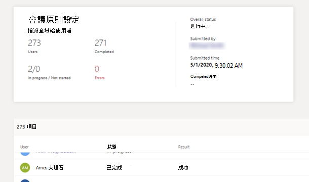

# 在活動記錄中查看您的策略指派

當您在系統管理中心指派Microsoft Teams，您可以在活動記錄中查看那些策略指派的狀態。 活動記錄會顯示過去 30 天內透過系統管理中心Microsoft Teams超過 20 個使用者批次的策略指派。 請記住，活動記錄不會顯示策略套件指派、透過 Microsoft Teams 系統管理中心將策略指派給少於 20 位使用者的批次，或透過 PowerShell 進行策略指派。

## 在活動記錄中查看您的策略作業活動

若要在活動記錄中查看您的策略指派：

1. 在系統管理中心的左側導Microsoft Teams，前往儀表板，然後在活動記錄下 **，選取** 查看 **詳細資料**。
2. 您可以查看所有策略指派，或根據狀態篩選清單，只顯示尚未開始、進行中或 **已完成的作業**。  您會看到每個作業的下列資訊：
    - **名稱**：策略指派的名稱。 按一下連結以查看更多詳細資料。 這包括已指派策略的使用者數目，以及已完成、進行中及尚未開始的指派數目。 您也會看到批次中的使用者清單，以及每個使用者的狀態和結果。 以下是範例：

        

    - **提交日期**：已提交政策分派的日期和時間。
    - **完成時間**：完成策略作業的日期和時間。
    - **影響：** 批次中的使用者數目。
    - **整體狀態**：策略工作分派的狀態。

> [!NOTE]
> 您也可以從使用者頁面取得 **活動記錄。** 按一下 [ **申請** 以提交大量原則作業後，就會在頁面頂端看到橫幅。 按一下 **橫幅中的** [活動記錄連結。

## 相關主題

- [指派策略給使用者](assign-policies.md)
