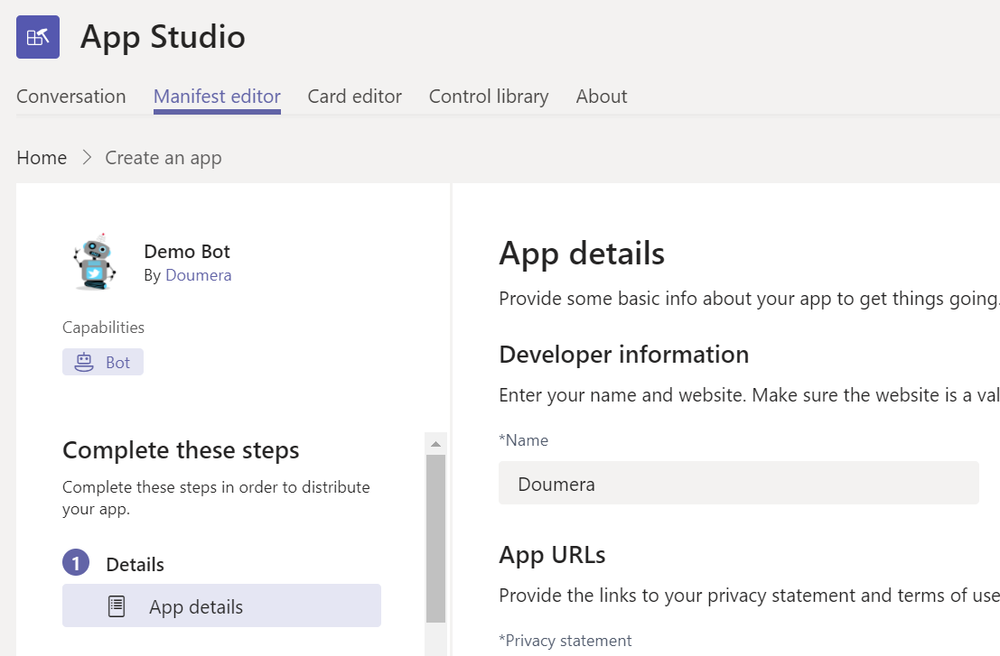

在 Microsoft 團隊中新增個人聊天、群組聊天和頻道的機器人Add bots for personal chats, group chats, and channels in Microsoft Teams
==========================================================
> [!IMPORTANT]
> [!INCLUDE [new-teams-sfb-admin-center-notice](includes/new-teams-sfb-admin-center-notice.md)]

Bot 是能回應查詢或提供更新和通知的自動程式, 讓使用者覺得有趣或想要掌握相關資訊。Bots are automated programs that respond to queries or give updates and notifications about details users find interesting or want to stay informed about. Bot 可讓使用者透過 Microsoft 團隊中的聊天交談, 與工作管理、排程及輪詢等雲端服務互動。Bots allow users to interact with cloud services like task management, scheduling, and polling, through chat conversations in Microsoft Teams. 小組的 bot 是在[Microsoft Bot 架構](https://go.microsoft.com/fwlink/?linkid=854370)中建立的。Bots for Teams are built on the [Microsoft Bot Framework](https://go.microsoft.com/fwlink/?linkid=854370). 您可以輕鬆地為團隊啟用使用這個架構開發的 bot。The bots that are developed using this framework can be enabled easily for Teams. 如需詳細資訊, 請參閱[管理貴組織的 Microsoft 團隊設定](enable-features-office-365.md)。For more information, see [Manage Microsoft Teams settings for your organization](enable-features-office-365.md).

目前, 團隊在小組中支援個人聊天、群組聊天和頻道中的 bot。Currently, Teams supports bots in personal chats, group chats, and channels within a team. 系統管理員可以控制是否允許或禁止在 Office 365 租使用者內使用 bot。Administrators can control whether the use of bots is allowed or prohibited within the Office 365 tenant.

您可以在團隊中利用社區開發的 bot。Bots developed by the community can be leveraged within Teams. 您必須先在租使用者層級啟用 bot 的功能和上傳自訂應用程式 (也稱為側載), 才能正常運作。The bot's functionality and the ability to upload custom apps (also known as sideloading) must be enabled on the tenant level for custom bots to be functional. 您可以在個人聊天、群組聊天和頻道中使用機器人。Bots can be used in personal chats, group chats, and channels. 對於頻道, 小組擁有者或成員可以新增機器人。For channels, team owners or members can add bots.

如需詳細資訊, 請參閱[應用程式和服務](https://support.office.com/article/Apps-and-services-cc1fba57-9900-4634-8306-2360a40c665b)。For more information, see [Apps and services](https://support.office.com/article/Apps-and-services-cc1fba57-9900-4634-8306-2360a40c665b).

> [!IMPORTANT]
> 建議您不要針對除測試用途以外的任何專案, 依 GUID 新增 bot。Adding a bot by GUID, for anything other than testing purposes, is not recommended. 這麼做會嚴重限制 bot 的功能。Doing so severely limits the functionality of a bot. 您應該將在生產中使用的 bot 新增至團隊做為應用程式的一部分。Bots in production use should be added to Teams as part of an app. 請參閱[建立 bot](https://docs.microsoft.com/microsoftteams/platform/concepts/bots/bots-create)並[測試及調試 Microsoft 團隊 bot](https://docs.microsoft.com/microsoftteams/platform/concepts/bots/bots-test)See [Create a bot](https://docs.microsoft.com/microsoftteams/platform/concepts/bots/bots-create) and [Test and debug your Microsoft Teams bot](https://docs.microsoft.com/microsoftteams/platform/concepts/bots/bots-test)

建立 Microsoft 團隊的自訂 botCreate custom bots for Microsoft Teams
--------------------------------------

您可以使用 Microsoft Bot 架構, 輕鬆建立與 LOB 應用程式整合的 bot。You can easily create a bot that integrates in to your LOB applications, using the Microsoft Bot Framework. 若要瞭解如何開發及發佈自己的機器人, 請參閱[建立及測試 Microsoft 團隊的 bot](https://go.microsoft.com/fwlink/?linkid=854371) 。See the [Creating and Testing a bot for Microsoft Teams](https://go.microsoft.com/fwlink/?linkid=854371) guidance to learn how you can develop and publish your own bots.

當您建立 bot 並將它註冊至 Bot 架構時, 您可以選擇發佈它。When you create a bot and register it with the Bot Framework, you can choose to publish it. 如果您沒有發佈, bot 會保持為私人。If you don't publish it, the bot remains private. 您也可以在使用 bot 前, 要求使用者登入。You can also require your users to log in before using the bot. 如果需要登入, 只需確認貴組織的員工就能存取 bot, 即使 bot 的應用程式識別碼變成已知也一樣。Requiring login makes sure only employees of your organization can access the bot, even if the bot's application ID becomes known. 如需如何使用 bot 針對您的 Active Directory 進行驗證的程式碼範例, 請參閱 GitHub 上的[*AuthBot*](https://go.microsoft.com/fwlink/?linkid=854372) 。See [*AuthBot*](https://go.microsoft.com/fwlink/?linkid=854372) on GitHub for a code example of how to authenticate users against your Active Directory using bots.

您可以在將 bot 部署到您的小組之前, 使用[Bot 架構模擬器](https://go.microsoft.com/fwlink/?linkid=854373)來測試機器人。Bots can be tested using the [Bot Framework Emulator](https://go.microsoft.com/fwlink/?linkid=854373) before they are deployed into your Teams.

上傳您的 bot 以進行個人聊天Upload your bot for personal chat
---------------------------------------

1. 建立您的 bot 之後, 請移至您所開發 bot 的 [**應用程式設定**], 然後在 [**應用程式設定**] 底下, 複製**MicrosoftAppId**設定的值。![Bot 的 [應用程式設定] 頁面的螢幕擷取畫面](media/Add_bots_for_private_chats_and_channels_in_Microsoft_Teams_image5.png)After you create your bot, go to the **Application Settings** for the bot you developed, and then under **App settings**, copy the value of the **MicrosoftAppId** setting.

2.  在 [團隊] 的 [**聊天**] 窗格中, 選取 [**新增聊天] 圖示**。In Teams, on the **Chat** pane, select the **Add chat icon**. 在**To**中, 貼上您 Bot 的**MICROSOFT 應用程式識別碼**。In **To**, paste your bot's **Microsoft app ID**. ![醒目提示 [聊天] 窗格的螢幕擷取畫面, 其中顯示 Microsoft 應用程式識別碼](media/Add_bots_for_private_chats_and_channels_in_Microsoft_Teams_image6.png)

3. 應用程式識別碼將解析到您的**bot 名稱,** 然後您就可以開始與該 bot 進行聊天交談。The app ID will resolve to your **bot name,** and then you can start a chat conversation with that bot.

上傳 [群組聊天] 或 [頻道] 的 botUpload your bot for group chats or channels
-----------------------------------

如果您想要與同事共用您的 bot, 以下說明如何將其新增至群組聊天或不同小組的頻道:If you want to share your bot with your colleagues, here's how to add it to group chats or channels of different teams:

1. 在您[為 bot 建立應用程式套件](https://docs.microsoft.com/microsoftteams/platform/concepts/apps/apps-upload)之後, 請開啟 [小組], 然後流覽至您要上傳 bot 的小組。After you [create an app package for your bot](https://docs.microsoft.com/microsoftteams/platform/concepts/apps/apps-upload), open Teams and browse to the team in which you'll be uploading the bot.
2. 將**[應用程式製作](https://docs.microsoft.com/microsoftteams/platform/get-started/get-started-app-studio)** 者、app 新增至團隊。Add **[App Studio](https://docs.microsoft.com/microsoftteams/platform/get-started/get-started-app-studio)**, app to Teams.
3. 在 App Studio 中, 選取 [**資訊清單編輯器**] 索引標籤。 ![[資訊清單編輯器] 索引標籤的螢幕擷取畫面](media/Adding_Bot_To_Teams.png)In App Studio, select the **Manifest Editor** Tab. 
4. 若要新增您的 bot, 請在 [功能] 中選取 bot, 然後選擇 [新增現有的 bot]。To add your bot, in capabilities, select the bot and choose to add an existing bot. 然後, 選擇現有的 bot, 或輸入現有 bot 的 Id。Then, choose an existing bot or enter the Id of an existing bot.

5. 流覽至您的應用程式套件的位置, 選取它, 然後按一下 [**開啟**]。Browse to the location of your app package, select it, and then click **Open**.
6. 選取您 bot 的名稱。Select your bot's name. (請不要忘記選取 [範圍] 區段底下的 [**群組聊天**] 或 [**小組**] 核取方塊)。(Don't forget to select the **Group chat** or **Team** check box under the scope section).
7. 選取 [**測試併發布**]。Select **Test and distribute**.
8. 選取您要將 bot 連線至其中的群組聊天或團隊。Select the group chat or team where you want to connect your bot to.

    您的 bot 將可在小組中的群組聊天或團隊中使用。Your bot will be available in your group chat or team in Teams.
