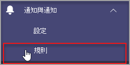

# Microsoft Teams 裝置健康情況監控Microsoft Teams device health monitoring

Microsoft Teams 系統管理中心的裝置健康情況監控功能讓您主動監控各種 Teams 裝置的健康情況。Device health monitoring in the Microsoft Teams admin center gives you an ability to proactively monitor the health of various Teams devices. 監控裝置離線狀態，如果貴組織中受監視的裝置離線，即時接收通知。Monitor the offline state of a device and receive alerts in real time if the monitored device in your organization goes offline.  

開始之前，您需要在租使用者中建立團隊/頻道的許可權。Before you start, you'll need the teams/channel creation permissions in your tenant. [深入瞭解](https://docs.microsoft.com/microsoft-365/solutions/manage-creation-of-groups?view=o365-worldwide)。[Learn More](https://docs.microsoft.com/microsoft-365/solutions/manage-creation-of-groups?view=o365-worldwide).

## 設定裝置狀態規則Configure device state rule

1. 在 Microsoft Teams 系統管理中心的左側流覽中，選取通知 **&規則**  >  \*\*\*\*。In the left navigation of the Microsoft Teams admin center, select **Notifications & alerts** > **Rules**.

   

2. 在規則 **頁面中** ，選取 **裝置狀態規則**。In the **Rules** Page, select **Device state rule**.

3. 選取裝置以設定啟用通知的狀態規則。Select the device to configure the state rule for enabling alerts.

    

## 解譯規則組Interpret the rule configuration

|領域Field |說明Description  |
|--------|-------------|
|**規則類型****Rule type**   |裝置狀態規則可協助您進行有效的管理。The device state rule helps you effectively manage. Teams 裝置，並歸類為裝置管理類型。Teams devices and is classified as a device management type. 未來，將會有更多的裝置管理類型規則可供監控其他相關功能 (例如：不健康裝置和裝置登錄狀態) 。In the future, more rules of device management type will be available to monitor other related capabilities (examples may include: unhealthy device and the sign-in status of device).|
|**條件****Condition**   |您可以監控裝置離線時的健康情況。You can monitor the health of devices if they go offline. [深入瞭解 Teams](https://docs.microsoft.com/microsoftteams/devices/device-management) 系統管理中心中的裝置管理。[Learn more](https://docs.microsoft.com/microsoftteams/devices/device-management) about device management in Teams admin center. |
|**範圍****Scope**   |您可以提及規則評估頻率，指定要監視裝置健康情況的頻率。You can specify how frequently you want to monitor device health status by mentioning the rule evaluation frequency. 根據預設，如果團隊裝置離線，將會即時監控裝置。By default teams devices will be monitored in near real time if they go offline. |
|**裝置使用者****Device users**   |您可以根據已登錄的使用者選取裝置，指定哪些裝置需要主動離線監控。You can specify which devices need proactive offline statue monitoring by selecting them based on signed-in users. 請參閱選取 [裝置以進行配置](#select-devices-for-configuration) ，以進一步瞭解詳細資料。Refer to [Select devices for configuration](#select-devices-for-configuration) for more details. |
|**動作**  > **頻道通知****Actions** > **Channel alert**   |在動作區段，您可以指定您想要取得通知的團隊頻道。In the Actions section, you can specify teams channels you want to get alerts for. 目前，系統將會建立名為系統管理通知和通知的預設小組，以及名為 **MonitoringAlerts** 的頻道，其中會傳送通知。Currently, a default team named **Admin Alerts and Notifications** and channel named **MonitoringAlerts** will be created where notifications will be delivered to.     您的租使用者中的全域系統管理員和 Teams 系統管理員會自動新加入這個預設團隊。Global administrators and Teams administrators in your tenant will be automatically added to this default team.|
|**動作**  > **Web上手****Actions** > **Webhook**   |您也可以使用外部網頁連結或 (功能) 。You can also get notifications with an external webhook (optional). 指定要送出 JSON 通知負載之網頁搖動區段的外部公用網頁連結 URL。Specify an external public webhook URL in the webhook section where a JSON notification payload will be sent.      通知有效負載可透過網頁連結，與貴組織的其他系統整合，以建立自訂工作流程。The notification payload, via webhooks, can be integrated with other systems in your organization to create custom workflows.   

**網頁搖動的 JSON 負載架構：****JSON payload schema for webhook:**   
<pre lang="json">{      "type": "object",     "properties": {        "AlertTitle": { "type": "string "} ,       "DeviceLoggedInUserId": { "type": "string" } ,       "DeviceId": { "type": "string" } ,        "MetricValues": {              "type": "object",             "properties": {                   "DeviceHealthStatus": { "type": "string"}              }         } ,        "RuleName": { "type": "string"} ,        "RuleDescription": { "type": "string"} ,        "RuleFrequency": { "type": "string"} ,        "RuleType": { "type": "string"} ,        "TenantId": { "type": "string"} ,         "RuleCondition": { "type": "string"} ,         "AlertRaisedAt": { "type": "string"}      }  } </pre>  <pre lang="json">{      "type": "object",     "properties": {        "AlertTitle": { "type": "string "} ,       "DeviceLoggedInUserId": { "type": "string" } ,       "DeviceId": { "type": "string" } ,        "MetricValues": {              "type": "object",             "properties": {                   "DeviceHealthStatus": { "type": "string"}              }         } ,        "RuleName": { "type": "string"} ,        "RuleDescription": { "type": "string"} ,        "RuleFrequency": { "type": "string"} ,        "RuleType": { "type": "string"} ,        "TenantId": { "type": "string"} ,         "RuleCondition": { "type": "string"} ,         "AlertRaisedAt": { "type": "string"}      }  } </pre>   

  **範例 JSON 負載**：**Sample JSON payload**:    <pre lang="JSON">    {        "AlertTitle":"*sample_device_name* of *User_Name* has become offline","AlertTitle":"*sample_device_name* of *User_Name* has become offline",       "DeviceLoggedInUserId": *User_GUID* ,"DeviceLoggedInUserId": *User_GUID* ,       "DeviceId": *Device_GUID* , "DeviceId": *Device_GUID* ,        "MetricValues": {           DeviceHealthStatus": "offline"              },                  "RuleName": "Device state rule" ,        "RuleDescription": ":"Alerts when device health status is detected as offline" ,        "RuleFrequency": "Real-time" ,        "RuleType": "Device Management" ,        "TenantId": *Tenant_GUID* , "TenantId": *Tenant_GUID* ,         "RuleCondition": "DeviceHealthStatus = Offline" ,         "AlertRaisedAt": "2020-02-28T12:49:06Z"      }  </pre>   

## 選取要配置的裝置Select devices for configuration

1. 您可以選取已登錄這些裝置的使用者，以選取要監視的 Teams 裝置。You can select Teams devices you want to monitor by selecting users signed in to those devices. 從 **裝置** 使用者區 **段選取** 新增。Select **Add** from the **Device users** section.

2. 選取一或多個您想要監控裝置健康情況狀態的使用者Select one or more users for which you want to monitor device health state

   

   選取的使用者清單會顯示在裝置 **使用者區** 段。The selected list of users shows in **Device users** section. 您可以新增或移除使用者來修改此清單。You can modify this list by adding or removing users.

系統將會監控所選使用者清單使用的所有登錄裝置，以檢查離線健康情況狀態。All the sign-in devices used by the selected list of users will be monitored for the offline health state.

## Teams 用戶端中的通知Notifications in Teams client

通知會傳送至系統管理通知和通知小組的 **自動建立監控Alerts\*\*\*\*頻道。**The notifications are delivered in the auto-created **MonitoringAlerts** channel of the **Admin Alerts and Notifications** Team.

裝置離線通知可以包含下列資訊：A device offline notification can include the following information:

- 離線的裝置名稱。The device name that's offline.
- 離線裝置的使用者。The user of the offline device.
- 裝置離線的時間。What time the device went offline.  (目前，時間會以 UTC.) (Currently, the time is presented in UTC.)
- 引發警示的規則類型。The type of rule that raised the alert.
- 為什麼會提出通知。Why an alert is raised.
