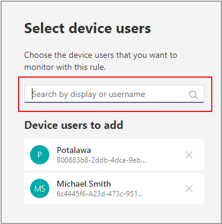

# Microsoft Teams裝置健康情況監視

Microsoft Teams系統管理中心的裝置健康情況監控可讓您主動監視各種Teams裝置的健康情況。 監控裝置的離線狀態，並在貴組織中受監視的裝置離線時即時收到通知。  

開始之前，您需要租使用者中的團隊/頻道建立許可權。 [深入瞭解](/microsoft-365/solutions/manage-creation-of-groups?view=o365-worldwide)。

## 設定裝置狀態規則

1. 在Microsoft Teams系統管理中心的左側導覽畫面中，選 **取 [通知&通知**  >  **]**。

   ![系統管理中心的 [規則] 區段。](../media/select-rules.png)

2. 在 [ **規則** ] 頁面中，選取 **[裝置狀態規則]**。

3. 選取裝置以設定啟用警示的狀態規則。

    

## 解讀規則設定

|領域 |描述  |
|--------|-------------|
|**規則類型**   |裝置狀態規則可協助您有效管理。 Teams裝置，並分類為裝置管理類型。 未來將會提供更多裝置管理類型的規則來監控其他相關功能 (範例可能包括：不正常的裝置以及裝置) 的登入狀態。|
|**條件**   |如果裝置離線，您可以監視其健康情況。 [深入瞭解](../devices/device-management.md)Teams系統管理中心的裝置管理。 |
|**範圍**   |您可以透過提及規則評估頻率來指定監視裝置健康情況狀態的頻率。 根據預設，如果裝置離線，將會以幾乎即時的方式監視小組裝置。 |
|**裝置使用者**   |您可以根據登入使用者選取哪些裝置，以指定哪些裝置需要主動離線監視。 如需詳細資訊，請參閱 [選取裝置以取得設定](#select-devices-for-configuration) 。 |
|**行動**  > **頻道警示**   |在 [動作] 區段中，您可以指定您要取得通知的團隊頻道。 目前，系統會建立名為「 **系統管理警示」及「通知」的** 預設小組，以及名為 **「監視郵件」的** 頻道，並在其中傳送通知。     您租使用者中的全域系統管理員和Teams系統管理員將會自動新增至此預設團隊。|
|**行動**  > **Webhook**   |您也可以使用外部 webhook (選用) 來取得通知。 在會傳送 JSON 通知承載的 webhook 區段中指定外部公用 Webhook URL。      通知承載可透過網路任務與組織中的其他系統整合，以建立自訂工作流程。   

**JSON 適用于 webhook 的承載架構：**   
<pre lang="json">{      "type": "object",     "properties": {        "AlertTitle": { "type": "string "} ,       "DeviceLoggedInUserId": { "type": "string" } ,       "DeviceId": { "type": "string" } ,        "MetricValues": {              "type": "object",             "properties": {                   "DeviceHealthStatus": { "type": "string"}              }         } ,        "RuleName": { "type": "string"} ,        "RuleDescription": { "type": "string"} ,        "RuleFrequency": { "type": "string"} ,        "RuleType": { "type": "string"} ,        "TenantId": { "type": "string"} ,         "RuleCondition": { "type": "string"} ,         "AlertRaisedAt": { "type": "string"}      }  } </pre>   

  **JSON 承載範例**：    <pre lang="JSON">    {        "AlertTitle":"*sample_device_name* of *User_Name* has become offline",       "DeviceLoggedInUserId": *User_GUID* ,       "DeviceId": *Device_GUID* ,        "MetricValues": {           "DeviceHealthStatus": "offline"              },                  "RuleName": "Device state rule" ,        "RuleDescription": "Alerts when device health status is detected as offline" ,        "RuleFrequency": "Real-time" ,        "RuleType": "Device Management" ,        "TenantId": *Tenant_GUID* ,         "RuleCondition": "DeviceHealthStatus = Offline" ,         "AlertRaisedAt": "2020-02-28T12:49:06Z"      }  </pre>   

## 選取要設定的裝置

1. 您可以選取Teams要監視的裝置，方法是選取登入這些裝置的使用者。 從 [**裝置使用者**] 區段選取 **[新增**]。

2. 選取一或多個您要監視裝置健康情況狀態的使用者

   

   選取的使用者清單會顯示在 [ **裝置使用者** ] 區段中。 您可以新增或移除使用者來修改此清單。

所選使用者清單所使用的所有登入裝置都會受到監控，以取得離線健康情況狀態。

## Teams用戶端中的通知

通知會在系統管理 **通知和通知** 小組的自動建立 **監視工具** 頻道中傳遞。 您會在裝置離線後的 15 分鐘內收到通知。 

裝置離線通知可以包含下列資訊：

- 離線的裝置名稱。
- 離線裝置的使用者。
- 裝置離線的時間。  (目前的時間是以 UTC.) 
- 提高警示的規則類型。
- 為何會提高警示。
