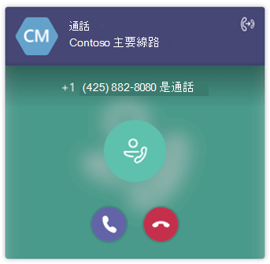

直接從 Teams 回答自動語音應答和通話佇列的通話Answer auto attendant and call queue calls directly from Teams
===========================================================

Teams 使用者可以直接從 Teams 用戶端接收和接聽來自雲端自動回應和通話佇列的通話。Teams users can receive and answer calls from Cloud auto attendants and call queues directly from their Teams client.

## 什麼是自動電話機和通話佇列？What are auto attendants and call queues?

雲端自動語音回應會提供一系列語音提示或音訊檔案，讓來電者在來電到組織時，聽到這些語音提示或音訊檔案，而不是由接線生聽到。Cloud auto attendants provide a series of voice prompts or an audio file that callers hear instead of a human operator when they call in to an organization. 自動語音機可讓來電者使用電話鍵台 (DTMF) 語音輸入，在功能表系統之間移動、撥打電話或尋找使用者。An auto attendant lets callers move through the menu system, place calls, or locate users by using a phone keypad (DTMF) or voice inputs using speech recognition.

雲端通話佇列包括當某人來電到貴組織的電話號碼時所使用的問候語、自動保留通話的能力，以及搜尋下一個可用的通話代理程式來處理通話，而通話者正在聆聽保留的音樂。Cloud call queues include greetings that are used when someone calls in to a phone number for your organization, the ability to automatically put the calls on hold, and the ability to search for the next available call agent to handle the call while the people who call are listening to music on hold. 您可以為貴組織建立單一或多個通話佇列。You can create single or multiple call queues for your organization.

## 處理自動電話機或通話佇列通話Handling an auto attendant or call queue call

在接聽來電之前，使用者將能夠將來電與自動回應或通話佇列區別。Users will be able to differentiate incoming calls from an auto attendant or call queue before they answer the call. 除了來電者的名稱和/或號碼外，每一個通話都會包含來電者嘗試與誰聯繫的資訊，為使用者提供更好的內容來稱呼來電者。Along with the name and/or number of the caller, each call will include information about who the caller was trying to reach, giving users a better context for addressing the caller.

下圖顯示來自自動電話機或通話佇列的來電會如何顯示給使用者。The following illustration shows how an incoming call from an auto attendant or call queue will appear to a user.

一旦自動回應或通話佇列通話獲得接聽，使用者就可以像處理任何其他通話一樣處理&#x2014;他們可以在其他使用者中新增或召開會議，或將通話轉接到另一方。Once an auto attendant or call queue call is answered, the user can process the call like any other call &#x2014; they can add or conference in another user or transfer the call to another party. 此外，系統也會根據使用者的組配置來轉乘自動通話。Also, auto attendant calls will be forwarded based on the user's configuration.

> [!NOTE] 
> 通話佇列通話不會根據使用者的組組進行轉轉。Call queue calls are not forwarded based on the user's configuration. 這是為了確保來電者保留在佇列中，直到代理人可以接聽來電，且來電者不會意外轉轉。This is to ensure callers remain in the queue until an agent can answer the call and the caller isn't forwarded unexpectedly.

> 代理人不會收到任何未接來電或來電佇列通話語音信箱的通知。Agents are not notified of any missed calls or voicemails for call queue calls.

## 支援的用戶端Supported clients

下列用戶端支援自動通話和通話佇列通話：Support for auto attendant and call queue calls is available in the following clients:

-    Microsoft Teams Windows 用戶端 (32 位和 64 位版本) Microsoft Teams Windows client (32 and 64-bit versions)
-    Microsoft Teams Mac 用戶端Microsoft Teams Mac client
-    Microsoft Teams iPhone 應用程式Microsoft Teams iPhone app
-    Microsoft Teams Android 應用程式Microsoft Teams Android app

## 設定 Microsoft Teams 的自動電話機和通話佇列支援Configure auto attendant and call queue support for Microsoft Teams

若要在 Microsoft Teams 上接收自動通話和通話佇列通話，您必須設定互通性原則與升級原則。To receive auto attendant and call queue calls on Microsoft Teams, you need to configure your interoperability policy and upgrade policy. 請審查使用 Teams 與商務用 Skype 的組織 [移移及互通性](migration-interop-guidance-for-teams-with-skype.md)。Please review [Migration and interoperability for organizations using Teams together with Skype for Business](migration-interop-guidance-for-teams-with-skype.md). 如果您沒有設定自動電話機和/或通話佇列，並想這麼做，請參閱設定雲端 [自動](create-a-phone-system-auto-attendant.md) 通話佇列和 [建立雲端通話佇列](create-a-phone-system-call-queue.md)。If you do not have auto attendant and/or call queue configured and would like to do so, see [Set up a Cloud auto attendant](create-a-phone-system-auto-attendant.md) and [Create a Cloud call queue](create-a-phone-system-call-queue.md).

## 已知問題Known Issues

當通話佇列代理程式在行動裝置上接聽來電時，如果裝置已鎖定，通話可能會保持保留狀態。When a call queue agents receives a call on their mobile device, calls may go on hold if the device is locked. 使用者必須先解除鎖定裝置，然後接聽電話。User must unlock device first and then answer the call.

## 相關主題Related topics

-    [什麼是 Microsoft 365 或 Office 365 中的電話系統What is Phone System in Microsoft 365 or Office 365](what-is-phone-system-in-office-365.md)
-    [建立雲端通話佇列Create a Cloud call queue](create-a-phone-system-call-queue.md)
-    [什麼是雲端自動語音應答？What are Cloud auto attendants?](what-are-phone-system-auto-attendants.md)
-    [設定雲端自動語音應答Set up a Cloud auto attendant](create-a-phone-system-auto-attendant.md)

