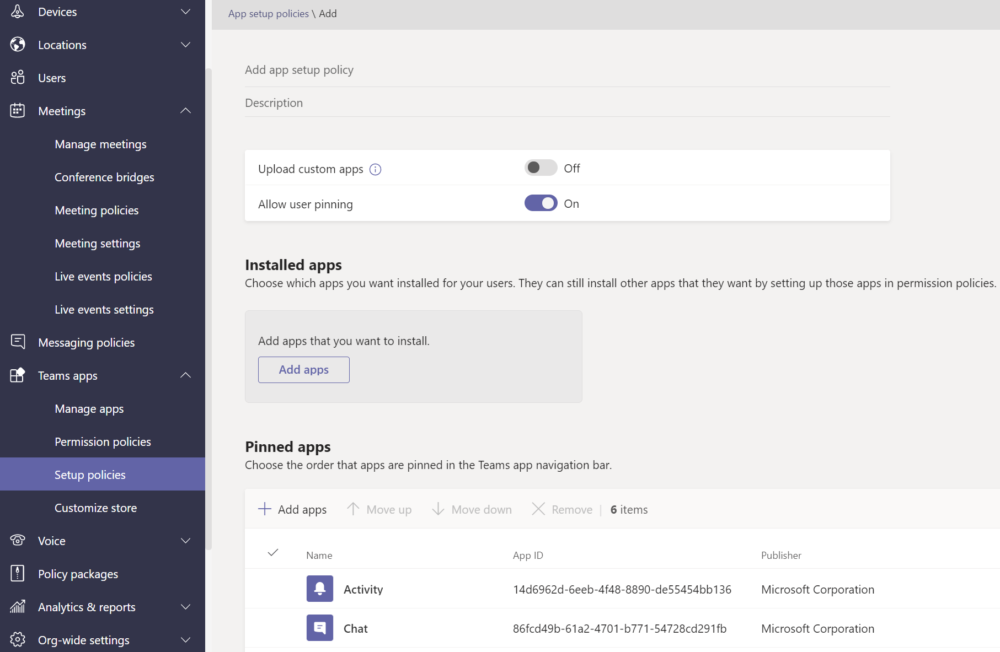

# 在 Microsoft Teams 中管理應用程式政策

應用程式策略是用來控制 Microsoft Teams 中的應用程式。

## 應用程式權限原則

**應用程式許可權** 策略是用來控制哪些應用程式可供使用者使用。 系統管理員可以允許或封鎖使用者從 Teams App Store 安裝的特定應用程式。 [App 許可權政策](teams-app-permission-policies.md) 會透過 Microsoft Teams 系統管理中心管理。

## 應用程式設定政策

**應用程式設定** 政策可代表使用者釘定及安裝應用程式，並控制貴組織的這些設定。 [在 Teams](teams-app-setup-policies.md) 系統管理中心管理應用程式設定政策。

## 自訂應用程式政策

您可以使用自訂應用程式策略來控制誰可以將自訂 **應用程式上傳到** Teams。 [自訂應用程式設定和策略](teams-custom-app-policies-and-settings.md) 會透過 Microsoft Teams 系統管理中心管理。

## 相關主題

* [在 Teams 中管理自訂應用程式原則和設定](teams-custom-app-policies-and-settings.md)
* [在 Teams 中管理應用程式設定原則](teams-app-setup-policies.md)
* [在 Teams 中管理應用程式權限原則](teams-app-permission-policies.md)
* [使用策略管理 Teams](manage-teams-with-policies.md)
