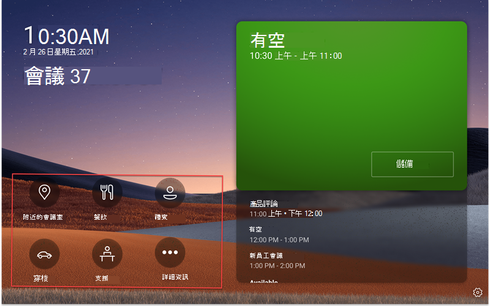
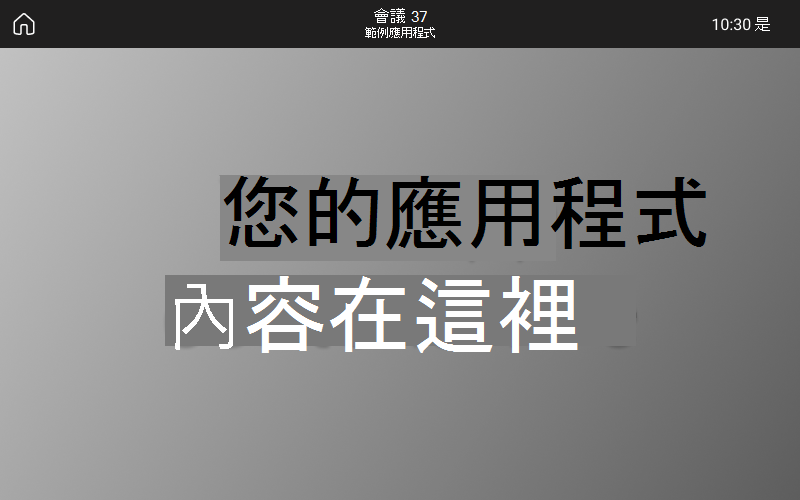
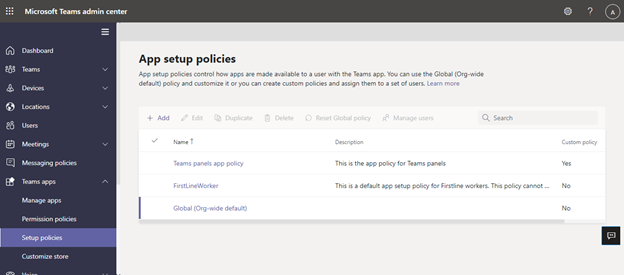
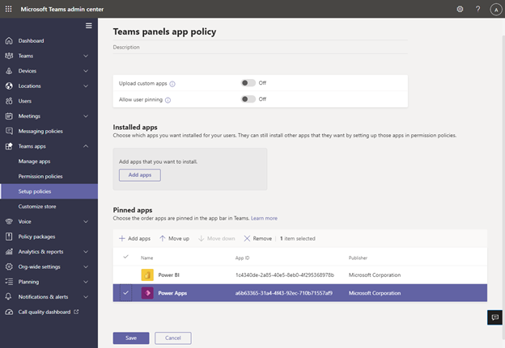

# Microsoft Teams面板上的 LOB (LOB) 應用程式支援Teams應用程式

Teams面板新增了 Teams [App/Business Line](/microsoftteams/platform/overview) (LOB) 支援。 這可讓企業在面板上新增其他體驗，以滿足貴組織的需求。 此版本支援靜態網頁內容。

> [!IMPORTANT]
> 這項功能只有在更新您的Teams面板裝置 (才能) 。 您必須擁有 Teams 應用程式版本 1449/1.0.97.2021070601 或更新版本，在 Teams 面板中擁有應用程式支援。

## Teams面板上的應用程式Teams體驗

 

*Teams面板主畫面包含應用程式流覽選項，螢幕擷取畫面以紅色顯示。請注意，這些是範例圖示，可能無法使用。*

*當使用者點一下其中一個 App 圖示時，他們會看到上一個螢幕擷取畫面Teams顯示的應用程式畫面。螢幕擷取畫面中的灰色矩形是應用程式顯示在螢幕Teams位置。應用程式欄已修正，且已Teams面板應用程式的一部分。*

## 在系統管理中心Teams並管理Teams面板應用程式 

Microsoft Teams應用程式將關鍵資訊、常用工具和信任的流程帶到人員收集、學習及工作的地方。 Teams應用程式[可透過整合功能使用](/microsoftteams/platform/concepts/capabilities-overview)。 現在，做為 IT 系統管理員，您可以選擇要納入貴組織的 Teams 面板裝置中的應用程式，並透過系統管理中心Teams[許可權](https://admin.teams.microsoft.com/)。

現在，您可以在 Teams面板Teams應用程式，並根據您的組織需求自訂使用者體驗。 您可以決定使用者可以存取及使用哪個 Web 應用程式，並排列應用程式視圖的優先順序。 目前不支援某些選項 ，例如 Bot 和傳訊功能。 深入瞭解應用程式[Teams，](/microsoftteams/platform/overview)以及如何在 Microsoft Teams 中[管理您的Microsoft Teams。](/microsoftteams/devices/device-management)

## 在系統管理中心Teams面板Teams應用程式

**注意**：您必須是全域系統管理員或Teams系統管理員才能存取 Teams [系統管理中心](https://admin.teams.microsoft.com/)。

使用者可以在面板上查看但無法Teams應用程式。 做為系統管理員，您可以透過系統管理中心Teams組織的所有應用程式Teams應用程式。 深入瞭解如何在系統管理中心透過管理應用程式Microsoft Teams [管理](/microsoftteams/manage-apps)**應用程式**。 系統 **管理中心** 內的 Teams 頁面，您也可以在這裡上傳 [自訂應用程式](/microsoftteams/manage-apps#publish-a-custom-app-to-your-organizations-app-store)。

設定應用程式之後，您可以使用 [應用程式](/microsoftteams/teams-app-permission-policies) 權限原則和應用程式 [設定策略](/microsoftteams/teams-app-setup-policies) ，為貴組織的特定會議室帳戶設定應用程式體驗。

## 使用應用程式設定Teams在面板上釘上應用程式

由於 Teams 提供顯示各種應用程式的功能，系統管理員可以決定哪些應用程式對組織來說最必要，並只針對 Teams 面板的首頁畫面釘上這些應用程式，以便快速存取。 如果超過五個固定的 App 或任何未釘釘的應用程式，這些 App 會顯示在更多 **畫面** 下。 Microsoft 建議為面板建立Teams設定策略。

 

若要管理顯示在 Teams 面板上的釘選應用程式，請登錄貴組織的 Teams 系統管理中心，並流覽至 **Teams App** 設定政策 選取或建立已釘選的新策略 \>  \>  \> **** App。

 

*此影像中包含的應用程式只是範例，可能無法使用。*

Microsoft 建議您關閉自訂 **Upload，** 並允許使用者釘Teams面板上的應用程式Teams體驗。

有關釘上 App 的更多資訊，請參閱 [管理應用程式設定策略](/microsoftteams/teams-app-setup-policies)。

## 在面板中管理應用程式Teams順序 

*此影像中包含的應用程式只是範例，可能無法使用。*

若要管理應用程式在 Teams 面板上的顯示順序，請登錄貴組織的 Teams 系統管理中心，然後流覽至 **Teams App** 設定政策 選取已釘選的 App：上 \>  \>  \> ******移/下** 策略。

## 將設定策略指派給會議室資源帳戶

建立設定策略之後，系統管理員需要將這個策略指派給要登錄至 Teams 聊天室資源帳戶。 若要詳細資訊，請參閱指派 [策略給使用者和群組](/microsoftteams/assign-policies-users-and-groups)。

## 常見問題集

### 您的面板需要多久Teams才能取得新的或更新的應用程式設定政策？

在系統管理中心編輯或指派Teams後，變更最多可能需要 24 小時才能生效。 系統管理員可以嘗試從面板登出/登出、點 **設定圖示，** 然後返回主畫面以嘗試重新更新政策。 

### 「其他」畫面上的應用程式順序是什麼？

在更多 **應用程式** 頁面上，釘上的應用程式會先出現。 接著，任何其他已安裝的應用程式都會以字母順序顯示。

### 為什麼 bot 應用程式不會顯示在Teams面板上？

目前僅支援靜態定位停駐點網頁內容。

### 為什麼原生Teams應用程式 ，例如日曆和工作，不會顯示在Teams面板上？

原生Teams應用程式 ，例如日曆和工作，不會顯示在Teams面板。

### 在 Teams系統管理中心，在設定政策區段下，已安裝的應用程式與釘點的應用程式之間有什麼不同？

針對Teams，Microsoft 建議使用釘選的應用程式，讓系統管理員能夠選取所需的應用程式，並重新排列其順序。

**注意：** 有些應用程式不支援 App 釘釘。 請聯絡應用程式開發人員以啟用 App 釘點功能。

### 為什麼其他應用程式會出現在 「更多」畫面中，即使它們不是安裝或釘Teams App 的一部分？

如果應用程式先前是透過其他應用程式政策安裝，或是在 Teams 桌面/Web 用戶端中手動安裝 Teams 面板上所使用的會議室資源帳戶，系統管理員可能需要在 Teams 中登錄會議室資源帳戶，然後以滑鼠右鍵按一下應用程式，然後選取卸載來手動卸載應用程式。 

### 為什麼我在 「新增釘上的應用程式」窗格中找不到應用程式？

並非所有應用程式都可以透過應用程式設定Teams釘釘到其他應用程式。 某些應用程式可能不支援此功能。 若要尋找可釘上的應用程式，請搜尋在新增釘上 App 窗格中 **的應用程式** 。 如需詳細資訊，請參閱使用 [應用程式設定政策中的常見問題](/microsoftteams/teams-app-setup-policies#why-cant-i-find-an-app-in-the-add-pinned-apps-pane)。

### 為什麼我在關閉「允許使用者釘釘」之後，在設定政策面板中看到「允許使用者釘釘」的快顯視窗？

*此影像中包含的應用程式只是範例，可能無法使用。* 

此行為是預期在共用空間中的裝置，並有助於防止意外的應用程式釘釘。
