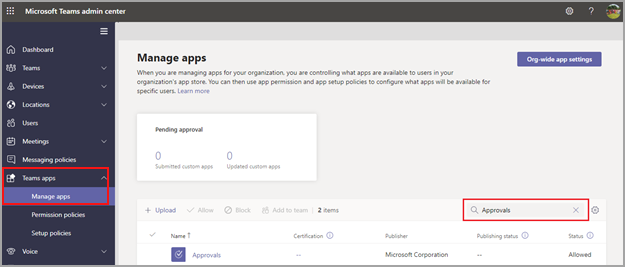

# Teams 核准應用程式可用性

核准應用程式可以個人應用程式形式供所有 Microsoft Teams 使用者使用。
核准應用程式提供一個簡單的方法，將稽核、合規性、責任和工作流程帶到 Teams 中的結構化和非結構化核准。

 

使用者可以釘選核准應用程式，以將其儲存到功能表列。

 

從應用程式建立的第一核准，會觸發預設 Microsoft Dataverse 環境中之核准解決方案的置備。 核准應用程式建立核准會儲存在預設的 Microsoft Dataverse 環境中。

本文章說明核准應用程式的需求和角色。

> [!NOTE]
> 這項功能尚未發行至 政府社群雲端 GCCH (中) DOD (DOD) 使用者。

## 必要的權限和授權

若要部署 核准應用程式，您需要下列專案的許可權：

- 建立 Microsoft Dataverse 資料庫的許可權。

- 帳戶 [powerautomate.microsoft.com](https://powerautomate.microsoft.com/)

- 目標環境中的系統管理員角色。

- 適用于[Power Automate、](/power-automate/get-started-approvals)Office 365或 Dynamics 365 授權。

- 使用者Microsoft Forms授權才能設定新的核准範本。

若要使用 核准 應用程式，您需要 Power Automate 授權，您的帳戶會在第一次核准指派時自動新核准至目標環境中的使用者角色。

## 儲存體 Microsoft Dataverse

共同資料模型 (CD) 是商務和分析應用程式在 Microsoft Dataverse 中使用的共用資料語言。 它由 Microsoft 和我們的合作夥伴所發佈的一組標準化、可擴展的資料架構所組成，可讓資料在應用程式和商務程式間保持一致性及其意義。 深入了解 [Microsoft Power Platform 的 Common Data Model](/power-automate/get-started-approvals)。

深入了解[核准工作流程](/power-automate/modern-approvals)。

核准範本建立的資料仍然會儲存在 Microsoft Dataverse 中，例如標題、詳細資料、範本識別碼等。 在核准要求上提交的回復會儲存在 Forms 中。 深入瞭解資料 [儲存空間Microsoft Forms](https://support.microsoft.com/office/data-storage-for-microsoft-forms-97a34e2e-98e1-4dc2-b6b4-7a8444cb1dc3#:~:text=Where%20data%20is%20stored%20for%20Microsoft%20Forms.%20Microsoft,European-based%20tenants%20is%20stored%20on%20servers%20in%20Europe)。

>[!Note]
>如果您刪除網站上 Microsoft Forms範本，將會中斷您的核准範本，而使用者將無法啟動要求。 使用者嘗試開啟已在 Microsoft Forms 上刪除的核准範本時，收到「CDB TableNotFound」錯誤。

組織範圍的範本會共用租使用者相同的生命週期，而小組範圍的範本會共用團隊的相同生命週期。 因此，永久刪除小組會刪除相關的範本。

## 核准 Teams 應用程式權限

核准 Teams 應用程式可讓您存取下列功能：

- 接收您提供的訊息和資料。

- 傳送訊息和通知給您。

- 在沒有 Teams 提供的標頭的情況下，呈現個人應用程式和對話方塊。

- 存取您的設定檔資訊，例如您的姓名、電子郵件地址、公司名稱和偏好的語言。

- 接收小組成員在頻道中提供的訊息和資料。

- 在頻道中傳送訊息和通知。

- 存取小組的資訊：
  - 小組名稱
  - 頻道清單
  - 名冊 (小組成員的名稱和電子郵件地址)。

- 使用小組的資訊來連絡他們。

核准範本許可權

- 所有團隊擁有者都可以為他們擁有的團隊建立核准範本。

- 當系統管理員第一次為整個組織建立範本時，系統會自動為租使用者的所有系統管理員建立一個新的 Azure Active Directory (AAD) 群組，包括全域Teams管理員。 這些系統管理員會新增為群組擁有者，以便共同管理組織範本。 小組建立之後，組織的新管理員必須手動新增為群組擁有者，以便他們擁有管理全組織範本的相同許可權。

> [!Note]
> 如果系統管理員刪除群組，您只有一個月的時間才能在 Azure Active Directory (AAD) 入口網站中還原群組，以還原所有關聯資料。 一個月後，或如果系統管理員在回收站中刪除此群組，您將失去所有相關的資料。

## 停用核准應用程式

核准應用程式預設可供使用。 您可以在 Teams 系統管理中心停用該應用程式。

  1. 登入 Teams 系統管理中心。

  2. 前往 **[Teams 應用程式]** >  **[管理應用程式]**。

  3. 搜尋核准應用程式。

     

  4. 選取 **核准**。

  5. 選取切換以為組織停用該應用程式。

     :::image type="content" alt-text="顯示應用程式核准詳細資料。" source="media/approvals-details-new.png" lightbox="media/approvals-details-new.png":::

## 應用程式政策

### 保留原則

核准應用程式建立核准儲存在預設的 Microsoft Dataverse 環境中，目前不支援備份。 深入了解如何[備份和還原環境 - Power Platform \| Microsoft Docs](/power-platform/admin/backup-restore-environments)。

除非團隊擁有者從表單應用程式中刪除的表單Microsoft Forms資料，才能刪除儲存在 Forms 中的資料。****

### 條件式 Access 政策

目前，核准中的 Teams 應用程式不支援為 Microsoft Teams 設定的條件式 access Microsoft Teams。

## 資料限制

每個小組最多可以包含 400 個核准範本，而每個範本最多可以根據 Microsoft Forms 中的目前功能收集 50，000 個Microsoft Forms。

## 稽核

核准應用程式會記錄 Microsoft 365 安全性與合規性中心內的稽核事件。 您可以檢視稽核記錄。

1. 移至 Microsoft 365 合規性網站。

2. 選取 [稽核 **]** 區段。

3. 在 [Microsoft Teams 核准活動 **]** 下搜尋活動。

您可以搜尋下列活動：

- 建立新核准要求

- 檢視核准要求詳細資料

- 核准的核准要求

- 拒絕的核准要求

- 取消的核准要求

- 共用的核准要求

- 已附加到核准要求的檔案

- 重新指派的核准要求

- 已新增至核准要求的電子簽章

- 已查看電子簽章要求詳細資料

- 已審查電子簽章要求

- 已取消電子簽名要求

- 建立新範本

- 編輯現有的範本

- 啟用/停用範本

- 已查看範本

若要在 Power Automate中存取更多稽核核准，請啟用及設定主要核准實體的預設環境稽核核准、核准要求和核准回應。 建立、更新和刪除作業是核准記錄的可稽核事件。 深入了解[安全性與合規性的稽核資料和使用者活動 - Power Platform \| Microsoft Docs](/power-platform/admin/audit-data-user-activity)。

您可以在 [Microsoft 365 安全性與合規性中心](https://support.office.com/article/go-to-the-office-365-security-compliance-center-7e696a40-b86b-4a20-afcc-559218b7b1b8?ui=en-US&rs=en-US&ad=US)進一步自訂稽核。

1. 若要使用預先設定的報告，請登入 Microsoft 365 安全性與合規性。

2. 選取 [搜尋與調查 **]**。

3. 搜尋稽核記錄，並選取 [Dynamics 365 活動 **]** 索引標籤。

深入了解 [Microsoft Dataverse 和模型導向的應用程式活動記錄 - Power Platform](/power-platform/admin/enable-use-comprehensive-auditing)。

## 安全性

使用者可以從 Teams 核准應用程式建立新的核准，並檢視他們已傳送和接收的核准。 使用者無法存取其他人所建立的核准，除非他們是回應者或要求的檢視者。

> [!Note]
> 如果使用者是建立核准所在的聊天或頻道的一部分，就會獲授與要求的檢視者角色。 如果在建立核准時未提供他們該角色，他們即無法對要求採取動作。

## 核准電子簽名整合

若要使用 核准應用程式電子簽章功能，您需要特定電子簽章提供者的許可證才能使用。 若要取得貴組織的授權，您必須前往提供者的網站。

### 啟用或停用電子簽名提供者

您可以使用系統管理Teams，控制哪些協力廠商電子簽章提供者可供您的使用者在 核准 App 中使用。 根據預設，電子簽章提供者會于應用程式核准啟用。 當您停用電子簽章提供者時，您的使用者在建立核准時無法存取該提供者。 您的使用者也將無法查看使用該提供者建立的電子郵件簽名要求。

1. 在系統管理中心的左側導Teams，請前往 **Teams管理**  >  **應用程式**。
2. 搜尋應用程式核准，然後選取它。
3. 請 **前往設定，** 然後執行下列一或多個操作：

    - 若要啟用或停用 Adobe Sign，請切換至 **開啟或****關閉**。
    - 若要啟用或停用 DocuSign，請切換至 **開啟或****關閉**。
4. 選取 **提交**。

從應用程式建立核准簽名核准會儲存在所選提供者的雲端環境中。 若要匯出電子簽章的資料，您必須前往提供者的網站。 有關電子簽章協定的儲存、匯出及保留詳細資訊，請參閱提供者的檔。
