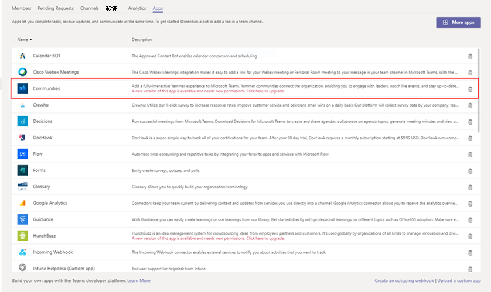

# 更新應用程式Microsoft TeamsUpdate apps in Microsoft Teams

在大多數情況下，應用程式開發人員發佈 App 更新後，新版本會自動顯示給使用者。In most cases, after app developers publish an app update, the new version automatically appears for users. 不過，系統對 Microsoft Teams<a href="/microsoftteams/platform/resources/schema/manifest-schema" target="_blank">清單</a>有一些更新需要使用者接受才能完成：However, there are some updates to the <a href="/microsoftteams/platform/resources/schema/manifest-schema" target="_blank">Microsoft Teams manifest</a> that require user acceptance to complete:

* 已新增或移除 BotA bot was added or removed
* 現有 Bot 的「botId」屬性已變更An existing bot's "botId" property changed
* 已變更現有 Bot 的 "isNotificationOnly" 屬性An existing bot's "isNotificationOnly" property changed
* Bot 的「支援檔」屬性已變更The bot's "supportsFiles" property changed
* 已新增或移除訊息擴充功能A messaging extension was added or removed
* 已新增連接器A new connector was added
* 已新增靜態定位停駐點A new static tab was added
* 已新增可配置的選項卡A new configurable tab was added
* 「webApplicationInfo」中的屬性已變更Properties inside "webApplicationInfo" changed

> [!NOTE] 
> 更新程式適用于 Microsoft App、自訂應用程式和協力廠商應用程式的所有應用程式更新。The update process applies to all app updates for Microsoft apps, custom apps, and third-party apps. 

## 相關主題Related topics

[管理應用程式Manage apps](manage-apps.md)