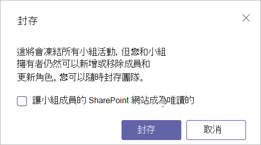

# <a name="archive-or-delete-a-team-in-microsoft-teams"></a>在 Microsoft Teams 中封存或刪除團隊

經過一段時間後，在 Microsoft Teams 中建立的小組可能不再使用，或是您可能想要在專案結束時封存或刪除小組。 如果您是 Microsoft Teams 的系統管理員，請按照本文所述的步驟封存或刪除不再需要的小組。

當您封存小組時，該小組的所有活動都會停止。 封存小組也會封存小組的私人頻道及其相關網站集合。  但是，您仍然可以新增或移除成員、更新角色，而且仍然可以在標準和私人頻道、檔案、聊天中檢視所有的小組活動。

當您刪除小組時，也會刪除標準和私人頻道 (以及相關聯的網站集合)、檔案、聊天中的小組活動。

> [!IMPORTANT]
> 封存的小組可以重新啟用，但是您無法直接還原已刪除的小組。 請先考慮封存小組，並延後刪除，直到確定您不再需要小組。

## <a name="archive-a-team"></a>封存小組

按照這些步驟以封存小組。 您必須是 Teams 服務系統管理員才能進行這些變更。 請參閱[使用 Teams 系統管理員角色來管理 Teams](./using-admin-roles.md)，以了解取得系統管理員角色和權限。

1. 在系統管理中心 **中，選取** Teams。
2. 按一下小組名稱以選取小組。
3. 選取 [封存]。 將會出現下列訊息。

    

4. 若要防止人員編輯小組SharePoint網站和與小組相關聯的 Wiki SharePoint中的內容，請選取讓小組成員使用唯讀SharePoint **網站**。  (Teams擁有者仍然可以編輯此內容。) 
5. 選取 [封存] 以封存小組。 小組的狀態會變更為 [已封存]。

## <a name="make-an-archived-team-active"></a>讓封存的小組成為使用中

按照下列步驟，讓封存的小組成為使用中。

1. 在系統管理中心 **中，選取** Teams。
2. 按一下小組名稱以選取小組。
3. 選取 [解除封存]。 小組的狀態會變更為 [使用中]。

## <a name="delete-a-team"></a>刪除小組

如果未來不再需要小組，您可以將它刪除，而不只是封存。 按照下列步驟刪除小組。

1.  在系統管理中心 **中，選取** Teams。
2.  按一下小組名稱以選取小組。
3.  選取 [刪除]。 將會出現確認訊息。
4.  選取 [刪除] 以永久刪除小組。

## <a name="restore-a-deleted-team"></a>還原刪除的小組

請遵循下列步驟還原已刪除的團隊，Microsoft 365與小組相關聯的群組。 還原小組Microsoft 365群組會還原小組內容，包括定位停駐點、標準頻道和私人頻道及其相關聯的網站集合。

根據預設，已刪除Microsoft 365群組會保留 30 天。 此 30 天期間稱為「虛刪除」，因為您可還原該群組。 若要深入瞭解，請參閱 [還原已刪除的群組](/microsoft-365/admin/create-groups/restore-deleted-group)。

### <a name="install-the-azureadpreview-module"></a>安裝 AzureADPreview 模組

1. 以系統管理員身分開啟 Windows PowerShell。
2. 如果您已安裝舊版 AzureADPreview 模組或 AzureAD 模組，請執行下列其中一項操作將其解除安裝：

    ```PowerShell
    Uninstall-Module AzureADPreview
    ```

    ```PowerShell
    Uninstall-Module AzureAD
    ```
3. 執行以下命令安裝最新版 AzureADPreview 模組：

    ```PowerShell
    Install-Module AzureADPreview
    ```

### <a name="restore-the-deleted-microsoft-365-group"></a>還原已刪除的Microsoft 365群組

1. 執行下列命令連線到 Azure AD：
    ```PowerShell
    Connect-AzureAD
    ```
    當您看到提示時，使用您的系統管理員帳戶和密碼登入。  
2. 請執行下列操作，以顯示仍在 30 天保留期間Microsoft 365刪除的所有群組清單。 如果有大量群組，請使用 **-All $True** 參數。
    ```PowerShell
    Get-AzureADMSDeletedGroup
    ```
3. 尋找您要還原的群組，然後記下識別碼。
4. 執行下列命令來還原群組，其中 [Id] 是群組識別碼。
    ```PowerShell
    Restore-AzureADMSDeletedDirectoryObject -Id [Id]
    ```
5.  執行下列命令來確認群組還原是否成功，其中 [Id] 是群組識別碼。
    ```PowerShell
    Get-AzureADGroup -ObjectId [Id]
    ```

    完成還原程序最多可能需要 24 小時，之後就會在 Teams 中顯示小組以及小組相關聯的內容 (包括索引標籤和頻道) 。
    
## <a name="related-topics"></a>相關主題

- [將小組存檔或還原](https://support.microsoft.com/office/archive-or-restore-a-team-dc161cfd-b328-440f-974b-5da5bd98b5a7) 
