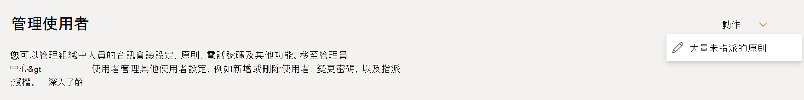
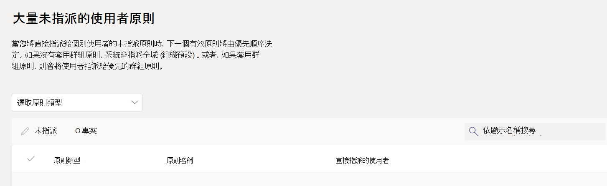

# <a name="assign-policies-to-users-and-groups"></a>指派原則給使用者和群組

本文將檢閱在 Microsoft Teams 中將原則指派給使用者和群組的不同方式。 閱讀之前，請確定您已閱讀 [Teams 中的指派原則 - 開始使用](policy-assignment-overview.md)。

## <a name="assign-a-policy-to-individual-users"></a>指派原則給個別使用者

請依照下列步驟，一次指派原則給個別使用者或幾個使用者。

### <a name="use-the-microsoft-teams-admin-center"></a>使用 Microsoft Teams 系統管理中心

若要指派原則給使用者：

1. 在 [Microsoft Teams 系統管理中心的](https://admin.teams.microsoft.com)左側導覽中，移至 **[使用者**  >  **管理使用者]**。
2. 按一下使用者名稱左側以選取使用者，然後選取 **[編輯設定]**。
3. 選取您要指派的原則，然後選取 [ **套用]**。

    :::image type="content" source="media/assign-policies-users-edit-settings.png"  alt-text="[管理使用者] 底下的 [編輯設定] 窗格螢幕擷取畫面。" lightbox="media/assign-policies-users-edit-settings-expanded.png":::

> [!NOTE]
> 若要取消指派特定原則給使用者，您可以將每個原則設定為 **全域 (組織預設)**。 您也可以為直接指派給原則的所有使用者大量移除原則指派。 若要深入瞭解，請閱讀 [大量取消指派原則](#unassign-policies-in-bulk)。

您也可以執行下列動作來指派原則給使用者：

1. 在 Microsoft Teams 系統管理中心的左側導覽中，移至原則頁面。
2. 按一下原則名稱左邊，選取您要指派的原則。
3. 選 **取 [指派使用者]**。
4. 在 **[管理使用者]** 窗格中，依顯示名稱或使用者名稱搜尋使用者，選取名稱，然後選取 **[新增]**。 針對要新增的每一個使用者重複此步驟。
5. 當您完成新增使用者時，選取 [ **套用]**。

    :::image type="content" source="media/assign-policies-user-example.png" alt-text="螢幕擷取畫面顯示如何在 Teams 系統管理中心透過第二種方法指派原則給使用者。" lightbox="media/assign-policies-user-example-expanded.png":::

### <a name="use-powershell"></a>使用 PowerShell

每個原則類型都有一組專屬的 Cmdlet 來進行管理。 `Grant-`使用指定原則類型的 Cmdlet 來指派原則。 例如，使用 `Grant-CsTeamsMeetingPolicy` Cmdlet 將 Teams 會議原則指派給使用者。 這些 Cmdlet 包含在 Teams PowerShell 模組中，並會在[商務用 Skype Cmdlet 參照](/powershell/skype)中記錄。

 如果您尚未) ，請下載並安裝 [Teams PowerShell 公開發行](https://www.powershellgallery.com/packages/MicrosoftTeams/) (，然後執行下列動作來連線。

> [!NOTE]
> 商務用 Skype Online 連接器目前是最新 Teams PowerShell 模組的一部分。
>
> 如果您使用的是最新的[Teams PowerShell 公開發行](https://www.powershellgallery.com/packages/MicrosoftTeams/)版，則不需要安裝 商務用 Skype Online Connector。

```powershell
  # When using Teams PowerShell Module

   Import-Module MicrosoftTeams
   $credential = Get-Credential
   Connect-MicrosoftTeams -Credential $credential
```

在此範例中，我們指派名為 Student Meeting Policy 的 Teams 會議原則給名為 Reda 的使用者。

```powershell
Grant-CsTeamsMeetingPolicy -Identity reda@contoso.com -PolicyName "Student Meeting Policy"
```

若要深入瞭解，請閱讀 [透過 PowerShell 管理原則](teams-powershell-managing-teams.md#manage-policies-via-powershell)。

## <a name="assign-a-policy-to-a-group"></a>指派原則給群組

群組的原則指派可讓您將原則指派給一組使用者，例如安全性群組、組織單位或通訊群組清單。 原則指派將根據優先順序規則傳播到群組成員。 在群組中新增或移除成員時，系統會相應地更新其繼承的原則指派。

最多 50，000 個使用者的群組建議將原則指派給群組，但也適用于較大的群組。

當您指派原則時，原則會立即指派給該群組。 不過，原則指派給群組成員的傳播會做為背景作業，而且可能需要一些時間，視群組的大小而定。 當原則未指派給群組，或成員從群組新增或移除時，也是如此。

群組原則指派只會傳播給群組直接成員的使用者。 作業不會傳播到巢狀群組的成員。

### <a name="what-you-need-to-know-about-policy-assignment-to-groups"></a>關於群組的原則指派所需注意的事項

開始之前，請務必先瞭解優先順序規則和群組作業排名。

#### <a name="precedence-rules"></a>優先順序規則

針對指定的原則類型，會根據下列專案判斷使用者的有效原則：

- 直接指派給使用者的原則優先于指派給群組之相同類型的任何其他原則。 換句話說，如果使用者直接獲派指定類型的原則，該使用者就不會繼承群組中相同類型的原則。 這也表示如果使用者有直接指派給他們的指定類型原則，您必須先將該原則從使用者中移除，使用者才能繼承群組中相同類型的原則。
- 如果使用者沒有直接指派原則，而且屬於兩個或多個群組的成員，且每個群組都有相同類型的原則，則使用者會繼承排名最高的群組指派原則。
- 如果使用者不是獲指派原則之任何群組的成員，則該原則類型的全域 (組織預設) 原則會套用至該使用者。

使用者的有效原則會根據下列規則更新：

- 當使用者從已指派原則的群組中新增或移除時。
- 已取消指派原則給群組。
- 系統會移除直接指派給使用者的原則。

#### <a name="group-assignment-ranking"></a>群組作業排名

> [!NOTE]
> 指定的原則類型可指派給該類型最多 64 個原則實例的 64 個群組。

當您將原則指派給群組時，您可以指定群組指派的排名。 此排名是用來判斷如果使用者是兩個或多個群組的成員，且每個群組都獲派相同類型的原則，使用者應該繼承哪一個原則作為其有效原則。

群組作業排名相對於相同類型的其他群組作業。 例如，如果您將通話原則指派給兩個群組，請將一個指派的排名設為 1，另一個設為 2，其中 1 為最高排名。 群組指派排名會指出哪些群組成員資格比在繼承方面的其他群組成員資格更為重要或更相關。

例如，假設您有兩個群組：[Microsoft Store 員工] 和 [市集管理員]。 這兩個群組都會分別獲指派 Teams 通話原則、Microsoft Store 員工通話原則和 Microsoft Store 管理員通話原則。 對於同時位於這兩個群組中的店面管理員，其經理角色會比其員工角色更相關，因此指派給 [市集管理員] 群組的通話原則的排名應該較高。

|組 |Teams 通話原則名稱  |排名|
|---------|---------|---|
|市集管理員   |Microsoft Store 管理員通話原則         |1|
|Microsoft Store 員工    |Microsoft Store 員工通話原則      |2|

如果您未指定排名，系統會將原則指派指定為最低排名。

### <a name="in-the-teams-admin-center"></a>在 Teams 系統管理中心

> [!NOTE]
> 目前，使用 Microsoft Teams 系統管理中心的群組原則指派僅適用于 Teams 通話原則、Teams 通話駐留原則、Teams 原則、Teams 即時活動原則、Teams 會議原則和 Teams 訊息原則。 對於其他原則類型，請使用 PowerShell。

1. 在 Microsoft Teams 系統管理中心的左側導覽中，移至原則類型頁面。 例如，移至 **會議**  >  **會議原則**。
2. 選取 [ **群組原則指派] 索引** 標籤。
3. 選取 **[新增群組**]，然後在 [ **指派原則給群組** ] 窗格中，執行下列動作：
    1. 搜尋並新增您要指派原則的群組。
    2. 設定群組作業的排名。
    3. 選取您要指派的原則。
    4. 選取 [ **套用]**。

        :::image type="content" source="media/assign-policies-groups-messaging.png" alt-text="顯示如何在 Teams 系統管理中心將原則指派給群組的螢幕擷取畫面。" lightbox="media/assign-policies-groups-messaging-expanded.png":::

若要移除群組原則指派，請在原則頁面的 [ **群組原則指派** ] 索引標籤上，選取群組作業，然後選取 [ **移除]**。

若要變更群組作業的排名，您必須先移除群組原則指派。 然後，依照上述步驟將原則指派給群組。

### <a name="use-the-powershell-option"></a>使用 PowerShell 選項

> [!NOTE]
> 目前，並非所有 Teams 原則類型都提供使用 PowerShell 之群組的原則指派。 如需支援的原則類型清單，請參閱 [New-CsGroupPolicyAssignment](/powershell/module/teams/new-csgrouppolicyassignment) 。

#### <a name="install-and-connect-to-the-microsoft-teams-powershell-module"></a>安裝並聯機到 Microsoft Teams PowerShell 模組

如需逐步指引，請參閱 [安裝 Teams PowerShell](teams-powershell-install.md)。

#### <a name="assign-a-policy-to-a-group-of-users"></a>指派原則給一組使用者

使用 [New-CsGroupPolicyAssignment](/powershell/module/teams/new-csgrouppolicyassignment) Cmdlet 將原則指派給群組。 您可以使用物件識別碼、SIP 位址或電子郵件地址來指定群組。

在此範例中，我們指派名為「零售經理會議原則」的 Teams 會議原則給作業排名為 1 的群組。

```powershell
New-CsGroupPolicyAssignment -GroupId d8ebfa45-0f28-4d2d-9bcc-b158a49e2d17 -PolicyType TeamsMeetingPolicy -PolicyName "Retail Managers Meeting Policy" -Rank 1
```

#### <a name="get-policy-assignments-for-a-group"></a>取得群組的原則指派

使用 [Get-CsGroupPolicyAssignment](/powershell/module/teams/get-csgrouppolicyassignment) Cmdlet 將所有原則指派給群組。 群組一律會以其群組識別碼列出，即使其 SIP 位址或電子郵件地址是用來指派原則。

在此範例中，我們會擷取指派給特定群組的所有原則。

```powershell
Get-CsGroupPolicyAssignment -GroupId e050ce51-54bc-45b7-b3e6-c00343d31274
```

在此範例中，我們會傳回已指派 Teams 會議原則的所有群組。

```powershell
Get-CsGroupPolicyAssignment -PolicyType TeamsMeetingPolicy
```

#### <a name="remove-a-policy-from-a-group"></a>從群組移除原則

使用 [Remove-CsGroupPolicyAssignment](/powershell/module/teams/remove-csgrouppolicyassignment) Cmdlet 從群組移除原則。 當您從群組移除原則時，會更新指派給該群組且排名較低的相同類型其他原則的優先順序。 例如，如果您移除排名為 2 的原則，則會更新排名為 3 和 4 的原則，以反映其新排名。 下列兩個數據表顯示此範例。

以下是 Teams 會議原則的原則指派和優先順序清單。

|組名  |原則名稱  |排名|
|---------|---------|---------|
|銷售    |銷售原則       | 1        |
|西部地區     |西部地區原則         |2         |
|劃分    |除法原則         |3         |
|附屬   |子公司原則        |4         |

如果我們從 [西部地區] 群組移除西部地區原則，則原則指派和優先順序會如下所示更新。

|組名  |原則名稱  |排名|
|---------|---------|---------|
|銷售    |銷售原則       | 1        |
|劃分    |除法原則         |2         |
|附屬   |子公司原則        |3        |

在此範例中，我們會從群組中移除 Teams 會議原則。

```powershell
Remove-CsGroupPolicyAssignment -PolicyType TeamsMeetingPolicy -GroupId f985e013-0826-40bb-8c94-e5f367076044
```

#### <a name="change-a-policy-assignment-for-a-group"></a>變更群組的原則指派

> [!NOTE]
> [Set-CsGroupPolicyAssignment](/powershell/module/teams/set-csgrouppolicyassignment) Cmdlet 即將推出。 在此同時，若要變更群組原則指派，您可以從群組中移除目前的原則指派，然後新增新的原則指派。

指派原則給群組之後，您可以使用 [Set-CsGroupPolicyAssignment](/powershell/module/teams/set-csgrouppolicyassignment) Cmdlet 來變更該群組的原則指派，如下所示：

- 變更排名
- 變更指定原則類型的原則
- 變更指定原則類型的原則和排名

在此範例中，我們會將群組的 Teams 通話駐留原則變更為名為 SupportCallPark 的原則，並將作業排名變更為 3。

```powershell
Set-CsGroupPolicyAssignment -GroupId 566b8d39-5c5c-4aaa-bc07-4f36278a1b38 -PolicyType TeamsMeetingPolicy -PolicyName SupportCallPark -Rank 3
```

#### <a name="change-the-effective-policy-for-a-user"></a>變更使用者的有效原則

以下範例說明如何變更直接獲派原則之使用者的有效原則。

首先，我們會將 [Get-CsUserPolicyAssignment](/powershell/module/teams/get-csuserpolicyassignment) Cmdlet 與 `PolicySource` 參數搭配使用，以取得與使用者相關聯的 Teams 會議廣播原則的詳細資料。

```powershell
Get-CsUserPolicyAssignment -Identity daniel@contoso.com -PolicyType TeamsMeetingBroadcastPolicy | select -ExpandProperty PolicySource
```

輸出顯示使用者已直接獲指派名為 **「員工事件**」的 Teams 會議廣播原則，其優先順序高於指派給使用者所屬群組的「 **廠商即時活動** 」原則。

```console
AssignmentType PolicyName         Reference
-------------- ----------         ---------
Direct         Employee Events
Group          Vendor Live Events 566b8d39-5c5c-4aaa-bc07-4f36278a1b38
```

現在，我們會從使用者移除員工事件原則。 這表示使用者不再擁有直接指派給他們的 Teams 會議廣播原則，且會繼承指派給使用者所屬群組的 [廠商即時活動] 原則。

使用 商務用 Skype PowerShell 模組中的下列 Cmdlet 執行此動作。

```powershell
Grant-CsTeamsMeetingBroadcastPolicy -Identity daniel@contoso.com -PolicyName $null
```

在 Teams PowerShell 模組中使用下列 Cmdlet 來透過批次處理原則指派來執行此動作，其中$users是您指定的使用者清單。

```powershell
New-CsBatchPolicyAssignmentOperation -OperationName "Assigning null at bulk" -PolicyType TeamsMeetingBroadcastPolicy -PolicyName $null -Identity $users  
```

## <a name="assign-a-policy-to-a-batch-of-users"></a>指派原則給一批使用者

### <a name="use-the-admin-center"></a>使用系統管理中心

若要大量指派原則給使用者：

1. 在 Microsoft Teams 系統管理中心的左側導覽中，選取 [ **使用者]**。
2. 搜尋您要指派原則的使用者，或篩選檢視以顯示您想要的使用者。
3. 在 [&#x2713;] (核取方塊) 欄中，選取使用者。 若要選取所有使用者，請選取表格頂端) &#x2713; (核取記號。
4. 選取 **[編輯設定**]，進行您要的變更，然後選取 [ **套用]**。

若要檢視原則指派的狀態，請在選取 **[套用**] 以提交原則指派後，出現在 [**使用者**] 頁面頂端的橫幅中，選取 [**活動記錄檔]**。 或者，在 Microsoft Teams 系統管理中心的左側導覽中，移至 **[儀表板**]，然後在 [ **活動記錄** 檔] 底下選 **取 [檢視詳細資料]**。 活動記錄會顯示過去 30 天內，透過 Microsoft Teams 系統管理中心分批指派給超過 20 個使用者的原則指派。 若要深入瞭解，請參 [閱在活動記錄中檢視您的原則指派](activity-log.md)。

### <a name="use-powershell-method"></a>使用 PowerShell 方法

> [!NOTE]
> 目前，並非所有 Teams 原則類型都提供使用 PowerShell 的批次處理原則指派。 如需支援的原則類型清單，請參閱 [New-CsBatchPolicyAssignmentOperation](/powershell/module/teams/new-csbatchpolicyassignmentoperation) 。

透過批次處理原則指派，您可以一次指派原則給一大組使用者，而不需使用腳本。 您可以使用 [New-CsBatchPolicyAssignmentOperation](/powershell/module/teams/new-csbatchpolicyassignmentoperation) Cmdlet 來提交一批使用者和您要指派的原則。 系統會將工作處理為背景作業，並為每個批次產生作業識別碼。 接著，您可以使用 [Get-CsBatchPolicyAssignmentOperation](/powershell/module/teams/get-csbatchpolicyassignmentoperation) Cmdlet 來追蹤批次中作業的進度和狀態。

依使用者的物件識別碼或會話初始通訊協定 (SIP) 位址指定使用者。 使用者的 SIP 位址的值通常與 UPN) 或電子郵件地址 (使用者主體名稱相同，但並非必要。 如果使用者是使用 UPN 或電子郵件指定，但其值與 SIP 位址不同，則使用者的原則指派將會失敗。 如果批次包含重複的使用者，則會在處理前從批次移除重複專案，而且只有批次中剩餘的唯一使用者才會提供狀態。

批次最多可包含 5000 個使用者。 為獲得最佳結果，請不要一次提交多個批次。 允許批次完成處理，然後再提交更多批次。

#### <a name="install-and-connect-to-the-teams-powershell-module"></a>安裝並聯機到 Teams PowerShell 模組

執行下列動作以安裝 [Microsoft Teams PowerShell 模組](https://www.powershellgallery.com/packages/MicrosoftTeams)。 請確定您已安裝版本 1.0.5 或更新版本。

```powershell
Install-Module -Name MicrosoftTeams
```

執行下列動作以連線至 Teams 並開始會話。

```powershell
Connect-MicrosoftTeams
```

出現提示時，請使用您的系統管理員認證登入。

#### <a name="install-and-connect-to-the-azure-ad-powershell-for-graph-module-optional"></a>安裝並聯機到 Graph 版 Azure AD PowerShell 模組 (選用) 

如果您尚未) 並聯機到 Azure AD，以便擷取組織中的使用者清單，您可能也想要 [下載並安裝 Graph 版 Azure AD PowerShell 模組](/powershell/azure/active-directory/install-adv2) (。

執行下列動作以連線至 Azure AD。

```powershell
Connect-AzureAD
```

當系統提示時，請使用您用來連線至 Teams 的同一個系統管理員認證登入。

#### <a name="assign-a-setup-policy-to-a-batch-of-users"></a>指派設定原則給一批使用者

在此範例中，我們使用 [New-CsBatchPolicyAssignmentOperation](/powershell/module/teams/new-csbatchpolicyassignmentoperation) Cmdlet，將名為 HR 應用程式設定原則的應用程式設定原則指派給users_ids.文字檔中列出的一批使用者。

```powershell
$user_ids = Get-Content .\users_ids.txt
New-CsBatchPolicyAssignmentOperation -PolicyType TeamsAppSetupPolicy -PolicyName "HR App Setup Policy" -Identity $user_ids -OperationName "Example 1 batch"
```

在此範例中，我們連線到 Azure AD 以擷取使用者集合，然後指派名為 New Hire Messaging Policy 的傳訊原則給使用 SIP 位址指定的一批使用者。

```powershell
Connect-AzureAD
$users = Get-AzureADUser
New-CsBatchPolicyAssignmentOperation -PolicyType TeamsMessagingPolicy -PolicyName "New Hire Messaging Policy" -Identity $users.SipProxyAddress -OperationName "Example 2 batch"
```

#### <a name="get-the-status-of-a-batch-assignment"></a>取得批次處理作業的狀態

執行下列動作以取得批次處理作業的狀態，其中 OperationId 是指定批次 Cmdlet 所傳 `New-CsBatchPolicyAssignmentOperation` 回的作業識別碼。

```powershell
$Get-CsBatchPolicyAssignmentOperation -OperationId f985e013-0826-40bb-8c94-e5f367076044 | fl
```

如果輸出顯示發生錯誤，請執行下列動作以取得有關錯誤的詳細資訊，錯誤位於屬性中 `UserState` 。

```powershell
Get-CsBatchPolicyAssignmentOperation -OperationId f985e013-0826-40bb-8c94-e5f367076044 | Select -ExpandProperty UserState
```

若要深入瞭解，請參閱 [Get-CsBatchPolicyAssignmentOperation](/powershell/module/teams/get-csbatchpolicyassignmentoperation)。

## <a name="unassign-policies-in-bulk"></a>大量取消指派原則

當您大量取消指派原則時，您要移除透過直接指派指派給個別使用者的原則指派。 在下列案例中，此功能很有用：

1. **針對全域 (組織的預設) 或群組原則指派生效：** 由於 [優先順序規則](policy-assignment-overview.md#which-policy-takes-precedence)，全域 (組織的預設) 或群組原則指派將不會對具有直接原則指派的使用者生效。 身為系統管理員，您可以大量取消指派原則以移除直接指派，讓全全組織 (預設) 或群組原則指派生效。
1. **從 Teams 教育精靈清理原則作業：** Teams 教育版原則精靈會套用學生的全域原則預設值，並為使用群組原則作業的教職員指派自訂原則集。 系統管理員必須清理全域 (組織預設) 和群組作業的學生和教職員個別原則，才能生效。
1. **移除不正確的原則指派：** 如果有一大群使用者透過直接指派獲指派錯誤的原則，您可以大量使用未指派原則來移除這些指派。

 您可以從 [Microsoft Teams](https://admin.teams.microsoft.com)系統管理中心大量取消指派原則。

1. 移至 **[使用者**  >  **管理使用者]**。
2. 在頁面右上角，從 [**動作**] 下拉式功能表中選取 [**大量取消指派** 原則]。

    

    > [!NOTE]
    > 您也可以從個別原則頁面取消指派原則，方法是選擇原則，然後選取 **[管理使用者]**。

3. 選取原則類型。

    

4. 選擇您要重新指派的原則，然後選取 [ **載入資料** ] 以取得目前指派給該原則的使用者數目。

    > [!IMPORTANT]
    > 當您選擇原則時，您要從該原則中移除 **所有** 個別指派的使用者。

5. 選取 **[取消指派原則]**。

取消指派原則之後，您可以在 [[活動] 記錄](https://admin.teams.microsoft.com/activity-log)檔中檢閱作業詳細資料。

## <a name="related-topics"></a>相關主題

- [使用原則管理 Teams](manage-teams-with-policies.md)
- [Teams PowerShell 概觀](teams-powershell-overview.md)
- [在 Teams 中指派原則 - 快速入門](policy-assignment-overview.md)
