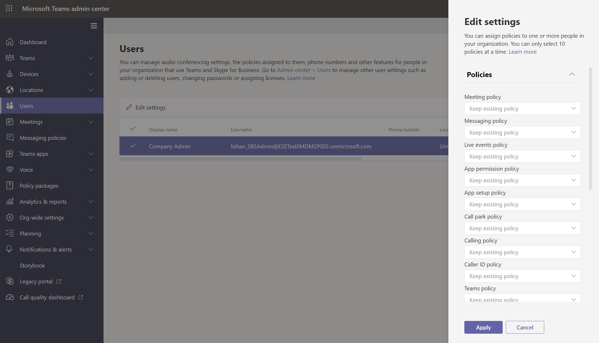

# <a name="assign-policies-to-users-and-groups"></a>指派策略給使用者和群組

本文將審查在 Microsoft Teams 中指派策略給使用者和群組Microsoft Teams。 閱讀前，請確定您閱讀過在 Teams[中指派策略 - 開始使用](policy-assignment-overview.md)。

## <a name="assign-a-policy-to-individual-users"></a>指派策略給個別使用者

請遵循下列步驟，一次指派一個策略給個別使用者或少數使用者。

### <a name="use-the-microsoft-teams-admin-center"></a>使用 Microsoft Teams系統管理中心

若要將策略指派給使用者：

1. 在系統管理中心的左側導 [Microsoft Teams，請](https://admin.teams.microsoft.com)前往 **UsersManage** ****  >  使用者。
2. 按一下使用者名稱左側的選取使用者，然後選取編輯 **設定**。
3. 選取您想要指派原則，然後 **選取 Apply。**



> [!NOTE]
> 若要從使用者取消特定策略，您可以將每個策略設定為全域 (**全組織的預設)**。

您也可以執行下列操作，將策略指派給使用者：

1. 在系統管理中心的左側導Microsoft Teams，請前往政策頁面。
2. 按一下策略名稱左側，選取您想要指派的政策。
3. 選取 [管理使用者]。
4. 在 **[管理使用者]** 窗格中，依顯示名稱或使用者名稱搜尋使用者，選取名稱，然後選取 **[新增]**。 針對要新增的每一個使用者重複此步驟。
5. 新增使用者完成後，請 **選取應用程式。**


### <a name="use-powershell"></a>使用 PowerShell

每個策略類型都有一組自己的 Cmdlet 來管理它。 使用指定 `Grant-` 策略類型的 Cmdlet 來指派策略。 例如，使用 `Grant-CsTeamsMeetingPolicy` Cmdlet 將會議Teams指派給使用者。 這些 Cmdlet 包含在 PowerShell 模組Teams中，並記錄在 商務用 Skype [Cmdlet 參照中](/powershell/skype)。

 如果您尚未Teams， (並安裝[PowerShell](https://www.powershellgallery.com/packages/MicrosoftTeams/)公開發行，) ，然後執行下列操作以連接。

> [!NOTE]
> 商務用 Skype Online 連接器目前是最新 Teams PowerShell 模組的一部分。
>
> 如果您使用的是最新版[PowerShell](https://www.powershellgallery.com/packages/MicrosoftTeams/) Teams版本，則不需要安裝 商務用 Skype 連接器。

```powershell
  # When using Teams PowerShell Module

   Import-Module MicrosoftTeams
   $credential = Get-Credential
   Connect-MicrosoftTeams -Credential $credential
```

在此範例中，我們會將名為 Teams會議策略的一個會議策略指派給名為 Reda 的使用者。

```powershell
Grant-CsTeamsMeetingPolicy -Identity reda@contoso.com -PolicyName "Student Meeting Policy"
```

若要深入瞭解，請參閱透過 [PowerShell 管理原則](teams-powershell-managing-teams.md#manage-policies-via-powershell)。

## <a name="assign-a-policy-to-a-group"></a>將策略指派給群組

將策略指派給群組可讓您將策略指派給一組使用者，例如安全性群組、組織單位或通訊群組清單。 原則指派將根據優先順序規則傳播到群組成員。 在群組中新增或移除成員時，系統會相應地更新其繼承的原則指派。

建議最多 50，000 個使用者群組使用群組原則指派給群組，但也適用于較大的群組。

當您指派策略時，系統會立即將其指派給群組。 不過，將策略指派傳播給群組成員會以背景作業方式執行，視群組大小不同，可能需要一些時間。 當未從群組中未指定策略，或成員新加入群組或從群組中移除時，也是如此。

群群組原則指派只會傳播給直接成為群組成員的使用者。 指派不會傳播到巢中群組的成員。

### <a name="what-you-need-to-know-about-policy-assignment-to-groups"></a>關於將策略指派給群組時，您需要知道什麼

在您開始使用之前，瞭解優先順序規則和群組作業排名非常重要。

#### <a name="precedence-rules"></a>優先順序規則

對於給定的策略類型，使用者的有效政策會依據下列條件決定：

- 直接指派給使用者的政策優先于指派給群組之相同類型之任何其他政策。 換句話說，如果使用者直接獲派指定類型的策略，該使用者不會從群組繼承相同類型的策略。 這也表示如果使用者有直接指派給該使用者的指定類型之策略，您必須從使用者移除該策略，才能從群組繼承相同類型的策略。
- 如果使用者沒有直接指派策略給他們，而且是兩個或多個群組的成員，且每個群組都有指派給該群組的相同類型之策略，則使用者會繼承排名最高的群組指派策略。
- 如果使用者不是指派原則之任何群組的成員，則該原則類型的全域 (組織) 預設) 原則會適用于該使用者。

使用者的有效原則會依照以下規則更新：

- 將使用者新加入或移除已指派策略的群組時。
- 系統未從群組中未指定一個策略。
- 系統會移除直接指派給使用者的政策。

#### <a name="group-assignment-ranking"></a>群組作業排名

當您將策略指派給群組時，您可以為群組作業指定排名。 這是用來判斷如果使用者是兩個或多個群組的成員，且每個群組被指派了相同類型的策略，使用者應該繼承哪一個策略為其有效原則。

群組作業排名是相對於相同類型的其他群組作業。 例如，如果您要將通話策略指派給兩個群組，請設定一個作業的排名為 1，另一個則設為 2，其中 1 為最高排名。 群組作業排名會指出哪些群組成員資格比繼承的其他群組成員資格重要或更相關。

例如，假設您擁有兩個群組，即 Store Employees 和 Store 管理員。 這兩個群組會分別Teams通話策略、市售員工通話策略和市管理員通話政策。 對於同時同時在兩個群組中的商店管理員，其主管角色比員工角色更相關，因此指派給市管理員群組的通話政策應具有較高的排名。

|組 |Teams通話策略名稱  |排名|
|---------|---------|---|
|市管理   |市商店管理員通話政策         |1|
|儲存員工    |儲存員工通話政策      |2|

如果您沒有指定排名，則策略作業會獲得最低的排名。

### <a name="in-the-teams-admin-center"></a>在 Teams 系統管理中心

> [!NOTE]
> 目前，使用 Microsoft Teams 系統管理中心指派給群組的策略僅適用于 Teams 通話政策、Teams 通話停駐政策、Teams 政策、Teams 即時活動政策、Teams 會議策略和 Teams 傳訊政策。 針對其他策略類型，請使用 PowerShell。

1. 在系統管理中心的左側導Microsoft Teams，請前往策略類型頁面。 例如，請前往 **MeetingsMeeting** ****  >  策略。
2. 選取組 **策略工作分派** 選項卡。
3. 選取 **新增群組**，然後在指派策略 **至群組** 窗格中，執行下列操作：
    1. 搜尋並新增要指派該策略的群組。
    2. 設定群組作業的排名。
    3. 選取您想要指派的政策。
    4. 選取 **Apply**。
    


若要移除群組原則作業，請在策略頁面的群組原則指派選項卡上，選取組作業，**然後選取移除**。

若要變更群組作業的排名，您首先必須移除群組原則作業。 接著，請遵循上述步驟，將策略指派給群組。

### <a name="use-the-powershell-option"></a>使用 PowerShell 選項

> [!NOTE]
> 目前，所有使用 PowerShell 的群群組原則指派不適用於Teams類型。 請參閱 [New-CsGroupPolicyAssignment](/powershell/module/teams/new-csgrouppolicyassignment) ，瞭解支援的策略類型清單。

#### <a name="install-and-connect-to-the-microsoft-teams-powershell-module"></a>安裝並連接到 powerShell Microsoft Teams模組

有關逐步指南，請參閱在[PowerShell Teams安裝](teams-powershell-install.md)。

#### <a name="assign-a-policy-to-a-group-of-users"></a>指派一個策略給一組使用者

使用 [New-CsGroupPolicyAssignment](/powershell/module/teams/new-csgrouppolicyassignment) Cmdlet 將策略指派給群組。 您可以使用物件識別碼、SIP 位址或電子郵件地址來指定群組。

在此範例中，我們將名為零Teams會議策略的會議策略指派給作業排名為 1 的群組。

```powershell
New-CsGroupPolicyAssignment -GroupId d8ebfa45-0f28-4d2d-9bcc-b158a49e2d17 -PolicyType TeamsMeetingPolicy -PolicyName "Retail Managers Meeting Policy" -Rank 1
```

#### <a name="get-policy-assignments-for-a-group"></a>取得群組的策略指派

使用 [Get-CsGroupPolicyAssignment Cmdlet](/powershell/module/teams/get-csgrouppolicyassignment) 取得指派給群組的所有策略。 請注意，即使已使用群組的 SIP 位址或電子郵件地址來指派策略，群組還是會一直以群組識別碼列出。

在此範例中，我們會取回指派給特定群組的所有策略。

```powershell
Get-CsGroupPolicyAssignment -GroupId e050ce51-54bc-45b7-b3e6-c00343d31274
```

在此範例中，我們會將所有指派給會議Teams群組。

```powershell
Get-CsGroupPolicyAssignment -PolicyType TeamsMeetingPolicy
```

#### <a name="remove-a-policy-from-a-group"></a>從群組移除策略

使用 [Remove-CsGroupPolicyAssignment Cmdlet](/powershell/module/teams/remove-csgrouppolicyassignment) 從群組移除策略。 當您從群組移除策略時，會更新指派給該群組且排名較低的相同類型其他策略的優先順序。 例如，如果您移除排名為 2 的策略，則排名為 3 和 4 的策略會更新以反映其新排名。 下列兩個表格顯示此範例。

以下列出會議Teams工作分派和優先順序。

|群組名稱  |策略名稱  |排名|
|---------|---------|---------|
|銷售    |銷售政策       | 1        |
|西部地區     |西部地區政策         |2         |
|劃分    |部門政策         |3         |
|附屬   |子公司政策        |4         |

如果我們從西部區域群組移除西部區域政策，則策略指派和優先順序會更新如下。

|群組名稱  |策略名稱  |排名|
|---------|---------|---------|
|銷售    |銷售政策       | 1        |
|劃分    |部門政策         |2         |
|附屬   |子公司政策        |3        |

在此範例中，我們會從Teams移除會議策略。

```powershell
Remove-CsGroupPolicyAssignment -PolicyType TeamsMeetingPolicy -GroupId f985e013-0826-40bb-8c94-e5f367076044
```

#### <a name="change-a-policy-assignment-for-a-group"></a>變更群組的策略指派

> [!NOTE]
> [Set-CsGroupPolicyAssignment Cmdlet](/powershell/module/teams/set-csgrouppolicyassignment)即將推出。 同時，若要變更群組原則指派，您可以移除群組中的目前策略指派，然後新增新的策略指派。

將策略指派給群組之後，您可以使用 [Set-CsGroupPolicyAssignment](/powershell/module/teams/set-csgrouppolicyassignment) Cmdlet 變更該群組的策略指派，如下所示：

- 變更排名
- 變更給定策略類型的策略
- 變更給定策略類型的策略和排名

在此範例中，我們將群組的呼叫Teams策略變更為名為 SupportCallPark 且作業排名為 3。

```powershell
Set-CsGroupPolicyAssignment -GroupId 566b8d39-5c5c-4aaa-bc07-4f36278a1b38 -PolicyType TeamsMeetingPolicy -PolicyName SupportCallPark -Rank 3
```

#### <a name="change-the-effective-policy-for-a-user"></a>變更使用者的有效原則

以下是如何變更直接指派策略之使用者之有效原則的範例。

首先，我們使用[Get-CsUserPolicyAssignment Cmdlet](/powershell/module/teams/get-csuserpolicyassignment) `PolicySource` 與參數一起取得與使用者關聯的 Teams 會議廣播政策詳細資料。

```powershell
Get-CsUserPolicyAssignment -Identity daniel@contoso.com -PolicyType TeamsMeetingBroadcastPolicy | select -ExpandProperty PolicySource
```

輸出顯示使用者已直接獲派名為員工事件的 Teams 會議廣播策略，其優先順序高於指派給使用者所屬群組的廠商 Live Events。

```console
AssignmentType PolicyName         Reference
-------------- ----------         ---------
Direct         Employee Events
Group          Vendor Live Events 566b8d39-5c5c-4aaa-bc07-4f36278a1b38
```

現在，我們會從使用者移除員工事件政策。 這表示使用者不再有直接指派Teams廣播策略，而且會繼承指派給使用者所屬群組的廠商 Live Events 政策。

在 PowerShell 模組商務用 Skype下列 Cmdlet 執行此操作。

```powershell
Grant-CsTeamsMeetingBroadcastPolicy -Identity daniel@contoso.com -PolicyName $null
```

在 PowerShell 模組Teams使用下列 Cmdlet，在批次策略指派中以縮放$users，其中 $users是您指定的使用者清單。

```powershell
New-CsBatchPolicyAssignmentOperation -OperationName "Assigning null at bulk" -PolicyType TeamsMeetingBroadcastPolicy -PolicyName $null -Identity $users  
```

## <a name="assign-a-policy-to-a-batch-of-users"></a>指派一個策略給一批使用者

### <a name="use-the-admin-center"></a>使用系統管理中心

若要大量指派策略給使用者：

1. 在系統管理中心的左側導Microsoft Teams **，選取使用者**。
2. 搜尋您想要指派策略的使用者，或篩選該視圖以顯示您想要的使用者。
3. 在 [&#x2713;] (核取方塊) 欄中，選取使用者。 若要選取 [所有使用者]，請按一下表格頂端的 [&#x2713;] (核取方塊)。
4. 選取 **編輯設定**，進行您想要的變更， **然後選取應用程式**。

若要查看原則作業的狀態，請在選取應用程式以提交原則作業後，于使用者頁面頂端出現的橫幅中，選取 **活動記錄**。 或者，在系統管理中心的左側導Microsoft Teams，前往儀表板，然後在活動記錄下，選取查看 **詳細資料**。**** 活動記錄會顯示過去 30 天內透過系統管理中心Microsoft Teams 20 多個使用者的批次策略指派。 若要深入瞭解，請參閱 [在活動記錄中查看您的策略指派](activity-log.md)。

### <a name="use-powershell-method"></a>使用 PowerShell 方法

> [!NOTE]
> 目前，並非所有策略類型都使用 PowerShell Teams指派。 請參閱 [New-CsBatchPolicyAssignmentOperation](/powershell/module/teams/new-csbatchpolicyassignmentoperation) ，瞭解支援原則類型的清單。

使用批次策略指派，您可以一次指派一個策略給大型使用者組，而不需要使用腳本。 您可以使用 [New-CsBatchPolicyAssignmentOperation Cmdlet](/powershell/module/teams/new-csbatchpolicyassignmentoperation) 提交一批使用者和您想要指派原則。 系統會將工作處理為背景作業，並為每個批次產生作業識別碼。 接著，您可以使用 [Get-CsBatchPolicyAssignmentOperation Cmdlet](/powershell/module/teams/get-csbatchpolicyassignmentoperation) 來追蹤批次中作業的進度和狀態。

根據使用者的物件識別碼或會話初始通訊協定 (SIP) 位址。 使用者的 SIP 位址通常與 UPN 或電子郵件地址的使用者主體名稱 (相同) ，但這不是必要的。 如果使用者是使用 UPN 或電子郵件指定，但其值與 SIP 位址不同，則使用者的策略指派將會失敗。 如果批次包含重複的使用者，則重複專案將在處理前從批次中移除，而狀態只會提供給批次中的唯一使用者。

批次最多可包含 5000 個使用者。 為了獲得最佳結果，一次不要提交多個批次。 在提交更多批次之前，允許批次完成處理。

#### <a name="install-and-connect-to-the-teams-powershell-module"></a>安裝並連接到 powerShell Teams模組

執行下列操作以安裝[powerShell Microsoft Teams模組](https://www.powershellgallery.com/packages/MicrosoftTeams)。 請確定您安裝版本 1.0.5 或更新版本。

```powershell
Install-Module -Name MicrosoftTeams
```

執行下列操作以連接到Teams並開始會話。

```powershell
Connect-MicrosoftTeams
```

系統提示您時，請使用系統管理員認證來登錄。

#### <a name="install-and-connect-to-the-azure-ad-powershell-for-graph-module-optional"></a>安裝並連接到 PowerShell Azure AD模組Graph選 (模組) 

如果您尚未下載並安裝 Graph 模組 Azure AD [PowerShell](/powershell/azure/active-directory/install-adv2) (，您可能還想下載並安裝) 並連接到 Azure AD，這樣您才能在組織中取回使用者清單。

執行下列操作以連接到Azure AD。

```powershell
Connect-AzureAD
```

系統提示您時，請使用相同的系統管理員認證來Teams。

#### <a name="assign-a-setup-policy-to-a-batch-of-users"></a>指派設定策略給一批使用者

在此範例中，我們使用 [New-CsBatchPolicyAssignmentOperation Cmdlet](/powershell/module/teams/new-csbatchpolicyassignmentoperation) 將名為 HR App 設定原則的應用程式設定原則指派給 users_ids.文字檔中列出的一批使用者。

```powershell
$user_ids = Get-Content .\users_ids.txt
New-CsBatchPolicyAssignmentOperation -PolicyType TeamsAppSetupPolicy -PolicyName "HR App Setup Policy" -Identity $user_ids -OperationName "Example 1 batch"
```

在此範例中，我們會Azure AD使用者集合，然後將名為新進員工傳訊政策的訊息原則指派給一批使用 SIP 位址指定的使用者。

```powershell
Connect-AzureAD
$users = Get-AzureADUser
New-CsBatchPolicyAssignmentOperation -PolicyType TeamsMessagingPolicy -PolicyName "New Hire Messaging Policy" -Identity $users.SipProxyAddress -OperationName "Example 2 batch"
```

#### <a name="get-the-status-of-a-batch-assignment"></a>取得批次作業的狀態

執行下列操作以取得批次工作分派的狀態，其中 OperationId `New-CsBatchPolicyAssignmentOperation` 是 Cmdlet 針對指定批次所返回的操作識別碼。

```powershell
$Get-CsBatchPolicyAssignmentOperation -OperationId f985e013-0826-40bb-8c94-e5f367076044 | fl
```

如果輸出顯示發生錯誤，請執行下列操作以取得有關錯誤的詳細資訊，這些資訊會顯示在 `UserState` 屬性中。

```powershell
Get-CsBatchPolicyAssignmentOperation -OperationId f985e013-0826-40bb-8c94-e5f367076044 | Select -ExpandProperty UserState
```

若要深入瞭解，請參閱 [Get-CsBatchPolicyAssignmentOperation](/powershell/module/teams/get-csbatchpolicyassignmentoperation)。

## <a name="related-topics"></a>相關主題

- [使用Teams管理](manage-teams-with-policies.md)
- [Teams PowerShell 概觀](teams-powershell-overview.md)
- [在 Teams 中指派Teams - 開始使用](policy-assignment-overview.md)
