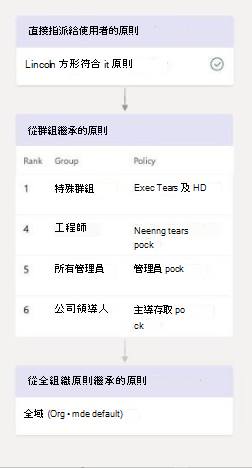
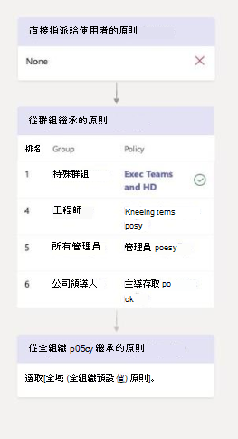
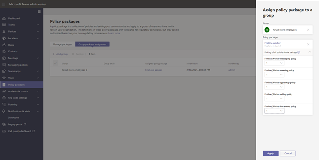

# <a name="assign-policies-to-your-users-in-microsoft-teams"></a>在 Microsoft Teams 中將原則指派給使用者

做為系統管理員，您可以使用策略來控制組織中使用者可用的 Teams 功能。 例如，有通話策略、會議策略和傳訊策略，僅舉幾例。

組織有不同類型的使用者，具有獨特的需求。 您建立及指派的自訂策略，讓您根據這些需求，為不同的使用者量身訂做策略設定。

為了輕鬆地管理貴組織內的政策，Teams 提供數種指派策略給使用者的方法。 直接指派一個策略給使用者，無論是個別指派，或是透過批次工作分派來縮放，或是指派給使用者是成員的群組。 您也可以使用策略套件，為組織中具有類似角色的使用者指派一組預先設定的策略。 您選擇的選項取決於您管理的策略數量，以及您指派策略的使用者數目。 全域 (全組織的預設) 原則會適用于貴組織中人數最多的使用者。 您只需要將策略指派給需要特殊策略的使用者。

本文將說明您可以指派策略給使用者的不同方式，以及使用方法的建議案例。

## <a name="which-policy-takes-precedence"></a>哪一個策略優先？

使用者針對每個策略類型有一個有效原則。 使用者有可能或甚至有可能被直接指派一個策略，而且也是指派相同類型之策略的一或多個群組的成員。 在這類情況下，哪一個策略會優先？ 使用者的有效原則是根據優先順序規則所決定，如下所示。

如果使用者是個別或透過批次指派 (指派給使用者，該) 優先。 在下列視覺化範例中，使用者的有效政策是直接指派給使用者的林肯平方會議政策。



如果使用者未直接指派指定類型的策略，則指派給該使用者為成員之群組的策略會優先。 如果使用者是多個群組的成員，則指定策略類型中群組分派排名最高的策略[](#group-assignment-ranking)會優先。

在此視覺化範例中，使用者的有效原則是 Exec Teams 和 HD 策略，相對於使用者是成員並同時被指派相同策略類型之策略的其他群組，其工作分派排名最高。  



如果使用者未直接指派策略，或不是任何指派策略之群組的成員，該使用者會取得該策略類型的全域 (組織) 預設) 策略。 以下是一個視覺化範例。


若要深入瞭解，請參閱優先順序 [規則](#precedence-rules)。

## <a name="ways-to-assign-policies"></a>指派策略的方法

以下概述您可以指派策略給使用者的方式，以及每個使用者的建議案例。 選取連結以深入瞭解。

在將原則指派給個別使用者或群組之前，首先請設定全域 (組織) 預設 [) 原則](#set-the-global-policies) ，讓原則適用于貴組織中人數最多的使用者。  設定全域原則之後，您只需要將策略指派給需要特殊策略的使用者。

|執行此  |如果。。。  | 使用。。。
|---------|---------|----|
|[指派策略給個別使用者](#assign-a-policy-to-individual-users)    | 您剛開始使用 Teams，而且剛開始使用，或者您只需要將一或幾個策略指派給少數使用者。 |Teams PowerShell 模組中的 Microsoft Teams 系統管理中心或 PowerShell Cmdlet
|[將策略指派給群組](#assign-a-policy-to-a-group) |根據使用者的群組成員資格指派策略。 例如，將策略指派給安全性群組或通訊群組清單中的所有使用者。| Teams PowerShell 模組中的 Microsoft Teams 系統管理中心或 PowerShell Cmdlet|
|[指派一個策略給一批使用者](#assign-a-policy-to-a-batch-of-users)   | 指派策略給大量使用者。 例如，一次指派一個策略給貴組織中數百或數千個使用者。 |Teams PowerShell 模組中的 Microsoft Teams 系統管理中心或 PowerShell Cmdlet|
| [指派策略套件給使用者](#assign-a-policy-package-to-users)  |為貴組織中具有相同或類似角色的特定使用者組指派多個策略。 例如，將教育 (教師) 方案套件指派給學校的教師，讓他們能完全存取聊天、通話和會議。 將教育 (中學生) 方案套件指派給中學生，以限制某些功能，例如私人通話。  |Teams PowerShell 模組中的 Microsoft Teams 系統管理中心或 PowerShell Cmdlet|
| [在私人預覽中將](#assign-a-policy-package-to-a-group) (套件指派給群組)    |將多個策略指派給貴組織中具有相同或類似角色的一組使用者。 例如，將策略套件指派給安全性群組或通訊群組清單中的所有使用者。 |Microsoft Teams 系統管理中心 (Teams PowerShell 模組) PowerShell Cmdlet 即將推出|
| [將策略套件指派給一批使用者](#assign-a-policy-package-to-a-batch-of-users)|將多個策略指派給貴組織中具有相同或類似角色的一批使用者。 例如，使用批次作業將 (教師) 教師策略套件指派給學校的所有教師，讓他們能完全存取聊天、通話和會議。 將教育 (中學生) 方案套件指派給一批中學生，以限制某些功能，例如私人通話。|Teams PowerShell 模組中的 PowerShell Cmdlet|

## <a name="set-the-global-policies"></a>設定全域原則

請遵循下列步驟來設定每個 (全組織的預設) 策略。

### <a name="using-the-microsoft-teams-admin-center"></a>使用 Microsoft Teams 系統管理中心

1. 在 Microsoft Teams 系統管理中心的左側流覽中，前往您想要更新之策略類型的政策頁面。 例如 **，Teams**  >  **Teams 政策**、**會議**  >  **政策**、**訊息策略** 或 **語音**  >  **通話政策**。
2. 選取全域 **(全組織的預設)** 來查看目前的設定。
3. 請根據需要更新原則， **然後選取** Apply 。

### <a name="using-powershell"></a>使用 PowerShell

若要使用 PowerShell 設定全域原則，請使用全域識別碼。  首先，請審查目前的全域原則，決定要變更的設定。

```powershell
Get-CsTeamsMessagingPolicy -Identity Global
 
Identity                      : Global
Description                   :
AllowUrlPreviews              : True
AllowOwnerDeleteMessage       : False
AllowUserEditMessage          : True
AllowUserDeleteMessage        : True
AllowUserChat                 : True
AllowRemoveUser               : True
AllowGiphy                    : True
GiphyRatingType               : Moderate
AllowMemes                    : True
AllowImmersiveReader          : True
AllowStickers                 : True
AllowUserTranslation          : False
ReadReceiptsEnabledType       : UserPreference
AllowPriorityMessages         : True
ChannelsInChatListEnabledType : DisabledUserOverride
AudioMessageEnabledType       : ChatsAndChannels
Expand (20 lines) Collapse 
```

接下來，請根據需要更新全域原則。  您只需要為要變更的設定指定值。

```powershell
Set-CsTeamsMessagingPolicy -Identity Global -AllowUserEditMessage $false
```

## <a name="assign-a-policy-to-individual-users"></a>指派策略給個別使用者

請遵循下列步驟，一次指派一個策略給個別使用者或少數使用者。

### <a name="use-the-microsoft-teams-admin-center"></a>使用 Microsoft Teams 系統管理中心

若要將策略指派給使用者：

1. 在 Microsoft Teams 系統管理中心的左側流覽中，前往 **使用者，然後** 選取使用者。
2. 按一下使用者名稱左側以選取使用者，然後選取編輯 **設定**。
3. 選取您想要指派原則，然後選取 **Apply**。

或者，您也可以執行下列操作：

1. 在 Microsoft Teams 系統管理中心的左側流覽中，前往政策頁面。
2. 按一下策略名稱左側，選取您想要指派的政策。
3. 選取 [管理使用者]。
4. 在 **[管理使用者]** 窗格中，依顯示名稱或使用者名稱搜尋使用者，選取名稱，然後選取 **[新增]**。 針對要新增的每一個使用者重複此步驟。
5. 新增使用者完成後，請選取 **Apply**。

### <a name="use-powershell"></a>使用 PowerShell

每個策略類型都有一組自己的 Cmdlet 來管理它。 使用 ```Grant-``` 指定策略類型的 Cmdlet 來指派策略。 例如，使用 ```Grant-CsTeamsMeetingPolicy``` Cmdlet 將 Teams 會議策略指派給使用者。 這些 Cmdlet 包含在 Teams PowerShell 模組中，並記錄在 [商務用 Skype Cmdlet 參照中](/powershell/skype/intro?view=skype-ps)。

 如果您尚未安裝，請 (Teams [PowerShell](https://www.powershellgallery.com/packages/MicrosoftTeams/) 公開發行) ，然後執行下列操作以連接。

> [!NOTE]
> 商務用 Skype Online Connector 目前是 Teams PowerShell 最新模組的一部分。
>
> 如果您使用的是最新的 [Teams PowerShell](https://www.powershellgallery.com/packages/MicrosoftTeams/)公開發行，則不需要安裝商務用 Skype Online 連接器。

```powershell
  # When using Teams PowerShell Module

   Import-Module MicrosoftTeams
   $credential = Get-Credential
   Connect-MicrosoftTeams -Credential $credential
```

在此範例中，我們將名為學生會議策略的 Teams 會議策略指派給名為 Reda 的使用者。

```powershell
Grant-CsTeamsMeetingPolicy -Identity reda@contoso.com -PolicyName "Student Meeting Policy"
```

若要深入瞭解，請參閱透過 [PowerShell 管理原則](teams-powershell-managing-teams.md#manage-policies-via-powershell)。

## <a name="assign-a-policy-to-a-group"></a>將策略指派給群組

將策略指派給群組可讓您將策略指派給一組使用者，例如安全性群組或通訊群組清單。 原則指派將根據優先順序規則傳播到群組成員。 在群組中新增或移除成員時，系統會相應地更新其繼承的原則指派。

建議最多 50，000 個使用者群組使用群組原則指派給群組，但也適用于較大的群組。

當您指派策略時，系統會立即將其指派給群組。 不過，將策略指派傳播給群組成員會以背景作業方式執行，視群組大小不同，可能需要一些時間。 當未從群組中未指定策略，或成員新加入群組或從群組中移除時，也是如此。

群群組原則指派只會傳播給群組的直接成員使用者。 指派不會傳播到巢中群組的成員。

### <a name="what-you-need-to-know-about-policy-assignment-to-groups"></a>關於將策略指派給群組時，您需要知道什麼

在您開始使用之前，瞭解優先順序規則和群組作業排名非常重要。

#### <a name="precedence-rules"></a>優先順序規則

對於給定的策略類型，使用者的有效政策會依據下列條件決定：

- 直接指派給使用者的政策優先于指派給群組之相同類型之任何其他政策。 換句話說，如果使用者直接獲派指定類型的策略，該使用者不會從群組繼承相同類型的策略。 這也表示如果使用者有直接指派給該使用者的指定類型之策略，您必須從使用者移除該策略，才能從群組繼承相同類型的策略。
- 如果使用者沒有直接指派策略給他們，而且是兩個或多個群組的成員，且每個群組都有指派給該群組的相同類型之策略，則使用者會繼承排名最高的群組指派策略。
- 如果使用者不是指派原則之任何群組的成員，則該原則類型的全域 (組織) 預設) 原則會適用于該使用者。

使用者的有效原則會依照以下規則更新：

- 將使用者新加入或移除已指派策略的群組時。
- 系統未從群組中未指定一個策略。
- 系統會移除直接指派給使用者的政策。

#### <a name="group-assignment-ranking"></a>群組作業排名

當您將策略指派給群組時，您可以為群組作業指定排名。 這是用來判斷如果使用者是兩個或多個群組的成員，且每個群組被指派了相同類型的策略，使用者應該繼承哪一個策略為其有效原則。

群組作業排名是相對於相同類型的其他群組作業。 例如，如果您要將通話策略指派給兩個群組，請設定一個作業的排名為 1，另一個則設為 2，其中 1 為最高排名。 群組作業排名會指出哪些群組成員資格比繼承相關的其他群組成員資格重要或更相關。

例如，假設您擁有兩個群組，即 Store Employees 和 Store 管理員。 這兩個群組分別會指派 Teams 通話策略、Store Employees 通話策略和市售管理員通話政策。 對於同時在兩個群組中的商店管理員，其主管角色比其員工角色更相關，因此指派給 Store Manager 群組的通話政策應具有較高的排名。

|組 |Teams 通話策略名稱  |排名|
|---------|---------|---|
|市管理   |市商店管理員通話政策         |1|
|儲存員工    |儲存員工通話政策      |2|

如果您沒有指定排名，則策略作業會獲得最低的排名。

### <a name="in-the-teams-admin-center"></a>在 Teams 系統管理中心

> [!NOTE]
> 目前，使用 Microsoft Teams 系統管理中心指派給群組的政策僅適用于 Teams 通話政策、Teams 通話停駐政策、Teams 政策、Teams 即時活動政策、Teams 會議策略和 Teams 傳訊政策。 針對其他策略類型，請使用 PowerShell。

1. 在 Microsoft Teams 系統管理中心的左側流覽中，前往策略類型頁面。 例如，請前往 **會議**  >  **會議政策**。
2. 選取組 **策略工作分派** 選項卡。
3. 選取 **新增群組**，然後在指派策略 **至群組** 窗格中，執行下列操作：
    1. 搜尋並新增要指派該策略的群組。
    2. 設定群組作業的排名。
    3. 選取您想要指派的政策。
    4. 選取 **Apply**。

若要移除群組原則作業，請在策略頁面的群組原則工作分派選項卡上，選取群組作業，然後選取 **移除**。

若要變更群組作業的排名，您首先必須移除群組原則作業。 接著，請遵循上述步驟，將策略指派給群組。

### <a name="use-the-powershell-option"></a>使用 PowerShell 選項

> [!NOTE]
> 目前，所有 Teams 策略類型都不適用於使用 PowerShell 的群群組原則指派。 請參閱 [New-CsGroupPolicyAssignment](/powershell/module/teams/new-csgrouppolicyassignment) 以尋找支援的策略類型清單。

#### <a name="install-and-connect-to-the-microsoft-teams-powershell-module"></a>安裝並連接到 Microsoft Teams PowerShell 模組

有關逐步指南，請參閱安裝 Teams [PowerShell](teams-powershell-install.md)。

#### <a name="assign-a-policy-to-a-group-of-users"></a>將策略指派給一組使用者

使用 [New-CsGroupPolicyAssignment](/powershell/module/teams/new-csgrouppolicyassignment) Cmdlet 將策略指派給群組。 您可以使用物件識別碼、SIP 位址或電子郵件地址來指定群組。

在此範例中，我們將名為零售管理員會議策略的 Teams 會議策略指派給作業排名為 1 的群組。

```powershell
New-CsGroupPolicyAssignment -GroupId d8ebfa45-0f28-4d2d-9bcc-b158a49e2d17 -PolicyType TeamsMeetingPolicy -PolicyName "Retail Managers Meeting Policy" -Rank 1
```

#### <a name="get-policy-assignments-for-a-group"></a>取得群組的策略指派

使用 [Get-CsGroupPolicyAssignment Cmdlet](/powershell/module/teams/get-csgrouppolicyassignment) 取得指派給群組的所有策略。 請注意，即使已使用群組的 SIP 位址或電子郵件地址來指派策略，群組一直會以群組識別碼列出。

在此範例中，我們會取回指派給特定群組的所有策略。

```powershell
Get-CsGroupPolicyAssignment -GroupId e050ce51-54bc-45b7-b3e6-c00343d31274
```

在此範例中，我們會退回所有指派 Teams 會議策略的群組。

```powershell
Get-CsGroupPolicyAssignment -PolicyType TeamsMeetingPolicy
```

#### <a name="remove-a-policy-from-a-group"></a>從群組移除策略

使用 [Remove-CsGroupPolicyAssignment Cmdlet](/powershell/module/teams/remove-csgrouppolicyassignment) 從群組移除策略。 當您從群組移除策略時，會更新指派給該群組且排名較低的相同類型其他策略的優先順序。 例如，如果您移除排名為 2 的策略，則排名為 3 和 4 的策略會更新以反映其新排名。 下列兩個表格顯示此範例。

以下是 Teams 會議政策的政策指派和優先順序清單。

|群組名稱  |策略名稱  |排名|
|---------|---------|---------|
|銷售    |銷售政策       | 1        |
|西部地區     |西部地區政策         |2         |
|劃分    |部門政策         |3         |
|附屬   |子公司政策        |4         |

如果我們從西部區域群組移除西部區域政策，則策略指派和優先順序會更新如下。

|群組名稱  |策略名稱  |排名|
|---------|---------|---------|
|銷售    |銷售政策       | 1        |
|劃分    |部門政策         |2         |
|附屬   |子公司政策        |3        |

在此範例中，我們會從群組移除 Teams 會議策略。

```powershell
Remove-CsGroupPolicyAssignment -PolicyType TeamsMeetingPolicy -GroupId f985e013-0826-40bb-8c94-e5f367076044
```

#### <a name="change-a-policy-assignment-for-a-group"></a>變更群組的策略指派

> [!NOTE]
> [Set-CsGroupPolicyAssignment Cmdlet](/powershell/module/teams/set-csgrouppolicyassignment)即將推出。 同時，若要變更群組原則指派，您可以移除群組中的目前策略指派，然後新增新的策略指派。

將策略指派給群組之後，您可以使用 [Set-CsGroupPolicyAssignment](/powershell/module/teams/set-csgrouppolicyassignment) Cmdlet 變更該群組的策略指派，如下所示：

- 變更排名
- 變更給定策略類型的策略
- 變更給定策略類型的策略和排名

在此範例中，我們將群組的 Teams 通話停駐策略變更為名為 SupportCallPark 且作業排名為 3 的策略。

```powershell
Set-CsGroupPolicyAssignment -GroupId 566b8d39-5c5c-4aaa-bc07-4f36278a1b38 -PolicyType TeamsMeetingPolicy -PolicyName SupportCallPark -Rank 3
```

#### <a name="change-the-effective-policy-for-a-user"></a>變更使用者的有效原則

以下是如何變更直接指派策略之使用者之有效原則的範例。

首先，我們使用 [Get-CsUserPolicyAssignment Cmdlet](/powershell/module/teams/get-csuserpolicyassignment) 與參數一起取得與使用者相關聯的 Teams 會議廣播政策 ```PolicySource``` 詳細資料。

```powershell
Get-CsUserPolicyAssignment -Identity daniel@contoso.com -PolicyType TeamsMeetingBroadcastPolicy | select -ExpandProperty PolicySource
```

輸出顯示使用者已直接獲派名為員工事件的 Teams 會議廣播政策，其優先順序會高於指派給使用者所屬群組的廠商即時事件。

```console
AssignmentType PolicyName         Reference
-------------- ----------         ---------
Direct         Employee Events
Group          Vendor Live Events 566b8d39-5c5c-4aaa-bc07-4f36278a1b38
```

現在，我們會從使用者移除員工事件政策。 這表示使用者不再有直接指派給他們的 Teams 會議廣播政策，而且會繼承指派給使用者所屬群組的廠商 Live Events 政策。

在商務用 Skype PowerShell 模組中使用下列 Cmdlet 執行此操作。

```powershell
Grant-CsTeamsMeetingBroadcastPolicy -Identity daniel@contoso.com -PolicyName $null
```

在 Teams PowerShell 模組中，使用遵循 Cmdlet，以縮放執行此作業，但批次$users指派 ，其中 $users是您指定的使用者清單。

```powershell
New-CsBatchPolicyAssignmentOperation -OperationName "Assigning null at bulk" -PolicyType TeamsMeetingBroadcastPolicy -PolicyName $null -Identity $users  
```

## <a name="assign-a-policy-to-a-batch-of-users"></a>指派一個策略給一批使用者

### <a name="use-the-admin-center"></a>使用系統管理中心

若要大量指派策略給使用者：

1. 在 Microsoft Teams 系統管理中心的左側流覽中，選取 **使用者**。
2. 搜尋您想要將策略指派給使用者的使用者，或篩選該視圖以顯示您想要的使用者。
3. 在 [&#x2713;] (核取方塊) 欄中，選取使用者。 若要選取 [所有使用者]，請按一下表格頂端的 [&#x2713;] (核取方塊)。
4. 選取 **編輯設定**，進行您想要的變更， **然後選取** Apply 。

若要查看原則作業的狀態，請在選取應用程式以提交原則作業後，于使用者頁面頂端出現的橫幅中，選取活動 **記錄**。 或者，在 Microsoft Teams 系統管理中心的左側流覽中，前往儀表板，然後在活動 **記錄下，** 選取查看 **詳細資料**。 活動記錄會顯示過去 30 天內透過 Microsoft Teams 系統管理中心分批指派給超過 20 個使用者的策略指派。 若要深入瞭解，請參閱 [在活動記錄中查看您的策略指派](activity-log.md)。

### <a name="use-powershell-method"></a>使用 PowerShell 方法

> [!NOTE]
> 目前，並非所有 Teams 策略類型都提供使用 PowerShell 的批次策略指派。 請參閱 [New-CsBatchPolicyAssignmentOperation，](/powershell/module/teams/new-csbatchpolicyassignmentoperation) 瞭解支援原則類型的清單。

使用批次策略指派，您可以一次指派一個策略給大型使用者組，而不需要使用腳本。 您可以使用 [New-CsBatchPolicyAssignmentOperation Cmdlet](/powershell/module/teams/new-csbatchpolicyassignmentoperation) 提交一批使用者和您想要指派原則。 系統會將工作處理為背景作業，並為每個批次產生作業識別碼。 接著，您可以使用 [Get-CsBatchPolicyAssignmentOperation Cmdlet](/powershell/module/teams/get-csbatchpolicyassignmentoperation) 來追蹤批次中作業的進度和狀態。

根據使用者的物件識別碼或會話初始通訊協定 (SIP) 位址。 使用者的 SIP 位址通常與 UPN 或電子郵件地址的使用者主體名稱 (相同) ，但這不是必要的。 如果使用者是使用 UPN 或電子郵件指定，但其值與 SIP 位址不同，則使用者的策略指派將會失敗。 如果批次包含重複的使用者，則重複專案將在處理前從批次中移除，而狀態只會提供給批次中的唯一使用者。

批次最多可包含 5000 個使用者。 為了獲得最佳結果，一次不要提交多個批次。 在提交更多批次之前，允許批次完成處理。

#### <a name="install-and-connect-to-the-teams-powershell-module"></a>安裝並連接到 Teams PowerShell 模組

執行下列操作以安裝 [Microsoft Teams PowerShell 模組](https://www.powershellgallery.com/packages/MicrosoftTeams)。 請確定您安裝版本 1.0.5 或更新版本。

```powershell
Install-Module -Name MicrosoftTeams
```

執行下列操作以連接到 Teams 並開始會話。

```powershell
Connect-MicrosoftTeams
```

系統提示您時，請使用系統管理員認證來登錄。

#### <a name="install-and-connect-to-the-azure-ad-powershell-for-graph-module-optional"></a>安裝並連接到 Azure AD PowerShell for Graph 模組， (選) 

如果您尚未下載並安裝 [Azure AD PowerShell for Graph](/powershell/azure/active-directory/install-adv2) 模組 (如果您尚未) 並連接到 Azure AD，以便您可以取回貴組織的使用者清單。

執行下列操作以連接到 Azure AD。

```powershell
Connect-AzureAD
```

系統提示您時，請使用您用來連接到 Teams 的相同系統管理員認證來登錄。

#### <a name="assign-a-setup-policy-to-a-batch-of-users"></a>指派設定策略給一批使用者

在此範例中，我們使用 [New-CsBatchPolicyAssignmentOperation Cmdlet](/powershell/module/teams/new-csbatchpolicyassignmentoperation) 將名為 HR App 設定原則的應用程式設定原則指派給 Users_ids.文字檔中列出的一批使用者。

```powershell
$user_ids = Get-Content .\users_ids.txt
New-CsBatchPolicyAssignmentOperation -PolicyType TeamsAppSetupPolicy -PolicyName "HR App Setup Policy" -Identity $users_ids -OperationName "Example 1 batch"
```

在此範例中，我們會連接到 Azure AD 以取回使用者集合，然後將名為新進員工傳訊政策的訊息原則指派給一批使用 SIP 位址指定的使用者。

```powershell
Connect-AzureAD
$users = Get-AzureADUser
New-CsBatchPolicyAssignmentOperation -PolicyType TeamsMessagingPolicy -PolicyName "New Hire Messaging Policy" -Identity $users.SipProxyAddress -OperationName "Example 2 batch"
```

#### <a name="get-the-status-of-a-batch-assignment"></a>取得批次作業的狀態

執行下列操作以取得批次工作分派的狀態，其中 OperationId 是 Cmdlet 針對指定批次所返回 ```New-CsBatchPolicyAssignmentOperation``` 的操作識別碼。

```powershell
$Get-CsBatchPolicyAssignmentOperation -OperationId f985e013-0826-40bb-8c94-e5f367076044 | fl
```

如果輸出顯示發生錯誤，請執行下列操作，以取得有關錯誤的詳細資訊 ，而錯誤則出現在 ```UserState``` 屬性中。

```powershell
Get-CsBatchPolicyAssignmentOperation -OperationId f985e013-0826-40bb-8c94-e5f367076044 | Select -ExpandProperty UserState
```

若要深入瞭解，請參閱 [Get-CsBatchPolicyAssignmentOperation](/powershell/module/teams/get-csbatchpolicyassignmentoperation)。

## <a name="assign-a-policy-package-to-users"></a>指派策略套件給使用者

Teams 中的策略套件是預先定義的策略和設定集合，您可以指派給組織中相同或類似角色的使用者。 每個策略套件都是針對使用者角色所設計，並包含預先定義的策略和策略設定，可支援該角色的典型活動。 一些政策套件範例包括教育 (教師) 方案，以及醫療保健 (診所) 套件。 若要深入瞭解，請參閱 [在 Teams 中管理原則套件](manage-policy-packages.md)。

### <a name="assign-a-policy-package-to-one-user"></a>將策略套件指派給一個使用者

1. 在 Microsoft Teams 系統管理中心的左側流覽中，前往 **使用者，然後** 選取使用者。
2. 在使用者的頁面上，**選取策略**，然後在策略套件 **旁邊，選取****編輯**。
3. 在指派 **策略套件窗格中** ，選取您想要指派的套件， **然後選取** 儲存 。

### <a name="assign-a-policy-package-to-multiple-users"></a>指派策略套件給多個使用者

1. 在 Microsoft Teams 系統管理中心的左側流覽中，前往策略套件，然後按一下套件名稱左側，選取您想要指派的政策套件。
2. 選取 [管理使用者]。
3. 在 **[管理使用者]** 窗格中，依顯示名稱或使用者名稱搜尋使用者，選取名稱，然後選取 **[新增]**。 針對要新增的每一個使用者重複此步驟。
4. 新增使用者完成後，請選取 **儲存**。

## <a name="assign-a-policy-package-to-a-group"></a>將原則套件指派給群組

透過向群組指派原則套件，可以將多個原則指派給一組使用者，例如安全性群組或通訊群組。 原則指派將根據優先順序規則傳播到群組成員。 在群組中新增或移除成員時，系統會相應地更新其繼承的原則指派。

建議最多 50，000 個使用者群組將策略套件指派給群組，但也會與較大的群組一起使用。

當您指派策略套件時，系統會立即將其指派給群組。 不過，將策略指派傳播給群組成員會以背景作業方式執行，視群組大小不同，可能需要一些時間。 當未從群組中未指定策略，或成員新加入群組或從群組中移除時，也是如此。

> [!IMPORTANT]
> 在您開始使用之前，瞭解優先順序規則和群組[作業](#group-assignment-ranking)排名非常重要[](#precedence-rules)。 請確定您閱讀並瞭解本文稍早中[](#what-you-need-to-know-about-policy-assignment-to-groups)關於將策略指派給群組時必須瞭解的概念。

### <a name="assign-a-policy-package-to-a-group-of-users-in-the-admin-center"></a>將策略套件指派給系統管理中心的一組使用者

1. 登入 Teams 系統管理中心。
2. 在左側流覽中，前往策略套件頁面。
3. 選取群組原則工作分派選項卡。
4. 選取 **新增群組**，然後在指派策略套件至群組窗格中，執行下列操作：

    a. 搜尋並新增要指派策略套件的群組。

    b. 選取一個策略套件。

    C。 設定每個策略類型的排名。

    D。 選取 **Apply**。

    

5. 若要管理特定策略類型的排名，請流覽至特定策略頁面。
6. 若要將策略套件重新指派給群組，請先移除群組原則指派。 接著，請遵循上述步驟，將策略套件指派給群組。

### <a name="work-with-powershell"></a>使用 PowerShell

#### <a name="get-the-teams-powershell-module"></a>取得 Teams PowerShell 模組

有關逐步指南，請參閱安裝 Teams [PowerShell](teams-powershell-install.md)。

#### <a name="assign-a-policy-package-to-a-group-of-users"></a>將策略套件指派給一組使用者

使用 [Grant-CsGroupPolicyPackageAssignment Cmdlet](/powershell/module/teams/grant-csgrouppolicypackageassignment) 將策略套件指派給群組。 您可以使用物件識別碼、SIP 位址或電子郵件地址來指定群組。 當您指派策略套件時 [，請為](#group-assignment-ranking) 策略套件中每一個策略類型指定群組分派排名。

在此範例中，我們將 Education_Teacher 策略套件指派給一個群組，其 TeamsAppSetupPolicy 和 TeamsMeetingBroadcastPolicy 的作業排名為 1，而 TeamsMeetingPolicy 的排名為 2。

```powershell
Grant-CsGroupPolicyPackageAssignment -GroupId "dae90bb4-120f-4a3e-a15d-30f142e79f69" -PackageName "Education_Teacher" -PolicyRankings "TeamsAppSetupPolicy, 1", "TeamsMeetingBroadcastPolicy, 1", "TeamsMeetingPolicy, 2"
```

## <a name="assign-a-policy-package-to-a-batch-of-users"></a>將策略套件指派給一批使用者

使用批次策略套件指派，您可以一次指派一群組原則套件給大型使用者，而不需要使用腳本。 您可以使用 [New-CsBatchPolicyAssignmentOperation Cmdlet](/powershell/module/teams/new-csbatchpolicyassignmentoperation) 提交一批使用者和您想要指派的政策套件。 系統會將工作處理為背景作業，並為每個批次產生作業識別碼。 接著，您可以使用 [Get-CsBatchPolicyAssignmentOperation Cmdlet](/powershell/module/teams/get-csbatchpolicyassignmentoperation) 來追蹤批次中作業的進度和狀態。

根據使用者的物件識別碼或會話初始通訊協定 (SIP) 位址。 使用者的 SIP 位址通常與 UPN 或電子郵件地址的使用者主體名稱 (相同) ，但這不是必要的。 如果使用者是使用 UPN 或電子郵件指定，但其值與 SIP 位址不同，則使用者的策略指派將會失敗。 如果批次包含重複的使用者，則重複專案將在處理前從批次中移除，而狀態只會提供給批次中的唯一使用者。

批次最多包含 5，000 個使用者。 為了獲得最佳結果，一次不要提交多個批次。 在提交更多批次之前，允許批次完成處理。

### <a name="use-the-teams-powershell-module"></a>使用 Teams PowerShell 模組

如果您尚未安裝 Microsoft [Teams PowerShell](https://www.powershellgallery.com/packages/MicrosoftTeams) 模組 (請執行下列) 。 請確定您安裝版本 1.0.5 或更新版本。

```powershell
Install-Module -Name MicrosoftTeams
```

執行下列操作以連接到 Teams 並開始會話。

```powershell
Connect-MicrosoftTeams
```

系統提示您時，請使用系統管理員認證來登錄。

### <a name="assign-policy-packages-to-a-batch-of-users"></a>指派策略套件給一批使用者

在此範例中，我們使用 [New-CsBatchPolicyAssignmentOperation Cmdlet](/powershell/module/teams/new-csbatchpolicyassignmentoperation) 將 Education_PrimaryStudent原則套件指派給一批使用者。

```powershell
New-CsBatchPolicyPackageAssignmentOperation -Identity 1bc0b35f-095a-4a37-a24c-c4b6049816ab,user1@econtoso.com,user2@contoso.com -PackageName Education_PrimaryStudent
```

### <a name="see-the-status-of-a-batch-assignment"></a>查看批次作業的狀態

執行下列操作以取得批次工作分派的狀態，其中 OperationId 是 Cmdlet 針對指定批次所返回 ```New-CsBatchPolicyAssignmentOperation``` 的操作識別碼。

```powershell
Get-CsBatchPolicyAssignmentOperation -OperationId f985e013-0826-40bb-8c94-e5f367076044 | fl
```

如果輸出顯示發生錯誤，請執行下列操作，以取得有關錯誤的詳細資訊 ，而錯誤則出現在 ```UserState``` 屬性中。

```powershell
Get-CsBatchPolicyAssignmentOperation -OperationId f985e013-0826-40bb-8c94-e5f367076044 | Select -ExpandProperty UserState
```

若要深入瞭解，請參閱 [Get-CsBatchPolicyAssignmentOperation](/powershell/module/teams/get-csbatchpolicyassignmentoperation)。

## <a name="related-topics"></a>相關主題

[Teams PowerShell 概觀](teams-powershell-overview.md)
