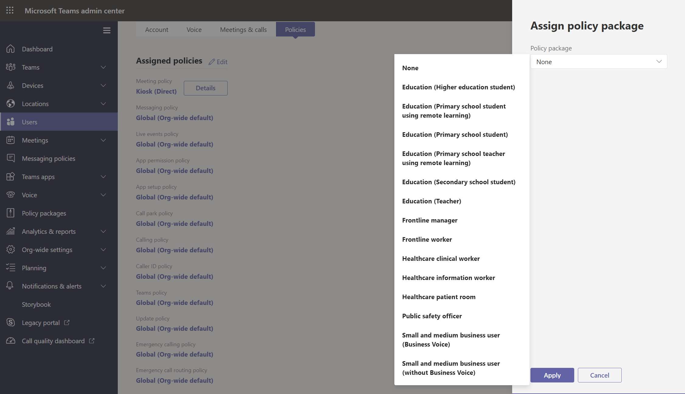

# <a name="assign-policy-packages-to-users-and-groups"></a>指派策略套件給使用者和群組

本文將審查將策略套件指派給使用者和群組的不同Microsoft Teams。 閱讀前，請確定您閱讀過在 Teams[中指派策略 - 開始使用](policy-assignment-overview.md)。

> [!NOTE]
> 每位使用者都需要 [進階通訊] 附加元件，才能接收自訂原則套件指派。 如需詳細資訊，請參閱 [Microsoft Teams 的進階通訊附加元件](/microsoftteams/teams-add-on-licensing/advanced-communications) (部分機器翻譯)。

## <a name="assign-a-policy-package-to-users"></a>指派策略套件給使用者

Teams中的策略套件是預先定義的策略和設定集合，您可以指派給組織中具有相同或類似角色的使用者。 每個策略套件都是針對使用者角色設計，並包含預先定義的策略和策略設定，可支援該角色的一般活動。 一些政策套件範例包括教育 (教師) 方案，以及醫療保健 (診所) 套件。 若要深入瞭解，請參閱在 Teams[中管理Teams。](manage-policy-packages.md)

### <a name="assign-a-policy-package-to-one-user"></a>將策略套件指派給一個使用者

1. 在系統管理中心的左側導Microsoft Teams，請前往 **使用者，然後** 選取使用者。
2. 在使用者的頁面上，**選取策略**，然後在策略套件 **旁邊，選取****編輯**。
3. 在指派 **策略套件窗格中** ，選取您想要指派的套件， **然後選取** 儲存 。



### <a name="assign-a-policy-package-to-multiple-users"></a>指派策略套件給多個使用者

1. 在系統管理中心的左側導Microsoft Teams，前往策略套件，然後按一下套件名稱左側，選取您想要指派的政策套件。
2. 選取 [管理使用者]。
3. 在 **[管理使用者]** 窗格中，依顯示名稱或使用者名稱搜尋使用者，選取名稱，然後選取 **[新增]**。 針對要新增的每一個使用者重複此步驟。
4. 新增使用者完成後，請選取 **儲存**。


## <a name="assign-a-policy-package-to-a-group"></a>將原則套件指派給群組

透過向群組指派原則套件，可以將多個原則指派給一組使用者，例如安全性群組或通訊群組。 原則指派將根據優先順序規則傳播到群組成員。 在群組中新增或移除成員時，系統會相應地更新其繼承的原則指派。

建議最多 50，000 個使用者群組將策略套件指派給群組，但也會用於較大的群組。

當您指派策略套件時，系統會立即將其指派給群組。 不過，將策略指派傳播給群組成員是做為背景作業，可能需要一些時間，視群組大小而不同。 當未從群組中未指定策略，或成員新加入群組或從群組中移除時，也是如此。

> [!IMPORTANT]
> 在您開始使用之前，瞭解群組工作分派 (優先順序)  ([優先順序) 。](assign-policies-users-and-groups.md#group-assignment-ranking) [](assign-policies-users-and-groups.md#precedence-rules) 請確認您閱讀並瞭解本文 (本文中關於指派給群組[](assign-policies-users-and-groups.md#what-you-need-to-know-about-policy-assignment-to-groups)之) 中必須瞭解的概念。

### <a name="assign-a-policy-package-to-a-group-of-users-in-the-admin-center"></a>將策略套件指派給系統管理中心的一組使用者

1. 登入 Teams 系統管理中心。
2. 在左側流覽中，前往策略套件頁面。
3. 選取群組原則工作分派選項卡。
4. 選取 **新增群組**，然後在指派策略套件至群組窗格中，執行下列操作：

    a. 搜尋並新增要指派策略套件的群組。

    b. 選取一個策略套件。

    C。 設定每個策略類型的排名。

    D。 選取 **Apply**。


5. 若要管理特定策略類型的排名，請流覽至特定策略頁面。
6. 若要將策略套件重新指派給群組，請先移除群組原則指派。 接著，請遵循上述步驟，將策略套件指派給群組。

### <a name="work-with-powershell"></a>使用 PowerShell

#### <a name="get-the-teams-powershell-module"></a>取得 PowerShell Teams模組

有關逐步指南，請參閱在[PowerShell Teams安裝](teams-powershell-install.md)。

#### <a name="assign-a-policy-package-to-a-group-of-users"></a>將策略套件指派給一組使用者

使用 [Grant-CsGroupPolicyPackageAssignment Cmdlet](/powershell/module/teams/grant-csgrouppolicypackageassignment) 將策略套件指派給群組。 您可以使用物件識別碼、SIP 位址或電子郵件地址來指定群組。 當您指派策略套件時，請針對 (中) 類型指定[](assign-policies-users-and-groups.md#group-assignment-ranking)群組分派排名。

在此範例中，我們將 Education_Teacher 策略套件指派給一個群組，其 TeamsAppSetupPolicy 和 TeamsMeetingBroadcastPolicy 的作業排名為 1，而 TeamsMeetingPolicy 的排名為 2。

```powershell
Grant-CsGroupPolicyPackageAssignment -GroupId "dae90bb4-120f-4a3e-a15d-30f142e79f69" -PackageName "Education_Teacher" -PolicyRankings "TeamsAppSetupPolicy, 1", "TeamsMeetingBroadcastPolicy, 1", "TeamsMeetingPolicy, 2"
```

## <a name="assign-a-policy-package-to-a-batch-of-users"></a>將策略套件指派給一批使用者

使用批次策略套件指派，您可以一次指派一群組原則套件給大型使用者，而不需要使用腳本。 您可以使用 [New-CsBatchPolicyAssignmentOperation Cmdlet](/powershell/module/teams/new-csbatchpolicyassignmentoperation) 提交一批使用者和您想要指派的政策套件。 系統會將工作處理為背景作業，並為每個批次產生作業識別碼。 接著，您可以使用 [Get-CsBatchPolicyAssignmentOperation Cmdlet](/powershell/module/teams/get-csbatchpolicyassignmentoperation) 來追蹤批次中作業的進度和狀態。

根據使用者的物件識別碼或會話初始通訊協定 (SIP) 位址。 使用者的 SIP 位址通常與 UPN 或電子郵件地址的使用者主體名稱 (相同) ，但這不是必要的。 如果使用者是使用 UPN 或電子郵件指定，但其值與 SIP 位址不同，則使用者的策略指派將會失敗。 如果批次包含重複的使用者，則重複專案將在處理前從批次中移除，而狀態只會提供給批次中的唯一使用者。

批次最多包含 5，000 個使用者。 為了獲得最佳結果，一次不要提交多個批次。 在提交更多批次之前，允許批次完成處理。

### <a name="use-the-teams-powershell-module"></a>使用 PowerShell Teams模組

執行下列操作，Microsoft Teams[安裝 PowerShell](https://www.powershellgallery.com/packages/MicrosoftTeams)模組 (如果您尚未安裝) 。 請確定您安裝版本 1.0.5 或更新版本。

```powershell
Install-Module -Name MicrosoftTeams
```

執行下列操作以連接到Teams並啟動會話。

```powershell
Connect-MicrosoftTeams
```

系統提示您時，請使用系統管理員認證來登錄。

### <a name="assign-policy-packages-to-a-batch-of-users"></a>指派策略套件給一批使用者

在此範例中，我們使用 [New-CsBatchPolicyAssignmentOperation Cmdlet](/powershell/module/teams/new-csbatchpolicyassignmentoperation) 將 Education_PrimaryStudent原則套件指派給一批使用者。

```powershell
New-CsBatchPolicyPackageAssignmentOperation -Identity 1bc0b35f-095a-4a37-a24c-c4b6049816ab,user1@econtoso.com,user2@contoso.com -PackageName Education_PrimaryStudent
```

### <a name="see-the-status-of-a-batch-assignment"></a>查看批次作業的狀態

執行下列操作以取得批次工作分派的狀態，其中 OperationId 是 Cmdlet 針對指定批次所返回 ```New-CsBatchPolicyAssignmentOperation``` 的操作識別碼。

```powershell
$Get-CsBatchPolicyAssignmentOperation -OperationId f985e013-0826-40bb-8c94-e5f367076044 | fl
```

如果輸出顯示發生錯誤，請執行下列操作，以取得有關錯誤的詳細資訊 ，而錯誤則出現在 ```UserState``` 屬性中。

```powershell
Get-CsBatchPolicyAssignmentOperation -OperationId f985e013-0826-40bb-8c94-e5f367076044 | Select -ExpandProperty UserState
```

若要深入瞭解，請參閱 [Get-CsBatchPolicyAssignmentOperation](/powershell/module/teams/get-csbatchpolicyassignmentoperation)。

## <a name="related-topics"></a>相關主題

- [使用Teams管理](manage-teams-with-policies.md)
- [在中管理Microsoft Teams](manage-policy-packages.md)
- [TeamsPowerShell 概觀](teams-powershell-overview.md)
- [在 Teams 中指派Teams - 開始使用](policy-assignment-overview.md)
