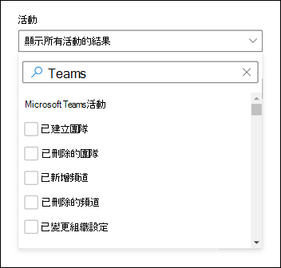
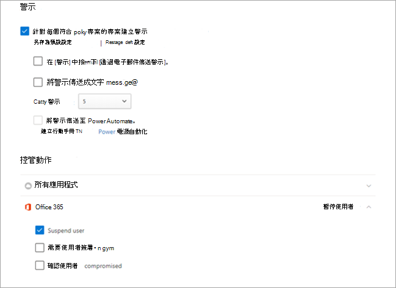

# 在 Microsoft Teams 中搜尋事件的稽核記錄

> [!IMPORTANT]
> [!INCLUDE [new-teams-sfb-admin-center-notice](includes/new-teams-sfb-admin-center-notice.md)]

稽核記錄可協助您調查 Microsoft 365 服務中的特定活動。 對於 Microsoft Teams，以下是一些已稽核的活動：

- 團隊建立
- 團隊刪除
- 已新增頻道
- 已刪除頻道
- 已變更頻道設定

如需已稽核的完整 Teams 活動清單，請參閱 [Teams 活動](#teams-activities) 和 [Teams 活動中的班次](#shifts-in-teams-activities)。

> [!NOTE]
> 來自私人頻道的稽核事件也會像記錄團隊和標準頻道一樣記錄。

## 在 Teams 中開啟稽核

您必須先開啟Microsoft Purview 合規性入口網站中的稽核，才能查看稽核資料。 如需詳細資訊，請參閱 [開啟或關閉稽核](/microsoft-365/compliance/turn-audit-log-search-on-or-off)。

> [!IMPORTANT]
> 稽核資料只能從您開啟稽核時開始使用。

## 從稽核記錄擷取 Teams 資料

1. 若要擷取 Teams 活動的稽核記錄，請移至 <https://compliance.microsoft.com> 並選取 **[稽核]**。

2. 在 [ **搜尋]** 頁面上，篩選您要稽核的活動、日期和使用者。

3. 將結果匯出至 Excel 以進行進一步分析。

如需逐步指示，請參閱 [在合規性中心中搜尋稽核記錄](/microsoft-365/compliance/search-the-audit-log-in-security-and-compliance#search-the-audit-log)。

> [!IMPORTANT]
> 只有在稽核已開啟時，稽核資料才會顯示在稽核記錄中。

稽核記錄在稽核記錄中保留和搜尋的時間長度取決於您的 Microsoft 365 或 Office 365 訂閱，特別是指派給使用者的授權類型。 若要深入瞭解，請參閱 [安全性&合規性中心服務說明](/office365/servicedescriptions/office-365-platform-service-description/office-365-securitycompliance-center)。

## 搜尋稽核記錄的秘訣

以下是在稽核記錄中搜尋 Teams 活動的秘訣。

:::image type="content" alt-text="合規性中心中稽核記錄搜尋頁面的螢幕擷取畫面" source="media/audit-log-search-page.png" lightbox="media/audit-log-search-page.png":::

- 您可以按一下一或多個活動旁的核取方塊，選取要搜尋的特定活動。 如果已選取活動，您可以按一下該活動以取消選取。 您也可以使用搜尋方塊來顯示包含您輸入關鍵字的活動。

  

- 若要顯示使用 Cmdlet 執行的活動事件，請選取 [活動 **] 清單中****所有活動的 [顯示結果**]。 如果您知道這些活動的作業名稱，請在搜尋方塊中輸入以顯示活動，然後選取該活動。

- 若要清除目前的搜尋準則，請按一下 [ **全部清除]**。 日期範圍會回到過去七天的預設值。

- 如果找到 5，000 個結果，您可能可以假設有超過 5，000 個符合搜尋準則的事件。 您可以精簡搜尋準則並重新執行搜尋以傳回較少的結果，也可以選取 [**導**  >  出 **下載所有** 結果] 來匯出所有搜尋結果。 如需匯出稽核記錄的逐步指示，請參閱 [將搜尋結果匯出至檔案](/microsoft-365/compliance/search-the-audit-log-in-security-and-compliance#step-3-export-the-search-results-to-a-file)。

請觀看 [這段](https://www.youtube.com/embed/UBxaRySAxyE) 影片以使用音訊記錄搜尋。 加入 Teams 專案經理 Ansuman Acharya，示範如何在 Teams 中執行稽核記錄搜尋。

## Teams 活動

以下是 Microsoft 365 稽核記錄中針對 Teams 中使用者和系統管理員活動所記錄的所有事件清單。 表格包含 [ **活動** ] 欄中顯示的易記名稱，以及當您匯出搜尋結果時，稽核記錄詳細資訊以及 CSV 檔案中所顯示的對應作業名稱。

|易記名稱|操作|描述|
|---|---|---|
|已將 Bot 新增至團隊|BotAddedToTeam|使用者將 Bot 新增至團隊。|
|已新增頻道|ChannelAdded|使用者將頻道新增至團隊。|
|已新增連接器|ConnectorAdded|使用者在頻道中新增連接器。|
|已新增有關 Teams 會議2 的詳細資料|MeetingDetail|Teams 新增了會議的相關資訊，包括開始時間、結束時間，以及加入會議的 URL。|
|新增會議參與者的相關資訊 2|MeetingParticipantDetail|Teams 新增了會議參與者的相關資訊，包括每位參與者的使用者識別碼、參與者加入會議的時間，以及參與者離開會議的時間。|
|已新增成員|MemberAdded|團隊擁有者會將成員新增至團隊、頻道或群組聊天。|
|已新增索引標籤|TabAdded|使用者在頻道中新增索引標籤。|
|已變更頻道設定|ChannelSettingChanged|當小組成員執行下列活動時，會記錄 ChannelSettingChanged 作業。 針對這些活動，稽核記錄搜尋結果中的 [ **專案** ] 欄中會顯示變更 (括弧的描述。 <ul><li>變更團隊頻道名稱 (**頻道名稱**) </li><li>變更團隊頻道 (**頻道描述**) </li> </ul>|
|已變更組織設定|TeamsTenantSettingChanged|當全域系統管理員在 Microsoft 365 系統管理中心 中執行下列活動時，會記錄 TeamsTenantSettingChanged 作業。 這些活動會影響整個組織的 Teams 設定。 若要深入瞭解，請參閱 [管理組織的 Teams 設定](enable-features-office-365.md)。  針對這些活動，稽核記錄搜尋結果中的 [ **專案** ] 欄中會顯示變更 () 括弧中所顯示之設定的描述。<ul><li>啟用或停用組織 Teams (**Microsoft Teams**) 。</li><li>啟用或停用 Microsoft Teams 與組織商務用 Skype之間的互通性， (**商務用 Skype互通性**) 。</li><li>啟用或停用 Microsoft Teams 用戶端中的組織結構檢 **視 (組織結構檢視**) 。</li><li>啟用或停用小組成員排程私人會議 (**私人會議排程**) 的能力。</li><li>啟用或停用團隊成員 (**頻道會議排** 程) 排程頻道會議的能力。</li><li>啟用或停用 Teams 會議中的視訊通話 (**Skype 會議** 的視訊) 。</li><li>啟用或停用組織在 Microsoft Teams 會議中的螢幕畫面分享 (**Skype 會議) 的螢幕畫面分享** 。</li><li>啟用或停用將動畫影像新增至 Teams 交談 (稱為 Giphys) 的功能， (**動畫影** 像) 。</li><li>變更組織的內容分級設定 (**內容分級**) 。 內容分級會限制交談中可顯示的動畫影像類型。</li><li>可讓小組成員將自訂影像新增 (從網際網路) 自訂 meme 至團隊交談 (**可從網際網路) 自訂影** 像的功能。</li><li>啟用或停用團隊成員新增可編輯影像 (稱為貼圖) 至小組交談 (**可編輯** 影像) 的能力。</li><li>啟用或停用團隊成員在 Microsoft Teams 聊天和頻道中使用 Bot 的能力， (**整個組織機器人)**。</li><li>啟用 Microsoft Teams 的特定 Bot。 這不包括 T-Bot，當組織 (**個人** 機器人) 啟用機器人時，可以使用 Teams 說明機器人。</li><li>啟用或停用小組成員在擴充功能或索引標籤)  (新增擴充功能 **或** 索引標籤的功能。</li><li>啟用或停用 Microsoft Teams 專屬 Bot 的側載載入 (端 **載入 Bot**) 。</li><li>啟用或停用使用者傳送電子郵件訊息至 Microsoft Teams 頻道 (**通道電子郵件**) 的功能。</li></ul>|
|已變更團隊中成員的角色|MemberRoleChanged|團隊擁有者變更團隊中成員的角色。 下列值表示指派給使用者的角色類型。   **1** - 表示成員角色。 **2** - 表示擁有者角色。 **3** - 表示來賓角色。  [成員] 屬性也包含貴組織的名稱和成員的電子郵件地址。|
|已變更團隊設定|TeamSettingChanged|當小組擁有者執行下列活動時，會記錄 TeamSettingChanged 作業。 針對這些活動，稽核記錄搜尋結果中的 [ **專案** ] 欄中會顯示變更 () 括弧中所顯示之設定的描述。<ul><li>變更團隊的存取類型。 Teams 可以設定為私人或公開 (**團隊存取類型**) 。 當團隊為私人 (預設設定) 時，使用者只能透過邀請存取團隊。 當團隊公開時，任何人都可以搜尋到該團隊。</li><li>變更小組 (**小組分類**) 的資訊分類。 例如，小組資料可以分類為高業務影響、中等業務影響或低業務影響。</li><li>變更團隊名稱 (組 **名**) 。</li><li>變更團隊描述 (團隊 **描述**) 。</li><li>對團隊設定所做的變更。 若要存取這些設定，團隊擁有者可以以滑鼠右鍵按一下團隊，選取 **[管理團隊**]，然後按一下 [ **設定] 索引卷** 標。針對這些活動，已變更的設定名稱會顯示在稽核記錄搜尋結果的 [ **專案** ] 欄中。</li></ul>|
|已建立聊天 1、  2|ChatCreated|已建立 Teams 聊天。|
|已建立團隊|TeamCreated|使用者建立團隊。|
|已刪除郵件|MessageDeleted|已刪除聊天或頻道中的訊息。|
|已刪除所有組織應用程式|DeletedAllOrganizationApps|已從目錄中刪除所有組織應用程式。|
|已刪除應用程式|AppDeletedFromCatalog|已從目錄中刪除應用程式。|
|已刪除頻道|ChannelDeleted|使用者刪除團隊中的頻道。|
|已刪除團隊|TeamDeleted|團隊擁有者刪除團隊。|
|在 Teams 中使用 URL 連結編輯郵件|MessageEditedHasLink|使用者在 Teams 中編輯訊息並新增 URL 連結。|
|匯出的郵件 1、  2|MessagesExported|已匯出聊天或頻道訊息。|
|無法驗證共用通道3的邀請|FailedValidation|使用者回應共用頻道的邀請，但邀請驗證失敗。|
|擷取聊天 1、  2|ChatRetrieved|已擷取 Microsoft Teams 聊天。|
|擷取郵件的所有託管內容1、  2|MessageHostedContentsListed|已擷取郵件中的所有託管內容，例如影像或代碼片段。|
|已安裝的應用程式|已安裝 App|已安裝應用程式。|
|在卡片上執行動作|PerformedCardAction|使用者在聊天中對介面卡採取動作。 調適型卡片通常供 Bot 使用，以便在聊天中提供豐富的資訊和互動。   **注意：** 只有聊天內介面卡上的內嵌輸入動作才能在稽核記錄中使用。 例如，當使用者在投票機器人所產生的介面卡上，于頻道交談中提交投票回應時。 在稽核記錄中無法使用使用者動作，例如開啟對話方塊的「檢視結果」或對話方塊內的使用者動作。|
|張貼新訊息 1、  2|郵件傳送|新訊息已張貼至聊天或頻道。|
|已發佈的應用程式|AppPublishedToCatalog|已將應用程式新增至目錄。|
|朗讀郵件 1、  2|MessageRead|已擷取聊天或頻道的訊息。|
|朗讀郵件的託管內容 1、  2|MessageHostedContentRead|已擷取郵件中的託管內容，例如影像或程式碼片段。|
|已將 Bot 從團隊中移除|BotRemovedFromTeam|使用者從團隊中移除 Bot。|
|已移除連接器|ConnectorRemoved|使用者從頻道中移除連接器。|
|已移除成員|MemberRemoved|團隊擁有者會從團隊、頻道或群組聊天中移除成員。|
|已移除團隊頻道3的共用|TerminatedSharing|團隊或頻道擁有者已停用共用頻道的共用。|
|已還原團隊頻道3的共用|SharingRestored|共用頻道的團隊或頻道擁有者重新啟用共用功能。|
|已移除索引標籤|TabRemoved|使用者從頻道中移除索引標籤。|
|回復共用頻道3的邀請|InviteeResponded|使用者回復共用頻道邀請。|
|回應共用頻道3的受邀者回應|ChannelOwnerResponded|頻道擁有者回復回復共用頻道邀請之使用者的回應。|
|擷取郵件 1、  2|郵寄清單|已擷取來自聊天或頻道的訊息。|
|已在 Teams 中傳送含有 URL 連結的訊息|MessageCreatedHasLink|使用者在 Teams 中傳送包含 URL 連結的訊息。|
|已傳送訊息建立的變更通知 1、  2|MessageCreatedNotification|已傳送變更通知，以通知訂閱的聆聽者應用程式新郵件。|
|已傳送郵件刪除變更通知 1、  2|MessageDeletedNotification|已傳送變更通知，以通知訂閱的聆聽者應用程式已刪除的郵件。|
|已傳送訊息更新的變更通知 1、  2|MessageUpdatedNotification|已傳送變更通知，以通知訂閱的聆聽者應用程式有更新的訊息。|
|已傳送共用通道3的邀請|邀請者|頻道擁有者或成員會傳送共用頻道的邀請。 如果頻道原則已設定為與外部使用者共用頻道，則可傳送共用頻道的邀請給組織外部人員。|
|訂閱訊息變更通知 1、  2|訂閱的ToMessages|訂閱是由聆聽程式應用程式建立，以接收訊息的變更通知。|
|已解除安裝的應用程式|已卸載 App|已卸載應用程式。|
|已更新的應用程式|AppUpdatedInCatalog|目錄中已更新應用程式。|
|已更新聊天 1、  2|ChatUpdated|Teams 聊天已更新。|
|更新訊息 1、  2|MessageUpdated|聊天或頻道的訊息已更新。|
|更新的連接器|ConnectorUpdated|使用者已修改頻道中的連接器。|
|已更新索引標籤|TabUpdated|使用者修改了頻道中的索引標籤。|
|已升級應用程式|App 升級|應用程式已升級至目錄中的最新版本。|
|使用者已登入 Teams|TeamsSessionStarted|使用者登入 Microsoft Teams 用戶端。 此事件不會擷取權杖重新整理活動。|

> [!NOTE]
> 1只有在執行此作業時，才會記錄此事件的稽核記錄，方法是致電 Microsoft 圖形 API。 如果作業是在 Teams 用戶端中執行，則不會記錄稽核記錄 2 此事件僅適用于稽核 (Premium) 。 這表示，在這些事件登入稽核記錄之前，必須先指派適當的授權給使用者。 如需僅適用于稽核 (進階版) 活動的詳細資訊，請參閱 [Microsoft Purview 中的稽核 (進階版) ](/microsoft-365/compliance/advanced-audit#advanced-audit-events)。 如需稽核 (進階版) 授權需求，請參閱 [Microsoft 365 中的稽核解決方案](/microsoft-365/compliance/auditing-solutions-overview#licensing-requirements)。   3 此活動為公開預覽。

## Teams 活動中的班次

**(預覽)**

如果您的組織在 Teams 中使用 Shifts 應用程式，您可以搜尋稽核記錄，尋找與 Shifts 應用程式相關的活動。 以下是 Microsoft 365 稽核記錄中針對 Teams 中的 Shifts 活動所記錄的所有事件清單。

|易記名稱|操作|描述|
|---|---|---|
|已新增排程群組|ScheduleGroupAdded|使用者已成功將新的排程群組新增至排程。|
|編輯排程群組|ScheduleGroupEdited|使用者成功編輯排程群組。|
|已刪除排程群組|ScheduleGroupDeleted|使用者已成功從排程中刪除排程群組。|
|已取消排程|ScheduleWithdrawn|使用者成功撤回已發佈的排程。|
|已新增班次|ShiftAdded|使用者成功新增班次。|
|編輯的班次|ShiftEdited|使用者成功編輯班次。|
|已刪除班次|ShiftDeleted|使用者成功刪除班次。|
|已新增休假|TimeOffAdded|使用者在排程中成功新增休假。|
|編輯的休假|TimeOffEdited|使用者成功編輯休假。|
|已刪除休假|TimeOffDeleted|使用者成功刪除休假。|
|已新增開放式班次|OpenShiftAdded|使用者成功將開放式班次新增至排程群組。|
|編輯的開啟班次|OpenShiftEdited|使用者成功編輯排程群組中的開放式班次。|
|已刪除的開啟班次|OpenShiftDeleted|使用者成功刪除排程群組中的開放式班次。|
|共用排程|ScheduleShared|使用者成功共用日期範圍的小組排程。|
|使用時間時鐘打卡|ClockedIn|使用者成功使用時間時鐘打卡。|
|使用時間時鐘打卡|ClockedOut|使用者使用時間時鐘成功打卡。|
|使用時間時鐘開始中斷|BreakStarted|使用者在使用中的時間時鐘會話中成功開始休息。|
|使用時間時鐘結束分隔時間|BreakEnded|使用者在使用中的時間時鐘會話中成功結束休息。|
|已新增時間時鐘專案|TimeClockEntryAdded|使用者在時程表上成功新增新的手動時間時鐘專案。|
|編輯的時間時鐘專案|TimeClockEntryEdited|使用者成功編輯時程表上的時鐘專案。|
|已刪除時間時鐘專案|TimeClockEntryDeleted|使用者成功刪除時程表上的時鐘專案。|
|已新增班次要求|RequestAdded|使用者已新增班次要求。|
|回復班次要求|RequestRespondedTo|使用者回應班次要求。|
|已取消班次要求|RequestCancelled|使用者已取消班要求。|
|已變更排程設定|ScheduleSettingChanged|使用者變更 Shifts 設定中的設定。|
|新增員工整合|WorkforceIntegrationAdded|Shifts 應用程式已與協力廠商系統整合。|
|已接受班外訊息|OffShiftDialogAccepted|使用者認可在下班後存取 Teams 的班外訊息。|

## Office 365管理活動 API

您可以使用Office 365管理活動 API 來擷取 Teams 事件的相關資訊。 若要深入瞭解 Teams 的管理活動 API 架構，請參閱 [Teams 架構](/office/office-365-management-api/office-365-management-activity-api-schema#microsoft-teams-schema)。

## Teams 稽核記錄中的屬性

Teams (的成員資格變更，例如透過 Azure Active Directory (Azure AD) 、Microsoft 365 系統管理入口網站或 Microsoft 365 群組 圖形 API 新增或刪除) 的使用者，將會顯示在 Teams 稽核訊息和 [一般] 頻道中，且該訊息的屬性為團隊的現有擁有者，而不是動作的實際初始者。 在這些案例中，請參閱 Azure AD 或 [Microsoft 365 群組稽核記錄](/microsoft-365/compliance/search-the-audit-log-in-security-and-compliance) ，以查看相關資訊。

## 使用雲端應用程式的 Defender 來設定活動原則

使用[Microsoft Defender for Cloud Apps](/cloud-app-security/what-is-cloud-app-security)整合，您可以設定[活動原則](/cloud-app-security/user-activity-policies)，使用應用程式提供者的 API 來強制執行各種自動化程式。 這些原則可讓您監控各種使用者所執行的特定活動，或是追蹤某一種特定活動類型的非預期高率。

設定活動偵測原則之後，它會開始產生警示。 只有在您建立原則之後發生的活動才會產生通知。 以下是一些範例案例，說明如何在雲端應用程式的 Defender 中使用活動原則來監控 Teams 活動。

### 外部使用者案例

從企業的觀點來看，您可能會想要留意的其中一個案例是將外部使用者新增到您的 Teams 環境。 如果已啟用外部使用者，監控他們的目前狀態是很好的主意。  您可以使用 [雲端應用程式的 Defender](/cloud-app-security/what-is-cloud-app-security) 來識別潛在威脅。

:::image type="content" alt-text="監控新增外部使用者的原則。" source="media/TeamsExternalUserAddPolicy.png" lightbox="media/TeamsExternalUserAddPolicy.png":::

此原則的螢幕擷取畫面，用於監控新增外部使用者，可讓您命名原則、根據您的業務需求設定嚴重性、在此情況下將其設為 () 單一活動，然後建立參數，專門監控新增的非內部使用者，並將此活動限制為 Teams。

此原則的結果可在活動記錄檔中檢視：

:::image type="content" alt-text="外部使用者原則觸發的事件。" source="media/TeamsExternalUserList.png" lightbox="media/TeamsExternalUserList.png":::

您可以在這裡檢閱符合您所設定的原則，並視需要進行任何調整，或匯出結果以在其他地方使用。

### 大量刪除案例

如前所述，您可以監控刪除案例。 您可以建立能監控大量刪除 Teams 網站的原則。 在此範例中，已設定以警示為基礎的原則，以偵測到在 30 分鐘內大量刪除團隊。

:::image type="content" alt-text="顯示設定大量小組刪除偵測原則的原則。" source="media/TeamsMassDeletePolicy.png" lightbox="media/TeamsMassDeletePolicy.png":::

螢幕擷取畫面顯示時，您可以為此原則設定許多不同的參數，以監控 Teams 刪除，包括嚴重性、單一或重複動作，以及限制 Teams 和網站刪除的參數。 這可以獨立于範本中完成，或者您可能會根據組織的需求建立範本來根據此原則。

建立適用于貴公司的原則之後，您可以在觸發事件時，檢閱活動記錄中的結果：

:::image type="content" alt-text="大量刪除觸發的螢幕擷取畫面事件。" source="media/TeamsMassDeleteList.png" lightbox="media/TeamsMassDeleteList.png":::

您可以篩選到您已設定的原則，以查看該原則的結果。 如果您在活動記錄檔中得到的結果不令人滿意 (您可能會看到很多結果，或完全沒有) ，這可能會協助您微調查詢，使其與您需要執行的動作更相關。

### 警示與控管案例

您可以在觸發活動原則時，設定提醒並傳送電子郵件給系統管理員和其他使用者。 您可以設定自動化控管動作，例如暫停使用者或讓使用者以自動方式重新登入。 此範例示範如何在觸發活動原則時暫停使用者帳戶，並在 30 分鐘內決定刪除兩個或多個團隊的使用者。

## 使用雲端應用程式的 Defender 來設定異常偵測原則

Defender 雲端應用程式中的[異常偵測原則](/cloud-app-security/anomaly-detection-policy)可提供全新使用者和實體行為分析 (UEBA) 和機器學習 (ML) ，讓您可以立即在雲端環境中執行進階威脅偵測。 由於系統會自動啟用它們，新的異常偵測原則會提供立即偵測，並針對使用者以及連線到您網路的電腦和裝置上的許多行為異常，提供立即的偵測結果。 此外，新原則會公開更多來自雲端應用程式 Defender 偵測引擎的資料，以協助您加快調查程式並包含持續的威脅。

我們正努力將 Teams 事件整合到異常的偵測原則。 目前，您可以為其他 Office 產品設定異常偵測原則，並針對符合這些原則的使用者採取動作。

## 相關主題

- [在Microsoft Purview 合規性入口網站中搜尋稽核記錄](/microsoft-365/compliance/search-the-audit-log-in-security-and-compliance)
