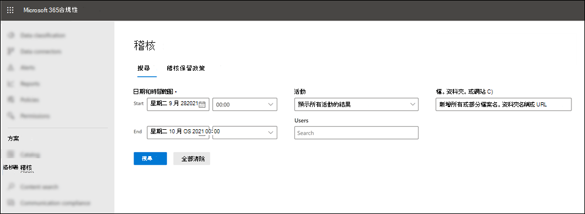
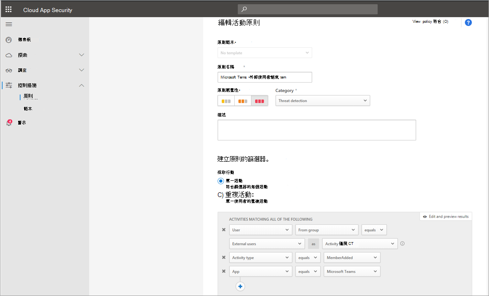
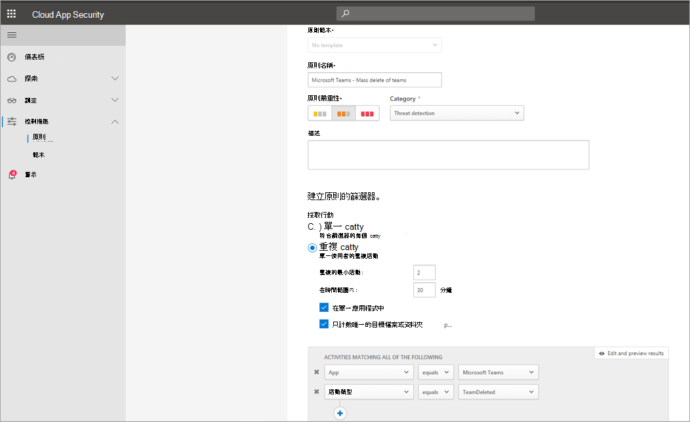
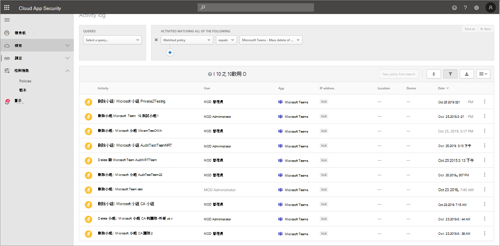

# 在稽核記錄中搜尋Microsoft Teams

> [!IMPORTANT]
> [!INCLUDE [new-teams-sfb-admin-center-notice](includes/new-teams-sfb-admin-center-notice.md)]

稽核記錄可協助調查整個服務Microsoft 365活動。 針對Microsoft Teams，以下是一些已稽核的活動：

- 團隊建立
- 團隊刪除
- 已新增頻道
- 已變更設定

有關已稽核Teams活動的完整清單，請參閱預覽Teams中的活動Teams班次 ([預覽](#shifts-in-teams-activities)) 。

> [!NOTE]
> 私人頻道的稽核事件也會與團隊和標準頻道一樣記錄。

## 開啟稽核Teams

在查看稽核資料之前，您首先必須開啟安全性與合規性中心的稽核& [稽核](https://protection.office.com)。 有關開啟稽核的協助，請參閱 [開啟或關閉稽核記錄搜尋](https://support.office.com/article/Turn-Office-365-audit-log-search-on-or-off-e893b19a-660c-41f2-9074-d3631c95a014)。

> [!IMPORTANT]
> 只有您開啟稽核時，才能使用稽核資料。

## 從稽Teams中取回資料

1. 若要取回稽核記錄，請前往安全性 [與合規性&中心](https://go.microsoft.com/fwlink/?linkid=855775)。 在 **搜尋下**，選取 **稽核記錄搜尋**。

2. 使用 **搜尋** 來篩選您想要稽核的活動、日期和使用者。

3. 將結果匯出Excel進一步分析。

> [!IMPORTANT]
> 只有在開啟稽核時，稽核資料才能顯示在稽核記錄中。

稽核記錄在稽核記錄中保留及搜尋的時間長度取決於您的 Microsoft 365 或 Office 365 訂閱，特別是指派給使用者的授權類型。 若要深入瞭解，請參閱安全性與合規性 [&中心服務描述](/office365/servicedescriptions/office-365-platform-service-description/office-365-securitycompliance-center)。

## 提示稽核記錄

以下是在稽核記錄中搜尋Teams活動的秘訣。

- 您可以按一下活動名稱，選取要搜尋的特定活動。 或者，您也可以按一下群組名稱 (群組中的所有活動，) 檔案和資料夾活動。 如果已選取活動，您可以按一下該活動以取消選取專案。 您也可以使用搜尋方塊來顯示包含您輸入之關鍵字的活動。

  

- 若要顯示使用 Cmdlet 執行的活動活動，請選取 **顯示活動** 清單中 **所有活動的結果** 。 如果您知道這些活動的作業名稱，請搜尋所有活動，然後在活動欄的方塊中輸入作業名稱來 **篩選** 結果。 若要深入瞭解，請參閱 [步驟 3：篩選搜尋結果](/microsoft-365/compliance/search-the-audit-log-in-security-and-compliance#step-3-filter-the-search-results)。

- 若要清除目前的搜尋準則，請按一下 [ **清除**。 日期範圍會回到過去七天的預設值。 您也可以按一下 [ **全部清除以顯示所有活動的結果，** 以取消所有選取的活動。

- 如果找到 5，000 個結果，您可以假設超過 5，000 個符合搜尋準則的事件。 您可以調整搜尋準則，然後重新搜尋以返回較少的結果，或者您也可以選取匯出下載所有結果來匯出  >  **所有搜尋結果**。

請觀看 [這段影片](https://www.youtube.com/embed/UBxaRySAxyE) 以使用音訊記錄搜尋。 加入 Ansuman Acharya，Teams的專案經理，示範如何執行稽核記錄搜尋Teams。

## 使用 雲端 App 安全性設定活動政策

您可以使用[Microsoft Cloud App Security](/cloud-app-security/what-is-cloud-app-security)整合，設定活動策略，以使用應用程式提供者的 API 強制執行各種自動化程式。 這些策略可支援您監控各種使用者執行的特定活動，或追蹤某一種特定類型活動的意外高比率。

設定活動偵測策略之後，系統即會開始產生警示。 只有在您建立策略後發生的活動時，才產生通知。 以下是一些範例案例，說明如何在 雲端 App 安全性中Teams活動。

### 外部使用者案例

從商務角度而言，您可能會想要留意的其中一個案例，是新增外部使用者到您的Teams環境。 如果已啟用外部使用者，則監視其目前狀態是一個好方法。  您可以使用[雲端 App 安全性來](/cloud-app-security/what-is-cloud-app-security)識別潛在威脅。

此策略的螢幕擷取畫面可監控新增外部使用者，可讓您為策略命名、根據業務需求設定嚴重性、將它設定為 (在此案例中為) 單一活動，然後建立僅專門監控新增非內部使用者的參數，然後將此活動限制為 Teams。

此策略的結果可在活動記錄中查看：

您可以在這裡查看符合您設定之方針的符合專案，並根據需要進行任何調整，或匯出結果以用於其他位置。

### 大量刪除案例

如先前所述，您可以監控刪除案例。 可以建立一個可監控大量刪除網站Teams策略。 在此範例中，系統設定了以警示為基礎的策略，以在 30 分鐘內偵測到團隊大量刪除。

如螢幕擷取畫面所示，您可以為此策略設定許多不同的參數，以監控 Teams 刪除，包括嚴重性、單一或重複動作，以及限制此Teams和網站刪除的參數。 您可以獨立于範本執行此工作，或者您可能已建立範本以根據組織需求來建立此策略。

建立適用于企業的政策之後，您可以在觸發事件時，查看活動記錄中的結果：

您可以篩選到您設定的策略，以查看該政策的結果。 如果您在活動記錄中取得的結果不盡如人意 (可能是因為您看到許多結果，或) 沒有任何結果，這或許可以協助您微調查詢，使其更切切地與您需要它執行哪些工作相關。

### 警示與監管案例

當觸發活動策略時，您可以設定通知，並傳送電子郵件給系統管理員和其他使用者。 您可以設定自動化的管理動作，例如暫停使用者或讓使用者以自動方式再次登錄。 此範例顯示觸發活動策略時，使用者帳戶如何被暫停，並確定使用者在 30 分鐘內刪除兩或多個團隊。

## Teams活動

以下是在稽核記錄中記錄使用者和系統管理活動Teams活動Microsoft 365清單。 資料表包含顯示在活動欄中的好記名稱，以及匯出搜尋結果時出現在稽核記錄詳細資訊和 CSV 檔案中的對應作業名稱。

|好用的名稱  |操作 |描述 |
|:---------|:---------|:---------|
|新增 Bot 至小組   |BotAddedToTeam        |使用者會新增 Bot 至團隊。        |
|已新增頻道   |ChannelAdded         |使用者會新增頻道至團隊。         |
|新增連接器  |ConnectorAdded          |使用者會新增連接器至頻道。        |
|新增成員    |MemberAdded         |團隊擁有者會將成員新增到團隊、頻道或群組聊天。         |
|已新增的定位停駐點    |TabAdded         |使用者會新增一個定位停駐點至頻道。        |
|已變更頻道設定    |ChannelSettingChanged         |當團隊成員執行下列活動時，會記錄 ChannelSettingChanged 作業。 針對上述每一項活動，在稽核記錄搜尋結果的 (欄會顯示變更設定的描述， (括弧中顯示的設定。  <ul><li>變更團隊頻道的名稱 (**頻道名稱)**</li><li>變更小組頻道描述 (**頻道描述)**</li> </ul>      |
|已變更組織設定   |TeamsTenantSettingChanged         |當下列活動由全域系統管理員在 Microsoft 365 系統管理中心 中執行時，會記錄 TeamsTenantSettingChanged 作業。 這些活動會影響整個組織Teams設定。 若要深入瞭解，請參閱[管理Teams的設定](enable-features-office-365.md)。  針對上述每一個活動，在稽核記錄搜尋結果的 (欄會顯示變更) 括弧或括弧中顯示的設定描述。 <ul><li>為組織Teams或停用 **(Microsoft Teams) 。**</li><li>啟用或停用組織Microsoft Teams與商務用 Skype之間的互通性 (商務用 Skype **互通性**) 。</li><li>啟用或停用 Microsoft Teams 中組織結構 (**組織結構) 。**</li><li>啟用或停用小組成員排程私人會議的能力， (**私人會議排** 程) 。</li><li>啟用或停用小組成員排程頻道會議的能力， (**頻道會議排程) 。**</li><li>在會議中啟用或停用視Teams視 (**視Skype視) 。**</li><li>啟用或停用組織Microsoft Teams會議中的螢幕畫面 (共用Skype **會議) 。**</li><li>啟用或停用新增名為 Giphys (動畫影像) 功能Teams動畫 (**動畫**) 。</li><li>變更組織的內容分級設定 (**內容分級) 。** 內容分級會限制可在交談中顯示的動畫影像類型。</li><li>啟用或停用小組成員將可自訂的影像 (稱為自訂 meme) 從網際網路新增到小組交談 (可自訂的) 。 </li><li>啟用或停用小組成員新增可編輯的影像 (貼圖) 可編輯 (圖像) 。 </li><li>啟用或停用小組成員在全組織 bot Microsoft Teams聊天和頻道中 (**Bot**) 。</li><li>啟用特定 bot Microsoft Teams。 這不包括 T-Bot，這是Teams為組織啟用 Bot 時可用的 (Bot) 。 </li><li>啟用或停用小組成員在擴充功能或 (**或**) 。</li><li>啟用或停用專屬 Bot 的側載功能，Microsoft Teams (**自動載入 Bot) 。**</li><li>啟用或停用使用者將電子郵件訊息傳送至頻道Microsoft Teams頻道 (**頻道) 。**</li></ul>|
|變更小組成員在團隊中的角色    |MemberRoleChanged         |團隊擁有者會變更團隊中成員的角色。 下列值表示指派給使用者的角色類型。   **1** - 表示成員角色。 **2** - 表示擁有者角色。 **3** - 表示來賓角色。  成員屬性也包括貴組織的名稱和成員的電子郵件地址。        |
|已變更團隊設定    |TeamSettingChanged        |當團隊擁有者執行下列活動時，會記錄 TeamSettingChanged 作業。 針對上述每一個活動，在稽核記錄搜尋結果的 (欄會顯示變更) 括弧或括弧中顯示的設定描述。 <ul><li>變更團隊的存取類型。 Teams小組存取類型設定為私人 (**公用) 。** 當團隊是私人 (預設) 時，使用者只能使用邀請來存取團隊。 當團隊公開時，任何人都可以探索團隊。</li><li>變更團隊資訊分類 (**團隊分類) 。** 例如，小組資料可以歸類為高業務影響、中型企業影響或低業務影響。</li><li>變更團隊名稱 (**團隊名稱) 。**</li><li>變更團隊描述 (**團隊描述) 。**</li><li>對小組設定進行變更。 若要存取這些設定，團隊擁有者可以以滑鼠右鍵按一下團隊，選取[管理團隊，然後按一下 [設定 **欄。** 針對這些活動，變更的設定名稱會顯示在稽核記錄搜尋結果中的專案欄中。</li></ul>         |
|建立聊天 1， 2| ChatCreated|    已Teams聊天。|
|已建立團隊    |TeamCreated         |使用者會建立團隊。         |
|刪除郵件  |MessageDeleted |聊天或頻道中的訊息已刪除。|
|刪除所有組織應用程式|DeletedAllOrganizationApps           |已刪除目錄中的所有組織應用程式。     |
|已刪除的應用程式 |AppDeletedFromCatalog           |應用程式已從目錄中刪除。     |
|已刪除的頻道     |ChannelDeleted         |使用者會從團隊中刪除頻道。         |
|已刪除的團隊  |TeamDeleted            |團隊擁有者會刪除團隊。      |
|已編輯郵件中的 URL 連結Teams     |MessageEditedHasLink         |使用者會編輯郵件，並將 URL 連結新增到郵件Teams。         |
|匯出的郵件 1， 2 | 郵件已Exported |已匯出聊天或頻道訊息|.
|已抓取聊天  1</sup， 2>    |ChatRetrieved  |已Microsoft Teams聊天。|
|已提取郵件1、2的所有 託管內容  |MessageHostedContentsListed    |已取回郵件中所有託管的內容，例如影像或程式碼段。|
|已安裝的應用程式 |App 已安裝         |已安裝應用程式。   |
|在卡片上執行的動作|已執行CardAction|使用者對聊天中的介面卡片採取動作。 Bot 通常會使用介面卡片，以在聊天中豐富顯示資訊和互動。   **注意：** 稽核記錄中只能使用聊天內適性卡片上的內嵌輸入動作。 例如，當使用者在由投票機器人產生的介面卡片上，在頻道交談中提交投票回應。 「查看結果」等使用者動作會開啟對話方塊，或對話方塊內的使用者動作在稽核記錄中無法使用。|
|張貼新郵件 1， 2    |訊息：新訊息已張貼至聊天或頻道。|
|已發佈的應用程式 |AppPublishedToCatalog           |應用程式已新加入目錄。     |
|讀取郵件 1， 2  |MessageRead    |已取回聊天或頻道的訊息。|
|讀取郵件 1、2的 託管內容    |MessageHostedContentRead   |已取回郵件中的託管內容，例如影像或程式碼段。|
|從小組移除 Bot   |BotRemovedFromTeam         |使用者會從小組移除 Bot。       |
|移除連接器     |ConnectorRemoved         |使用者會從頻道移除連接器。         |
|已移除的成員    |MemberRemoved        |團隊擁有者會從團隊、頻道或群組聊天移除成員。         |
|已移除的定位停駐點    |TabRemoved         |使用者會從頻道移除一個定位停駐點。         |
|已取回的郵件 1， 2  |郵件已列出 |已從聊天或頻道中取回訊息。|
|在郵件中以 URL 連結Teams |MessageCreatedHasLink|使用者會傳送一則訊息，其中含有 Teams。|
|郵件建立 1、2 的已送 出變更通知   |MessageCreatedNotification |已送出變更通知，以通知訂閱的聆聽者應用程式新郵件。|
|已針對郵件刪除1、 2寄來變更通知   |MessageDeletedNotification |已送出變更通知，以通知訂閱的聆聽者應用程式已刪除的郵件。|
|郵件更新 1、2 的已送 出變更通知 |MessageUpdatedNotification |已送出變更通知，以通知訂閱的聆聽者應用程式已更新的郵件。|
|訂閱郵件變更通知 1， 2  |訂閱ToMessages   |由聆聽者應用程式建立訂閱以接收郵件的變更通知。|
|已卸載的應用程式 |AppUninstalled           |應用程式已卸載。     |
|更新的應用程式 |AppUpdatedInCatalog           |已更新目錄中的應用程式。     |
|更新聊天 1， 2  |ChatUpdated    |已Teams聊天。|
|更新郵件 1， 2   |MessageUpdated |聊天或頻道的訊息已更新。|
|更新連接器    |ConnectorUpdated         |使用者修改了頻道中的連接器。         |
|已更新的 Tab   |TabUpdated         |使用者修改了頻道中的一個定位停駐點。         |
|升級的應用程式 |AppUpgraded           |應用程式已升級至目錄中的最新版本。     |
|使用者已Teams     |TeamsSession 啟動         |使用者會以用戶端Microsoft Teams。 此事件不會捕獲權杖重新更新活動。         |
||||

> [!NOTE]
> 1此事件的稽核記錄只有在執行作業時，才能撥打 Microsoft Graph API。 如果在用戶端中執行Teams，將不會記錄稽核記錄  2 此事件僅適用于進位稽核。 這表示使用者必須先獲得適當的授權，才能將這些事件記錄在稽核記錄中。 有關僅適用于進位稽核活動的資訊，請參閱在 Microsoft 365 中[進Microsoft 365。](/microsoft-365/compliance/advanced-audit#advanced-audit-events) 有關進級稽核授權需求，請參閱稽核[Microsoft 365。](/microsoft-365/compliance/auditing-solutions-overview#licensing-requirements)

## 在活動中Teams班

**(預覽)**

如果貴組織正在使用 Teams 中的 Shifts 應用程式，您可以搜尋稽核記錄，尋找與 Shifts 應用程式相關的活動。 以下列出在稽核記錄中記錄在 Teams 中 Shifts Microsoft 365活動的所有事件。

|好用的名稱  |操作  |描述  |
|---------|---------|---------|
|已新增排程群組 |ScheduleGroupAdded          |使用者已成功新增排程群組至排程。|
|已編輯排程群組     |ScheduleGroupEdited         |使用者已成功編輯排程群組。          |
|已刪除的排程群組         |ScheduleGroupDeleted              |使用者已成功從排程中刪除排程群組。|
|已撤銷排程 |ScheduleWithdrawn              |使用者已成功撤銷已發佈的排程。|
|新增班次      |ShiftAdded          |使用者已成功新增班次。           |
|已編輯的班次       |ShiftEdited       |使用者已成功編輯班次。        |
|已刪除的班          |ShiftDeleted          | 使用者已成功刪除班次。               |
|新增請假      |TimeOffAdded          |使用者已成功在排程中新增假。          |
|已編輯的假         |TimeOffEdited           |使用者已成功編輯假。          |
|已刪除的假     |TimeOffDeleted              |使用者已成功刪除假。           |
|已新增開啟班次     |OpenShiftAdded          |使用者已成功將已開啟的班新增到排程群組。          |
|已編輯的開啟班次    |OpenShiftEdited          |使用者成功編輯排程群組中的已開啟班次。          |
|已刪除開啟的班      |OpenShiftDeleted          |使用者已成功從排程群組中刪除已開啟的班。         |
|共用排程     |ScheduleShared                  |使用者已成功共用日期範圍的小組排程。          |
|使用時間時鐘打卡         |ClockedIn          |使用者使用時間時鐘成功打卡。          |
|使用時間時鐘打卡      |ClockedOut          |使用者使用時間時鐘成功打卡。          |
|使用時間時鐘開始中斷      |中斷啟動          |使用者在使用中的時間時鐘會話期間成功開始休息。          |
|使用時間時鐘結束的中斷    |BreakEnded          |使用者在使用中的時間時鐘會話期間成功結束休息。          |
|新增時間時鐘專案     |TimeClockEntryAdded          |使用者已成功在時程表上新增手動時間時鐘專案。          |
|編輯的時間時鐘專案     | TimeClockEntryEdited             |使用者在時程表上成功編輯時間時鐘專案。          |
|已刪除的時間時鐘專案    |TimeClockEntryDeleted              |使用者已成功刪除時表上的時間時鐘專案。          |
|新增輪班要求         |RequestAdded              |使用者新增了輪班要求。          |
|回應班次要求     |RequestRespondedTo                  |使用者回應了輪班要求。          |
|已取消的班要求         |RequestCancelled               |使用者已取消班次要求。          |
|變更排程設定      |ScheduleSettingChanged          |使用者變更 Shifts 設定中的設定。         |
|新增員工整合      |WorkforceIntegrationAdded                  | Shifts App 已與協力廠商系統整合。         |
|已接受關閉班次訊息         |OffShiftDialogAccepted          |使用者會確認輪班後訊息，Teams輪班後存取。           |

## Office 365管理活動 API

您可以使用管理活動OFFICE 365 API 來取回事件Teams相關資訊。 若要深入瞭解管理活動 API 架構Teams，請參閱[Teams架構](/office/office-365-management-api/office-365-management-activity-api-schema#microsoft-teams-schema)。

## 稽核Teams中的屬性

Teams () 的成員資格變更，例如透過 Azure Active Directory (Azure AD) 、Microsoft 365 系統管理入口網站或 Microsoft 365 群組 Graph API 新增或刪除的使用者，其成員資格變更會顯示在 Teams 稽核訊息中，以及一般頻道中，其歸屬於團隊的現有擁有者，而非動作的實際啟動者。 在這些情況下，請參閱 Azure AD 或 Microsoft 365[群組稽核記錄](/microsoft-365/compliance/search-the-audit-log-in-security-and-compliance)以查看相關資訊。

## 使用 雲端 App 安全性設定異常偵測策略

[雲端 App 安全性](/cloud-app-security/anomaly-detection-policy)中的異常偵測策略提供開箱即用的使用者和實體行為分析 (UEBA) 和機器學習 (ML) ，以便您立即在雲端環境中執行進位威脅偵測。 由於系統會自動啟用這些異常現象偵測策略，因此提供立即偵測功能，針對使用者和連接到您網路的機器與裝置中的許多行為異常情況，提供立即結果。 此外，新政策會公開來自 雲端 App 安全性 引擎的更多資料，協助您加快調查程式並包含持續的威脅。

我們正努力將事件與Teams偵測策略整合。 目前，您可以針對其他產品設定異常Office，並針對符合這些策略的使用者採取動作專案。

## 相關主題

- [搜尋稽核記錄Microsoft 365 合規性中心](/microsoft-365/compliance/search-the-audit-log-in-security-and-compliance)
