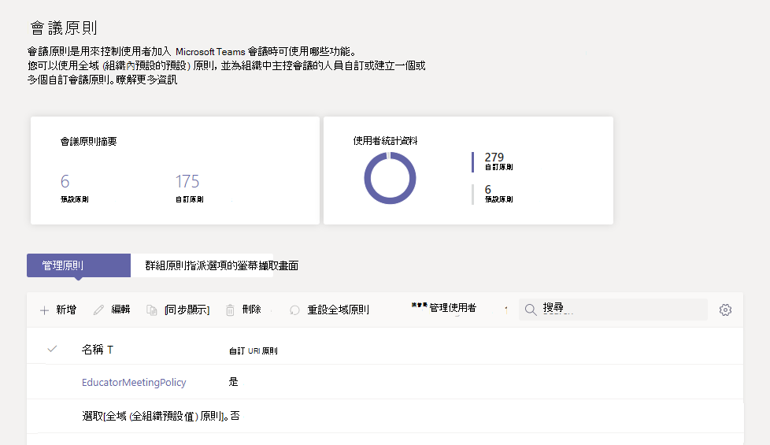
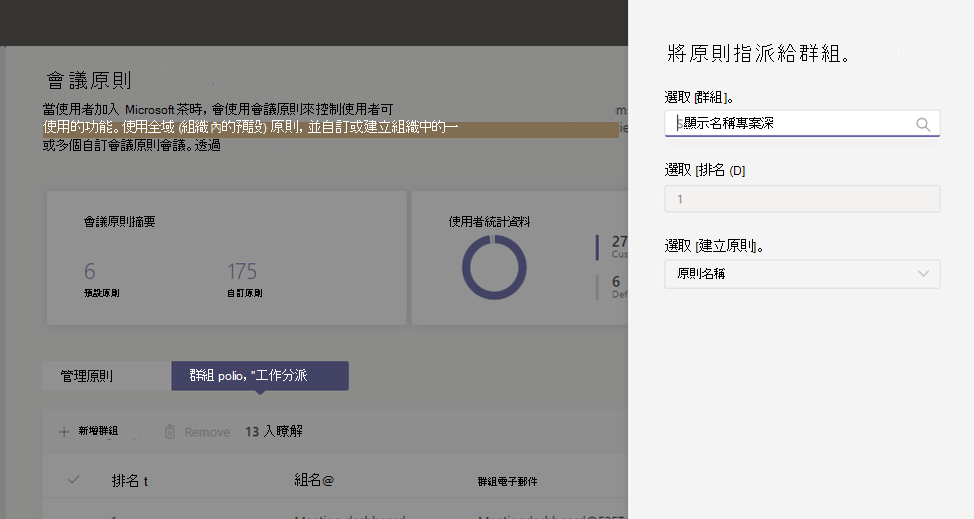

# <a name="assign-policies-to-large-sets-of-users-in-your-school"></a><span data-ttu-id="140c9-103">指派策略給學校中的大量使用者</span><span class="sxs-lookup"><span data-stu-id="140c9-103">Assign policies to large sets of users in your school</span></span>

[!INCLUDE [policy-wizard-edu](includes/policy-wizard-edu.md)]

> [!NOTE]
> <span data-ttu-id="140c9-104">有關在 Microsoft Teams 中指派策略的較大案例，請參閱在 Teams 中 [指派策略給使用者](assign-policies.md)。</span><span class="sxs-lookup"><span data-stu-id="140c9-104">For the larger story on assigning policies in Microsoft Teams, see [Assign policies to your users in Teams](assign-policies.md).</span></span>

## <a name="overview"></a><span data-ttu-id="140c9-105">概觀</span><span class="sxs-lookup"><span data-stu-id="140c9-105">Overview</span></span>

<span data-ttu-id="140c9-106">您是否需要讓學生和教師存取 Microsoft Teams 中的不同功能？</span><span class="sxs-lookup"><span data-stu-id="140c9-106">Do you need to give your students and educators access to different features in Microsoft Teams?</span></span> <span data-ttu-id="140c9-107">您可以根據授權類型快速識別貴組織中使用者，然後指派適當的策略給他們。</span><span class="sxs-lookup"><span data-stu-id="140c9-107">You can quickly identify the users in your organization by license type and then assign them the appropriate policy.</span></span> <span data-ttu-id="140c9-108">此教學課程會教您如何為學校中的大型使用者指派會議策略。</span><span class="sxs-lookup"><span data-stu-id="140c9-108">This tutorial shows you how to assign a meeting policy to large sets of users in your school.</span></span> <span data-ttu-id="140c9-109">您可以使用 Microsoft Teams 系統管理中心和 PowerShell 指派策略，我們會同時提供這兩種方式。</span><span class="sxs-lookup"><span data-stu-id="140c9-109">You can assign policies using the Microsoft Teams admin center and PowerShell and we'll show you both ways.</span></span>

<span data-ttu-id="140c9-110">您可以將會議策略指派給使用者為成員的安全性群組，或透過批次策略指派來直接將會議策略指派給使用者。</span><span class="sxs-lookup"><span data-stu-id="140c9-110">You can assign a meeting policy to a security group that the users are members of or directly to users at scale through a batch policy assignment.</span></span> <span data-ttu-id="140c9-111">您將瞭解如何：</span><span class="sxs-lookup"><span data-stu-id="140c9-111">You'll learn how to:</span></span>

- <span data-ttu-id="140c9-112">**使用 [策略指派給群組](#assign-a-policy-to-a-group) ，將** 會議策略指派給安全性群組， (建議) 。</span><span class="sxs-lookup"><span data-stu-id="140c9-112">**Use [policy assignment to groups](#assign-a-policy-to-a-group) to assign a meeting policy to a security group (recommended)**.</span></span> <span data-ttu-id="140c9-113">此方法可讓您根據群組成員資格指派策略。</span><span class="sxs-lookup"><span data-stu-id="140c9-113">This method lets you assign a policy based on group membership.</span></span> <span data-ttu-id="140c9-114">您可以將策略指派給安全性群組或通訊群組清單。</span><span class="sxs-lookup"><span data-stu-id="140c9-114">You can assign a policy to a security group or distribution list.</span></span> <span data-ttu-id="140c9-115">當成員新加入群組或從群組中移除時，其繼承的策略指派會因此更新。</span><span class="sxs-lookup"><span data-stu-id="140c9-115">As members are added to or removed from the group, their inherited policy assignments are updated accordingly.</span></span> <span data-ttu-id="140c9-116">建議您使用此方法，因為它可以減少管理新使用者之策略的時間，或使用者角色變更的時間。</span><span class="sxs-lookup"><span data-stu-id="140c9-116">We recommend you use this method because it reduces the time to manage policies for new users or when users' roles change.</span></span> <span data-ttu-id="140c9-117">這個方法最適合最多 50，000 個使用者群組使用，但也適用于較大的群組。</span><span class="sxs-lookup"><span data-stu-id="140c9-117">This method works best for groups of up to 50,000 users but will also work with larger groups.</span></span>

- <span data-ttu-id="140c9-118">**使用 [批次策略指派](assign-policies.md#assign-a-policy-to-a-batch-of-users) 直接將會議策略指派給使用者**。</span><span class="sxs-lookup"><span data-stu-id="140c9-118">**Use [batch policy assignment](assign-policies.md#assign-a-policy-to-a-batch-of-users) to assign a meeting policy directly to users in bulk**.</span></span> <span data-ttu-id="140c9-119">您可以一次指派最多 5，000 個使用者的政策。</span><span class="sxs-lookup"><span data-stu-id="140c9-119">You can assign a policy for up to 5,000 users at a time.</span></span> <span data-ttu-id="140c9-120">如果您有超過 5，000 個使用者，您可以提交多個批次。</span><span class="sxs-lookup"><span data-stu-id="140c9-120">If you have more than 5,000 users, you can submit multiple batches.</span></span> <span data-ttu-id="140c9-121">使用此方法時，當您有新使用者時，您必須重新執行批次指派，以將策略指派給這些新使用者。</span><span class="sxs-lookup"><span data-stu-id="140c9-121">With this method, when you have new users, you'll need to re-run the batch assignment to assign the policy to those new users.</span></span>

<span data-ttu-id="140c9-122">請記住，除非您建立及指派自訂 (，否則使用者在 Teams 中會自動取得 Teams (全組織的預設策略) Teams 策略類型。</span><span class="sxs-lookup"><span data-stu-id="140c9-122">Remember that in Teams, users automatically get the Global (Org-wide default) policy for a Teams policy type unless you create and assign a custom policy.</span></span> <span data-ttu-id="140c9-123">由於學生人口通常是最大的一組使用者，而且他們通常會收到限制最嚴格的設定，建議您執行下列操作：</span><span class="sxs-lookup"><span data-stu-id="140c9-123">Because the student population is often the largest set of users and they often receive the most restrictive settings, we recommend that you do the following:</span></span>

- <span data-ttu-id="140c9-124">建立自訂策略，允許私人聊天和會議排程等核心功能，並將該政策指派給教職員和教師。</span><span class="sxs-lookup"><span data-stu-id="140c9-124">Create a custom policy that allows core capabilities such as private chat and meeting scheduling and assign the policy to your staff and educators.</span></span>
- <span data-ttu-id="140c9-125">將自訂政策指派給教職員和教育工作者。</span><span class="sxs-lookup"><span data-stu-id="140c9-125">Assign the custom policy to your staff and educators.</span></span>
- <span data-ttu-id="140c9-126">編輯並適用全域 (全組織的預設) 原則，以限制學生的功能。</span><span class="sxs-lookup"><span data-stu-id="140c9-126">Edit and apply the Global (Org-wide default) policy to restrict capabilities for students.</span></span>

<span data-ttu-id="140c9-127">請記住，全域原則會適用于學校中的所有使用者，直到您建立自訂原則並指派給教職員和教師。</span><span class="sxs-lookup"><span data-stu-id="140c9-127">Keep in mind that the Global policy will apply to all users in your school until you create a custom policy and assign it to your staff and educators.</span></span>

<span data-ttu-id="140c9-128">在此教學課程中，學生會取得全域會議政策，我們會指派名為 EducatorMeetingPolicy 的自訂會議政策給教職員和教育工作者。</span><span class="sxs-lookup"><span data-stu-id="140c9-128">In this tutorial, students will get the Global meeting policy and we'll assign a custom meeting policy named EducatorMeetingPolicy to staff and educators.</span></span> <span data-ttu-id="140c9-129">我們假設您已編輯全域原則，為學生量身訂做會議設定，並建立了[](policy-packages-edu.md)自訂策略，為教職員和教育工作者定義會議體驗。</span><span class="sxs-lookup"><span data-stu-id="140c9-129">We assume that you've edited the Global policy to tailor meeting settings for students and [created a custom policy](policy-packages-edu.md) that defines the meeting experience for staff and educators.</span></span>



## <a name="assign-a-policy-to-a-group"></a><span data-ttu-id="140c9-131">將策略指派給群組</span><span class="sxs-lookup"><span data-stu-id="140c9-131">Assign a policy to a group</span></span>

<span data-ttu-id="140c9-132">請遵循下列步驟，為教職員和教育工作者建立安全性群組，然後將名為 EducatorMeetingPolicy 的自訂會議策略指派給該安全性群組。</span><span class="sxs-lookup"><span data-stu-id="140c9-132">Follow these steps to create a security group for your staff and educators, and then assign a custom meeting policy named EducatorMeetingPolicy to that security group.</span></span>

### <a name="before-you-get-started"></a><span data-ttu-id="140c9-133">開始之前</span><span class="sxs-lookup"><span data-stu-id="140c9-133">Before you get started</span></span>

> [!IMPORTANT]
> <span data-ttu-id="140c9-134">當您將原則指派給群組時，原則指派會依據優先順序規則傳播給群組的成員。</span><span class="sxs-lookup"><span data-stu-id="140c9-134">When you assign a policy to a group, the policy assignment is propagated to members of the group according to precedence rules.</span></span> <span data-ttu-id="140c9-135">例如，如果使用者直接指派一個 (或透過批次指派) ，該策略會優先于從群組繼承的規則。</span><span class="sxs-lookup"><span data-stu-id="140c9-135">For example, if a user is directly assigned a policy (either individually or through a batch assignment), that policy takes precedence over a policy that's inherited from a group.</span></span> <span data-ttu-id="140c9-136">這也表示如果使用者有直接指派給他們的會議策略，您必須從使用者移除該會議策略，才能從安全性群組繼承會議策略。</span><span class="sxs-lookup"><span data-stu-id="140c9-136">This also means that if a user has a meeting policy that was directly assigned to them, you'll have to remove that meeting policy from the user before they can inherit a meeting policy from a security group.</span></span>

<span data-ttu-id="140c9-137">在您開始使用之前，瞭解優先順序規則和群組[作業](assign-policies.md#group-assignment-ranking)排名非常重要[](assign-policies.md#precedence-rules)。</span><span class="sxs-lookup"><span data-stu-id="140c9-137">Before you get started, it's important to understand [precedence rules](assign-policies.md#precedence-rules) and [group assignment ranking](assign-policies.md#group-assignment-ranking).</span></span> <span data-ttu-id="140c9-138">**請確定您閱讀 [](assign-policies.md#what-you-need-to-know-about-policy-assignment-to-groups)** 並瞭解有關指派給群組之策略的您需要瞭解的概念。</span><span class="sxs-lookup"><span data-stu-id="140c9-138">**Make sure that you read and understand the concepts in [What you need to know about policy assignment to groups](assign-policies.md#what-you-need-to-know-about-policy-assignment-to-groups)**.</span></span>

<span data-ttu-id="140c9-139">您必須完成這些步驟，讓教職員和教育工作者從安全性群組繼承會議政策。</span><span class="sxs-lookup"><span data-stu-id="140c9-139">You'll need to complete all these steps for your staff and educators to inherit a meeting policy from a security group.</span></span>

1. <span data-ttu-id="140c9-140">[建立安全性群組](#create-security-groups)。</span><span class="sxs-lookup"><span data-stu-id="140c9-140">[Create security groups](#create-security-groups).</span></span>
2. <span data-ttu-id="140c9-141">[將策略指派給安全性群組](#assign-a-policy-to-a-security-group)。</span><span class="sxs-lookup"><span data-stu-id="140c9-141">[Assign a policy to a security group](#assign-a-policy-to-a-security-group).</span></span>
3. <span data-ttu-id="140c9-142">[移除直接指派給使用者的策略](#remove-a-policy-that-was-directly-assigned-to-users)。</span><span class="sxs-lookup"><span data-stu-id="140c9-142">[Remove a policy that was directly assigned to users](#remove-a-policy-that-was-directly-assigned-to-users).</span></span>

### <a name="create-security-groups"></a><span data-ttu-id="140c9-143">建立安全性群組</span><span class="sxs-lookup"><span data-stu-id="140c9-143">Create security groups</span></span>

<span data-ttu-id="140c9-144">首先，為教職員和教育工作者建立安全性群組。</span><span class="sxs-lookup"><span data-stu-id="140c9-144">First, create a security group for your staff and educators.</span></span>

<span data-ttu-id="140c9-145">使用[學校資料同步](/SchoolDataSync/) (SDS) ，您可以輕鬆地建立學校中的安全[](/SchoolDataSync/edu-security-groups)組教育者和學生。</span><span class="sxs-lookup"><span data-stu-id="140c9-145">With [School Data Sync](/SchoolDataSync/) (SDS), you can [easily create security groups educators and students](/SchoolDataSync/edu-security-groups) in your school.</span></span> <span data-ttu-id="140c9-146">我們建議您使用 SDS 建立管理學校之策略所需的安全性群組。</span><span class="sxs-lookup"><span data-stu-id="140c9-146">We recommend that you use SDS to create the security groups you need to manage policies for your school.</span></span>

<span data-ttu-id="140c9-147">如果您無法在環境中部署 SDS，請使用 [此 PowerShell](scripts/powershell-script-security-groups-edu.md) 腳本來建立兩個安全性群組，一個針對指派教職員授權的所有教職員和教育工作者，另一個則針對指派學生授權的所有學生。</span><span class="sxs-lookup"><span data-stu-id="140c9-147">If you're unable to deploy SDS within your environment, use [this PowerShell script](scripts/powershell-script-security-groups-edu.md) to create two security groups, one for all staff and educators who have a Faculty license assigned and another for all students who have a Student license assigned.</span></span> <span data-ttu-id="140c9-148">您必須定期執行此腳本，讓群組保持在最新狀態。</span><span class="sxs-lookup"><span data-stu-id="140c9-148">You'll need to run this script routinely to keep the groups fresh and up to date.</span></span>

### <a name="assign-a-policy-to-a-security-group"></a><span data-ttu-id="140c9-149">將策略指派給安全性群組</span><span class="sxs-lookup"><span data-stu-id="140c9-149">Assign a policy to a security group</span></span>

#### <a name="using-the-microsoft-teams-admin-center"></a><span data-ttu-id="140c9-150">使用 Microsoft Teams 系統管理中心</span><span class="sxs-lookup"><span data-stu-id="140c9-150">Using the Microsoft Teams admin center</span></span>

> [!NOTE]
> <span data-ttu-id="140c9-151">目前，使用 Microsoft Teams 系統管理中心指派給群組的政策僅適用于 Teams 通話政策、Teams 通話停駐政策、Teams 政策、Teams 即時活動政策、Teams 會議策略和 Teams 傳訊政策。</span><span class="sxs-lookup"><span data-stu-id="140c9-151">Currently, policy assignment to groups using the Microsoft Teams admin center is only available for Teams calling policy, Teams call park policy, Teams policy, Teams live events policy, Teams meeting policy, and Teams messaging policy.</span></span> <span data-ttu-id="140c9-152">針對其他策略類型，請使用 PowerShell。</span><span class="sxs-lookup"><span data-stu-id="140c9-152">For other policy types, use PowerShell.</span></span>

1. <span data-ttu-id="140c9-153">在 Microsoft Teams 系統管理中心的左側流覽中，前往 **會議**  >  **會議政策**。</span><span class="sxs-lookup"><span data-stu-id="140c9-153">In the left navigation of the Microsoft Teams admin center, go to **Meetings** > **Meeting policies**.</span></span>
2. <span data-ttu-id="140c9-154">選取組 **策略工作分派** 選項卡。</span><span class="sxs-lookup"><span data-stu-id="140c9-154">Select the **Group policy assignment** tab.</span></span>
3. <span data-ttu-id="140c9-155">選取 **新增群組**，然後在指派策略 **至群組** 窗格中，執行下列操作：</span><span class="sxs-lookup"><span data-stu-id="140c9-155">Select **Add group**, and then in the **Assign policy to group** pane, do the following:</span></span>

    
    1. <span data-ttu-id="140c9-157">在選取 **群組方塊** 中，搜尋並新增包含教職員與教育人員的安全性群組。</span><span class="sxs-lookup"><span data-stu-id="140c9-157">In the **Select a group** box, search for and add the security group that contains your staff and educators.</span></span>
    2. <span data-ttu-id="140c9-158">在選取 **排名方塊** 中，輸入 **1**。</span><span class="sxs-lookup"><span data-stu-id="140c9-158">In the **Select rank** box, enter **1**.</span></span>
    3. <span data-ttu-id="140c9-159">在選取 **策略方塊中** ，選取 **EducatorMeetingPolicy**。</span><span class="sxs-lookup"><span data-stu-id="140c9-159">In the **Select a policy** box, select **EducatorMeetingPolicy**.</span></span>
    4. <span data-ttu-id="140c9-160">選取 **Apply**。</span><span class="sxs-lookup"><span data-stu-id="140c9-160">Select **Apply**.</span></span>

<span data-ttu-id="140c9-161">若要移除群組原則作業，請在策略頁面的群組原則工作分派選項卡上，選取群組作業，然後選取 **移除**。</span><span class="sxs-lookup"><span data-stu-id="140c9-161">To remove a group policy assignment, on the **Group policy assignment** tab of the policy page, select the group assignment, and then select **Remove**.</span></span>

<span data-ttu-id="140c9-162">若要變更群組作業的排名，您首先必須移除群組原則作業。</span><span class="sxs-lookup"><span data-stu-id="140c9-162">To change the ranking of a group assignment, you have to first remove the group policy assignment.</span></span> <span data-ttu-id="140c9-163">接著，請遵循上述步驟，將策略指派給群組。</span><span class="sxs-lookup"><span data-stu-id="140c9-163">Then, follow the steps above to assign the policy to a group.</span></span>

#### <a name="using-powershell"></a><span data-ttu-id="140c9-164">使用 PowerShell</span><span class="sxs-lookup"><span data-stu-id="140c9-164">Using PowerShell</span></span>

> [!NOTE]
> <span data-ttu-id="140c9-165">目前，所有 Teams 策略類型都不適用於使用 PowerShell 的群群組原則指派。</span><span class="sxs-lookup"><span data-stu-id="140c9-165">Currently, policy assignment to groups using PowerShell isn't available for all Teams policy types.</span></span> <span data-ttu-id="140c9-166">請參閱 [New-CsGroupPolicyAssignment](/powershell/module/teams/new-csgrouppolicyassignment) 以尋找支援的策略類型清單。</span><span class="sxs-lookup"><span data-stu-id="140c9-166">See [New-CsGroupPolicyAssignment](/powershell/module/teams/new-csgrouppolicyassignment) for the list of supported policy types.</span></span>

##### <a name="install-and-connect-to-the-microsoft-teams-powershell-module"></a><span data-ttu-id="140c9-167">安裝並連接到 Microsoft Teams PowerShell 模組</span><span class="sxs-lookup"><span data-stu-id="140c9-167">Install and connect to the Microsoft Teams PowerShell module</span></span>

<span data-ttu-id="140c9-168">執行下列操作以安裝 [Teams PowerShell 模組 (](https://www.powershellgallery.com/packages/MicrosoftTeams) 如果尚未在) 。</span><span class="sxs-lookup"><span data-stu-id="140c9-168">Run the following to install the [Teams PowerShell module](https://www.powershellgallery.com/packages/MicrosoftTeams) (if it's not already installed).</span></span> <span data-ttu-id="140c9-169">請確定您安裝版本 1.0.5 或更新版本。</span><span class="sxs-lookup"><span data-stu-id="140c9-169">Make sure you install version 1.0.5 or later.</span></span>

```powershell
Install-Module -Name MicrosoftTeams
```

<span data-ttu-id="140c9-170">執行下列操作以連接到 Teams 並開始會話。</span><span class="sxs-lookup"><span data-stu-id="140c9-170">Run the following to connect to Teams and start a session.</span></span>

```powershell
Connect-MicrosoftTeams
```

<span data-ttu-id="140c9-171">系統提示您時，請使用系統管理員認證來登錄。</span><span class="sxs-lookup"><span data-stu-id="140c9-171">When you're prompted, sign in using your admin credentials.</span></span>

##### <a name="assign-a-policy-to-a-group"></a><span data-ttu-id="140c9-172">將策略指派給群組</span><span class="sxs-lookup"><span data-stu-id="140c9-172">Assign a policy to a group</span></span>

<span data-ttu-id="140c9-173">執行下列操作，將名為 EducatorMeetingPolicy 的會議策略指派給包含您教職員和教育工作者的安全性群組，並將作業排名設定為 1。</span><span class="sxs-lookup"><span data-stu-id="140c9-173">Run the following to assign the meeting policy named EducatorMeetingPolicy to the security group that contains your staff and educators and set the assignment ranking to 1.</span></span> <span data-ttu-id="140c9-174">您可以使用物件識別碼、會話初始通訊協定 (SIP) 或電子郵件地址來指定安全性群組。</span><span class="sxs-lookup"><span data-stu-id="140c9-174">You can specify a security group by using the object Id, Session Initiation Protocol (SIP) address, or email address.</span></span> <span data-ttu-id="140c9-175">在此範例中，我們使用電子郵件地址 (staff-faculty@contoso.com) 。</span><span class="sxs-lookup"><span data-stu-id="140c9-175">In this example, we use an email address (staff-faculty@contoso.com).</span></span>

```powershell
New-CsGroupPolicyAssignment -GroupId staff-faculty@contoso.com -PolicyType TeamsMeetingPolicy -PolicyName "EducatorMeetingPolicy" -Rank 1
```

### <a name="remove-a-policy-that-was-directly-assigned-to-users"></a><span data-ttu-id="140c9-176">移除直接指派給使用者的策略</span><span class="sxs-lookup"><span data-stu-id="140c9-176">Remove a policy that was directly assigned to users</span></span>

<span data-ttu-id="140c9-177">請記住，如果使用者是個別或透過批次指派 (，則該) 優先。</span><span class="sxs-lookup"><span data-stu-id="140c9-177">Remember that if a user was directly assigned a policy (either individually or through a batch assignment), that policy takes precedence.</span></span> <span data-ttu-id="140c9-178">這表示如果使用者有直接指派給他們的會議策略，您必須從使用者移除該會議策略，才能從安全性群組繼承會議策略。</span><span class="sxs-lookup"><span data-stu-id="140c9-178">This means that if a user has a meeting policy that was directly assigned to them, you'll have to remove that meeting policy from the user before they can inherit a meeting policy from a security group.</span></span>

<span data-ttu-id="140c9-179">若要深入瞭解，請參閱您需要瞭解哪些資訊， [以將策略指派給群組](assign-policies.md#what-you-need-to-know-about-policy-assignment-to-groups)。</span><span class="sxs-lookup"><span data-stu-id="140c9-179">To learn more, see [What you need to know about policy assignment to groups](assign-policies.md#what-you-need-to-know-about-policy-assignment-to-groups).</span></span>

<span data-ttu-id="140c9-180">請遵循下列步驟，移除直接指派給教職員和教育人員的會議政策。</span><span class="sxs-lookup"><span data-stu-id="140c9-180">Follow these steps to remove the meeting policy that was directly assigned to your staff and educators.</span></span>

#### <a name="install-and-connect-to-the-microsoft-teams-powershell-module"></a><span data-ttu-id="140c9-181">安裝並連接到 Microsoft Teams PowerShell 模組</span><span class="sxs-lookup"><span data-stu-id="140c9-181">Install and connect to the Microsoft Teams PowerShell module</span></span>

<span data-ttu-id="140c9-182">執行下列操作以安裝 [Teams PowerShell 模組 (](https://www.powershellgallery.com/packages/MicrosoftTeams) 如果尚未在) 。</span><span class="sxs-lookup"><span data-stu-id="140c9-182">Run the following to install the [Teams PowerShell module](https://www.powershellgallery.com/packages/MicrosoftTeams) (if it's not already installed).</span></span> <span data-ttu-id="140c9-183">請確定您安裝版本 1.0.5 或更新版本。</span><span class="sxs-lookup"><span data-stu-id="140c9-183">Make sure you install version 1.0.5 or later.</span></span>

```powershell
Install-Module -Name MicrosoftTeams
```

<span data-ttu-id="140c9-184">執行下列操作以連接到 Teams 並開始會話。</span><span class="sxs-lookup"><span data-stu-id="140c9-184">Run the following to connect to Teams and start a session.</span></span>

```powershell
Connect-MicrosoftTeams
```

<span data-ttu-id="140c9-185">系統提示您時，請使用您用來連接到 Azure AD 的相同系統管理員認證來登錄。</span><span class="sxs-lookup"><span data-stu-id="140c9-185">When you're prompted, sign in using the same admin credentials you used to connect to Azure AD.</span></span>

#### <a name="unassign-a-policy-that-was-directly-assigned-to-users"></a><span data-ttu-id="140c9-186">取消指派直接指派給使用者的策略</span><span class="sxs-lookup"><span data-stu-id="140c9-186">Unassign a policy that was directly assigned to users</span></span>

<span data-ttu-id="140c9-187">執行下列操作，從直接指派該策略的使用者移除會議策略。</span><span class="sxs-lookup"><span data-stu-id="140c9-187">Run the following to remove a meeting policy from users who were directly assigned that policy.</span></span> <span data-ttu-id="140c9-188">您可以根據電子郵件地址或物件識別碼來指定使用者。</span><span class="sxs-lookup"><span data-stu-id="140c9-188">You can specify users by email address or object ID.</span></span>

<span data-ttu-id="140c9-189">在此範例中，會議策略會從使用者電子郵件地址指定的使用者中移除。</span><span class="sxs-lookup"><span data-stu-id="140c9-189">In this example, the meeting policy is removed from users specified by their email address.</span></span>

```powershell
$users_ids = @("reda@contoso.com", "nikica@contoso.com", "jamie@contoso.com")
New-CsBatchPolicyAssignmentOperation -PolicyType TeamsMeetingPolicy -PolicyName $null -Identity $users_ids -OperationName "Unassign meeting policy"
```

<span data-ttu-id="140c9-190">在此範例中，會議策略會從名為 user_ids.txt 的文字檔中的使用者清單中user_ids.txt。</span><span class="sxs-lookup"><span data-stu-id="140c9-190">In this example, the meeting policy is removed from the list of users in a text file named user_ids.txt.</span></span>

```powershell
$user_ids = Get-Content .\users_ids.txt
New-CsBatchPolicyAssignmentOperation -PolicyType TeamsMeetingPolicy -PolicyName $null -Identity $users_ids -OperationName "Unassign meeting policy"
```

##### <a name="get-policy-assignments-for-a-group"></a><span data-ttu-id="140c9-191">取得群組的策略指派</span><span class="sxs-lookup"><span data-stu-id="140c9-191">Get policy assignments for a group</span></span>

<span data-ttu-id="140c9-192">執行下列操作以查看指派給特定安全性群組的所有策略。</span><span class="sxs-lookup"><span data-stu-id="140c9-192">Run the following to see all the policies assigned to a specific security group.</span></span> <span data-ttu-id="140c9-193">請注意，即使已使用群組的 SIP 位址或電子郵件地址來指派策略，群組還是會一直以群組識別碼列出。</span><span class="sxs-lookup"><span data-stu-id="140c9-193">Note that groups are always listed by their group ID even if its SIP address or email address was used to assign the policy.</span></span>

```powershell
Get-CsGroupPolicyAssignment -GroupId staff-faculty@contoso.com

```

##### <a name="get-the-policies-assigned-to-a-user"></a><span data-ttu-id="140c9-194">取得指派給使用者的政策</span><span class="sxs-lookup"><span data-stu-id="140c9-194">Get the policies assigned to a user</span></span>

<span data-ttu-id="140c9-195">執行下列操作以查看指派給特定使用者的所有策略。</span><span class="sxs-lookup"><span data-stu-id="140c9-195">Run the following to see all the policies that are assigned to a specific user.</span></span> <span data-ttu-id="140c9-196">下列範例將說明如何取得指派給 reda@contoso.com。</span><span class="sxs-lookup"><span data-stu-id="140c9-196">The following example shows you how to get the policies that are assigned to reda@contoso.com.</span></span>

```powershell
Get-CsUserPolicyAssignment -Identity reda@contoso.com
```

## <a name="assign-a-policy-to-a-batch-of-users"></a><span data-ttu-id="140c9-197">指派一個策略給一批使用者</span><span class="sxs-lookup"><span data-stu-id="140c9-197">Assign a policy to a batch of users</span></span>

<span data-ttu-id="140c9-198">請遵循下列步驟，直接將名為 EducatorMeetingPolicy 的自訂會議政策指派給大量教職員和教育工作者。</span><span class="sxs-lookup"><span data-stu-id="140c9-198">Follow these steps to assign a custom meeting policy named EducatorMeetingPolicy directly to your staff and educators in bulk.</span></span>

### <a name="using-powershell"></a><span data-ttu-id="140c9-199">使用 PowerShell</span><span class="sxs-lookup"><span data-stu-id="140c9-199">Using PowerShell</span></span>

#### <a name="connect-to-the-azure-ad-powershell-for-graph-module-and-the-teams-powershell-module"></a><span data-ttu-id="140c9-200">連接到 Azure AD PowerShell for Graph 模組和 Teams PowerShell 模組</span><span class="sxs-lookup"><span data-stu-id="140c9-200">Connect to the Azure AD PowerShell for Graph module and the Teams PowerShell module</span></span>

<span data-ttu-id="140c9-201">執行本文中的步驟之前，您必須安裝並連接到 Azure AD PowerShell for Graph 模組 (，才能根據使用者指派授權) 和 Microsoft Teams PowerShell 模組 (來識別使用者，才能將策略指派給這些使用者) 。</span><span class="sxs-lookup"><span data-stu-id="140c9-201">Before you perform the steps in this article, you'll need to install and connect to the Azure AD PowerShell for Graph module (to identify users by their assigned licenses) and the Microsoft Teams PowerShell module (to assign the policies to those users).</span></span>

##### <a name="install-and-connect-to-the-azure-ad-powershell-for-graph-module"></a><span data-ttu-id="140c9-202">安裝並連接到 Azure AD PowerShell for Graph 模組</span><span class="sxs-lookup"><span data-stu-id="140c9-202">Install and connect to the Azure AD PowerShell for Graph module</span></span>

<span data-ttu-id="140c9-203">開啟提升的 Windows PowerShell 命令提示 (以系統管理員) 執行 Windows PowerShell，然後執行下列操作以安裝 Azure Active Directory PowerShell for Graph 模組。</span><span class="sxs-lookup"><span data-stu-id="140c9-203">Open an elevated Windows PowerShell command prompt (run Windows PowerShell as an administrator), and then run the following to install the Azure Active Directory PowerShell for Graph module.</span></span>

```powershell
Install-Module -Name AzureAD
```

<span data-ttu-id="140c9-204">執行下列操作以連接到 Azure AD。</span><span class="sxs-lookup"><span data-stu-id="140c9-204">Run the following to connect to Azure AD.</span></span>

```powershell
Connect-AzureAD
```

<span data-ttu-id="140c9-205">系統提示您時，請使用系統管理員認證來登錄。</span><span class="sxs-lookup"><span data-stu-id="140c9-205">When you're prompted, sign in using your admin credentials.</span></span>

<span data-ttu-id="140c9-206">若要深入瞭解，請參閱 [使用 Azure Active Directory PowerShell for Graph 模組進行連接](/office365/enterprise/powershell/connect-to-office-365-powershell#connect-with-the-azure-active-directory-powershell-for-graph-module)。</span><span class="sxs-lookup"><span data-stu-id="140c9-206">To learn more, see [Connect with the Azure Active Directory PowerShell for Graph module](/office365/enterprise/powershell/connect-to-office-365-powershell#connect-with-the-azure-active-directory-powershell-for-graph-module).</span></span>

##### <a name="install-and-connect-to-the-microsoft-teams-powershell-module"></a><span data-ttu-id="140c9-207">安裝並連接到 Microsoft Teams PowerShell 模組</span><span class="sxs-lookup"><span data-stu-id="140c9-207">Install and connect to the Microsoft Teams PowerShell module</span></span>

<span data-ttu-id="140c9-208">執行下列操作以安裝 [Teams PowerShell 模組 (](https://www.powershellgallery.com/packages/MicrosoftTeams) 如果尚未在) 。</span><span class="sxs-lookup"><span data-stu-id="140c9-208">Run the following to install the [Teams PowerShell module](https://www.powershellgallery.com/packages/MicrosoftTeams) (if it's not already installed).</span></span> <span data-ttu-id="140c9-209">請確定您安裝版本 1.0.5 或更新版本。</span><span class="sxs-lookup"><span data-stu-id="140c9-209">Make sure you install version 1.0.5 or later.</span></span>

```powershell
Install-Module -Name MicrosoftTeams
```

<span data-ttu-id="140c9-210">執行下列操作以連接到 Teams 並開始會話。</span><span class="sxs-lookup"><span data-stu-id="140c9-210">Run the following to connect to Teams and start a session.</span></span>

```powershell
Connect-MicrosoftTeams
```

<span data-ttu-id="140c9-211">系統提示您時，請使用您用來連接到 Azure AD 的相同系統管理員認證來登錄。</span><span class="sxs-lookup"><span data-stu-id="140c9-211">When you're prompted, sign in using the same admin credentials you used to connect to Azure AD.</span></span>

#### <a name="identify-your-users"></a><span data-ttu-id="140c9-212">識別您的使用者</span><span class="sxs-lookup"><span data-stu-id="140c9-212">Identify your users</span></span>

<span data-ttu-id="140c9-213">首先，請執行下列操作，以根據授權類型識別教職員和教師。</span><span class="sxs-lookup"><span data-stu-id="140c9-213">First, run the following to identify your staff and educators by license type.</span></span> <span data-ttu-id="140c9-214">這表示貴組織使用哪些 SKUS。</span><span class="sxs-lookup"><span data-stu-id="140c9-214">This tells you what SKUs are in use in your organization.</span></span> <span data-ttu-id="140c9-215">接著，您可以找出已指派教職員 SKU 的教職員和教育工作者。</span><span class="sxs-lookup"><span data-stu-id="140c9-215">You can then identify staff and educators that have a Faculty SKU assigned.</span></span>

```powershell
Get-AzureAdSubscribedSku | Select-Object -Property SkuPartNumber,SkuId
```

<span data-ttu-id="140c9-216">這會返回：</span><span class="sxs-lookup"><span data-stu-id="140c9-216">Which returns:</span></span>

```
SkuPartNumber      SkuId
-------------      -----
M365EDU_A5_FACULTY e97c048c-37a4-45fb-ab50-922fbf07a370
M365EDU_A5_STUDENT 46c119d4-0379-4a9d-85e4-97c66d3f909e
```

<span data-ttu-id="140c9-217">在此範例中，輸出顯示教職員授權 SkuId 為"e97c048c-37a4-45fb-ab50-922fbf07a370"。</span><span class="sxs-lookup"><span data-stu-id="140c9-217">In this example, the output shows that the Faculty license SkuId is "e97c048c-37a4-45fb-ab50-922fbf07a370".</span></span>

> [!NOTE]
> <span data-ttu-id="140c9-218">若要查看教育用 SKU 和 SKU ID 清單，請參閱[教育用 SKU 參考 。](sku-reference-edu.md)</span><span class="sxs-lookup"><span data-stu-id="140c9-218">To see a list of Education SKUs and SKU IDs, see [Education SKU reference](sku-reference-edu.md).</span></span>

<span data-ttu-id="140c9-219">接下來，我們會執行下列操作來識別擁有此授權的使用者，並一併收集這些使用者。</span><span class="sxs-lookup"><span data-stu-id="140c9-219">Next, we run the following to identify the users that have this license and collect them all together.</span></span>

```powershell
$faculty = Get-AzureADUser -All $true | Where-Object {($_.assignedLicenses).SkuId -contains "e97c048c-37a4-45fb-ab50-922fbf07a370"}
```

#### <a name="assign-a-policy-in-bulk"></a><span data-ttu-id="140c9-220">大量指派策略</span><span class="sxs-lookup"><span data-stu-id="140c9-220">Assign a policy in bulk</span></span>

<span data-ttu-id="140c9-221">現在，我們會大量指派適當的政策給使用者。</span><span class="sxs-lookup"><span data-stu-id="140c9-221">Now, we assign the appropriate policies to users in bulk.</span></span> <span data-ttu-id="140c9-222">您可以指派或更新策略的使用者數量上限為一次 5，000 個。</span><span class="sxs-lookup"><span data-stu-id="140c9-222">The maximum number of users for which you can assign or update policies is 5,000 at a time.</span></span> <span data-ttu-id="140c9-223">例如，如果您有超過 5，000 名教職員和教育工作者，您必須提交多個批次。</span><span class="sxs-lookup"><span data-stu-id="140c9-223">For example, if you have more than 5,000 staff and educators, you'll need to submit multiple batches.</span></span>

<span data-ttu-id="140c9-224">執行下列操作，將名為 EducatorMeetingPolicy 的自訂會議策略指派給教職員和教育工作者。</span><span class="sxs-lookup"><span data-stu-id="140c9-224">Run the following to assign a custom meeting policy named EducatorMeetingPolicy to your staff and educators.</span></span>

```powershell
New-CsBatchPolicyAssignmentOperation -PolicyType TeamsMeetingPolicy -PolicyName EducatorMeetingPolicy -Identity $faculty.ObjectId
```

> [!NOTE]
> <span data-ttu-id="140c9-225">若要大量指派不同的策略類型 ，例如 TeamsMessagingPolicy，您必須變更為您指派的策略和策略 ```PolicyType``` ```PolicyName``` 名稱。</span><span class="sxs-lookup"><span data-stu-id="140c9-225">To assign a different policy type in bulk, like TeamsMessagingPolicy, you'll need to change ```PolicyType``` to the policy that you're assigning and ```PolicyName``` to the policy name.</span></span>

#### <a name="get-the-status-of-a-bulk-assignment"></a><span data-ttu-id="140c9-226">取得大量作業的狀態</span><span class="sxs-lookup"><span data-stu-id="140c9-226">Get the status of a bulk assignment</span></span>

<span data-ttu-id="140c9-227">每個大量工作分派會返回一個作業識別碼，您可以使用此識別碼來追蹤策略指派的進度，或找出任何可能會發生的失敗。</span><span class="sxs-lookup"><span data-stu-id="140c9-227">Each bulk assignment returns an operation ID, which you can use to track the progress of the policy assignments or identify any failures that might occur.</span></span> <span data-ttu-id="140c9-228">例如，執行下列操作：</span><span class="sxs-lookup"><span data-stu-id="140c9-228">For example, run the following:</span></span>

```powershell
Get-CsBatchPolicyAssignmentOperation -OperationId 3964004e-caa8-4eb4-b0d2-7dd2c8173c8c | fl
```

<span data-ttu-id="140c9-229">若要在批次作業中查看每個使用者的作業狀態，請執行下列操作。</span><span class="sxs-lookup"><span data-stu-id="140c9-229">To view the assignment status of each user in the batch operation, run the following.</span></span> <span data-ttu-id="140c9-230">每個使用者的詳細資訊都位在 ```UserState``` 屬性中。</span><span class="sxs-lookup"><span data-stu-id="140c9-230">Details of each user are in the ```UserState``` property.</span></span>

```powershell
Get-CsBatchPolicyAssignmentOperation -OperationId 3964004e-caa8-4eb4-b0d2-7dd2c8173c8c | Select -ExpandProperty UserState
```

#### <a name="assign-a-policy-in-bulk-if-you-have-more-than-5000-users"></a><span data-ttu-id="140c9-231">如果您的使用者超過 5，000 個，請大量指派策略</span><span class="sxs-lookup"><span data-stu-id="140c9-231">Assign a policy in bulk if you have more than 5,000 users</span></span>

<span data-ttu-id="140c9-232">首先，請執行下列操作，查看您有多少教職員和教師：</span><span class="sxs-lookup"><span data-stu-id="140c9-232">First, run the following to see how many staff and educators you have:</span></span>

```powershell
$faculty.count
```

<span data-ttu-id="140c9-233">與其提供完整的使用者 ID 清單，請執行下列操作來指定前 5，000 個，然後指定接下來 5，000 個，以此類比。</span><span class="sxs-lookup"><span data-stu-id="140c9-233">Instead of providing the whole list of user IDs, run the following to specify the first 5,000, and then the next 5,000, and so on.</span></span>

```powershell
New-CsBatchPolicyAssignmentOperation -PolicyType TeamsMeetingPolicy -PolicyName EducatorMeetingPolicy -Identity $faculty[0..19999].ObjectId
```

<span data-ttu-id="140c9-234">您可以變更使用者 ID 的範圍，直到您到達完整的使用者清單。</span><span class="sxs-lookup"><span data-stu-id="140c9-234">You can change the range of user IDs until you reach the full list of users.</span></span> <span data-ttu-id="140c9-235">例如，輸入 ```$faculty[0..4999``` 第一批、用於第二批、 ```$faculty[5000..9999``` 輸入 ```$faculty[10000..14999``` 第三批等等。</span><span class="sxs-lookup"><span data-stu-id="140c9-235">For example, enter ```$faculty[0..4999``` for the first batch, use ```$faculty[5000..9999``` for the second batch, enter ```$faculty[10000..14999``` for the third batch, and so on.</span></span>

#### <a name="get-the-policies-assigned-to-a-user"></a><span data-ttu-id="140c9-236">取得指派給使用者的政策</span><span class="sxs-lookup"><span data-stu-id="140c9-236">Get the policies assigned to a user</span></span>

<span data-ttu-id="140c9-237">執行下列操作以查看指派給特定使用者的所有策略。</span><span class="sxs-lookup"><span data-stu-id="140c9-237">Run the following to see all the policies that are assigned to a specific user.</span></span> <span data-ttu-id="140c9-238">下列範例將說明如何取得指派給 hannah@contoso.com。</span><span class="sxs-lookup"><span data-stu-id="140c9-238">The following example shows you how to get the policies that are assigned to hannah@contoso.com.</span></span>

```powershell
Get-CsUserPolicyAssignment -Identity hannah@contoso.com
```

## <a name="faq"></a><span data-ttu-id="140c9-239">常見問題集</span><span class="sxs-lookup"><span data-stu-id="140c9-239">FAQ</span></span>

<span data-ttu-id="140c9-240">**我不熟悉 Teams 的 PowerShell。哪裡可以深入瞭解？**</span><span class="sxs-lookup"><span data-stu-id="140c9-240">**I'm not familiar with PowerShell for Teams. Where can I learn more?**</span></span>

<span data-ttu-id="140c9-241">若要概觀使用 PowerShell 來管理 Teams，請參閱 [Teams PowerShell 概觀](teams-powershell-overview.md)。</span><span class="sxs-lookup"><span data-stu-id="140c9-241">For an overview of using PowerShell to manage Teams, see [Teams PowerShell overview](teams-powershell-overview.md).</span></span> <span data-ttu-id="140c9-242">有關本文中使用的 Cmdlet 詳細資訊，請參閱：</span><span class="sxs-lookup"><span data-stu-id="140c9-242">For more information about the cmdlets used in this article, see:</span></span>

- [<span data-ttu-id="140c9-243">New-CsGroupPolicyAssignment</span><span class="sxs-lookup"><span data-stu-id="140c9-243">New-CsGroupPolicyAssignment</span></span>](/powershell/module/teams/new-csgrouppolicyassignment)
- [<span data-ttu-id="140c9-244">Get-CsGroupPolicyAssignment</span><span class="sxs-lookup"><span data-stu-id="140c9-244">Get-CsGroupPolicyAssignment</span></span>](/powershell/module/teams/get-csgrouppolicyassignment)
- [<span data-ttu-id="140c9-245">New-CsBatchPolicyAssignmentOperation</span><span class="sxs-lookup"><span data-stu-id="140c9-245">New-CsBatchPolicyAssignmentOperation</span></span>](/powershell/module/teams/new-csbatchpolicyassignmentoperation)
- [<span data-ttu-id="140c9-246">Get-CsBatchPolicyAssignmentOperation</span><span class="sxs-lookup"><span data-stu-id="140c9-246">Get-CsBatchPolicyAssignmentOperation</span></span>](/powershell/module/teams/get-csbatchpolicyassignmentoperation)
- [<span data-ttu-id="140c9-247">Get-CsUserPolicyAssignment</span><span class="sxs-lookup"><span data-stu-id="140c9-247">Get-CsUserPolicyAssignment</span></span>](/powershell/module/teams/get-csuserpolicyassignment)

## <a name="related-topics"></a><span data-ttu-id="140c9-248">相關主題</span><span class="sxs-lookup"><span data-stu-id="140c9-248">Related topics</span></span>

- [<span data-ttu-id="140c9-249">指派策略給使用者</span><span class="sxs-lookup"><span data-stu-id="140c9-249">Assign policies to your users</span></span>](assign-policies.md)
- [<span data-ttu-id="140c9-250">適用于教育的 Teams 策略與政策套件</span><span class="sxs-lookup"><span data-stu-id="140c9-250">Teams policies and policy packages for Education</span></span>](policy-packages-edu.md)
- [<span data-ttu-id="140c9-251">管理 Teams 中的會議原則</span><span class="sxs-lookup"><span data-stu-id="140c9-251">Manage meeting policies in Teams</span></span>](meeting-policies-in-teams.md)