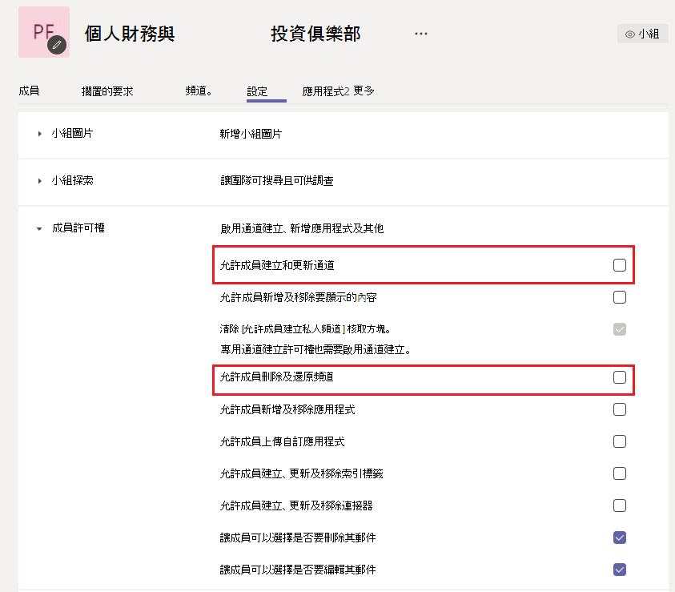
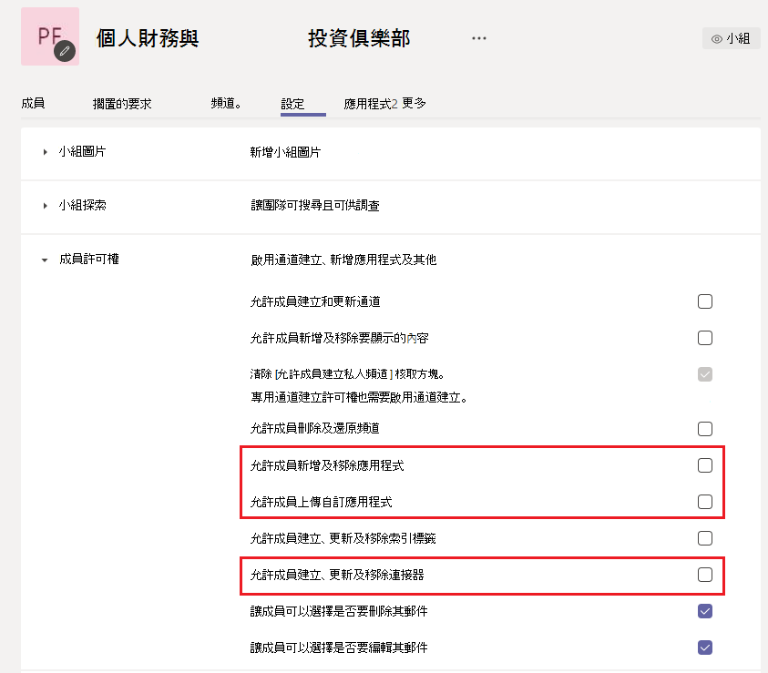
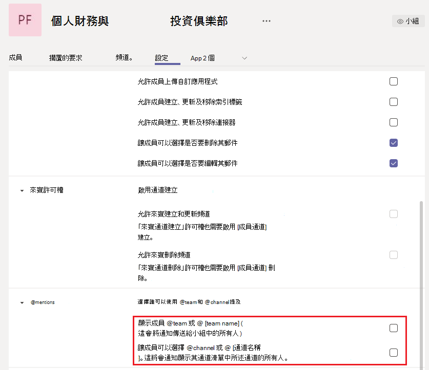

在 Microsoft Teams 中管理大型團隊 - 最佳做法
======================================================

Microsoft Teams 對於促進與數十個成員和數千個成員的大型群組之間的溝通，同樣有效率。 查看 [Teams 的限制和](limits-specifications-teams.md) 規格，以更新團隊大小。 團隊規模增加會導致獨特的管理和營運挑戰。 本文將說明建立及管理由數千個成員組成的大型團隊的最佳作法。

## 大型團隊的價值

大型團隊在啟用下列共同合作案例時非常實用：

- **全部門** 共同作業：如果貴組織有多個部門，例如財務、營運、R&D 等，您可以建立一個包含特定部門所有成員的單一小組。 現在，所有與部門相關的通訊都可以在這個小組中共用，這有助於成員立即聯繫和互動。

- **員工資源群組中的** 共同作業：組織通常擁有屬於不同部門或工作組之具有共同興趣的大型人員群組。 舉個例說，可以有一組人對個人財務與投資有一種熱情。 在大型組織中通常很難進行聯繫。 若要為這類群組開發社群，租使用者管理員可以建立大型團隊，做為全公司的公用資源群組，任何人都可以加入並利用。 這些社群最後會收集新成員和現有成員都可以享用的資訊。

- **內部和外部成員** 之間的共同合作：熱門產品通常會開發一個早期採用者社群，他們樂於嘗試新產品發行並提供意見回饋。 早期採用者與產品群組建立關係，協助塑造產品。 在這類情況下，租使用者系統管理員可以設定一個包含內部產品群組和外部產品評估員的大型小組，以利豐富的產品開發程式。 這些團隊也可以為一組選取的客戶提供客戶支援。

## 從現有的群組建立團隊

使用連絡人群組、安全性群組或 Office 群組來快速啟動您的小組。 您可以匯出群組以建立團隊，或從 Office 群組建立團隊。

**將群組匯出** 成團隊：當您將最多 3，500 個成員的群組導入 Teams 時，Teams 會自動計算群組中的成員總數。 這是一次只進行一次導入，因此群組中未來的變更不會在 Teams 中自動更新。

**從大型 Microsoft 365** 群組建立團隊：當您從大型 Microsoft 365 群組建立團隊時，成員會自動成為 Microsoft 365群組和團隊的一部分。 日後，當團隊成員加入或離開 Microsoft 365 群組時，系統會自動新增或移除他們。

## 大量匯進/匯出/移除團隊中的成員

Azure 入口網站可讓使用者大量匯進/匯出/移除 Microsoft 365 群組中的成員。 詳細資訊請參閱大量導入 [群組成員](https://docs.microsoft.com/azure/active-directory/enterprise-users/groups-bulk-import-members#to-bulk-import-group-members)。

由於每個團隊都有 Microsoft 365 群組的支援，因此您可以使用 Azure 入口網站，在對應該團隊的群組中執行這些作業。 成員作業將在 24 小時內反映在團隊中。

## 建立頻道來聚焦討論

您可以建立焦點頻道，以縮小群組討論範圍。 請參閱 [組織團隊的最佳作法](best-practices-organizing.md)。

## 限制頻道建立

如果允許任何團隊成員建立頻道，該團隊可以擁有頻道頻道。 團隊擁有者應該在設定或成員許可權中，為成員關閉頻道 **>、更新、刪除和還原**。 請參閱 [團隊和頻道概觀](teams-channels-overview.md)。

## 新增最愛的頻道

若要加速新的使用者互動和內容探索，您可以選取使用者預設可以使用的最愛頻道。 在 **系統管理中心的** 頻道窗格中，查看顯示成員 **欄下的頻道** 。

 詳情 [請參閱建立您的第一個團隊和](get-started-with-teams-create-your-first-teams-and-channels.md) 頻道。

## 在大型團隊中規範應用程式和 Bot

為了避免新增令人分心的應用程式或 Bot，團隊擁有者可以停用、新增、移除及上傳團隊成員的應用程式和連接器。 在系統管理中心的設定> **成員許可權下**，取消勾選允許成員新增 App 或連接器的三個選項。

請參閱 [應用程式、bot、&連接器](deploy-apps-microsoft-teams-landing-page.md)。

## 規範團隊和頻道提及

團隊和頻道提及可用來吸引整個團隊對特定頻道文章的注意。 在文章使用提及後，會向數千名小組成員收到通知。 如果通知過於頻繁，小組成員可能會負擔過重，而且可能會向團隊擁有者抱怨。 若要避免提及團隊或頻道，請取消勾選團隊設定窗格中的 **> @mentions提及。**

## 請考量在您的頻道中設定仲裁

小組擁有者可以針對頻道開啟仲裁，以控制誰可以開始新的文章，以及回覆該頻道中的文章。 當您設定仲裁時，您可以選擇讓一或多個小組成員成為仲裁者。 團隊擁有者預設為仲裁者。 詳細資訊請參閱設定 [及管理通道的審核](manage-channel-moderation-in-teams.md)。

## 相關主題

- [組織 Teams 的最佳作法](best-practices-organizing.md)
- [建立全組織團隊](create-an-org-wide-team.md)
