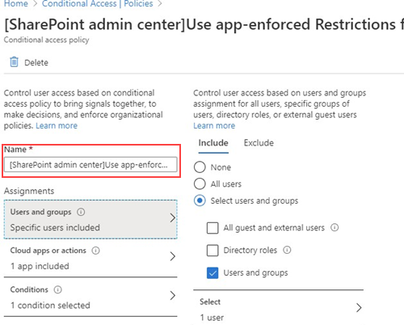

# 封鎖特定使用者對 SharePoint 的存取權Block access to SharePoint for specific users

在 Microsoft 365 的 SharePoint 中，將任何條件式存取 (CA) 原則，也會套用至小組。Applying any Conditional Access (CA) policy on SharePoint in Microsoft 365 is also applied to Teams. 不過，某些組織想要封鎖 SharePoint 檔案的存取權 (上傳、下載、查看、編輯、建立) 但仍允許員工在未受管理的裝置上使用小組桌面、行動裝置和 web 用戶端。However, some organizations want to block access to SharePoint files (upload, download, view, edit, create) yet allow their employees to use Teams desktop, mobile, and web clients on unmanaged devices. 在 CA 原則規則底下，封鎖 Sharepoint 也會導致封鎖小組。Under the CA policy rules, blocking Sharepoint would lead to blocking Teams as well. 本文說明如何解決這項限制，並允許員工繼續使用團隊，同時完全封鎖對儲存在 SharePoint 中的檔案的存取權。This article explains how you can work around this limitation and allow your employees to continue using Teams while completely blocking access to files stored in SharePoint.

> [!Note]
> 受管理的裝置上的封鎖或限制存取依賴于 Azure AD 條件式存取原則。Blocking or limiting access on unmanaged devices relies on Azure AD conditional access policies. 瞭解 [AZURE AD 授權](https://azure.microsoft.com/pricing/details/active-directory/)。Learn about [Azure AD licensing](https://azure.microsoft.com/pricing/details/active-directory/). 如需 Azure AD 中的條件式存取權概覽，請參閱 [Azure Active Directory 中的條件式存取](https://docs.microsoft.com/azure/active-directory/conditional-access/overview)。For an overview of conditional access in Azure AD, see [Conditional access in Azure Active Directory](https://docs.microsoft.com/azure/active-directory/conditional-access/overview). 如需建議的 SharePoint Online 存取原則的相關資訊，請參閱 [保護 sharepoint 網站和檔案的原則建議](https://docs.microsoft.com/microsoft-365/enterprise/sharepoint-file-access-policies)。For info about recommended SharePoint Online access policies, see [Policy recommendations for securing SharePoint sites and files](https://docs.microsoft.com/microsoft-365/enterprise/sharepoint-file-access-policies). 如果您在未受管理的裝置上限制存取，受管理的裝置上的使用者必須使用其中一個 [受支援的作業系統和瀏覽器混合](https://docs.microsoft.com/azure/active-directory/conditional-access/technical-reference#client-apps-condition)，否則它們也會有有限的存取權。If you limit access on unmanaged devices, users on managed devices must use one of the [supported OS and browser combinations](https://docs.microsoft.com/azure/active-directory/conditional-access/technical-reference#client-apps-condition), or they will also have limited access.

您可以封鎖或限制存取：You can block or limit access for:

- 組織中的使用者或只有部分使用者或安全性群組。Users in the organization or only some users or security groups.

- 組織中的所有網站或只在部分網站中。All sites in the organization or only some sites.

當存取權封鎖時，使用者會看到錯誤訊息。When access is blocked, users will see an error message. 封鎖存取可協助提供安全性並保護安全的資料。Blocking access helps provide security and protects secure data. 當存取權封鎖時，使用者會看到錯誤訊息。When access is blocked, users will see an error message.

1. 開啟 SharePoint 系統 [管理中心](https://admin.microsoft.com/sharepoint?page=accessControl&modern=true)。Open the SharePoint [Admin Center](https://admin.microsoft.com/sharepoint?page=accessControl&modern=true).

2. 展開 [**原則**  >  **存取原則**]。Expand **Policies** > **Access Policies**.

3. 在 [ **未管理的裝置** ] 區段中，選取 [ **封鎖存取** ] 並選取 [ **儲存**]。In the **Unmanaged Devices** section,  select **Block Access** and select **Save**.

   ![原則的 [未受管理的裝置] 區段](media/no-sharepoint-access1.png)

4. 開啟 [Azure Active Directory](https://portal.azure.com/#blade/Microsoft_AAD_IAM/ConditionalAccessBlade/Policies) 入口網站，然後流覽至 [ **條件式存取原則**]。Open the [Azure Active Directory](https://portal.azure.com/#blade/Microsoft_AAD_IAM/ConditionalAccessBlade/Policies) portal and navigate to **Conditional Access Policies**.

    您會看到 SharePoint 建立了一個類似這個範例的新原則：You'll see a new policy has been created by SharePoint that's similar to this example:

    

5. 將原則更新為僅以特定使用者或群組為目標。Update the policy to target only specific users or a group.

    ![[Sharepoint 系統管理中心] 醒目提示 [選取使用者] 區段。](media/no-sharepoint-access2b.png)

  > [!Note]
> 設定此原則將會切斷您對 SharePoint 系統管理入口網站的存取權。Setting this policy will cut your access to the SharePoint admin portal. 建議您設定排除原則，並選取全域和 SharePoint 系統管理員。We recommended that you configure the exclusion policy and select the Global and SharePoint admins.

6. 確認只選取 [SharePoint] 作為 [目標雲端] AppVerify that only SharePoint is selected as targeted Cloud App

    ![已選取 [Sharepoint] 作為目標 app。](media/no-sharepoint-access3.png)

7. 更新 **條件** 以包含桌面用戶端。Update **Conditions** to include desktop clients, as well.

    

8. 確認已啟用 **[授與存取權** ]Make sure that **Grant access** is enabled

    ![已啟用 [授與存取權]。](media/no-sharepoint-access5.png)

9. 請確定已啟用 [ **使用 app 強制性限制** ]。Make sure **Use app enforced restrictions** is enabled.

10. 啟用您的原則，然後選取 [ **儲存**]。Enable your policy and select **Save**.

    

若要測試原則，您必須從任何用戶端（例如團隊桌面應用程式或商務用 OneDrive 同步處理用戶端）登出，然後再次登入，以查看原則是否正常運作。To test your policy, you need to sign out from any client such as the Teams desktop app or the OneDrive for Business sync client and sign in again to see the policy working. 如果您的存取權遭到封鎖，就會在小組中看到一則訊息，指出該專案可能不存在。If your access has been blocked, you'll see a message in Teams that states the item might not exist.

 ![[找不到專案] 訊息。](media/access-denied-sharepoint.png)

在 Sharepoint 中，您會收到「拒絕存取」的訊息。In Sharepoint, you'll receive an access denied message.

![[拒絕存取] 訊息。](media/blocked-access-warning.png)

## 相關主題Related topics

[在 SharePoint 中控制非託管裝置的存取權Control access for unmanaged devices in SharePoint](https://docs.microsoft.com/sharepoint/control-access-from-unmanaged-devices)
