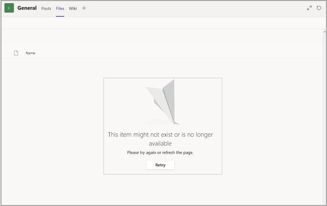

# 封鎖特定使用者對 SharePoint 的存取Block access to SharePoint for specific users

在 Microsoft 365 中對 SharePoint 套用任何條件式存取 (CA) 原則也會套用至 Teams。Applying any Conditional Access (CA) policy on SharePoint in Microsoft 365 is also applied to Teams. 但是，有些組織希望封鎖對 SharePoint 檔案的存取 (上載、下載、檢視、編輯、建立)，但允許其員工在未受管理的裝置上使用Teams 桌面、行動裝置和 web 用戶端。However, some organizations want to block access to SharePoint files (upload, download, view, edit, create) yet allow their employees to use Teams desktop, mobile, and web clients on unmanaged devices. 根據 CA 原則規則，封鎖 SharePoint 也會導致封鎖 Teams。Under the CA policy rules, blocking Sharepoint would lead to blocking Teams as well. 本文將解釋如何克服這一限制，允許員工繼續使用 Teams，同時完全封鎖對存儲在 SharePoint 中的檔的存取。This article explains how you can work around this limitation and allow your employees to continue using Teams while completely blocking access to files stored in SharePoint.

> [!Note]
> 封鎖或限制對未受管理裝置的存取取決於 Azure AD 條件式存取原則。Blocking or limiting access on unmanaged devices relies on Azure AD conditional access policies. 深入了解[Azure AD 授權](https://azure.microsoft.com/pricing/details/active-directory/)。Learn about [Azure AD licensing](https://azure.microsoft.com/pricing/details/active-directory/). 有關 Azure AD 中條件式存取的概覽，請參閱 [Azure Active Directory 中的條件式存取](https://docs.microsoft.com/azure/active-directory/conditional-access/overview)。For an overview of conditional access in Azure AD, see [Conditional access in Azure Active Directory](https://docs.microsoft.com/azure/active-directory/conditional-access/overview). 有關推薦的 SharePoint Online 存取原則的資訊，請參閱 [用於保護 SharePoint 網站和檔的原則建議](https://docs.microsoft.com/microsoft-365/enterprise/sharepoint-file-access-policies)。For info about recommended SharePoint Online access policies, see [Policy recommendations for securing SharePoint sites and files](https://docs.microsoft.com/microsoft-365/enterprise/sharepoint-file-access-policies). 如果限制未受管理裝置上的存取，則受管理裝置上的使用者必須使用其中一個[受支援的作業系統和流覽器組合](https://docs.microsoft.com/azure/active-directory/conditional-access/technical-reference#client-apps-condition)，否則他們的存取權限也將受到限制。If you limit access on unmanaged devices, users on managed devices must use one of the [supported OS and browser combinations](https://docs.microsoft.com/azure/active-directory/conditional-access/technical-reference#client-apps-condition), or they will also have limited access.

您可以封鎖或限制存取：You can block or limit access for:

- 組織中的使用者，或僅部分使用者或安全性群組。Users in the organization or only some users or security groups.

- 組織中的所有網站或僅部分網站。All sites in the organization or only some sites.

存取被封鎖時，使用者將看到一條錯誤消息。When access is blocked, users will see an error message. 封鎖存取有助於提供安全性並保護安全資料。Blocking access helps provide security and protects secure data. 存取被封鎖時，使用者將看到一條錯誤消息。When access is blocked, users will see an error message.

1. 開啟 SharePoint 系統管理中心。Open the SharePoint Admin Center.

2. 展開 **[原則]** > **[存取原則]**。Expand **Policies** > **Access Policies**.

3. 在 **[未受管理的裝置]** 區段中，選取 **[封鎖存取]**，然後選取 **[儲存]**。In the **Unmanaged Devices** section,  select **Block Access** and select **Save**.

   ![原則的 [未受管理的裝置] 區段](media/no-sharepoint-access1.png)

4. 開啟 [Azure Active Directory](https://portal.azure.com/#blade/Microsoft_AAD_IAM/ConditionalAccessBlade/Policies) 入口網站並瀏覽至 **[條件式存取原則]**。Open the [Azure Active Directory](https://portal.azure.com/#blade/Microsoft_AAD_IAM/ConditionalAccessBlade/Policies) portal and navigate to **Conditional Access Policies**.

    您將看到 SharePoint 建立了新原則，與此範例類似：You'll see a new policy has been created by SharePoint that's similar to this example:

    ![名為 [使用應用程式強制限制流覽器存取] 的新原則](media/no-sharepoint-access2.png)

5. 更新原則以僅針對特定使用者或組。Update the policy to target only specific users or a group.

    ![醒目提示 [選取使用者] 區段的 SharePoint 系統管理中心。](media/no-sharepoint-access2b.png)

  > [!Note]
> 設定此原則將切斷您對 SharePoint 系統管理入口網站的存取權限。Setting this policy will cut your access to the SharePoint admin portal. 我們建議您設定排除原則並選取全域管理員和 SharePoint 管理員。We recommended that you configure the exclusion policy and select the Global and SharePoint admins.

6. 驗證是否僅選取 SharePoint 作為目標 [雲端應用程式]Verify that only SharePoint is selected as targeted Cloud App

    

7. 更新 **[條件]** 以包括桌面用戶端。Update **Conditions** to include desktop clients, as well.

    

8. 確保已啟用 **授與存取權**Make sure that **Grant access** is enabled

    

9. 請確保已啟用 **[使用應用程式強制限制]**。Make sure **Use app enforced restrictions** is enabled.

10. 啟用策略並選取 **[儲存]**。Enable your policy and select **Save**.

    

若要測試您的原則，您需要從任何用戶端（如 Teams 桌面應用程式或商務用 OneDrive 同步處理用戶端）登出，然後重新登入以查看原則是否有效。To test your policy, you need to sign out from any client such as the Teams desktop app or the OneDrive for Business sync client and sign in again to see the policy working. 如果您的存取已被封鎖，您將在 Teams 中看到指出該項目可能不存在的訊息。If your access has been blocked, you'll see a message in Teams that states the item might not exist.

 

在 Sharepoint 中，您將收到拒絕存取的訊息。In Sharepoint, you'll receive an access denied message.

## 相關主題Related topics

[在 SharePoint 中控制對未受管理裝置的存取Control access for unmanaged devices in SharePoint](https://docs.microsoft.com/sharepoint/control-access-from-unmanaged-devices)
