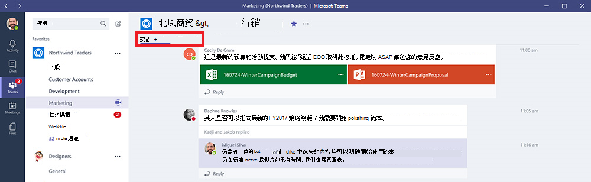
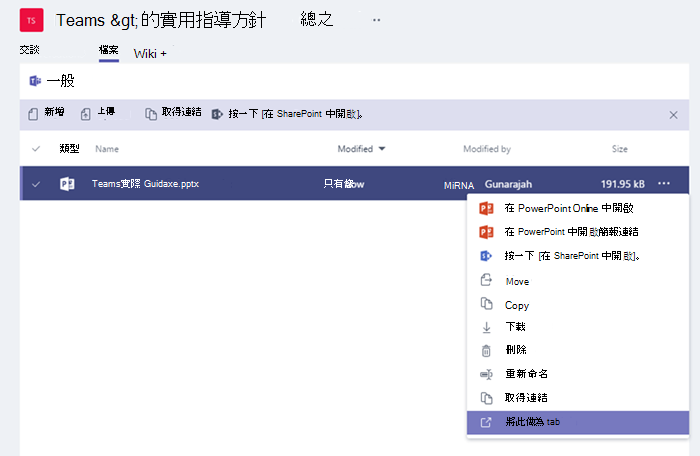
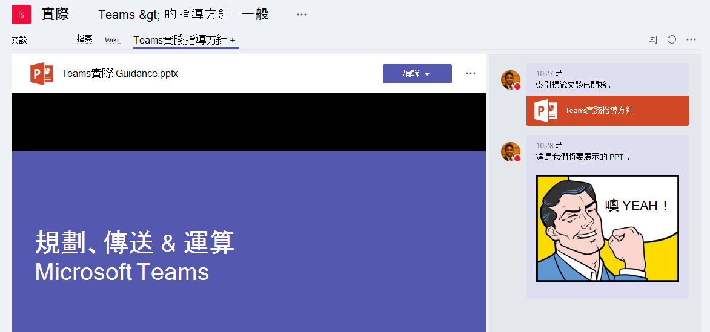

使用內建和自訂的Microsoft Teams
==================================================

使用定位停駐點，小組成員可以存取頻道或聊天中專用空間中的服務和內容。 這可讓小組直接使用工具和資料，並且與工具和資料進行交談，而所有內容都位於頻道或聊天中。

擁有者與團隊成員可以在頻道、私人聊天和群組聊天中新增索引標籤，協助整合其雲端服務。 您可以新增定位停駐點，協助使用者輕鬆存取及管理所需的資料，或與大部分使用者互動。 這可以是一個Power BI、儀表板，甚至是[您發佈](https://go.microsoft.com/fwlink/?linkid=855785)訓練影片的 Microsoft Stream 影片頻道。

>[!Note]
> 從使用 Microsoft Stream 變更為使用[商務用 OneDrive 和 SharePoint 來進行會議錄製](tmr-meeting-recording-change.md)，將會採取階段性的方式。推出時您將可以加入此體驗。在 11 月，如果您想要繼續使用 Stream，則必須退出體驗。在 2021 年初的某個時候，我們將要求所有客戶對新會議錄製使用商務用 OneDrive 和 SharePoint。

## 使用定位字元

- 根據預設，每一個新頻道都會提供兩個選項卡：交談和檔案。

    
- 根據預設，每一個私人聊天都會提供四個選項卡：交談、檔案、組織和活動。

    

- 擁有者和小組成員可以按一下新增 Tab 按鈕的 Tab 螢幕快照，顯示 +符號，以在頻道或聊天中新增  位於頻道或聊天頂端。

- Excel、PowerPoint、Word 和 PDF 檔案必須上傳到檔案標籤，才能轉換成定位字元。 只要按一下即可將任何現有的上傳檔案轉換成定位停駐點，如下所示。

    

- 若要新增網站，URL 必須以 **HTTPs** 首碼開頭，以便交換的資訊保持安全。

- 當團隊成員嘗試在頻道或聊天中新增自訂定位停駐點時，會提供詳細指示。 將自訂的定位停駐點新加到頻道時，會建立 **Tab** 交談，讓小組成員對內容進行焦點討論。

    

## 開發自訂的定位停駐點

除了內建的定位停駐點之外，您還可以設計及開發自己的定位停駐點，Teams與社群其他人共用。 如需詳細資訊，請參閱我們的[開發人員文件](/microsoftteams/platform/tabs/what-are-tabs)。

---
