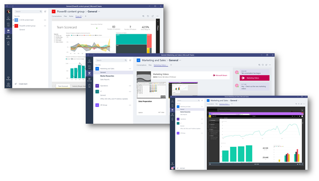

在 Microsoft 團隊中使用內建和自訂索引標籤Use built-in and custom tabs in Microsoft Teams
==================================================

索引標籤可讓小組成員存取頻道內或聊天中的專用空間中的服務與內容。Tabs allow team members to access services and content in a dedicated space within a channel or in a chat. 這可讓小組直接使用工具和資料，並在頻道或聊天的內容內，提供有關工具和資料的交談。This lets the team work directly with tools and data, and have conversations about the tools and data, all within the context of the channel or chat.

擁有者和小組成員可以在頻道、私人聊天和群組聊天中新增索引標籤，以協助整合其雲端服務。Owners and team members can add tabs to a channel, private chat, and group chat to help integrate their cloud services. 您可以新增索引標籤，協助使用者輕鬆存取及管理他們所需的資料，或與最多的資料互動。Tabs can be added to help users easily access and manage the data they need or interact with the most. 這可以是 Power BI 報表、儀表板，或甚至是[Microsoft 串流](https://go.microsoft.com/fwlink/?linkid=855785)視頻通道，您可以在這裡發佈訓練影片。This can be a Power BI report, a dashboard, or even a [Microsoft Stream](https://go.microsoft.com/fwlink/?linkid=855785) video channel where you publish training videos.

## 使用索引標籤Work with tabs

- 在每個新頻道中，預設都會提供兩個索引標籤： [交談] 和 [檔案]。With every new channel, two tabs are provisioned by default: Conversations and Files.

    ![行銷團隊之 [交談] 區段的螢幕擷取畫面。](media/Use_built-in_and_custom_tabs_in_Microsoft_Teams_image1.png)
- 透過每個私人聊天，預設都會提供四個索引標籤： [交談]、[檔案]、[組織] 和 [活動]。With every private chat, four tabs are provisioned by default: Conversations, Files, Organization, and Activity.

    

- 擁有者和小組成員可以按一下 [新增索引標籤] 按鈕的 [新增索引標籤 **]** Owners and team members can add more tabs to a channel or chat by clicking **Add a tab**  在頻道或聊天的頂端。at the top of the channel or chat.

- Excel、PowerPoint、Word 和 PDF 檔案**必須上傳至 [檔案**] 索引標籤，才能轉換為索引標籤。Excel, PowerPoint, Word, and PDF files must be uploaded to the **Files** tab before they can be converted to tabs. 只要按一下，任何現有的上傳檔案就可以轉換成索引標籤，如下所示。Any existing uploaded file can be converted to a tab with a single click, as shown below.

    ![已選取 PowerPoint 檔案之 [檔案] 索引標籤的螢幕擷取畫面。](media/Use_built-in_and_custom_tabs_in_Microsoft_Teams_image2.png)

- 若要新增網站，URL 必須以**HTTPs**首碼開頭，才能讓交換的資訊保持安全。To add a website, the URL must start with an **https** prefix so information that's exchanged remains secure.

- 當小組成員嘗試將自訂索引標籤新增至其頻道或聊天時，會提供詳細指示。Detailed instructions are provided when a team member tries to add a custom tab to their channel or chat. 在頻道中新增自訂索引標籤時，會建立一個 [索引標籤**交談]** ，讓小組成員能夠對內容進行專門的討論。When a custom tab is added to a channel, a **Tab conversation** is created that allows team members to have focused discussions about the content.

    ![[自訂] 索引標籤的螢幕擷取畫面，右側有一個索引標籤交談](media/Use_built-in_and_custom_tabs_in_Microsoft_Teams_image3.png)

## 開發自訂索引標籤Develop custom tabs

除了內建索引標籤之外，您還可以設計及開發自己的索引標籤，以整合至小組或與其他群組共用。In addition to the built-in tabs, you can design and develop your own tabs to integrate to Teams or share with the rest of the community. 您可以設定適當的 Office 365 群組，[以控制對您的自訂](https://docs.microsoft.com/microsoftteams/platform/get-started/design#streamline-access)索引標籤的存取權。You can [control access to your custom tab](https://docs.microsoft.com/microsoftteams/platform/get-started/design#streamline-access) by configuring the appropriate Office 365 Groups.

Microsoft 開發人員網路提供 Microsoft 所開發的[範例](https://docs.microsoft.com/MicrosoftTeams/platform/samples/code-samples)索引標籤，以及設計及建立您自己的索引標籤的[詳細指示](https://docs.microsoft.com/MicrosoftTeams/platform/tabs/design/tabs)。The Microsoft Developer Network provides [sample tabs](https://docs.microsoft.com/MicrosoftTeams/platform/samples/code-samples) developed by Microsoft that you can download, and [detailed instructions](https://docs.microsoft.com/MicrosoftTeams/platform/tabs/design/tabs) for designing and building your own tabs.

![Microsoft 團隊中 [自訂] 索引標籤範例的螢幕擷取畫面。](media/Use_built-in_and_custom_tabs_in_Microsoft_Teams_image5.png)

---
