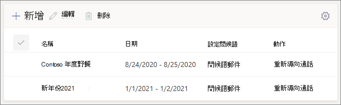

# 設定自動助理 - 小型企業教學課程

自動電話機可讓人打電話給您的組織，並流覽功能表系統，與正確的部門、通話佇列、人員或接線生通話。 您可以使用 Microsoft Teams 系統管理中心為貴組織建立自動話務員。

#### 開始之前

從組織外部直接撥號，取得自動總機所需的服務號碼。 這可能包括 [從另一個提供者移轉號碼](../phone-number-calling-plans/transfer-phone-numbers-to-teams.md) 或 [要求新的服務號碼](../getting-service-phone-numbers.md)。

取得 [電話系統 - 針對](../teams-add-on-licensing/virtual-user.md) 您計畫建立的每個自動話務員取得虛擬使用者授權。 這些授權是免費的，因此我們建議您額外取得一些授權，以防您決定日後變更您的設定。

如果您想要在假日以不同方式讓自動電話機路由通話，請建立您想要使用的假日，然後再建立自動總機。

#### 請遵循下列步驟來設定自動助理

# [步驟 1   電話號碼](#tab/phone-number)

您建立的每個自動助理都需要資源帳戶。 這類似于使用者帳戶，除了該帳戶與自動通話或通話佇列相關聯，而不是與人員相關聯。 在此步驟中，我們會建立帳戶、指派 *Microsoft 365 電話系統 - 虛擬使用者* 授權，然後指派服務號碼。

### 建立資源帳戶

您可以在 Teams 系統管理中心建立資源帳戶。

1. 在 Teams 系統管理中心，展開 **整個組織設定**，然後按一下 [ **資源帳戶**。

2. 按一下 [新增 **]**。

3. 在新增 **資源帳戶窗格中**，填寫 **顯示名稱**、**使用者名稱**，然後選擇資源帳戶類型的 **自動助理**

    

4. 按一下 [儲存]。

    新帳戶會顯示在帳戶清單中。

    

### 指派授權

您必須將 *Microsoft 365 Phone System - 虛擬使用者* 授權指派給資源帳戶。

1. 在 Microsoft 365 系統管理中心，按一下要指派授權的資源帳戶。

2. On the **Licenses and Apps** tab, under **Licenses**, select **Microsoft 365 Phone System - Virtual User**.

3. 按一下 **[儲存變更**。

    

### 指派服務編號

如果您需要讓電話號碼可以聯繫到這個自動助理，請指派該號碼給資源帳戶。

1. 在 Teams 系統管理中心中的 [資源 **帳戶** > 頁面上，選取要指派服務號碼的資源帳戶，然後按一下 [ **指派/取消指派**> 。

2. 在 **電話號碼類型** 下拉式下拉清單中，選擇您想要使用的號碼類型。

3. 在 **[指派的電話號碼>** 方塊中，搜尋您用的電話號碼，然後按一下 [ **新增**。

    

4. 按一下 [儲存]。

> [!div class="nextstepaction"]
> [步驟 2 - 自動總>](/microsoftteams/business-voice/create-a-phone-system-auto-attendant-smb?tabs=general-info#steps)

# [步驟 2   Attendant 一般資訊](#tab/general-info)

設定自動話務員

1. 在 Teams 系統管理中心，展開 **[語音，** 按一下 **自動語音留言**，然後按一下 [ **新增**。

2. 在頂端方塊中輸入自動助理的名稱。

3. 如果您想要指定運算子，請指定撥打給接線員的目的地。 這是選擇性選項 (，但建議使用) 。 您可以將 **運算子選項設定** 為允許來電者中斷功能表，並和指定的人員通話。

4. 指定此自動助理的時區。 如果您為小時後建立個別的通話流程，則時區會用來計算上班時間。

5. 指定此自動翻譯的語言。 這是系統產生的語音提示所使用的語言。

6. 選擇是否要啟用語音輸入。 啟用時，每個功能表選項的名稱會變成語音辨識關鍵字。 例如，來電者可以說「One」，以選取對應到按鍵 1 的功能表選項，或說「銷售」以選取名為「銷售」的功能表選項。

    

7. 按一下 **[下一步**。

> [!div class="nextstepaction"]
> [步驟 3 - 通話流程>](/microsoftteams/business-voice/create-a-phone-system-auto-attendant-smb?tabs=call-flow#steps)

# [步驟 3   通話流程](#tab/call-flow)

選擇您的通話流程選項

1. 選擇當自動回應接聽來電時，是否要播放問候語。

    如果您選取 **播放音訊檔案，** 您可以使用上傳檔案按鈕來上傳儲存為音訊的錄製問候語訊息。Wav。MP3 或 。WMA 格式。 錄製內容不能大於 5 MB。

    如果您選取輸入問候語 **訊息** ，當自動回應接聽來電時，系統會朗讀您輸入 (最多 1000 個字元) 文字。

    

2. 選擇通話的路由方式。

    如果您選取中斷 **連接**，自動電話機會掛斷通話。

    如果您選取 **重新導向通話**，您可以選擇其中一個呼叫路由目的地。

    如果您選取了 **播放功能表選項**，您可以選擇播放音訊檔案或輸入問候語訊息，然後選擇功能表選項和目錄搜尋。

    

3. 如果您希望來電者使用撥號鍵流覽，然後在設定功能表選項下，選擇當來電者按撥號鍵時要發生的專案。  (如果您要將這個自動助理建立為公司目錄，請保留撥號鍵選項空白。) 

    您可以將任何撥號鍵設定為下列目的地：

    - **組織中可以接聽** 語音通話的人。
    - **語音應用程式** - 另一個自動語音留言機或通話佇列。
    - **外部電話號碼** - 任何電話號碼。 使用此格式：+[國碼][區碼][電話號碼]
    - **語音** 信箱 - 與您指定的 Microsoft 365 群組相關聯的語音信箱。
    - **運算子** - 為自動話務員定義的運算子。 定義運算子是選擇性的。 運算子可定義為此清單的其他目的地。

    我們建議您將 0 鍵設定為運算子。

    針對每個功能表選項，指定下列專案：

    - **撥號鍵** - 電話鍵臺上的按鍵，以存取此選項。

    - **Voice 命令** - 定義來電者可給予存取此選項的語音命令 ，如果已啟用語音輸入。 它可以包含多個字詞，例如「客戶服務」或「營運與理由」。 

    - **重新導向** 至 -當來電者選擇此選項時，您希望通話前往何處。 如果您要重新導向到自動電話機或通話佇列，請選擇與其相關聯的資源帳戶。

    

4. 如果您想要使用此自動總機做為公司目錄，請在目錄搜尋 **下，選取****按名稱撥號**。 當您啟用此選項時，來電者可以說出使用者的名稱，或在電話鍵臺上輸入。 任何擁有電話系統授權的線上使用者都是合格的使用者，而且可以使用名稱撥號。 

     (**您可以選擇分機撥號**，不過擴充功能必須在 Azure Active Directory.) 

5. 選取目錄搜尋 **選項之後，** 請按一下 [ **下一步**。

> [!div class="nextstepaction"]
> [步驟 4 - 數小時後通話流程>](/microsoftteams/business-voice/create-a-phone-system-auto-attendant-smb?tabs=after-hours#steps)

# [步驟 4   小時之後](#tab/after-hours)

您可以針對每個自動話務員設定上班時間。 如果未設定上班時間，則一天中所有的天數和所有時數會視為上班時間，因為預設會設定 24/7 排程。 工作時間可以設定為一天中的休息時間，所有未設定為上班時間的時數會視為後小時。 您可以為工作時間設定不同的來電處理選項和問候語。

根據您如何配置自動電話機和通話佇列，您可能只需要為具有直接電話號碼的自動電話機指定後通話路由。

如果您想要為非工作時間的來電者個別進行通話路由，請為每天指定您的上班時間。 例如 **，按一下 [新增時間** 以指定指定一天的陣列時數，以指定午餐休息時間。

一旦指定您的上班時間，然後選擇您的通話路由選項以在數小時後進行。 在步驟 **3**- 通話流程中指定的上班時間通話路由，也提供相同的選項。

完成後 **，** 請按一下 [下一步。

> [!div class="nextstepaction"]
> [步驟 5 - 假日通話流程>](/microsoftteams/business-voice/create-a-phone-system-auto-attendant-smb?tabs=holidays#steps)

# [步驟 5   假日](#tab/holidays)

您可以讓撥打到自動電話機的通話在假日的路由方式與其他日期不同。  (如果您不想為假日使用不同的通話流程，您可以略過此步驟。) 

您的自動電話機可以針對您設定的每個假日設定通話流程。 您最多可以將 20 個排定的假日加到每個自動乘務員。

1. 在 [假日通話設定」 頁面上，按一下 [ **新增**。

2. 輸入此假日設定的名稱。

3. 從假日 **下** 拉下拉，選擇您想要使用的假日。

4. 選擇您想要使用的問候語類型。

    

5. 選擇是否要中斷 **連接或****重新導向** 通話。

6. 如果您選擇重新導向，請選擇通話的呼叫路由目的地。

    

7. 按一下 [儲存]。

    針對每一個額外的假日，根據需要重複此程式。
    
    
    
    當您新增所有假日後，請按一下 [ **下一步**。

> [!div class="nextstepaction"]
> [步驟 6 - 選擇目錄中的>](/microsoftteams/business-voice/create-a-phone-system-auto-attendant-smb?tabs=dial-scope#steps)

# [步驟 6   目錄成員](#tab/dial-scope)

撥號 *範圍* 會定義當來電者使用撥號名稱或撥號分機時，哪些使用者可在目錄中使用。 所有線上 **使用者的預設值** 包含貴組織中具有電話系統授權之線上使用者的所有使用者。

您可以選取包含或排除下的自訂使用者群組，並選擇一或多個Microsoft 365 群組、通訊群組清單或安全性群組，以包含或排除特定使用者。  例如，您可能會想要將貴組織的主管排除在撥號目錄中。  (如果使用者同時位於這兩個清單中，就會被排除在目錄中。) 

> [!NOTE]
> 新使用者最多可能需要 36 小時，才能將名稱列在目錄中。

設定好撥號範圍之後，請按一下 [ **下一步**。

> [!div class="nextstepaction"]
> [步驟 7 - 指派資源帳戶>](/microsoftteams/business-voice/create-a-phone-system-auto-attendant-smb?tabs=resource-accounts#steps)

# [步驟 7   資源帳戶](#tab/resource-accounts)

所有自動話務員都必須有相關聯的資源帳戶。  第一層自動總機至少需要一個具有關聯服務號碼的資源帳戶。 您可以根據需要，將多個資源帳戶指派給自動助理，每個帳戶都有個別的服務號碼。

新增資源帳戶

1. 按一下 **[** 新增並搜尋您想要新增的帳戶。 按一下 **[新增**，然後按一下 [ **新增**> 。

    

2. 當您完成新增服務帳戶後，請按一下 [ **提交>**。

    

    這會完成自動總機配置。

---

