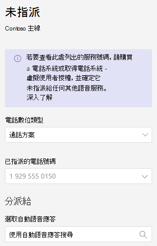

# 設定自動語音應答-小型企業教學課程

自動語音應答讓其他人打電話給您的組織，並流覽功能表系統，以與正確的部門通話、呼叫佇列、人員或接線員。 您可以使用 Microsoft 團隊系統管理中心為貴組織建立自動語音應答。

#### 開始之前

取得您想要的自動語音應答所需的服務號碼（透過從貴組織外撥號直接撥號即可）。 這可能包括 [從另一個提供者轉移號碼](../phone-number-calling-plans/transfer-phone-numbers-to-teams.md) 或 [要求新的服務號碼](../getting-service-phone-numbers.md)。

取得您打算建立之每個自動語音應答的 [電話系統-虛擬使用者授權](../teams-add-on-licensing/virtual-user.md) 。 這些授權是免費的，因此我們建議您先取得幾個額外的案例，以備日後決定變更您的設定。

如果您想讓自動語音應答傳送在假日上以不同方式呼叫，請在建立自動語音應答前， [建立您要使用的假日](../set-up-holidays-in-teams.md) 。

#### 請依照下列步驟來設定您的自動語音應答

# [步驟 1   電話號碼](#tab/phone-number)

您建立的每個自動助理都需要有資源帳戶。 這與使用者帳戶類似，只是帳戶與自動語音應答或通話佇列無關，而不是寄件者。 在此步驟中，我們會建立帳戶，將它指派為 *Microsoft 365 電話系統-虛擬使用者* 授權，然後指派服務號碼。

### 建立資源帳戶

您可以在 [團隊管理中心] 中建立資源帳戶。

1. 在 [團隊管理中心] 中，展開 [ **整個組織的設定**]，然後按一下 [ **資源帳戶**]。

2. 按一下 [ **新增**]。

3. 在 [**新增資源帳戶**] 窗格中，填寫 [**顯示名稱**]、[使用者名稱 **]，然後** 針對 **資源帳戶類型** 選擇 [**自動助理**]

    ![[新增資源帳戶] 使用者介面的螢幕擷取畫面](../media/resource-account-add.png)

4. 按一下 **[儲存]**。

新帳戶將會出現在帳戶清單中。

### 指派授權

您必須將 *Microsoft 365 電話系統-虛擬使用者* 授權指派給資源帳戶。

1. 在 Microsoft 365 系統管理中心，按一下您要指派授權的資源帳戶。

2. 在 [ **授權及應用程式** ] 索引標籤的 [ **授權**] 底下，選取 [ **Microsoft 365 電話系統-虛擬使用者**]。

3. 按一下 [ **儲存變更**]。

    

### 指派服務號碼

如果您需要電話號碼可達到這個自動助手，請將該號碼指派給資源帳戶。

1. 在團隊系統管理中心的 [ **資源帳戶** ] 頁面上，選取您要指派服務號碼的資源帳戶，然後按一下 [ **指派/取消指派**]。

2. 在 [ **電話號碼類型** ] 下拉式清單中，選擇您要使用的號碼類型。

3. 在 [ **已指派的電話號碼** ] 方塊中，搜尋您要使用的號碼，然後按一下 [ **新增**]。

    

4. 按一下 **[儲存]**。

> [!div class="nextstepaction"]
> [步驟 2-自動助理一般資訊 >](https://review.docs.microsoft.com/microsoftteams/business-voice/create-a-phone-system-auto-attendant-smb?branch=mikeplum-smb-voice&tabs=general-info#steps)

# [步驟 2   助理一般資訊](#tab/general-info)

設定自動語音應答

1. 在 [團隊管理中心] 中，展開 [語音]，按一下 [**自動****語音**]，然後按一下 [**新增**]。

2. 在頂端方塊中輸入自動語音應答的名稱。

3. 如果您想要指派運算子，請指定呼叫操作員的目的地。 這是選擇性 (但建議) 。 您可以設定 [ **運算子** ] 選項，讓呼叫者中斷功能表並向指定的人朗讀。

4. 指定此自動語音應答的時區。 如果您在下班後建立單獨的通話流程，則會使用時區來計算上班時間。

5. 指定此自動語音應答的語言。 這是將用於系統產生的語音提示的語言。

6. 選擇是否要啟用語音輸入。 啟用時，每個功能表選項的名稱都會變成語音辨識關鍵字。 例如，來電者可以說「一」，選取對應至鍵1的功能表選項，或者說「銷售」來選取名為「銷售」的功能表選項。

    ![[名稱]、[操作員]、[時區]、[語言] 和 [語音輸入] 的自動助理設定的螢幕擷取畫面](../media/auto-attendant-general-info-page-new.png)

7. 按一下 **[下一步]**。

> [!div class="nextstepaction"]
> [步驟 3-通話流程 >](https://review.docs.microsoft.com/microsoftteams/business-voice/create-a-phone-system-auto-attendant-smb?branch=mikeplum-smb-voice&tabs=call-flow#steps)

# [步驟 3   通話流程](#tab/call-flow)

選擇您的通話流程選項

1. 選擇當自動語音接聽來電時，是否要播放問候語。

    如果您選取 [ **播放音訊** 檔]，您可以使用 [ **上傳** 檔案] 按鈕，上傳儲存為音訊的錄製問候語訊息。WAV，。[MP3] 或。WMA 格式。 錄製不能大於 5 MB。

    如果您選取 [ **輸入問候語** ]，系統將會朗讀您在其中輸入文字的文字， (最多1000個字元) 當自動語音接聽來電時。

    

2. 選擇您要路由通話的方式。

    如果您選取 **[中斷連線]**，自動語音應答就會掛斷通話。

    如果您選取 [重新 **導向通話**]，您可以選擇其中一個呼叫路由目標。

    如果您選取 [ **播放] 功能表選項**，您可以選擇 **播放音訊** 檔案或 **輸入問候語** ，然後選擇 [功能表選項] 和 [目錄搜尋]。

    

3. 如果您希望呼叫者使用撥號鍵來流覽，請在 [ **設定功能表選項**] 底下，選擇要在來電者按下撥號鍵時所發生的情況。  (如果您是將此自動語音應答建立為公司目錄，請將 [撥號鍵選項] 留白。 ) 

    您可以將任何撥號鍵設定為下列目的地：

    - **組織中的人員** -您組織中能夠接聽語音通話的人員。
    - **語音 app** -另一個自動語音應答或通話佇列。
    - **外部電話號碼** -任何電話號碼。 使用此格式： + [國家/地區碼] [區域碼] [電話號碼]
    - **語音信箱** -與您指定的 Microsoft 365 群組相關聯的語音信箱。
    - **Operator** -為自動語音應答定義的運算子。 定義運算子是選擇性的。 操作員可以定義為此清單中的任何其他目的地。

    我們建議您設定0鍵至運算子。

    針對每個功能表選項，指定下列各項：

    - **撥號鍵** -電話鍵臺上的按鍵可存取此選項。

    - **Voice 命令** -定義來電者可提供的語音命令來存取此選項（如果已啟用語音輸入）。 它可以包含多個字詞，例如「客戶服務」或「作業與不限」。 

    - [**重定向至**]-來電者選擇此選項時，您想要撥打電話的位置。 如果您要重新導向自動語音應答或通話佇列，請選擇與其關聯的資源帳戶。

    ![[撥號鍵] 選項的螢幕擷取畫面](../media/auto-attendant-call-flow-menu-options-complete.png)

4. 如果您想要將這個自動語音應答做為公司目錄，請在 [ **目錄搜尋**] 底下，選取 [ **依名稱撥號**]。 當您啟用此選項時，呼叫者可以說出使用者的名稱，或在電話鍵臺上輸入密碼。 任何具備電話系統授權的線上使用者都是符合資格的使用者，而且可以使用 [按名稱撥號] 找到。 

     (您可以選擇 [透過 **延伸撥號**]，但是必須在 Azure Active Directory 中設定延伸。 ) 

5. 選取 **目錄搜尋** 選項之後，請按 **[下一步]**。

> [!div class="nextstepaction"]
> [步驟 4-下班後通話流程 >](https://review.docs.microsoft.com/microsoftteams/business-voice/create-a-phone-system-auto-attendant-smb?branch=mikeplum-smb-voice&tabs=after-hours#steps)

# [後4個工作的步驟 4  ](#tab/after-hours)

每個自動語音應答的上班時間都可以設定。 如果未設定上班時間，則當天的所有日期和所有的時間都被視為「上班時間」，因為預設會設定24/7 排程。 您可以在一天中使用時段來設定上班時間，而且所有未設為「上班時間」的小時都會被視為時間。 您可以設定不同的來電處理選項和問候語（在下班後）。

視您設定自動語音應答及呼叫佇列的方式而定，您可能只需要使用直接電話號碼，指定自動語音接聽的時間呼叫路由。

如果您想要在下班後的呼叫者單獨撥打通話路線，請指定每天的上班時間。 按一下 [ **新增時間** ]，為指定日期指定多組小時數（例如指定午餐時間）。

![[時間] 和 [時間] 設定的螢幕擷取畫面](../media/auto-attendant-business-hours.png)

指定上班時間之後，請選擇您的通話路線選項，以供下班時間使用。 對於您在 **步驟3通話流程** 中指定的商務時間呼叫路由，您可以使用相同的選項。

完成後，請按 **[下一步]** 。

> [!div class="nextstepaction"]
> [步驟 5-假日通話流程 >](https://review.docs.microsoft.com/microsoftteams/business-voice/create-a-phone-system-auto-attendant-smb?branch=mikeplum-smb-voice&tabs=holidays#steps)

# [步驟 5   假日](#tab/holidays)

您可以在假日上以不同于其他天數的方式傳送自動語音應答的來電。  (如果您不想要使用不同的假日通話流程，您可以略過此步驟。 ) 

您的自動語音應答可以針對您設定的每一個假日進行通話流程。 您最多可以將20個排定的假日新增至每個自動語音應答。

1. 在 [假日通話設定] 頁面上，按一下 [ **新增**]。

2. 輸入此假日設定的名稱。

3. 從 [ **假日** ] 下拉式清單中，選擇您要使用的假日。

4. 選擇您要使用的問候類型。

    

5. 選擇您是否要 **中斷** 連線，或重新 **導向** 通話。

6. 如果您選擇 [重新導向]，請選擇通話的呼叫傳送目的地。

    

7. 按一下 **[儲存]**。

視需要針對每個額外的假日重複程式。

![[假日] 設定的螢幕擷取畫面，其中列出假日](../media/auto-attendant-holiday-call-settings.png)

當您新增完所有假日之後，請按 **[下一步]**。

> [!div class="nextstepaction"]
> [步驟 6-選擇目錄中的人員 >](https://review.docs.microsoft.com/microsoftteams/business-voice/create-a-phone-system-auto-attendant-smb?branch=mikeplum-smb-voice&tabs=dial-scope#steps)

# [步驟 6   目錄成員](#tab/dial-scope)

*撥號作用* 中定義來電者使用按名稱撥號或撥號延伸時，在目錄中可使用的使用者。 **所有線上使用者** 的預設值都是貴組織中所有以電話系統授權為線上使用者的使用者。

您可以選取 [**包括**] 或 [**排除**] 底下的 [**自訂使用者組**]，然後選擇一或多個 Microsoft 365 群組、通訊群組清單或安全性群組，以包含或排除特定的使用者。 例如，您可能想要將貴組織中的主管從撥號目錄中排除。  (如果使用者同時位於兩個清單中，則會將其從目錄中排除。 ) 

![[撥號作用中包括] 和 [排除] 選項的螢幕擷取畫面](../media/auto-attendant-dial-scope.png)

> [!NOTE]
> 最多可能需要36小時，才能讓新使用者將其名稱列在目錄中。

完成設定撥號作用中的範圍之後，請按 **[下一步]**。

> [!div class="nextstepaction"]
> [步驟 7-指派資源帳戶 >](https://review.docs.microsoft.com/microsoftteams/business-voice/create-a-phone-system-auto-attendant-smb?branch=mikeplum-smb-voice&tabs=resource-accounts#steps)

# [步驟 7   資源帳戶](#tab/resource-accounts)

所有自動語音應答都必須有關聯的資源帳戶。  第一層自動語音應答將至少需要一個有相關服務號碼的資源帳戶。 如果您想要的話，您可以將多個資源帳戶指派給自動語音應答，每個都有不同的服務號碼。

新增資源帳戶

1. 按一下 [ **新增帳戶** ]，然後搜尋您要新增的帳戶。 按一下 [ **新增**]，然後按一下 [ **新增**]。

    ![資源帳戶 [新增帳戶] 面板的螢幕擷取畫面](../media/auto-attendant-add-resource-account.png)

2. 完成新增服務帳戶後，請按一下 [ **提交**]。

    ![[資源帳戶] 清單的螢幕擷取畫面，其中顯示已指派服務號碼的資源帳戶](../media/auto-attendant-resource-account-assigned.png)

這會完成自動助理設定。

---

