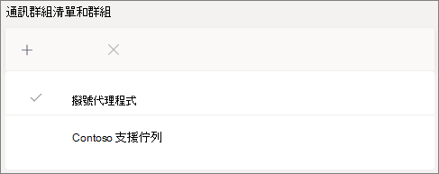

# 建立通話佇列-小型企業教學課程Create a call queue - small business tutorial

通話佇列提供將呼叫者路由給組織中的人員的方法，可協助您解決特定問題。Call queues provide a method of routing callers to people in your organization who can help with with a particular issue or question. 呼叫會一次散佈給佇列中的人員， (稱為 [ *代理* 程式]) 。Calls are distributed one at a time to the people in the queue (who are known as *agents*). 

通話佇列提供：Call queues provide:

- 問候訊息。A greeting message.

- 當人員在佇列中等待保留時，請使用音樂。Music while people are waiting on hold in a queue.

- 呼叫路由-先進先 *出* (FIFO) 訂單至代理程式。Call routing - in *First In, First Out* (FIFO) order - to agents.

- [佇列溢出] 和 [超時] 的處理選項。Handling options for queue overflow and timeout.

#### 開始之前Before you begin

取得一些 [電話系統-虛擬使用者授權（](../teams-add-on-licensing/virtual-user.md) 如果您還沒有的話）。Get some [Phone System - Virtual User licenses](../teams-add-on-licensing/virtual-user.md) if you don't already have them. 針對您規劃設定的每個通話佇列和自動語音應答，取得一個。Get one for each call queue and auto attendant that you plan to set up. 這些授權是免費的，因此我們建議您先取得幾個額外的案例，以備日後決定變更您的設定。These licenses are free, so we suggest getting a few extra in case you decide to make changes to your setup in the future.

由於通話佇列中的代理程式可能會撥出以傳回客戶電話，因此請考慮將來電代理程式的本機號碼設定為您的主要電話號碼或適當的自動語音應答號碼。Since agents in a call queue may dial out to return a customer call, consider setting the caller ID for your call agents to your main phone number or the number of an appropriate auto attendant. 如需詳細資訊，請參閱 [在 Microsoft 團隊中管理本機號碼原則](../caller-id-policies.md) 。See [Manage caller ID policies in Microsoft Teams](../caller-id-policies.md) for more information.

#### 請依照下列步驟來設定您的通話佇列Follow these steps to set up your call queue

# [步驟 1   建立小組Step 1 Create a team](#tab/create-team)

建立通話佇列時，您可以將個別使用者新增至佇列，或者您可以使用現有的安全性群組、Microsoft 365 群組或 Microsoft 團隊小組。When creating a call queue, you can add individual users to the queue, or you can use an existing security group, Microsoft 365 group, or Microsoft Teams team. 我們建議使用團隊。We recommend using a team. 這可讓佇列中的成員彼此聊天、分享想法，以及建立檔或其他資源，協助客戶進行協助。This allows members of the queue to chat with each other, share ideas, and create documents or other resources to help them help your customers. 小組也會提供語音信箱，讓來電者在數小時後離開訊息，或當佇列達到其最大容量時。A team also provides a voice mailbox for callers to leave a message after hours or if the queue reaches its maximum capacity.

建立小組To create a team

1. 首先，按一下應用程式左側的 [ **小組** ]，然後按一下團隊清單底部的 [ **加入] 或 [建立小組** ]。First, click **Teams** on the left side of the app, then click **Join or create a team** at the bottom of your teams list.

2. 然後按一下 [ **建立團隊** (第一張卡片，左上角) ]。Then click **Create team** (first card, top left corner).

3. 選擇 [ **從頭開始建立小組**]。Choose **Build a team from scratch**.

4. 接下來，選擇您要的是公用或私人團隊。Next, choose whether you want a public or private team. 我們建議您在通話佇列中使用 **私人** ，以避免人員透過加入小組而無意中成為佇列的一部分。We recommend **Private** for your call queue to avoid people unintentionally becoming part of the queue by joining the team.

5. 為您的小組命名，並新增選用的描述。Name your team and add an optional description.

6. 完成後，請按一下 [ **建立**]。When you're done, click **Create**.

8. 輸入您想在通話佇列中擁有的人員名稱，然後按一下 [ **新增**]。Type the names of the people that you want to have in your call queue, and then click **Add**.

9. 按一下 [ **關閉**]。Click **Close**. 您新增至小組的人員會收到一封電子郵件，讓他們知道他們現在是您的小組成員，而且小組會顯示在他們的小組清單中。People you add to a team will receive an email letting them know they are now a member of your team and the team will show up in their teams list.

> [!div class="nextstepaction"]
> [步驟 2-資源帳戶 >Step 2 - Resource accounts >](https://review.docs.microsoft.com/microsoftteams/business-voice/create-a-phone-system-call-queue-smb?branch=mikeplum-smb-voice&tabs=resource-account#steps)

# [步驟 2   資源帳戶Step 2 Resource accounts](#tab/resource-account)

您建立的每個通話佇列都需要有資源帳戶。Each call queue that you create requires a resource account. 這與使用者帳戶類似，只是帳戶與自動語音應答或通話佇列無關，而不是寄件者。This is similar to a user account, except the account is associated with an auto attendant or call queue instead of a person. 在此步驟中，我們會建立帳戶，將它指派為 *Microsoft 365 電話系統-虛擬使用者* 授權，然後使用它來開始建立通話佇列。In this step, we'll create the account, assign it a *Microsoft 365 Phone System - Virtual User* license, and then use it to start creating the call queue.

### 建立資源帳戶Create a resource account

您可以在 [團隊管理中心] 中建立資源帳戶。You can create a resource account in the Teams admin center.

1. 在 [團隊管理中心] 中，展開 [ **整個組織的設定**]，然後按一下 [ **資源帳戶**]。In the Teams admin center, expand **Org-wide settings**, and then click **Resource accounts**.

2. 按一下 [ **新增**]。Click **Add**.

3. 在 [ **新增資源帳戶** ] 窗格中，填寫 [ **顯示名稱**]、[使用者名稱 **]，然後** 選擇 [ **通話佇列** ] 作為 **資源帳戶類型**。In the **Add resource account** pane, fill out **Display name**, **Username**, and choose **Call queue** for the **Resource account type**.

    ![[新增資源帳戶] 使用者介面的螢幕擷取畫面](../media/resource-account-add-cq.png)

4. 按一下 **[儲存]**。Click **Save**.

新帳戶將會出現在帳戶清單中。The new account will appear in the list of accounts.

### 指派授權Assign a license

您必須將 *Microsoft 365 電話系統-虛擬使用者* 授權指派給資源帳戶。You must assign a *Microsoft 365 Phone System - Virtual User* license to the resource account.

1. 在 Microsoft 365 系統管理中心，按一下您要指派授權的資源帳戶。In the Microsoft 365 admin center, click the resource account to which you want to assign a license.

2. 在 [ **授權及應用程式** ] 索引標籤的 [ **授權**] 底下，選取 [ **Microsoft 365 電話系統-虛擬使用者**]。On the **Licenses and Apps** tab, under **Licenses**, select **Microsoft 365 Phone System - Virtual User**.

3. 按一下 [ **儲存變更**]。Click **Save changes**.

    

### 建立通話佇列Create a call queue

接下來，我們將開始建立新的通話佇列並指派資源帳戶。Next, we'll start creating a new call queue and assign the resource account.

1. 在 [團隊管理中心] 中，展開 [ **語音**]，按一下 [ **通話佇列**]，然後按一下 [ **新增**]。In the Teams admin center, expand **Voice**, click **Call queues**, and then click **Add**.

1. 輸入通話佇列的名稱。Type a name for the call queue. 當代理程式從佇列接收來電時，就會看到這個名稱。Agents will see this name when they receive an incoming call from the queue.

2. 按一下 [ **新增帳戶**]，搜尋您要與此通話佇列搭配使用的資源帳戶，按一下 [ **新增**]，然後按一下 [ **新增**]。Click **Add accounts**, search for the resource account that you want to use with this call queue, click **Add**, and then click **Add**.

3. 選擇語言。Choose a language. 此語言將用於系統產生的語音提示，以及語音信箱操作 (如果您) 啟用這些語言。This language will be used for system-generated voice prompts and voicemail transcription (if you enable them).

    

4. 指定是否要在來電者到達佇列時，向呼叫者播放問候語。Specify if you want to play a greeting to callers when they arrive in the queue. 您必須上傳包含您要播放之問候語的 MP3、WAV 或 WMA 檔案。You must upload an MP3, WAV, or WMA file containing the greeting that you want to play.

5. 當來電者在佇列中保留時，小組會將預設音樂提供給呼叫者。Teams provides default music to callers while they are on hold in a queue. 如果您想要播放特定音訊檔案，請選擇 [ **播放音訊** 檔案]，然後上傳 MP3、WAV 或 WMA 檔案。If you want to play a specific audio file, choose **Play an audio file** and upload an MP3, WAV, or WMA file.

> [!NOTE]
> 上傳的錄製不能超過 5 MB。The uploaded recording can be no larger than 5 MB.
> 小組通話佇列中提供的預設音樂，由貴組織所提供的任何版稅免費提供。The default music supplied in Teams call queues is free of any royalties payable by your organization. 

> [!div class="nextstepaction"]
> [步驟 3-通話代理程式 >Step 3 - Call agents >](https://review.docs.microsoft.com/microsoftteams/business-voice/create-a-phone-system-call-queue-smb?branch=mikeplum-smb-voice&tabs=call-agents#steps)

# [步驟3：   撥號代理程式Step 3 Call agents](#tab/call-agents)

若要將代理程式新增到通話佇列，我們將新增我們先前建立的小組。To add agents to the call queue, we'll add the team that we created earlier.

1. 按一下 [ **新增群組**]。Click **Add groups**.
2. 輸入您建立的小組名稱。Type the name of the team that you created.
3. 按一下 [ **新增**]，然後按一下 [ **新增**]。Click **Add**, and then click **Add**.

    

您可以透過群組或團隊新增最多20個代理程式，以及最多200個代理程式。You can add up to 20 agents individually and up to 200 agents via groups or teams.

> [!NOTE]
> 在小組中新增新的使用者時，最多可能需要八個小時的時間，才能讓初次通話到達。When new users are added to the team, it can take up to eight hours for their first call to arrive.

> [!div class="nextstepaction"]
> [步驟 4-資源帳戶 >Step 4 - Resource accounts >](https://review.docs.microsoft.com/microsoftteams/business-voice/create-a-phone-system-call-queue-smb?branch=mikeplum-smb-voice&tabs=call-routing#steps)

# [步驟 4   呼叫路由Step 4 Call routing](#tab/call-routing)

選擇您想要使用的通話路由方法。Choose the call routing method that you want to use.

1. 將 [ **會議模式]** 設定為 [ **自動**]。Set **Conference mode** to **Auto**.

2. 選擇您要使用的 **路由方法** 。Choose the **Routing method** you want to use. 這會決定代理從佇列接收呼叫的順序。This determines the order in which agents receive calls from the queue. 我們建議 **串列路由** 或  **迴圈**。We recommend **Serial routing** or  **Round robin**. 從這些選項中選擇：Choose from these options:

    - [**助理路由**] 會同時響鈴佇列中的所有代理程式。**Attendant routing** rings all agents in the queue at the same time. 第一個呼叫代理程式接聽電話，即可取得通話。The first call agent to pick up the call gets the call.

    - **串列路由** 逐一響鈴所有呼叫代理程式。**Serial routing** rings all call agents one by one. 如果代理程式關閉或沒接聽來電，該通話會撥打下一個代理程式，並嘗試所有的代理程式，直到它被挑選或超時為止。If an agent dismisses or does not pick up a call, the call will ring the next agent and will try all agents until it is picked up or times out.

    - **迴圈法** 會平衡來電的路由，讓每個通話代理程式從佇列取得相同數量的呼叫。**Round robin** balances the routing of incoming calls so that each call agent gets the same number of calls from the queue. 這在入站銷售環境中可能是您想要的，以確保所有通話代理程式之間有同等的機會。This may be desirable in an inbound sales environment to assure equal opportunity among all the call agents.

    - 閒置時間最長的 **閒置** 路由，每個呼叫都是閒置時間最長的代理程式。**Longest idle** routes each call to the agent who has been idle the longest time. [目前狀態] 為「已離開超過10分鐘的代理程式] 不會包含在其中。 )  ((Agents whose presence state has been Away for more than 10 minutes are not included.)

    ![[會議模式] 與 [路由方法] 設定的螢幕擷取畫面](../media/call-queue-conference-mode-routing-method.png)

3. 開啟 [目前 **狀態] 路由** 。Turn **Presence-based routing** on. 此路由會呼叫目前狀態為 [ **可用**] 的代理程式。This routes calls to agents whose presence status is **Available**.

4. 選擇您是否要允許代理退出通話。Choose if you want to allow agents to opt out of calls.

5. 設定 **代理程式警示時間** ，以指定在佇列將呼叫重新導向至下一部代理程式之前，電話會響鈴的時間。Set an **Agent alert time** to specify how long an agent's phone will ring before the queue redirects the call to the next agent.

    ![[路由]、[選擇外移] 及 [提醒時間] 設定的螢幕擷取畫面](../media/call-queue-presence-agents-time.png)

> [!div class="nextstepaction"]
> [步驟 5-呼叫溢出 >Step 5 - Call overflow >](https://review.docs.microsoft.com/microsoftteams/business-voice/create-a-phone-system-call-queue-smb?branch=mikeplum-smb-voice&tabs=call-overflow#steps)

# [步驟 5   通話溢出Step 5 Call overflow](#tab/call-overflow)

選擇您想要如何處理超過佇列中最大值的通話。Choose how you want to handle calls that exceed the maximum in the queue.

1. 設定 **佇列中的最大通話** 數。Set the **Maximum calls in the queue**.

2. 選擇達到最大通話數時要執行的動作。Choose what you want to do when the maximum number of calls is reached. 您可以中斷通話或重新導向。You can disconnect the call or redirect it. 我們建議您將來電重新導向至下列其中一個目的地：We recommend that you redirect the call to one of the following destinations:
    - **組織中的人員** -您組織中能夠接聽語音通話的人員**Person in the organization** - a person in your organization who is able to receive voice calls
    - **語音 app** -自動語音應答或其他通話佇列。**Voice app** - an auto attendant or another call queue.  (選擇 [選擇此目的地時，與自動語音應答或通話佇列] 相關聯的資源帳戶。 ) (Choose the resource account associated with the auto attendant or call queue when choosing this destination.)
    - **外部電話號碼** -任何電話號碼。**External phone number** - any phone number. 使用此格式： + [國家/地區碼] [區域碼] [電話號碼]Use this format: +[country code][area code][phone number]
    - **語音信箱** -您可以使用您所建立之小組的語音信箱。**Voicemail** - you can use the voice mailbox of the team that you created.

    

> [!div class="nextstepaction"]
> [步驟 6-通話超時 >Step 6 - Call timeout >](https://review.docs.microsoft.com/microsoftteams/business-voice/create-a-phone-system-call-queue-smb?branch=mikeplum-smb-voice&tabs=call-timeout#steps)

# [步驟 6   通話超時Step 6 Call timeout](#tab/call-timeout)

選擇當通話在佇列中等待的時間太長時要發生的情況。Choose what you want to happen when calls have been waiting in the queue for too long.

1. 設定 **通話超時：最長等待時間**。Set the **Call Timeout: maximum wait time**.

2. 選擇來電超時時要執行的動作。您可以中斷通話或重新導向。Choose what you want to do when a call times out. You can disconnect the call or redirect it. 我們建議您將來電重新導向至下列其中一個目的地：We recommend that you redirect the call to one of the following destinations:
    - **組織中的人員** -您組織中能夠接聽語音通話的人員**Person in the organization** - a person in your organization who is able to receive voice calls
    - **語音 app** -自動語音應答或其他通話佇列。**Voice app** - an auto attendant or another call queue.  (選擇 [選擇此目的地時，與自動語音應答或通話佇列] 相關聯的資源帳戶。 ) (Choose the resource account associated with the auto attendant or call queue when choosing this destination.)
    - **外部電話號碼** -任何電話號碼。**External phone number** - any phone number. 使用此格式： + [國家/地區碼] [區域碼] [電話號碼]Use this format: +[country code][area code][phone number]
    - **語音信箱** -您可以使用您所建立之小組的語音信箱。**Voicemail** - you can use the voice mailbox of the team that you created.

    

3. 按一下 **[儲存]**。Click **Save**.

這樣就完成了您的通話佇列設定。This completes the setup of your call queue. 接下來，您可能會想要 [設定自動](create-a-phone-system-auto-attendant-smb.md)語音應答。Next, you may want to [set up an auto attendant](create-a-phone-system-auto-attendant-smb.md).

---

