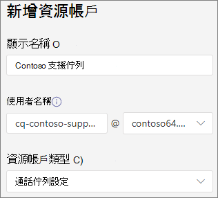
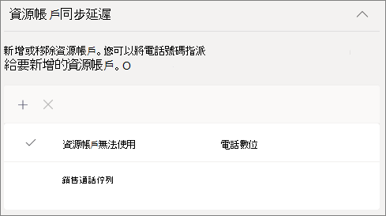
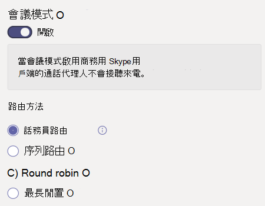
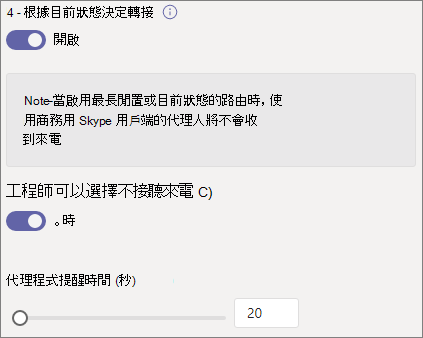
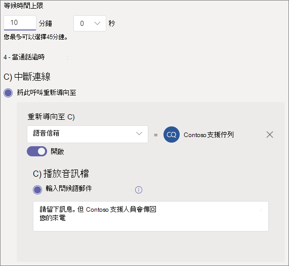

# 建立通話佇列 - 小型企業教學課程

通話佇列提供將來電者路由給組織中可協助處理特定問題或問題的人的方法。 通話會一次一次分散給佇列中 (稱為 *代理人) 。* 

通話佇列提供：

- 問候訊息。

- 當其他人在佇列中等候時播放音樂。

- 呼叫路由 - 在 *FIFO (* 中，) 呼叫路由 - 給代理人。

- 處理佇列溢出和超時的選項。

#### 影片示範

這段影片示範如何在 Teams 中建立Teams。

> [!VIDEO https://www.microsoft.com/videoplayer/embed/RWCF23?autoplay=false]

#### 開始之前

取得一[電話系統 - 如果您](../teams-add-on-licensing/virtual-user.md)還沒有虛擬使用者授權。 針對您打算設定的每個通話佇列和自動話務員取得一個。 這些授權是免費的，因此我們建議您額外取得一些授權，以防您決定日後變更您的設定。

由於通話佇列中的代理人可能會撥出以傳回客戶電話，請考慮將呼叫代理的本機號碼設定為主電話號碼或適當的自動語音機號碼。 請參閱[在 Microsoft Teams](../caller-id-policies.md)管理本機號碼政策以瞭解更多資訊。

#### 請遵循下列步驟來設定您的通話佇列

# [步驟 1   建立團隊](#tab/create-team)

建立通話佇列時，您可以新增個別使用者至佇列，或使用現有的安全性群組、Microsoft 365群組，或Microsoft Teams小組。 我們建議您使用 [小組頻道](https://support.microsoft.com/office/9f07dabe-91c6-4a9b-a545-8ffdddd2504e)。 這可讓佇列成員彼此聊天、分享想法，以及建立檔或其他資源，協助他們協助您的客戶。 團隊也會提供語音信箱，讓來電者在數小時後留言，或佇列達到最大容量。

建立團隊

1. 首先 **，Teams應用程式** 左側的 [加入或建立團隊>，然後在團隊清單底部按一下 [加入或建立團隊>。

2. 然後按一下 [ **建立團隊** (第一張卡片，左上角) 。

3. 選擇 **從頭開始建立團隊**。

4. 接下來，選擇您想要公開或私人團隊。 我們建議您使用 **私人** 通話佇列，以避免人員加入團隊而不小心成為佇列的一部分。

5. 為您的小組命名，並新增選擇性描述。

6. 完成後，請按一下 [**建立。**

8. 輸入您想要在通話佇列中擁有之人員的名稱，然後按一下 [ **新增**。

9. 按一下 **[關閉**。 您新加入團隊的人會收到一封電子郵件，讓他們知道他們現在是您團隊的成員，而團隊會顯示在團隊清單中。

接下來，我們會新增一個頻道，用於通話佇列。

新增頻道

1. 在 Teams中，尋找您剛剛建立的團隊，按一下[更多選項 (...) ，然後按一下 [**新增頻道**> 。

2. 輸入頻道的名稱和描述，然後按一下 [ **新增**。

> [!div class="nextstepaction"]
> [步驟 2 - 資源帳戶>](/microsoftteams/business-voice/create-a-phone-system-call-queue-smb?tabs=resource-account#steps)

# [步驟 2   資源帳戶](#tab/resource-account)

您建立的每個通話佇列都需要資源帳戶。 這類似于使用者帳戶，除了該帳戶與自動電話機或通話佇列相關聯，而不是與人員相關聯。 在此步驟中，我們將建立帳戶、指派帳戶Microsoft 365 電話系統 *虛擬* 使用者授權，然後使用它開始建立通話佇列。

### 建立資源帳戶

您可以在系統管理中心建立Teams帳戶。

1. 在 Teams系統管理中心中，展開 **整個組織設定**，然後按一下 [**資源帳戶**。

2. 按一下 [新增 **]**。

3. 在新增 **資源帳戶窗格中**，填寫 **顯示名稱**、**使用者名稱**，然後選擇資源帳戶 **類型的通話佇列**。 當代理人收到來自佇列的來電時，會顯示顯示名稱。

    

4. 按一下 [儲存]。

   新帳戶會顯示在帳戶清單中。

   

### 指派授權

您必須指派一個 *Microsoft 365 電話系統 - 虛擬使用者* 授權給資源帳戶。

1. 在 Microsoft 365系統管理中心，按一下 [使用中使用者」 清單中的您想要指派授權的資源帳戶。

2. On the **Licenses and Apps** tab, under **Licenses**, select **Microsoft 365 Phone System - Virtual User**.

3. 按一下 **[儲存變更**。

    

### 建立通話佇列

接下來，我們將開始建立新的通話佇列並指派資源帳戶。

1. 在系統管理Teams，展開 **[語音** 和通話佇列，然後按一下 [**新增**。

1. 輸入通話佇列的名稱。

2. 按一下 **[新增帳戶**，搜尋要用於此通話佇列的資源帳戶;按一下 [ **新增**，然後按一下 [ **新增**> 。

3.  ([指派) ID 下，按一下 [新增，搜尋您為自動話務員建立的資源帳戶，然後按一下 [新增，然後按一下 [**新增**> 。 這樣一來，通話代理人就會在來電時，提供主線本機號碼。

    

3. 選擇語言。 如果您啟用語音提示，系統產生的語音提示和語音信箱 (會) 。

    

4. 指定當來電者抵達佇列時，是否要播放問候語。 您必須上傳包含您想要播放的問候語的 MP3、WAV 或 WMA 檔案。

5. Teams在佇列中保留來電者時，提供預設音樂。 如果您想要播放特定的音訊檔案，請選擇播放音訊檔案並上傳 MP3、WAV 或 WMA 檔案。

   > [!NOTE]
   > 上傳的錄製不能大於 5 MB。
   > 在通話佇列Teams中提供的預設音樂，不含貴組織支付的任何版稅。 

> [!div class="nextstepaction"]
> [步驟 3 - 呼叫代理人>](/microsoftteams/business-voice/create-a-phone-system-call-queue-smb?tabs=call-agents#steps)

# [步驟 3   通話代理程式](#tab/call-agents)

若要將代理人新增到通話佇列，我們會將它們新加到我們先前建立的團隊和頻道中。

1. 選取 [ **選擇團隊選項** ，然後按一下 **[新增頻道**> 。
2. 輸入您建立的團隊名稱，選取它，然後按一下 [ **新增**。
3. 選取您為佇列所建立頻道。
3. 按一下 **[Apply.**

    

> [!NOTE]
> 新使用者新加入團隊時，第一次通話最多可能需要八小時才能到達。

> [!div class="nextstepaction"]
> [步驟 4 - 資源帳戶>](/microsoftteams/business-voice/create-a-phone-system-call-queue-smb?tabs=call-routing#steps)

# [步驟 4   通話路由](#tab/call-routing)

選擇您想要使用的通話路由方法。

1. 將 **會議模式設定** 為 **自動**。

2. 選擇 **您想要使用的** 路由方法。 這決定代理程式從佇列接收來電的順序。 我們建議您使用 **序列路由或** **Round robin。** 從這些選項中選擇：

    - **話務員路由** 會同時響鈴佇列中的所有代理程式。 第一個接電話的代理人會接到電話。

    - **連續路由** 會一個接一個地撥打所有呼叫代理程式。 如果客服人員關閉或不接電話，來電會撥打下一個代理人，並嘗試所有代理人，直到被接回或打出電話。

    - **輪循** 機制會平衡來電的路由，讓每個通話代理程式從佇列取得相同數量的通話。 在內入銷售環境中，這可能是理想的選擇，以確保所有通話代理人之間享有同等的機會。

    - **最長空閒** 時間會路由每個通話給閒置時間最長的代理人。  (目前狀態已離開超過 10 分鐘的代理人。) 

    

3. 開啟 **目前狀態路由** 。 這會將通話路由至目前狀態為可用的 **代理人**。

4. 選擇您是否要允許代理人退出宣告通話。

5. 設定 **代理人通知** 時間，指定在佇列將通話重新導向至下一個代理人之前，代理人的電話會響鈴多久。

    

> [!div class="nextstepaction"]
> [步驟 5 - 通話溢出>](/microsoftteams/business-voice/create-a-phone-system-call-queue-smb?tabs=call-overflow#steps)

# [步驟 5   通話溢出](#tab/call-overflow)

選擇您想要如何處理超過佇列中上限的通話。

1. 設定 **佇列中的通話上限**。

2. 選擇通話次數上限時要執行什麼工作。 您可以中斷通話或重新導向。 我們建議您將通話重新導向下列其中一個目的地：
    - **組織中能夠** 接聽語音通話的人
    - **語音應用程式** - 自動語音留言或其他通話佇列。  (選擇此目的地時，選擇與自動電話機或通話佇列相關聯的資源帳戶。) 
    - **外部電話號碼** - 任何電話號碼。 使用此格式：+[國碼][區碼][電話號碼]
    - **語音** 信箱 - 您可以使用您建立團隊的語音信箱。

    

> [!div class="nextstepaction"]
> [步驟 6 - 通話>](/microsoftteams/business-voice/create-a-phone-system-call-queue-smb?tabs=call-timeout#steps)

# [步驟 6   通話超時](#tab/call-timeout)

選擇當通話在佇列中等候太久時要發生的專案。

1. 設定 **最大等待時間**。

2. 選擇當通話時間過長時要執行什麼工作。您可以中斷通話或重新導向。 我們建議您將通話重新導向下列其中一個目的地：
    - **組織中能夠** 接聽語音通話的人
    - **語音應用程式** - 自動語音留言或其他通話佇列。  (選擇此目的地時，選擇與自動電話機或通話佇列相關聯的資源帳戶。) 
    - **外部電話號碼** - 任何電話號碼。 使用此格式：+[國碼][區碼][電話號碼]
    - **語音** 信箱 - 您可以使用您建立團隊的語音信箱。

    

3. 按一下 [儲存]。

這會完成通話佇列的設定。 接下來，您可能會想要 [設定自動話務員](create-a-phone-system-auto-attendant-smb.md)。

---

