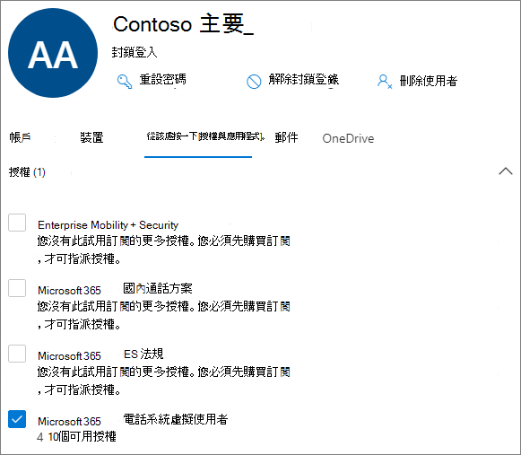

# 建立通話佇列 - 小型企業教學課程Create a call queue - small business tutorial

通話佇列提供將來電者路由給組織中可協助處理特定問題或問題的人的方法。Call queues provide a method of routing callers to people in your organization who can help with a particular issue or question. 通話會一次一次分散給佇列中 (稱為 *代理人) 。*Calls are distributed one at a time to the people in the queue (who are known as *agents*). 

通話佇列提供：Call queues provide:

- 問候訊息。A greeting message.

- 當其他人在佇列中等候時播放音樂。Music while people are waiting on hold in a queue.

- 呼叫路由 - 在 *FIFO (* 中，) 呼叫路由 - 給代理人。Call routing - in *First In, First Out* (FIFO) order - to agents.

- 處理佇列溢出和超時的選項。Handling options for queue overflow and timeout.

#### 影片示範Video demonstration

這段影片示範如何在 Teams 中建立通話佇列。This video demonstrates how to create a call queue in Teams.

> [!VIDEO https://www.microsoft.com/videoplayer/embed/RWCF23?autoplay=false]

#### 開始之前Before you begin

取得一 [些電話系統 - 如果您](../teams-add-on-licensing/virtual-user.md) 還沒有虛擬使用者授權。Get some [Phone System - Virtual User licenses](../teams-add-on-licensing/virtual-user.md) if you don't already have them. 針對您打算設定的每一個通話佇列和自動電話機，取得一個。Get one for each call queue and auto attendant that you plan to set up. 這些授權是免費的，因此我們建議您額外取得一些授權，以防您決定日後變更您的設定。These licenses are free, so we suggest getting a few extra in case you decide to make changes to your setup in the future.

由於通話佇列中的代理人可能會撥出以傳回客戶電話，請考慮將呼叫代理的本機號碼設定為主電話號碼或適當的自動語音機號碼。Since agents in a call queue may dial out to return a customer call, consider setting the caller ID for your call agents to your main phone number or the number of an appropriate auto attendant. 請參閱 [在 Microsoft Teams 中管理來電](../caller-id-policies.md) 顯示政策以瞭解更多資訊。See [Manage caller ID policies in Microsoft Teams](../caller-id-policies.md) for more information.

#### 請遵循下列步驟來設定您的通話佇列Follow these steps to set up your call queue

# [步驟 1   建立團隊Step 1 Create a team](#tab/create-team)

建立通話佇列時，您可以將個別使用者新增到佇列，或使用現有的安全性群組、Microsoft 365 群組或 Microsoft Teams 小組。When creating a call queue, you can add individual users to the queue, or you can use an existing security group, Microsoft 365 group, or Microsoft Teams team. 我們建議您 [使用小組頻道](https://support.microsoft.com/office/9f07dabe-91c6-4a9b-a545-8ffdddd2504e)。We recommend [using a team channel](https://support.microsoft.com/office/9f07dabe-91c6-4a9b-a545-8ffdddd2504e). 這可讓佇列的成員彼此聊天、分享想法，以及建立檔或其他資源，協助他們協助您的客戶。This allows members of the queue to chat with each other, share ideas, and create documents or other resources to help them help your customers. 團隊也會提供語音信箱，讓來電者在數小時後留言，或佇列達到最大容量時留言。A team also provides a voice mailbox for callers to leave a message after hours or if the queue reaches its maximum capacity.

建立團隊To create a team

1. 首先，按一下 **應用程式** 左側的 [團隊>，然後按一下 [加入或建立團隊清單底部的團隊>。First, click **Teams** on the left side of the app, then click **Join or create a team** at the bottom of your teams list.

2. 然後按一下 [ **建立團隊** (第一張卡片，左上角) 。Then click **Create team** (first card, top left corner).

3. 選擇 **從頭開始建立團隊**。Choose **Build a team from scratch**.

4. 接下來，選擇您想要公開或私人團隊。Next, choose whether you want a public or private team. 我們建議您使用 **私人** 通話佇列，以避免人員加入團隊而不小心成為佇列的一部分。We recommend **Private** for your call queue to avoid people unintentionally becoming part of the queue by joining the team.

5. 為您的小組命名，並新增選擇性描述。Name your team and add an optional description.

6. 完成後，請按一下 [**建立。**When you're done, click **Create**.

8. 輸入您想要在通話佇列中擁有之人員的名稱，然後按一下 [ **新增**。Type the names of the people that you want to have in your call queue, and then click **Add**.

9. 按一下 **[關閉**。Click **Close**. 您新加入團隊的人會收到一封電子郵件，讓他們知道他們現在是您團隊的成員，而團隊會顯示在團隊清單中。People you add to a team will receive an email letting them know they are now a member of your team and the team will show up in their teams list.

接下來，我們會新增一個頻道，用於通話佇列。Next, we'll add a channel to use with the call queue.

新增頻道To add a channel

1. 在 Teams 中，尋找您剛剛建立的團隊，按一下 [更多選項 (...) ，然後按一下 [**新增頻道**> 。In Teams, find the team you just created, click **More options** (...), and then click **Add channel**.

2. 輸入頻道的名稱和描述，然後按一下 [ **新增**。Type a name and description for the channel, and then click **Add**.

> [!div class="nextstepaction"]
> [步驟 2 - 資源帳戶>Step 2 - Resource accounts >](/microsoftteams/business-voice/create-a-phone-system-call-queue-smb?tabs=resource-account#steps)

# [步驟 2   資源帳戶Step 2 Resource accounts](#tab/resource-account)

您建立的每個通話佇列都需要資源帳戶。Each call queue that you create requires a resource account. 這類似于使用者帳戶，除了該帳戶與自動通話或通話佇列相關聯，而不是與人員相關聯。This is similar to a user account, except the account is associated with an auto attendant or call queue instead of a person. 在此步驟中，我們會建立帳戶、指派 *Microsoft 365 電話系統 - 虛擬使用者* 授權，然後使用它開始建立通話佇列。In this step, we'll create the account, assign it a *Microsoft 365 Phone System - Virtual User* license, and then use it to start creating the call queue.

### 建立資源帳戶Create a resource account

您可以在 Teams 系統管理中心建立資源帳戶。You can create a resource account in the Teams admin center.

1. 在 Teams 系統管理中心，展開 **整個組織設定**，然後按一下 [ **資源帳戶**。In the Teams admin center, expand **Org-wide settings**, and then click **Resource accounts**.

2. 按一下 [新增 **]**。Click **Add**.

3. 在新增 **資源帳戶窗格中**，填寫 **顯示名稱**、**使用者名稱**，然後選擇資源帳戶 **類型的通話佇列**。In the **Add resource account** pane, fill out **Display name**, **Username**, and choose **Call queue** for the **Resource account type**. 當代理人收到來自佇列的來電時，會顯示顯示名稱。Agents will see the display name when they receive an incoming call from the queue.

    

4. 按一下 [儲存]。Click **Save**.

   新帳戶會顯示在帳戶清單中。The new account will appear in the list of accounts.

   

### 指派授權Assign a license

您必須將 *Microsoft 365 Phone System - 虛擬使用者* 授權指派給資源帳戶。You must assign a *Microsoft 365 Phone System - Virtual User* license to the resource account.

1. 在 Microsoft 365 系統管理中心中，按一下 [使用中使用者」 清單中的您想要指派授權的資源帳戶。In the Microsoft 365 admin center, in the **Active users** list, click the resource account to which you want to assign a license.

2. 在授權 **與應用程式標籤** 的 **<授權**> 下，選取 Microsoft **365 電話系統 - 虛擬使用者**。On the **Licenses and Apps** tab, under **Licenses**, select **Microsoft 365 Phone System - Virtual User**.

3. 按一下 **[儲存變更**。Click **Save changes**.

    

### 建立通話佇列Create a call queue

接下來，我們將開始建立新的通話佇列並指派資源帳戶。Next, we'll start creating a new call queue and assign the resource account.

1. 在 Teams 系統管理中心中，展開 **[語音**，按一下 **[通話佇列**，然後按一下 **[新增**> 。In the Teams admin center, expand **Voice**, click **Call queues**, and then click **Add**.

1. 輸入通話佇列的名稱。Type a name for the call queue.

2. 按一下 **[新增帳戶**，搜尋要用於此通話佇列的資源帳戶;按一下 [ **新增**，然後按一下 [ **新增**> 。Click **Add accounts**, search for the resource account that you want to use with this call queue, click **Add**, and then click **Add**.

3. 選擇語言。Choose a language. 如果您啟用語音提示，系統產生的語音提示和語音信箱 (語音信箱) 。This language will be used for system-generated voice prompts and voicemail transcription (if you enable them).

    

4. 指定當來電者抵達佇列時，是否要播放問候語。Specify if you want to play a greeting to callers when they arrive in the queue. 您必須上傳包含您想要播放的問候語的 MP3、WAV 或 WMA 檔案。You must upload an MP3, WAV, or WMA file containing the greeting that you want to play.

5. 當來電者在佇列中保留時，Teams 會提供預設音樂。Teams provides default music to callers while they are on hold in a queue. 如果您想要播放特定的音訊檔案，請選擇播放音訊檔案並上傳 MP3、WAV 或 WMA 檔案。If you want to play a specific audio file, choose **Play an audio file** and upload an MP3, WAV, or WMA file.

   > [!NOTE]
   > 上傳的錄製不能大於 5 MB。The uploaded recording can be no larger than 5 MB.
   > Teams 通話佇列中提供的預設音樂不含貴組織支付的任何版稅。The default music supplied in Teams call queues is free of any royalties payable by your organization. 

> [!div class="nextstepaction"]
> [步驟 3 - 呼叫代理人>Step 3 - Call agents >](/microsoftteams/business-voice/create-a-phone-system-call-queue-smb?tabs=call-agents#steps)

# [步驟 3   通話代理人Step 3 Call agents](#tab/call-agents)

若要將代理人新增到通話佇列，我們會將它們新加到我們先前建立的團隊和頻道中。To add agents to the call queue, we'll add them to the team and channel that we created earlier.

1. 選取 [ **選擇團隊選項** ，然後按一下 **[新增頻道**> 。Select the **Choose a team** option and click **Add a channel**.
2. 輸入您建立的團隊名稱，選取它，然後按一下 [ **新增**。Type the name of the team that you created, select it, and click **Add**.
3. 選取您為佇列所建立頻道。Select the channel that you created for the queue.
3. 按一下 **[Apply.**Click **Apply**.

    

> [!NOTE]
> 新使用者新加入團隊時，第一次通話最多可能需要八小時才能到達。When new users are added to the team, it can take up to eight hours for their first call to arrive.

> [!div class="nextstepaction"]
> [步驟 4 - 資源帳戶>Step 4 - Resource accounts >](/microsoftteams/business-voice/create-a-phone-system-call-queue-smb?tabs=call-routing#steps)

# [步驟 4   通話路由Step 4 Call routing](#tab/call-routing)

選擇您想要使用的通話路由方法。Choose the call routing method that you want to use.

1. 將 **會議模式設定** 為 **自動**。Set **Conference mode** to **Auto**.

2. 選擇 **您想要使用的** 路由方法。Choose the **Routing method** you want to use. 這決定代理程式從佇列接收來電的順序。This determines the order in which agents receive calls from the queue. 我們建議您使用 **序列路由或** **Round robin。**We recommend **Serial routing** or  **Round robin**. 從這些選項中選擇：Choose from these options:

    - **話務員路由** 會同時響鈴佇列中的所有代理程式。**Attendant routing** rings all agents in the queue at the same time. 第一個接電話的代理人會接到電話。The first call agent to pick up the call gets the call.

    - **連續路由** 會一個接一個地撥打所有呼叫代理程式。**Serial routing** rings all call agents one by one. 如果客服人員關閉或不接電話，來電會撥打給下一個代理人，並嘗試所有代理人，直到被接回或打出電話。If an agent dismisses or does not pick up a call, the call will ring the next agent and will try all agents until it is picked up or times out.

    - **輪循** 機制會平衡來電的路由，讓每個通話代理程式從佇列取得相同數量的通話。**Round robin** balances the routing of incoming calls so that each call agent gets the same number of calls from the queue. 在內入銷售環境中，這一點可能相當理想，以確保所有通話代理人之間享有同等的機會。This may be desirable in an inbound sales environment to assure equal opportunity among all the call agents.

    - **最長空閒** 時間會路由每個通話給閒置時間最長的代理人。**Longest idle** routes each call to the agent who has been idle the longest time.  (狀態已離開超過 10 分鐘的代理人。) (Agents whose presence state has been Away for more than 10 minutes are not included.)

    

3. 開啟 **目前狀態路由** 。Turn **Presence-based routing** on. 這會將通話路由至目前狀態為可用的 **代理人**。This routes calls to agents whose presence status is **Available**.

4. 選擇您是否要允許代理人退出宣告通話。Choose if you want to allow agents to opt out of calls.

5. 設定 **代理人通知** 時間，指定在佇列將通話重新導向至下一個代理人之前，代理人的電話會響鈴多久。Set an **Agent alert time** to specify how long an agent's phone will ring before the queue redirects the call to the next agent.

    

> [!div class="nextstepaction"]
> [步驟 5 - 通話溢出>Step 5 - Call overflow >](/microsoftteams/business-voice/create-a-phone-system-call-queue-smb?tabs=call-overflow#steps)

# [步驟 5   通話溢出Step 5 Call overflow](#tab/call-overflow)

選擇您想要如何處理超過佇列中上限的通話。Choose how you want to handle calls that exceed the maximum in the queue.

1. 設定 **佇列中的通話上限**。Set the **Maximum calls in the queue**.

2. 選擇通話次數上限時要執行什麼工作。Choose what you want to do when the maximum number of calls is reached. 您可以中斷通話或重新導向。You can disconnect the call or redirect it. 我們建議您將通話重新導向下列其中一個目的地：We recommend that you redirect the call to one of the following destinations:
    - **組織中能夠** 接聽語音通話的人**Person in the organization** - a person in your organization who is able to receive voice calls
    - **語音應用程式** - 自動語音留言或其他通話佇列。**Voice app** - an auto attendant or another call queue.  (選擇此目的地時，選擇與自動電話機或通話佇列相關聯的資源帳戶。) (Choose the resource account associated with the auto attendant or call queue when choosing this destination.)
    - **外部電話號碼** - 任何電話號碼。**External phone number** - any phone number. 使用此格式：+[國碼][區碼][電話號碼]Use this format: +[country code][area code][phone number]
    - **語音** 信箱 - 您可以使用您建立團隊的語音信箱。**Voicemail** - you can use the voice mailbox of the team that you created.

    

> [!div class="nextstepaction"]
> [步驟 6 - 通話>Step 6 - Call timeout >](/microsoftteams/business-voice/create-a-phone-system-call-queue-smb?tabs=call-timeout#steps)

# [步驟 6   通話超時Step 6 Call timeout](#tab/call-timeout)

選擇當通話在佇列中等候太久時要發生的專案。Choose what you want to happen when calls have been waiting in the queue for too long.

1. 設定 **最長等待時間**。Set the **Maximum wait time**.

2. 選擇當通話時間過時您想要執行什麼工作。您可以中斷通話或重新導向。Choose what you want to do when a call times out. You can disconnect the call or redirect it. 我們建議您將通話重新導向下列其中一個目的地：We recommend that you redirect the call to one of the following destinations:
    - **組織中能夠** 接聽語音通話的人**Person in the organization** - a person in your organization who is able to receive voice calls
    - **語音應用程式** - 自動語音留言或其他通話佇列。**Voice app** - an auto attendant or another call queue.  (選擇此目的地時，選擇與自動電話機或通話佇列相關聯的資源帳戶。) (Choose the resource account associated with the auto attendant or call queue when choosing this destination.)
    - **外部電話號碼** - 任何電話號碼。**External phone number** - any phone number. 使用此格式：+[國碼][區碼][電話號碼]Use this format: +[country code][area code][phone number]
    - **語音** 信箱 - 您可以使用您建立團隊的語音信箱。**Voicemail** - you can use the voice mailbox of the team that you created.

    

3. 按一下 [儲存]。Click **Save**.

這會完成通話佇列的設定。This completes the setup of your call queue. 接下來，您可能會想要 [設定自動話務員](create-a-phone-system-auto-attendant-smb.md)。Next, you may want to [set up an auto attendant](create-a-phone-system-auto-attendant-smb.md).

---

