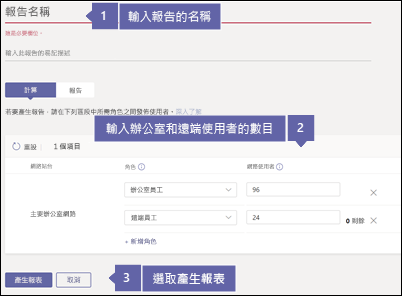
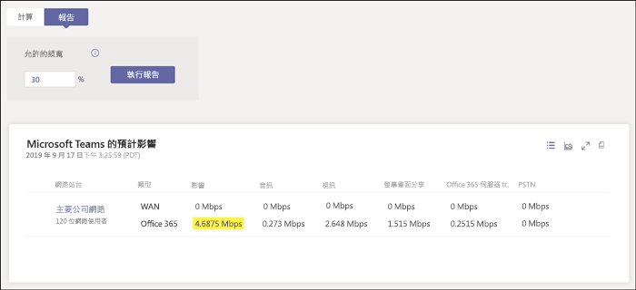

# 針對 Business Voice 檢查您的網際網路連線Check your Internet connection for Business Voice

Business Voice 位於 Microsoft 365 的雲端中。Business Voice is located in the cloud with Microsoft 365. 使用 Microsoft Teams 和 Business Voice 的每一台裝置都需要連線至網際網路。Every device that uses Microsoft Teams and Business Voice needs a connection to the Internet.

若要獲得 Business Voice 的最佳體驗，您需要可支援貴組織每次撥打最多電話數量所需的寬頻網際網路連線。To get the best Business Voice experience, you need a broadband Internet connection that can support the maximum number of phone calls that your organization might make at any one time. 您也需要確定您網路上的電腦能夠連線至 Microsoft 365 伺服器。You also need to make sure that the computers on your network can reach Microsoft 365 servers.

若要執行這些步驟，您必須有具備下列其中一項訂閱的租用戶：To follow these steps, you need to have a tenant with one of the following subscriptions:

* Office 365 商務基本版Office 365 Business Essentials
* Office 365 商務進階版Office 365 Business Premium
* Office 365 E1Office 365 E1
* Office 365 E3Office 365 E3
* Office 365 F1Office 365 F1
* Microsoft 365 A1Microsoft 365 A1
* Microsoft 365 A3Microsoft 365 A3
* Microsoft 365 E3Microsoft 365 E3
* Microsoft 365 商務版Microsoft 365 Business

您不需要 Business Voice 授權就可以執行這些步驟。You don't need a Business Voice license to follow these steps.

## 檢查您的網際網路連線速度Check your Internet connection speed

本文可協助判斷您的網際網路連線速度是否足夠因應需要撥打電話和主持視訊會議的人數。This article helps determine whether your Internet connection is fast enough for the number of people who need to make phone calls and host video conferences. 您將提供關於組織的資訊，並取得顯示 Teams 和 Business Voice 將使用的網際網路連線量的報告。You'll provide information about your organization and get back a report that shows how much of your Internet connection will be used by Teams and Business Voice.

### 收集有關您的網際網路連線和使用者的資訊Gather information about your Internet connection and users

開始之前，您需要下列資訊：Before you start, you need the following information:

* 您的網際網路連線速度The speed of your Internet connection
* 將主要透過您的辦公室使用 Business Voice 的人數How many people will use Business Voice mainly from your office
* 將主要透過遠端位置 (例如家庭辦公室) 使用 Business Voice 的人數How many people will use Business Voice mainly from a remote location, such as a home office

### 將您的資訊輸入網路規劃中心Enter your information into the network planner

請遵循下列步驟：Follow these steps:

1. 在瀏覽器中，移至 https://admin.teams.microsoft.com。In a browser, go to https://admin.teams.microsoft.com. 使用具備全域系統管理員權限的帳戶登入。Sign in by using an account that has Global Administrator permissions. 您用來註冊 Office 365 的帳戶具備這些權限。The account that you used to sign up for Office 365 has these permissions.
2. 開啟 **[規劃]**，並選取 **[網路規劃中心]**。Open **Planning** and select **Network planner**.
3. 在 **[網路規劃]** 底下，選取 **[新增]**。Under **Network plans**, select **Add**. 為您的規劃輸入名稱，然後選取 **[套用]**。Enter a name for your plan, and then select **Apply**. 您的網路規劃應看起來如下：Your network plan should look like this:

    
1. 選取網路規劃名稱。Select the name of your network plan. (上圖的**總公司**)。(It's **Main office** in the preceding picture.)
2. 在下一頁，於 **[網站]** 索引標籤底下選取 **[新增網路站台]**。On the next page, select **Add a network site** on the **Network sites** tab.
3. 只填寫以下螢幕擷取畫面中所指定的欄位，然後選取 **[儲存]**。Fill in only the fields that are indicated in the following screenshot, and then select **Save**. 讓這個畫面上的其他欄位保留空白，且不要選取 **[ExpressRoute]** 或 **[連線至 WAN]** 選項。Leave the other fields on this screen blank, and don't select the **ExpressRoute** or **Connected to WAN** options.

    
1. 在 **[報告]** 索引標籤，選取 **[開始報告]**。On the **Report** tab, select **Start a report**.
1. 輸入下列資訊，然後選取 **[產生報告]**，以建立顯示 Teams 頻寬需求的報告。Enter the following information, and then select **Generate report** to create a report that shows the bandwidth requirements for Teams. 我們會在下一節中示範如何顯示報告。We show you how to read the report in the next section.

    

### 找到您的最低網際網路連線速度Find your minimum Internet connection speed

選取 [產生報告]\*\*\*\* 時，Office 365 會建立一個看起來如下的報告：When you select **Generate report**, Office 365 creates a report that looks like this:

強調顯示的數字會顯示 Teams 和 Business Voice 使用您的網際網路連線量。The highlighted number shows how much of your Internet connection Teams and Business Voice will use. 建議這個數字不要超過網際網路連線速度總計的 30%。We recommend that this number is no more than 30 percent of your total Internet connection speed. 例如，如果您的網際網路連線是 60 Mbps，則 Teams 和 Business Voice 不應使用超過 18 Mbps。For example, if your Internet connection is 60 Mbps, Teams and Business Voice should use no more than 18 Mbps.

使用此方程式判斷您的最低網際網路連線速度：*\<強調顯示的數字> / 0.3*。Use this equation to determine your minimum Internet connection speed: *\<highlighted number> / 0.3*. 使用上圖中強調顯示的數字，計算為 *4.6875/0.3 = 15.6*。With the number that's highlighted in the preceding image, the calculation is *4.6875 / 0.3 = 15.6*. 在此情況下，網際網路連線速度應至少為 15.6 Mbps。In this case, the Internet connection speed should be at least 15.6 Mbps.

如果 Teams 和 Business Voice 將使用超過網際網路連線速度總計的 30%，則強調顯示的數字會以紅色顯示。If Teams and Business Voice will use more than 30 percent of your total Internet connection speed, the highlighted number will appear red. 在這種情況下，您可能需要將網際網路連線升級。In that case, you may need to upgrade your Internet connection.

## 確定您網路上的電腦和裝置能夠連線至 Microsoft 365Make sure the computers and devices on your network can reach Microsoft 365

使用 Business Voice 的電腦和裝置必須使用特定網路連接埠與 Microsoft 365 伺服器通訊。Computers and devices that use Business Voice must use specific network ports to communicate with Microsoft 365 servers. 這些連接埠本質上是門戶，裝置經由它透過網路或網際網路交互通訊。These ports are essentially doors through which devices talk to each other over a network or the Internet. 您的防火牆需要允許您網路上的裝置透過下列*輸出*網路連接埠來連線至 Microsoft 365：Your firewall needs to allow devices on your network to reach Microsoft 365 through the following *outbound* network ports:

* **TCP 連接埠** 80 和 443**TCP ports** 80 and 443
* **UDP 連接埠** 3478、3479、3480 和 3481**UDP ports** 3478, 3479, 3480, and 3481

檢查您的防火牆是否允許網路連接埠通訊的最簡單方法是在 Teams 中進行測試通話：The easiest way to check whether your firewall allows communication on these network ports is to make a test call in Teams:

1. 在您網路的電腦上移至 https://aka.ms/getteams，並安裝 Teams。Go to https://aka.ms/getteams on a computer on your network and install Teams. 確認電腦有喇叭和麥克風。Make sure that the computer has speakers and a microphone.
2. 使用 Microsoft 365 帳戶開啟 Teams 並登入。Open Teams and sign in by using a Microsoft 365 account.
3. 在 Teams 中，選取您的個人檔案圖片，然後前往 **[設定]** > **[裝置]**。In Teams, select your profile picture, and then go to **Settings** > **Devices**.
4. 選擇 **[音訊裝置]** 下的 **[進行測試通話]**。Under **Audio devices**, select **Make a test call**.
5. 遵循步驟留下訊息並讓訊息向您播放。Follow the steps to leave a message and have it played back to you.

   * 如果通話可連線，且您聽見訊息，表示防火牆已正確設定。If the call connects and you hear your message, your firewall is set up correctly.
   * 如果通話可連線，但您無法聽見指示或訊息，請確定您的喇叭和麥克風已正確設定，然後再試一次。If the call connects, but you can't hear the instructions or your message, make sure that your speakers and microphone are set up correctly, and then try again.
   * 如果通話未連線，或如果通話可連線但您無法聽見訊息，則可能需要更新您的防火牆，以允許存取所需的網路連接埠。If the call doesn't connect or it connects but you can't hear your message, you might need to update your firewall to allow access to the required network ports. 請參閱您的防火牆文件，或連絡 IT 專家以取得協助。Check your firewall's documentation, or contact an IT specialist for help.

 如果您是 IT 專業人員，想要深入了解如何準備更大型或更複雜的網路來支援 Business Voice 的資訊，請參閱[評估我的環境](../3-envision-evaluate-my-environment.md)。If you're an IT professional and want more information about how to prepare larger or more complex networks to support Business Voice, see [Evaluate my environment](../3-envision-evaluate-my-environment.md). 本文提供關於頻寬、Proxy 和防火牆需求，以及如何使用[網路評估工具](../3-envision-evaluate-my-environment.md#test-the-network)測試網路的更多資訊。This article provides information about bandwidth, proxy and firewall requirements, and how to use the [Network Assessment Tool](../3-envision-evaluate-my-environment.md#test-the-network) to test your network.

