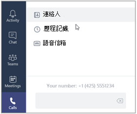

# 步驟 5：指派商務語音電話號碼給使用者

在使用者可以使用電話Teams撥打或接聽一般電話線的電話之前，您必須將電話號碼指派給他們。 在 Microsoft Teams用戶端中，使用者按一下通話時，您指派給使用者的電話號碼會列在撥號鍵台 **中**。 針對需要電話號碼的每個使用者執行下列操作。

> [!NOTE]
> 如果您沒看到任何電話號碼，請稍候。 您的新電話號碼可能需要數小時才能在 Teams。

1. 開啟 Microsoft Teams系統管理中心，然後使用全域系統管理員使用者登入 (這通常是您用來註冊帳戶Microsoft 365) 。
1. 在左側流覽窗格中，前往 <a href="https://admin.teams.microsoft.com/phone-numbers" target="_blank">**Voice 電話**  >  **號碼**</a>。
1. 在 [數位 **電話** 頁面上，選取清單中的未分配的號碼，然後按一下 [**編輯**。  
1. 在 [ **編輯窗格** 的 **[** 已指派至中） 下，依據顯示名稱或使用者名稱搜尋使用者，然後按一下 [ **指派**> 。
1. 在 **[緊急** 位置」 下，您可以選取在 [設定 緊急位置位置> 步驟中新增的緊急位置，或者如果您需要為另一個辦公室或家用辦公室建立新位置，請按一下 [新增 **位置**> 。
1. 決定是否要傳送包含電話號碼資訊的歡迎電子郵件給使用者。 如果您想要：
    - **將現有的電話號碼** 帶到商務語音 (稱為電話號碼) ，使用電話號碼資訊取消選擇電子郵件 **使用者**。
    - **使用商務語音選取** 的新電話號碼，*選取***包含電話號碼資訊的電子郵件使用者**。
1. 按一下 [儲存]。
1. 針對要指派電話號碼的每個使用者重複上述步驟。

> [!NOTE]
> 由於 Microsoft 365 或 Office 365 Teams 之間的延遲，使用者最多可能需要 24 小時才能啟用。 如果 24 小時後電話號碼未正確指派，請聯絡商務產品 [支援人員 - 系統管理協助](/microsoft-365/admin/contact-support-for-business-products)。 我們在此提供協助！

> [!div class="nextstepaction"]
> [下一個步驟：設定自動助理](set-up-auto-attendant.md?tabs=general-info#steps)
