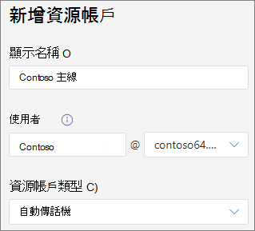
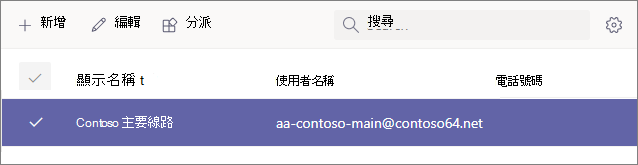

# 步驟 4：設定商務語音資源帳戶Step 4: Set up a Business Voice resource account

資源帳戶不會指派給任何特定使用者。Resource accounts aren't assigned to any specific user. 相反地，使用免費虛擬使用者授權的資源帳戶，會由裝置和服務在 Microsoft 365。Instead, resource accounts, which use a free virtual user license, are used by devices and services in Microsoft 365. 在 Microsoft Teams中，資源帳戶會指派電話號碼，然後與自動總機和通話佇列相關聯。In Microsoft Teams, resource accounts are assigned phone numbers and are then associated with auto attendants and call queues.

將資源帳戶與自動電話機和通話佇列建立關聯，您可以新增一或多個付費電話號碼或免付費電話號碼。By associating resource accounts to auto attendants and call queues, you can add one or more toll or toll-free phone numbers to them. 例如，您可以將一個資源帳戶與付費號碼關聯到當地來電者的自動語音服務。For example, you could associate one resource account with a toll number to an auto attendant for local callers. 針對長途通話，您可以將另一個資源帳戶與免付費號碼關聯到相同的自動話務員。For long distance calls, you could associate another resource account with a toll-free number to the same auto attendant.

本文中的各節將說明如何設定資源帳戶，然後為其指派電話號碼。The sections in this article show you how to set up a resource account and then assign a phone number to it. 稍後，您將將資源帳戶與自動助理建立關聯。Later on, you'll associate the resource account with an auto attendant.

## 取得虛擬使用者授權Obtain virtual user licenses

資源帳戶需要授權才能使用自動電話機和通話佇列。Resource accounts require a license in order to work with auto attendants and call queues. 您可以使用免費的虛擬使用者 *Microsoft 365 電話系統虛擬使用者* 授權。You can use a free *Microsoft 365 Phone System - Virtual User* license.

> [!NOTE]
> 如果您註冊了商務語音試用期間，您只需要執行下列步驟。You should only need to perform the following steps if you've signed up for a Business Voice trial period. 如果您購買 Business Voice 授權，虛擬授權應該已經適用于您的帳戶。If you purchased Business Voice licenses, virtual licenses should already be applied to your account. 
>
> 若要查看您是否已經有虛擬授權，請Microsoft 365全域系統管理員許可權的帳戶登入。To see if you already have virtual licenses, log into Microsoft 365 using an account with Global admin permissions. 然後前往帳單> [您的產品](https://admin.microsoft.com/Adminportal/Home#/subscriptions)。Then go to Billing > [Your products](https://admin.microsoft.com/Adminportal/Home#/subscriptions). 如果您有虛擬授權，這些授權會顯示為 Microsoft 365 電話系統 **- 虛擬使用者**。If you have virtual licenses, they'll appear as **Microsoft 365 Phone System - Virtual User**.

1. 開啟 Microsoft 365系統管理中心，然後使用全域系統管理員使用者登入 (通常是您用來註冊帳戶Microsoft 365) 。Open the Microsoft 365 admin center and log in with a user that is a Global admin (this is usually the account you used to sign up for Microsoft 365).
2. 在左側流覽窗格中，前往帳單 <a href="https://admin.microsoft.com/Adminportal/Home#/catalog" target="_blank">\*\*\*\*  >  **購買服務**</a>附加元件  >    >  **查看所有附加元件產品**。In the left navigation pane, go to <a href="https://admin.microsoft.com/Adminportal/Home#/catalog" target="_blank">**Billing** > **Purchase services**</a> > **Add-ons** > **See all Add-ons products**.
3. 卷起到最後以尋找Microsoft 365 電話系統 **– 虛擬使用者** 授權。Scroll to the end to find the **Microsoft 365 Phone System – Virtual User** license. 選取 **詳細** 資料，然後 **選取購買**。Select **Details**, then **Buy**.
4. 在授權購買頁面上，選取您想要的虛擬使用者授權數目。On the license purchase page, select the number of virtual user licenses you want. 針對您打算設定的每個自動電話機和通話佇列，您需要一個虛擬授權。You need one virtual license for each auto attendant and call queue you plan to set up. 我們建議您至少選取五個授權，以便日後輕鬆設定更多自動電話機和通話佇列，而不需要立即購買更多授權。We recommend selecting at least five licenses so you can easily set up more auto attendants and call queues in the future without having to purchase more licenses right away.
5. 取消 **勾選自動指派給沒有授權的所有使用者**。Uncheck **Automatically assign to all of your users with no licenses**.
6. 選取 **現在簽出**。Select **Check out now**.
7. 確認您的訂單， **選取下一** 步，然後 **下單**。Confirm your order, select **Next**, and then **Place order**.

> [!NOTE]
> 請記住，您仍必須  **購買授權** ，即使其成本為零。Keep in mind you must still  **Buy** the license even though it has a cost of zero.

## 建立資源帳戶Create a resource account

在您收到您的 Microsoft 365 電話系統 *- 虛擬使用者* 授權之後，您可以建立資源帳戶。After you've received your *Microsoft 365 Phone System - Virtual User* license, you can create your resource account.

1. 開啟 Microsoft Teams系統管理中心，然後使用全域系統管理員使用者登入 (這通常是您用來註冊帳戶Microsoft 365) 。Open the Microsoft Teams admin center and log in with a user that is a Global admin (this is usually the account you used to sign up for Microsoft 365).
2. 在左側流覽窗格中，前往 <a href="https://admin.teams.microsoft.com/company-wide-settings/resource-accounts" target="_blank">**全組織** 設定  >  **資源帳戶**</a>。In the left navigation pane, go to <a href="https://admin.teams.microsoft.com/company-wide-settings/resource-accounts" target="_blank">**Org-wide settings** > **Resource accounts**</a>.
3. 選取 [新增 **]**。Select **Add**.
4. 在新增 **資源帳戶窗格中** ，填寫 **顯示名稱**，然後填入 **使用者名稱**。In the **Add resource account** pane, fill out **Display name**, and then **Username**. 選擇描述性顯示名稱 ，例如「主行自動助理」，以描述資源帳戶的用途。Choose a descriptive display name such as "Main line auto attendant" to describe the purpose of the resource account.
5. 在 **資源帳戶類型中**，選取自動 **助理**。In **Resource account type**, select **Auto attendant**.
6. 選取 [儲存 **]**。Select **Save**.

## 指派授權Assign a license

建立資源帳戶之後，您需要指派一個Microsoft 365 電話系統 *- 虛擬* 使用者 *授權或電話系統* 授權。After you've created your resource account, you need to assign a *Microsoft 365 Phone System - Virtual User* license or *Phone System* license.

1. 開啟 Microsoft 365系統管理中心，然後使用全域系統管理員使用者登入 (通常是您用來註冊帳戶Microsoft 365) 。Open the Microsoft 365 admin center and log in with a user that is a Global admin (this is usually the account you used to sign up for Microsoft 365).
1. 在左側流覽窗格中，前往使用者 <a href="https://admin.microsoft.com/Adminportal/Home#/users" target="_blank">\*\*\*\*  >  **活動使用者**</a>。In the left navigation pane, go to <a href="https://admin.microsoft.com/Adminportal/Home#/users" target="_blank">**Users** > **Active users**</a>.
1. 選取您的資源帳戶。Select your resource account.
1. 在 "**授權與應用程式"** 選項卡的 **"授權**" 下，選取 Microsoft 365 電話系統 -**虛擬使用者**。On the **Licenses and Apps** tab, under **Licenses**, select **Microsoft 365 Phone System - Virtual User**.
1. 選取 **儲存變更，** 然後 **選取** 關閉 。Select **Save changes** and then **Close**.

## 指派服務編號Assign a service number

1. 開啟 Microsoft Teams系統管理中心，然後使用全域系統管理員使用者登入 (這通常是您用來註冊帳戶Microsoft 365) 。Open the Microsoft Teams admin center and log in with a user that is a Global admin (this is usually the account you used to sign up for Microsoft 365).
1. 在左側流覽窗格中，前往 <a href="https://admin.teams.microsoft.com/company-wide-settings/resource-accounts" target="_blank">**全組織** 設定  >  **資源帳戶**</a>。In the left navigation pane, go to <a href="https://admin.teams.microsoft.com/company-wide-settings/resource-accounts" target="_blank">**Org-wide settings** > **Resource accounts**</a>.
1. 選取您剛剛建立的資源帳戶，然後按一下 [ **指派/取消指派**> 。Select the resource account you just created, and then click **Assign/unassign**.
1. 在 電話 **數位類型** 下拉式下拉清單 **中，選擇** Online 。In the **Phone number type** dropdown, choose **Online**.
1. 在 **[指派的電話號碼>** 方塊中，搜尋您用的電話號碼，然後按一下 [ **新增**。In the **Assigned phone number** box, search for the number you want to use and click **Add**. 請務必包含國家/地區代碼 (例如 **+1** 250 555 0012) Be sure to include the country code (for example, **+1** 250 555 0012)
1. 按一下 [儲存]。Click **Save**.

> [!div class="nextstepaction"]
> [下一個步驟：指派電話號碼給使用者Next step: Assign phone numbers to your users](set-up-assign-numbers.md)
