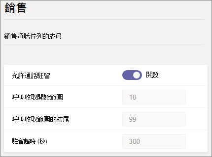
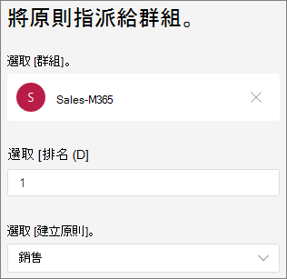

# Microsoft Teams 中的通話停駐和取回

通話保留和取回是一項功能，可讓使用者保留通話。 當通話被停駐時，服務會產生唯一的代碼以用於呼叫取回。 接著，將通話停駐的使用者或其他人就可以在支援的 App 或裝置上使用該代碼來取回通話。  (請參閱在 Teams [中](https://support.office.com/article/park-a-call-in-teams-8538c063-d676-4e9a-8045-fc3b7299bb2f) 將通話停駐，以尋找詳細資料。) 

使用通話停駐的一些常見案例有：

- 總機會為在工廠工作的人打電話。 然後，在公用電話系統上，接收者會宣告通話和代碼號碼。 接著，來電使用者就可以在工廠工廠拿起 Teams 電話，然後輸入代碼以取回通話。
- 使用者將通話放在行動裝置上，因為裝置電池電力不足。 然後，使用者可以輸入代碼，從 Teams 電話機取回通話。
- 支援代表會建立客戶通話的管道，並傳送公告給 Teams 頻道，讓專家取回通話並協助客戶。 專家在 Teams 用戶端中輸入代碼以取回通話

若要停駐和取回通話，使用者必須是企業語音使用者，而且必須包含在通話停駐政策中。

> [!NOTE]
> 通話停駐和取回僅適用于 [Teams 部署模式](teams-and-skypeforbusiness-coexistence-and-interoperability.md) ，商務用 Skype IP 電話不支援。

## 設定通話停駐和取回

您必須是 Teams 系統管理員，才能設定通話停駐和取回。 它預設為停用。 您可以為使用者啟用通話，以及使用通話停駐政策建立使用者群組。 當您將相同的原則套用至一組使用者時，他們可以自行停駐和取回通話。

啟用通話停駐政策

1. 在 Microsoft Teams 系統管理中心的左側流覽中，前往 **語音**  >  **通話公園政策**。
2. 在 [ **管理政策> 的選項卡** 上，按一下 **[新增**。
3. 為策略命名，然後將允許 **通話停駐切換** 為 **開啟**。

    

4. 選取 **儲存**。

您可以在清單中選取該策略，然後按一下編輯，以 **編輯該政策**。

為了讓該策略能夠執行，必須將它指派給使用者。 您可以 [個別指派該政策給使用者](assign-policies.md) ，或將使用者指派給群組。

將通話部分政策指派給群組

1. 在 [ **通話停駐點政策** 」 頁面上，按一下 [ **群組原則指派選項** > 的 **[新增群組**。
2. 搜尋您想要使用的群組，然後按一下 **[新增**。
3. 選擇與其他群組作業比較的排名。
4. 在 **選取一個策略** 下，選擇要指派給此群組的策略。

    

5. 選取Apply 。

## 相關主題

[在 Teams 中將通話停駐](https://support.office.com/article/park-a-call-in-teams-8538c063-d676-4e9a-8045-fc3b7299bb2f)

[在 Teams 中將原則指派給使用者](assign-policies.md)

[New-CsTeamsCallParkPolicy](https://docs.microsoft.com/powershell/module/skype/new-csteamscallparkpolicy?view=skype-ps)

[Set-CsTeamsCallParkPolicy](https://docs.microsoft.com/powershell/module/skype/set-csteamscallparkpolicy?view=skype-ps)

[Grant-CsTeamsCallParkPolicy](https://docs.microsoft.com/powershell/module/skype/grant-csteamscallparkpolicy?view=skype-ps)
