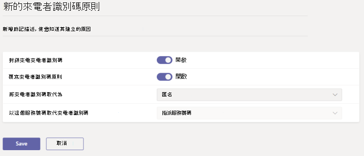

# 管理 Microsoft Teams 中的來電顯示原則。

根據預設，當 Teams 使用者撥打 PSTN 電話時，系統會顯示 Teams 使用者的電話號碼。 同樣地，當 PSTN 來電者撥打電話給 Teams 使用者時，系統也會顯示 PSTN 來電者的電話號碼。

身為系統管理員，您可以使用來電識別碼原則來變更或封鎖來電者識別碼 (也稱為來電線識別碼) 。 您可以使用來電者識別碼原則來顯示貴組織中 Teams 使用者的替代電話號碼、封鎖輸出電話號碼、封鎖顯示的來電號碼，或設定 [通話方名稱] (CNAM) 。 例如，當使用者撥打電話時，您可以變更本機號碼貴組織的主要電話號碼和公司名稱，而非使用者的電話號碼。

若要管理來電者識別碼原則，請移至 Microsoft Teams 系統管理中心的 **語音**  >  **來電** 顯示器識別碼原則。 您可以使用全域 (全組織預設值) 原則，或建立並指派自訂原則。 除非您建立並指派自訂原則，否則組織中的使用者將會自動取得全域原則。

## 建立自訂的來電識別碼原則

1. 在 Microsoft Teams 系統管理中心的左側導覽畫面中，移至 **語音**  >  **來電識別碼原則**。
2. 按一下 [新增 **]**。  

3. 輸入原則的名稱和描述。
4. 從這裡選擇您要的設定：

    - **封鎖來電者識別碼**：開啟此設定可封鎖來電的本機號碼。
    - **覆寫來電者識別碼原則**：開啟此設定可讓使用者覆寫原則中關於向來電者顯示其號碼的設定。 這表示使用者可以選擇是否要顯示其來電者識別碼。 如需詳細資訊，請參閱 [使用者對輸出來電識別碼的控制](./how-can-caller-id-be-used-in-your-organization.md#end-user-control-of-outbound-caller-id)。
    - **將來電者識別碼取代為**：選取下列其中一個本機號碼給使用者：

        - **使用者的號碼**：顯示使用者的號碼。 
        - **服務號碼**：可讓您設定服務電話號碼顯示為來電者識別碼。
        - **匿名**：將來電者識別碼顯示為匿名。

    - **使用此服務號碼取代來電者標識** 符：選擇服務號碼以取代使用者的來電者識別碼。 如果您在 [**將來電** 識別碼取代為] 中選取了 **[服務號碼**]，就可以使用此選項。

5. 按一下 [儲存]。

## 編輯來電者識別碼原則

您可以編輯全域原則或您建立的任何自訂原則。 

1. 在 Microsoft Teams 系統管理中心的左側導覽畫面中，移至 **語音**  >  **來電識別碼原則**。
2. 按一下原則名稱左側來選取原則，然後按一下 [編輯 **]**。
3. 變更您要的設定，然後按一下 [儲存 **]**。

## 指派自訂來電者識別碼原則給使用者

[!INCLUDE [assign-policy](includes/assign-policy.md)]

## 相關主題

[New-CsCallingLineIdentity](/powershell/module/skype/new-cscallinglineidentity)

[Set-CsCallingLineIdentity](/powershell/module/skype/set-cscallinglineidentity)

[在 Teams 中將原則指派給使用者](policy-assignment-overview.md)
