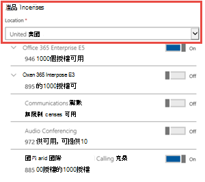

# Microsoft Teams 通話方案

撥打電話給其他商務用 Skype和 Microsoft Teams 使用者是免費的，但如果您希望使用者能夠撥打一般電話，而且您還沒有服務提供者可以撥打語音電話，則必須購買Microsoft Teams 通話方案。 如需詳細資訊，請參閱 [電話系統和通話方案](calling-plan-landing-page.md)。

以下是通話方案選項：
  
- **國內通話方案**：授權使用者可以撥打到 Microsoft 365 中指派其所在國家/地區的號碼。 包含無限的來電分鐘數。 待發分鐘數會根據購買的授權包含在內。

- **國際通話方案**：授權使用者可以根據使用者的位置，撥打到其 Microsoft 365 授權指派給使用者之國家/地區的號碼，以及 [196 個國家/地區的](country-and-region-availability-for-audio-conferencing-and-calling-plans/users-can-make-outbound-calls-to-these-countries-and-regions.md)國際號碼。 包含無限的來電分鐘數。 待發分鐘數會根據購買的授權包含在內。

- **隨時隨地付費通話方案**：授權使用者可以根據使用者的位置，撥打到其 Microsoft 365 授權指派給使用者之國家/地區的號碼，以及  [196 個國家/地區的](country-and-region-availability-for-audio-conferencing-and-calling-plans/users-can-make-outbound-calls-to-these-countries-and-regions.md)國際號碼。 包含無限的來電分鐘數。 不含撥出分鐘數。 所有撥出電話都會根據使用分鐘數收取費用，無論是通訊點數或使用後計費 (，新的商務體驗通話訂閱只需) 。 授權會根據使用者的位置指派給使用者。

  若要瞭解如何為隨手付費通話方案提供資金和使用通話分鐘方案，請參閱 [如何為隨身付費通話方案提供資金](#how-to-fund-a-pay-as-you-go-calling-plan)。

  有兩 **種隨選即用通話方案** 選項可供選擇：

  - **隨地付費通話方案區域-1**：購買此方案給美國和波多黎各、加拿大和英國使用者。
    - 區域 1 授權目前不適用於美國和波多黎各，但如果是在其他國家/地區購買，則可布建給美國和波多黎各的使用者。

  - **Pay-As-You-Go 通話方案區域-2**：針對奧地利、比利時、克羅埃西亞、捷克共和國、丹麥、愛沙尼亞、芬蘭、法國、德國、匈牙利、愛爾蘭、義大利、拉脫維亞、立陶宛、盧森堡、荷蘭、紐西蘭、挪威、波蘭、葡萄牙、羅馬尼亞、新加坡、斯洛伐克、斯洛維尼亞、南非、西班牙、瑞典和瑞士的使用者購買此方案。
    - 美國和波多黎各目前不提供第 2 區授權供銷售。

> [!NOTE]
> 墨西哥有自己的隨手付費通話方案。 它不是任何區域的一部分。 您必須購買獨立隨選即用通話方案。

相同國家/地區的所有使用者 (這是Microsoft 365 系統管理中心) 授權區域中定義的使用者國家/地區位置，且相同的通話方案共用通話分鐘方案。 例如，如果您有 100 個使用者位於相同的國家/地區，且已指派 120 分鐘的國內通話方案，則他們共用一個 12，000 分鐘的集區。 超過這些分鐘數的所有通話都會按分鐘計費。

請流覽 [國家/地區可用性](country-and-region-availability-for-audio-conferencing-and-calling-plans/country-and-region-availability-for-audio-conferencing-and-calling-plans.md) ，瞭解每個國家/地區中每個組織每個月可用的分鐘數。

> [!IMPORTANT]
> 國家/地區是根據使用者授權在 **Microsoft 365 系統管理中心**  >  作用中 **使用者** 的位置，**而非****Microsoft 365 系統管理中心** 中 **[組織設定檔**] 底下所列的帳單位址。

> [!NOTE]
> 集區功能僅適用于相同的通話方案。

如需使用限制和使用條款的詳細資訊，請參閱 [音訊會議免費撥出期間](complimentary-dial-out-period.md)。

## 如何購買通話方案

1. 您必須先購買 **電話系統附加元件授權**。 若要這麼做，[請登入Microsoft 365 系統管理中心，然後選擇 **[計費**](https://go.microsoft.com/fwlink/p/?linkid=868433)  >  **購買服務**  >  **附加元件**  >  訂閱 **立即購買]**。

    > [!NOTE]
    > 視您的方案而定，您可能需要購買更多附加元件，才能購買電話系統授權。 若要深入瞭解，請參閱 [Microsoft Teams 附加元件授權](./teams-add-on-licensing/microsoft-teams-add-on-licensing.md)。

2. 購買電話系統授權之後，您可以登入Microsoft 365 系統管理中心並 [選擇 [**計費**](https://go.microsoft.com/fwlink/p/?linkid=868433)  >  **購買服務**  >  附加元件 **訂閱**]，然後選取 [**立即購買]**，以購買通話方案。 您會在該處看到通話方案。

您可以根據組織的需求，購買不同的通話方案並指派給不同的使用者。 選取您需要的通話方案之後，請繼續結帳。 您可以將計畫指派給Microsoft 365 系統管理中心中的每個使用者。 若要瞭解做法，請參閱 [指派 Microsoft Teams 附加元件授權](./teams-add-on-licensing/microsoft-teams-add-on-licensing.md)。

## 如何為隨手付費通話方案提供資金

隨選即用通話方案的撥出通話分鐘數沒有設定，例如國內或國際通話方案。 相反地，有些系統管理員可能需要採取其他步驟來為他們的隨付通話方案提供資金。 在「隨付即用」通話方案正確地維持運作狀態之前，使用者將無法撥打撥出電話。

有兩種方式可讓您透過隨時隨地付費通話方案來募款和使用通話分鐘方案：

- **購買通訊點數**
  - 此選項適用于未透過新商務體驗 (NCE) 購買通話方案的客戶。 這些客戶必須購買通訊點數，才能為他們的隨付通話方案提供資金。
  - 如需有關如何購買及指派通訊點數的指示，請參閱 [為貴組織設定通訊點數](set-up-communications-credits-for-your-organization.md)。

- **透過新的商務體驗 (NCE) 購買隨手付費通話方案**
  - 透過新的商務體驗購買通話方案的客戶，可以支付他們上個月所用的撥出通話分鐘數。 這又稱為使用後或消費後計費。
  - 如需透過新的商務體驗購買通話方案的相關指示，請參閱 [為您的訂閱啟](/microsoft-365/commerce/subscriptions/manage-pay-as-you-go-services) 用隨付方案和 [電話公司付費就地支付的新商務超額](/partner-center/new-commerce-telco-payg)。
  
## 您是否有服務提供者為混合式使用者提供內部部署 PSTN 連線？

若是如此，您不需要購買通話方案。 Office 365 企業版 E5 包含 **電話系統** 附加元件，因此您可以繼續結帳。

然後，將企業版 E5 或 **電話系統** 附加元件授權指派給Microsoft 365 系統管理中心中的使用者。 若要瞭解做法，請參閱 [指派 Microsoft Teams 附加元件授權](./teams-add-on-licensing/microsoft-teams-add-on-licensing.md)。

## 定價資訊

- [通話方案和電話系統的定價](https://www.microsoft.com/microsoft-365/microsoft-teams/voice-calling)。
- [音訊會議的定價](https://www.microsoft.com/microsoft-365/microsoft-teams/online-meetings)。

## 如需詳細資訊

以下是說明如何設定通話方案的更多文章：

- [設定通話方案](set-up-calling-plans.md)。
- [Microsoft Teams 附加元件授權](./teams-add-on-licensing/microsoft-teams-add-on-licensing.md)。
- [以下是您在 Microsoft 365 或 Office 365 中透過手機系統取得](./here-s-what-you-get-with-phone-system.md)的功能。

## 相關文章

- [設定 商務用 Skype Online]](/SkypeForBusiness/set-up-skype-for-business-online/set-up-skype-for-business-online)
- [設定雲端語音信箱 - 管理員說明。](set-up-phone-system-voicemail.md)
- [設定通話方案](set-up-calling-plans.md)。
- [新增資金並管理通訊點數](add-funds-and-manage-communications-credits.md)。
