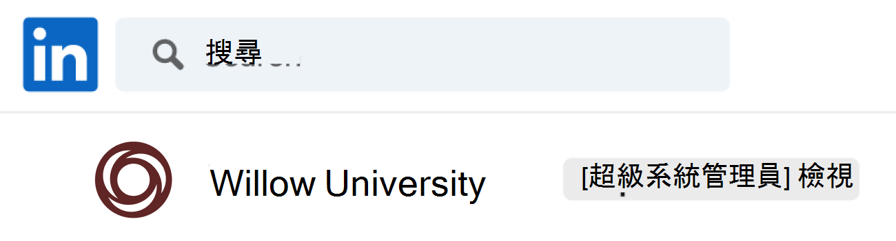
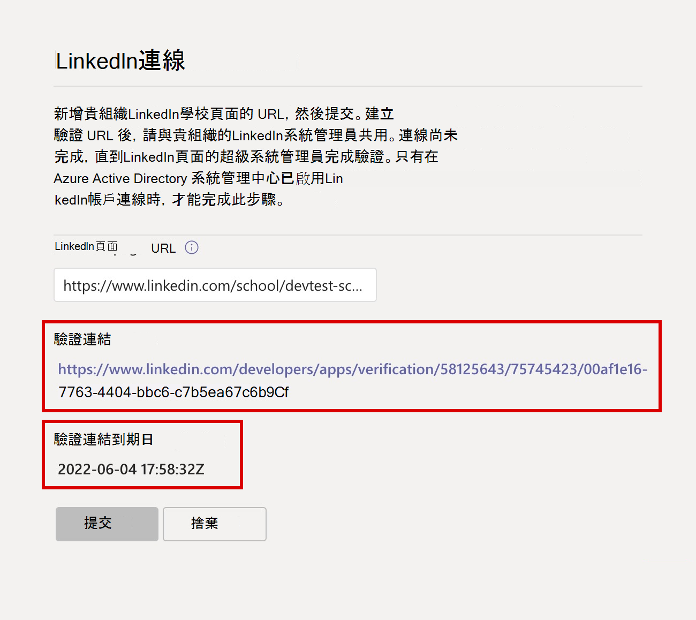
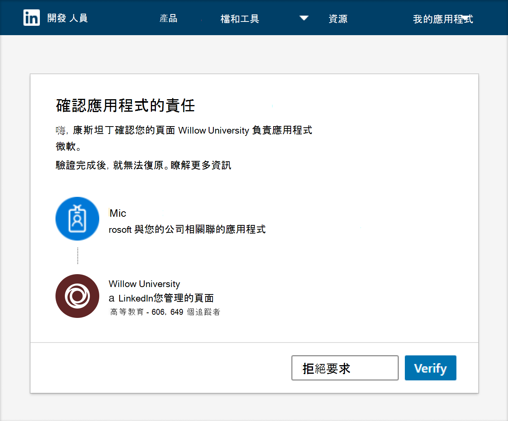

# 購買、設定及啟用 Microsoft Teams 的職業教練

[職涯教練] 是一款Microsoft Teams 教育版應用程式，由LinkedIn提供個人化的指導方針，讓教育學生能夠流覽其職涯旅程。 [職涯教練] 為教育機構提供統一的職涯解決方案，讓學生在單一位置探索其職涯路徑、發展實務技能，以及建立人脈。

## 支援的語言

[職涯教練] 以下列語言當地語系化：

- 簡體中文 (大陸) 
- 繁體中文 (，臺灣) 
- 英文 (美國) 
- 英文 (英國) 
- 法文 (加拿大) 
- 法文 (法國) 
- 德文 (德文) 
- 日文 (日本) 
- 葡萄牙文 (巴西) 
- 西班牙文 (西班牙) 
- 西班牙文 (墨西哥) 

深入瞭解 [職業教練](https://aka.ms/career-coach)。

> [!TIP]
> 使用本指南中的最佳做法和實用秘訣，為學生與教職員啟用職涯教練的功能。 請參閱 [快速規劃指南](https://support.microsoft.com/office/c5d0b934-bfcf-4fe7-8a85-ba7bbb1b6ad4) 文章。

## 檢閱需求

若要為您的教育機構啟用 [職涯教練]，請檢閱啟動並執行 [職涯教練] 所需的專案。

### 技術需求

- Office 365啟用LinkedIn帳戶連線的 Azure Active Directory 租使用者。
- Microsoft Teams。
- LinkedIn學校頁面]。

### 您教育機構的資料和檔案

- 教育機構以 [必要格式](#brand-and-preferences)顯示的標誌和圖形資產。

- 課程目錄資料。 [檢視範例檔案](https://aka.ms/career-coach/docs/it-admins/sample-catalog) 和 [檔案格式](#course-catalog-document-format-and-schema)。

- 提供的研究欄位清單。 [檢視範例檔案](https://aka.ms/career-coach/docs/it-admins/sample-fieldsofstudy)。

- 教育機構的 [LinkedIn學校頁面 URL](https://www.linkedin.com/help/linkedin/answer/40133/differences-between-a-linkedin-page-for-a-school-and-company?lang=en)。

- 教育機構的隱私權原則 URL。

- 教育機構連結至職涯相關資源，例如職涯服務網站和學生 (選用) 。

## 設定檢查清單

為您的租使用者準備發行「職涯教練」時，需要幾個系統管理員角色。 這些角色和許可權可能會指派給一個人，或可能需要與貴組織中的 IT 專業人員共同作業。 使用本指南協助識別完成所需工作所需的人員。

您可以流覽Microsoft 365 系統管理中心 >[使用者>作用中使用者>](https://go.microsoft.com/fwlink/p/?linkid=834822)選取您的使用者名稱以確認您的角色，以檢查帳戶的指派角色。

深入瞭解[Microsoft 365 系統管理中心中的系統管理員角色](/microsoft-365/admin/add-users/about-admin-roles)。

### [Microsoft 365 系統管理中心](https://go.microsoft.com/fwlink/p/?linkid=2024339)

角色： [全域系統管理員](/azure/active-directory/roles/permissions-reference#global-administrator) 職涯教練工作：

- [購買授權](#purchase-career-coach-licenses)
- [指派授權](#assign-career-coach-licenses-to-users)

### [Azure Active Directory 系統管理中心](https://go.microsoft.com/fwlink/p/?linkid=2067268)

角色： [全域系統管理員](/azure/active-directory/roles/permissions-reference#global-administrator) 職涯教練工作：

- [開啟LinkedIn帳戶連線](#turn-on-linkedin-account-connections)

### [Teams 系統管理中心](https://admin.teams.microsoft.com/dashboard)

角色： [Teams 系統管理員](/azure/active-directory/roles/permissions-reference#teams-administrator) 的職涯教練工作：

- [將 [職涯教練] 新增為已安裝的應用程式](#add-career-coach-as-an-installed-app)
- [設定 [職涯教練] 應用程式設定](#configure-career-coach-settings)
  - [品牌和喜好設定](#brand-and-preferences)  - 必要
  - [LinkedIn連線](#linkedin-connection)  - 必要
  - [課程目錄](#course-catalog)  - 必要
  - [研究](#fields-of-study)   欄位- 必要
  - [自訂](#customization) - 選用
- [設定原則](#setup-policies-and-pin-the-app)
- [釘選應用程式](#setup-policies-and-pin-the-app)

### LinkedIn開發人員入口網站

角色：[LinkedIn學校頁面超級管理員](https://www.linkedin.com/help/linkedin/answer/a541981)職涯教練工作：

- [確認LinkedIn學校頁面](#verify-the-linkedin-school-page)

## 購買職涯教練授權

### 授權類型

[職涯教練] 需要授權才能存取應用程式。

有兩種可用的授權類型。

- **學生授權** 是專為學生而設計。
- **教職員授權** 是專為參與使用職涯教練支援學生的教職員、教職員和 IT 專業人員所設計。

> [!IMPORTANT]
> 必須將職涯教練 **教職員授權** 指派給完成設定的 IT 系統管理員。

### 購買授權

職涯教練提供全球 (，除了中國和美國之外，) 合格的高等教育機構是透過註冊教育解決方案 (EES) 、雲端服務提供者 (雲端解決方案提供者) ，以及Microsoft 365 系統管理中心 (網頁直接) 的附加元件授權。

做為 Microsoft Teams 應用程式，租使用者必須具備 Microsoft 365 A3/A5 或 Office 365 A1/A3/A5 才能購買附加元件職業教練授權。 系統會為學生和教職員使用者提供個別的授權。

### 註冊免費試用版

標準的 90 天免費試用版適用于 25 個學生和 25 個教職員授權。 一個試用版適用于符合資格的租使用者。 試用版授權可由符合購買職業教練資格的租使用者從Microsoft 365 系統管理中心啟用。

如需試用啟用，請登入[Microsoft 365 系統管理中心 >帳單>購買服務>搜尋 [職涯教練](https://go.microsoft.com/fwlink/p/?linkid=868433)] 以尋找[學生授權試](https://signup.microsoft.com/signup?OfferId=b3a40ff2-3d0d-481e-a0ed-f4de1069f201)用版和[教職員授權試用版](https://signup.microsoft.com/signup?OfferId=6f6e7db5-b9ab-4baa-86be-f13d0ae6a2c8)。

## 準備職業教練

### 開啟LinkedIn帳戶連線

[職涯教練] 使用LinkedIn帳戶連線的方式有兩種。

- 若要允許學生與教職員將其 Microsoft 365 帳戶連結至其LinkedIn帳戶，並 [從 [職涯教練] 傳送LinkedIn邀請](https://support.microsoft.com/topic/career-coach-quick-start-guide-for-students-c419db47-9290-4961-9684-c3f86a9b3708#bkmk_connect_your_linkedin_account)。
- 若要使用來自LinkedIn的公用校友資料，開啟 [建立您的網路](https://support.microsoft.com/topic/career-coach-quick-start-guide-for-students-c419db47-9290-4961-9684-c3f86a9b3708#bkmk_build_your_network) 和 [探索職涯](https://support.microsoft.com/topic/career-coach-quick-start-guide-for-students-c419db47-9290-4961-9684-c3f86a9b3708#bkmk_discover_your_career_path) 功能。

1. 使用 Azure AD 組織的[全域系統管理員帳戶](#setup-checklist)登入[Azure AD 系統管理中心](https://go.microsoft.com/fwlink/p/?linkid=2067268)。

2. 選取 **[使用者]**。

3. 在 [ **使用者]** 頁面上，選取 **[使用者設定]**。

4. **LinkedIn帳戶聯** 機必須設定為 **[是** ] 或 [ **已選取] 群組** ，才能正確設定 [職涯教練]。

   - 選 **取 [是** ]，為您的教育機構中的所有使用者啟用服務。
   - 選 **取 [選取的群組** ]，只為您教育機構中的一組選取的使用者啟用服務。

如需詳細資訊，請 [參閱在 Azure Active Directory 中LinkedIn帳戶連線](/azure/active-directory/enterprise-users/linkedin-integration)。

> [!NOTE]
> 未經使用者同意，即不會共用任何資料。

### 在 Teams 中允許 Microsoft 應用程式

[職涯教練] 是 Microsoft 應用程式，因此必須在 Teams 應用程式許可權原則中允許。

1. 登入 **[Teams 系統管理中心](https://admin.teams.microsoft.com)**。

2. 在左側導覽中，選 **取 [Teams 應用程式**  >  **[許可權原則]](https://admin.teams.microsoft.com/policies/manage-apps)**。

3. 選取您的慣用原則。
    1. 如果您不確定該使用哪一個原則，請參閱 [Microsoft Teams 原則管理檔](policy-packages-edu.md)   ，或使用 [教育原則精靈](easy-policy-setup-edu.md)   來設定 Microsoft Teams 的原則。

深入瞭解 [設定許可權原則](teams-app-permission-policies.md)。

### 將 [職涯教練] 新增為已安裝的應用程式

此步驟可確保貴組織已正確設定 [職涯教練]，且學生可找到 [職涯教練]。

1. 登入 [Teams 系統管理中心](https://go.microsoft.com/fwlink/p/?linkid=2066851)。

2. 選 **取 [Teams 應用程式**   >  **設定原則**]，然後選取您的慣用原則。
    1. 如果您不確定該使用哪一個原則，請參閱 [Microsoft Teams 原則管理檔](policy-packages-edu.md)   ，或使用 [教育原則精靈](easy-policy-setup-edu.md)   來設定 Microsoft Teams 的原則。

3. 在 **[已安裝的應用程式]** 底下，選  **取 [+新增應用程式]**。

4. 在 [ **新增已安裝的應用程式** ] 窗格中，搜尋您要在啟動 Teams 時自動為使用者安裝的應用程式。 您也可以依應用程式許可權原則篩選應用程式。

5. 當您選擇應用程式清單時，請選取 [ **新增]**。

6. 選  **取 [儲存**  >  **確認]**。

> [!NOTE]
> 編輯或指派原則可能需要幾個小時，變更才會生效。 在變更完成之前，Microsoft Teams 將無法使用職業教練。

## 設定職涯教練設定

### 存取 [職涯教練] 應用程式設定

若要設定職涯教練設定並為使用者啟用，您必須是全域系統管理員或 Teams 服務系統管理員，才能存取該頁面。

1. 登入 [Teams 系統管理中心](https://go.microsoft.com/fwlink/p/?linkid=2066851)。
2. 在左側導覽中，選 **取 [Teams 應用程式**   >  **管理應用程式]**。
3. 搜尋或流覽 **職業教練**。
4. 選取 **[職涯教練**]，然後選取 [ **設定]**。

![顯示已選取 [設定] 索引標籤的 [職涯教練] 應用程式。](media/career-coach-app-updated.png)

### 職涯教練設定類別

若要有效為學生與教職員啟用職涯教練，必須執行下列設定：

- [品牌和喜好設定](#brand-and-preferences)
- [LinkedIn連線](#linkedin-connection)
- [課程目錄](#course-catalog)
- [研究欄位](#fields-of-study)

您也可以設定選擇性的 [自訂](#customization) 設定。

> [!TIP]
> 選取頁面頂端格式的 **[職涯教練** ] 路徑，快速地從某個類別流覽到另一個類別 `Manage apps\Career Coach\Setting label` 。

### 品牌和喜好設定

自訂職涯教練以符合您的教育機構品牌。 您必須尊重他人的權利，包括著作權和商標權。

> [!IMPORTANT]
> 這是必要區段。 若未提交 **品牌和喜好設定，** 就無法啟用職涯教練。

1. 登入 **[Teams 系統管理中心](https://go.microsoft.com/fwlink/p/?linkid=2066851)**。

2. 選 **取 Teams 應用程式**  >  **管理應用程式**  >  **[職涯教練**  >  **設定**  >  **] 編輯品牌和喜好設定**。

3. 在 **[商標] 底** 下，新增 **組織名稱**。

4. 上傳 **[組織] 圖示**。 此圖示會用於整個 [職涯教練] 中，用來識別您的教育機構專屬的內容、整個應用程式的課程目錄資源，以及儀表板的實際體驗區段。

    最適合將圖示格式設定為：

    - 透明 PNG
    - 1：1 的長寬比
    - 64 px x 64 px 的大小上限

5. 上傳 **學習內容縮圖影像**。 當您的教育機構未針對課程指定特定影像時，縮圖將用於整個應用程式的課程目錄學習資源。

    縮圖最適合格式化為：

    - A PNG
    - 16：9 的長寬比
    - 360 px x 200 px 的大小上限

6. 新增 **組織隱私權原則 URL**。 如果新增，學生可在 [職涯教練] 中檢閱機構的隱私權原則。

7. 選取 **[提交]**。

8. 若要確認已成功提交設定，請檢查 [[職涯教練] 設定狀態](#configuration-status) 以 **完成**。

![系統管理中心的 [職涯教練] 商標區段。](media/career-coach-brand-updated.png)

### LinkedIn連線

[LinkedIn連線] 設定會將 [職涯教練] 與機構LinkedIn學校頁面的公用校友資料連結。

只有在 [Azure Active Directory 中啟用LinkedIn帳戶聯](#turn-on-linkedin-account-connections)機時，才能完成此步驟。 LinkedIn連線設定可啟 [用建立您的網路](https://support.microsoft.com/topic/career-coach-quick-start-guide-for-students-c419db47-9290-4961-9684-c3f86a9b3708#bkmk_build_your_network) 和 [探索職涯](https://support.microsoft.com/topic/career-coach-quick-start-guide-for-students-c419db47-9290-4961-9684-c3f86a9b3708#bkmk_discover_your_career_path) 功能。

> [!IMPORTANT]
> 這是必要區段。 若未驗證LinkedIn學校頁面連線，就無法啟用職涯教練。

#### 新增LinkedIn學校頁面 URL

新增LinkedIn學校頁面 URL 的程式由 Teams 系統管理員負責。 確認 URL 的後續步驟是由您的教育機構的 LinkedIn School Page Super 系統管理員完成。

1. 登入 **[Teams 系統管理中心](https://go.microsoft.com/fwlink/p/?linkid=2066851)**。

2. 選 **取 [Teams 應用程式**  >  **] LinkedIn連線管理應用程式**  >  **的 [職涯教練**  >  **設定**  >  **]**。

3. 選取 **[連線至LinkedIn]**。

4. 搜尋LinkedIn並選取學校篩選，以尋找機構的LinkedIn **學校** 頁面。 或是與機構中的行銷人員聯繫，以判斷要使用的正確LinkedIn學校頁面。 如需詳細資訊，請參閱 [如何識別LinkedIn頁面](https://www.linkedin.com/help/linkedin/answer/40133/differences-between-a-linkedin-page-for-a-school-and-company?lang=en)。

    

5. 新增 **LinkedIn學校頁面 URL**。 URL 必須是 *學校頁面*，而不是 *公司頁面*，通常格式化為 `https://www.linkedin.com/school/willow-university/` 。

   ![LinkedIn學校頁面] 範例。](media/career-coach-linkedin-page-url-updated.png)

6. 選取 **[提交]**。

7. 成功提交 **LinkedIn學校頁面 URL** 之後，設定頁面將會更新以顯示  **[驗證連結**   ] 和 [ **驗證] 連結到期日**。 驗證連結會在 30 天后到期。

8. 複製 **[驗證] 連結** ，並與您的教育機構的 LinkedIn School Page Super 系統管理員共用。

9. LinkedIn學校頁面超級版管理員會使用唯一的驗證連結來 [驗證LinkedIn學校頁面](#verify-the-linkedin-school-page) ，並將它與職業教練建立關聯。

10. 若要確認已成功提交驗證和設定，請檢查 [[職涯教練] 設定狀態](#configuration-status) 是否標示為 [ **完成]**。

#### 確認LinkedIn學校頁面

LinkedIn學校頁面驗證必須由您的教育機構的 [LinkedIn School Page Super 系統管理員](https://www.linkedin.com/help/linkedin/answer/a541981)完成。

您可以登入LinkedIn並造訪教育機構的LinkedIn學校頁面，以檢查LinkedIn帳戶的系統管理員角色。 如果您的帳戶被指派超級系統管理員角色，您會在LinkedIn頁面上看到教育機構名稱旁列出的 **[超級** 系統管理員檢視]。 如果您沒有看到 **[超系統管理員檢視** ] 標籤，表示您不是學校頁面的超級系統管理員。

1. 在 Teams 系統管理員提交 **LinkedIn學校頁面 URL** 之後，該頁面會顯示 **[驗證] 連結** 和 **[驗證] 連結到期日**。 驗證連結會在 30 天后到期。

     

2. 複製驗證連結，並與您的LinkedIn學校頁面超級系統管理員共用。

3. [LinkedIn頁面超級管理員會開啟驗證連結，以建立職涯教練與學校頁面的關聯。 如需詳細資訊，請參閱 [LinkedIn頁面驗證的其他檔](https://www.linkedin.com/help/linkedin/answer/102672)。

4. 驗證完成後，Teams 系統管理員可以檢查 [[職涯教練](#configuration-status) ] 設定狀態是否標示為 [ **完成**]，以檢視是否已成功提交設定。

   

### 課程目錄

課程目錄會記錄您的教育機構提供的課程和課程。

職涯教練會使用課程目錄資料，從學生的成績單中識別學生的技能，並建議要參加的課程。

> [!IMPORTANT]
> 這是必要區段。 沒有課程目錄就無法啟用職涯教練。

這些課程在 [職涯教練] 中使用兩個區域：

- 課程會作為 [學習資源](https://support.microsoft.com/topic/career-coach-quick-start-guide-for-students-c419db47-9290-4961-9684-c3f86a9b3708#bkmk_grow_real_world_skills)的一部分傳回。  

- 課程和課程中繼資料，例如課程標題和描述，可用來協助學生在 [上傳成績單](https://support.microsoft.com/topic/career-coach-quick-start-guide-for-students-c419db47-9290-4961-9684-c3f86a9b3708#bkmk_Set_up_your_profile)時識別其技能。

若要建立課程目錄，請整理教育機構的所有課程清單，並使用 [課程目錄檔案格式和架構](#course-catalog-document-format-and-schema)將它上傳為 CSV 檔案。

> [!TIP]
> 從 [範例課程目錄](https://aka.ms/career-coach/docs/it-admins/sample-catalog)   檔開始，以確保正確格式設定。您也可以參照 [課程目錄檔案格式和架構](#course-catalog-document-format-and-schema) 區段，以取得必要和建議欄位的詳細資料。

#### 新增課程目錄

1. 登入 **[Teams 系統管理中心](https://go.microsoft.com/fwlink/p/?linkid=2066851)**。

2. 選 **取 [Teams 應用程式**  >  **] [管理應用程式**>搜尋 **職涯教練**  >  **設定**  >  **課程目錄]**。

3. 選 **取 [上傳課程目錄** >以 CSV 格式上傳具有必要欄的課程：課程識別碼、標題和來源連結。
    1. 每一列必須包含每一個必要欄的資料。
    1. *包含建議的欄位可傳回更好的搜尋結果和技能識別，藉此改善學生的體驗。*

4. 上傳的課程目錄區段預覽會顯示供您參考。

5. 準備就緒時，選取 **[提交** ]。

6. 上 [傳檔的狀態](#course-catalog-status) 會顯示在 [設定] 頁面中。

7. 若要確認已成功提交設定，請檢查 [[職涯教練] 設定狀態](#configuration-status) 是否標示為 [ **完成]**。

> [!TIP]
> 若要上傳新檔案，請選取 [ (X]) 關閉檔預覽，確保清除最後一個檔案。 這個動作可讓 **[上傳** ] 按鈕再次顯示。

![[職涯教練] 應用程式的課程目錄區段。](media/course-catalog-updated.png)

#### 課程目錄檔案格式和架構

檔必須採用最大大小為 18 MB 的 CSV 格式。 大型檔案應分割成多個較小的檔案，其中最多包含 15，000 列，以便順利處理。

檔必須包含必要的課程中繼資料： **課程標題**、 **課程識別碼** 和  **課程 URL**。

> [!TIP]
> 從 [範例課程目錄]( https://aka.ms/career-coach/docs/it-admins/sample-catalog) 檔開始，以確保正確格式設定。 *包含建議的欄位可傳回更好的搜尋結果和技能識別，藉此改善學生的體驗。*

下表顯示要包含在課程目錄中的專案：

| 名稱             | 地位      | 類型   | 描述                                                                    |
|------------------|-------------|--------|--------------------------------------------------------------------------------|
| courseId         | 必要    | 字串 | 課程識別碼會對應到學生文字記錄中產生的內容。             |
| 標題            | 必要    | 字串 | 課程標題。                                                              |
| sourceLink       | 必要    | URL    | 網站連結至課程頁面，以深入瞭解課程和教學大綱。   |
| 描述      | 建議 | 字串 | 說明學習目標之課程的簡介文字。       |
| language         | 建議 | 字串 | 課程的語言。 使用標準語言代碼。                           |
| 格式           | 建議 | 字串 |  (線上、影片、親自) 教學模式。                                   |
| 縮圖連結    | 建議 | URL    | 課程影像的縮圖連結。                                            |
| 縮圖AltText | 建議 | 字串 | 影像的協助工具替代文字                                           |
| educationLevel   | 建議 | 字串 | 例如，研究層級。 應徵者/畢業生。                                       |
| 主題           | 建議 | 字串 | 與課程教學技能相關的主題或標籤。          |

### 課程目錄狀態

檔上傳後，課程目錄狀態會顯示在課程目錄設定頁面上，提供檔上傳和處理狀態的詳細資料。

在處理期間，[職涯教練] 會分析檔中的重複專案、從標題和描述中擷取技能來正規化和豐富您的目錄，並將它儲存在學習頁面和學生字幕上傳期間，以用於技能識別。

![[職涯教練] 應用程式的課程目錄上傳狀態。](media/career-coach-course-catalog-status-updated.png)

| 列           | 值     | 描述                                                                                        |
| ---------------- | --------- | -------------------------------------------------------------------------------------------------- |
| 上傳的時間    | 時間 戳 | IT 系統管理員上傳檔的日期和時間。                                                     |
| 完成時間   | 時間 戳 | 檔的處理日期和時間。                                               |
| 已上傳的課程 | 整數   | 檔中找到的課程數目。                                                           |
| 𽩣取狀態 | 待處理   | 用於處理的佇列中的檔。                                                                  |
| 𽩣取狀態 | 運行   | 目前正在處理檔。 視檔案大小而定，此程式最多可能需要 6 小時。 |
| 𽩣取狀態 | 成功   | 拴入程式已完成，設定完所有必要的設定後，[職涯教練] 中就會提供課程。 |
| 𽩣取狀態 | 失敗    | 檢查檔案格式並重新上傳。                                                           |
| 重複       | 整數   | 在檔中找到重複的課程數目。                                                 |

> [!NOTE]
> 如果課程目錄狀態中的欄為空白，表示目前正在處理檔，且無法使用這些值。 視目錄的大小而定，此程式最多可能需要 6 小時。 檔處理完成後，值就會填入。 您可以重新整理頁面以檢查更新。

### 研究欄位

研究領域是與主要領域、學術專業和學位計畫同義字。 當學生開始使用 [職涯教練] 並開始設定其個人化設定檔時，會參考這些研究欄位。

欄位清單可讓學生探索可能感興趣的學習欄位，並將計畫中的學術重點新增至其在 [職涯教練] 中的個人檔案。

> [!IMPORTANT]
> 這是必要區段。 沒有研究欄位清單，就無法啟用職涯教練。
>
> 新增所有可供學生使用的學習欄位，例如工程、英文、商務等等

#### 新增研究欄位

1. 登入 **[Teams 系統管理中心](https://go.microsoft.com/fwlink/p/?linkid=2066851)**。

2. 選 **取 [Teams 應用程式**  >  **] [管理應用程式**>搜尋 **職涯教練**  >  **設定**  >   **] [研究欄位]**。

3. 選 **取 [上傳** ] 以 CSV 格式上傳研究檔案的欄位。 隨即會顯示研究檔欄位的預覽。

4. 選取 **[提交]**。

5. 若要確認已成功提交設定，請檢查 [[職涯教練] 設定狀態](#configuration-status) 是否標示為 [ **完成]**。

#### 研究檔案格式和架構的欄位

檔必須採用最大大小為 18 MB 的 CSV 格式。 檔必須包含必要的中繼資料： **研究欄位名稱**。

下表顯示要包含在研究欄位中的專案：

| 名稱          | 地位   | 類型   | 描述                    |
|---------------|----------|--------|--------------------------------|
| fieldsOfStudy | 必要 | 字串 | 研究欄位的名稱 |

### 定制

[自訂] 設定支援新增機會，以在您的教育機構提供給學生的儀表板上獲得實務經驗。

建議的連結包括可協助學生獲得實務經驗的連結，例如工作面板、活動、職涯服務辦公室、職涯相關活動和學生俱樂部。

1. 登入 **[Teams 系統管理中心](https://go.microsoft.com/fwlink/p/?linkid=2066851)**。

2. 選 **取 [Teams 應用程式**  >  **] >** 搜尋 **職涯教練**  >  **設定**] 管理應用程式。

3. 選 **取 [自訂體驗**  >  **+ 新增]**

4. 新增每個 **標題**、 **URL** 和 **資訊提示描述** >選取 [ **套用]**。

5. 隨即會顯示新增資訊的預覽。

6. 選取 **[提交]**。

## 職涯教練設定狀態

Teams 系統管理中心的 [職涯教練] 設定頁面提供設定 [職涯教練] 的不完整、擱置、完成和失敗的步驟之狀態摘要。

狀態訊息可協助您判斷 [職涯教練] 是否已正確設定並準備好發行給您的租使用者。

### 設定狀態

應用程式設定頁面的 [設定狀態] 區段會使用下列圖例顯示即時狀態。

![[職涯教練] 應用程式的設定狀態欄段。](media/career-coach-config-status-updated.png)

| 類別                    | 地位                                        | 描述                                                 |
| --------------------------- | --------------------------------------------- | ----------------------------------------------------------- |
| 服務布建狀態 | 職業教練正在初始化您的租使用者。     | 存取 [職涯教練] 設定頁面時，系統會自動布建服務。 設定變更必須等到初始設定完成後才會接受。 服務布建的預估時間最多為 15 分鐘。 |
| 服務布建狀態 | [職涯教練] 已準備好設定。       | [職涯教練] 設定頁面已準備好供 IT 系統管理員提交設定。 |
| 品牌和喜好設定       | 尚未開始                                   | 必須提交設定。 |
| 品牌和喜好設定       | 遺失：學習圖示                        | 上傳遺失的學習內容縮圖影像。 |
| 品牌和喜好設定       | 遺失：標誌                                 | 上傳遺失的組織圖示。 |
| 品牌和喜好設定       | 遺失：機構名稱                     | 上傳遺失的組織名稱。 |
| 品牌和喜好設定       | 完成                                      | 不再需要採取任何動作。 設定已完成。 |
| 課程目錄上傳       | 尚未開始                                   | 必須提交課程目錄 CSV。 |
| 課程目錄上傳       | 遺失：成功上傳課程目錄   | 如需課程目錄處理的詳細資料，請查看課程目錄狀態。 |
| 課程目錄上傳       | 完成                                      | 不再需要採取任何動作。 設定已完成。 |
| LinkedIn學校連線  | 尚未開始                                   | LinkedIn必須提交學校頁面 URL。 |
| LinkedIn學校連線  | 遺失：核准LinkedIn學校頁面 URL | 等待LinkedIn學校頁面的系統管理員驗證核准。 |
| LinkedIn學校連線  | 完成                                      | 不再需要採取任何動作。 設定已完成。 |
| 上傳研究欄位      | 尚未開始                                   | 必須提交研究領域 CSV。 |
| 上傳研究欄位      | 遺失：感興趣的領域                    | 檢查上傳研究欄位是否成功。 |
| 上傳研究欄位      | 完成                                      | 不再需要採取任何動作。 設定已完成。 |

> [!NOTE]
> 將所有必要步驟標示為完成後，[職涯教練] 就可以成功發行到您的租使用者。

## 讓貴組織能夠使用職涯教練

此時，已為您的組織設定職涯教練。

接下來，請依照下列步驟，確保貴組織可在 Microsoft Teams 中使用職涯教練。

### 指派職涯教練授權給使用者

如需逐步指示，請參閱 [指派授權給使用者](/microsoft-365/admin/manage/assign-licenses-to-users)。

### 設定原則並釘選應用程式

釘選 [職涯教練] 會將它新增到 Microsoft Teams 視窗的左側軌，讓學生更容易存取和看到它。 如果您想要為一部分使用者釘選 [職涯教練]，則必須實作包含該群組的 [設定原則](teams-app-setup-policies.md) 。

1. 登入 **[Teams 系統管理中心](https://go.microsoft.com/fwlink/p/?linkid=2066851)**。

2. 選 **取 [Teams 應用程式**  >  **設定原則**]，然後選取您的慣用原則。

    如果您不確定該使用哪一個原則，請參閱 [Microsoft Teams 原則管理檔](policy-packages-edu.md) ，或使用 [教育原則精靈](easy-policy-setup-edu.md) 來設定 Microsoft Teams 的原則。

3. 在 **[釘選的應用程式]** 底下，選擇 [ **新增應用程式]**。

4. **根據此應用程式許可權** 原則，在 [搜尋] 底下選取您的慣用原則。

5. 在 [依 **名稱搜尋**] 底下搜尋 **職涯教練**，然後選取 [ **新增**  >  ] 以關閉窗格。****

6. 選擇要顯示應用程式的順序，然後選取 [ **確認]**。

> [!NOTE]
> 學生將會在 Microsoft Teams 中收到已釘選 [職涯教練] 的通知。

## 職涯教練中的協助工具

職涯教練有責任建立所有使用者都易於存取的體驗。 職涯教練符合 WCAG 2.1 A、AA 和 AAA，並採用所有全球協助工具標準。

職涯教練協助工具功能包括：

- 邏輯標題結構和清楚的焦點指標，可支援按滑鼠、鍵盤或語音流覽。
- 略過連結可讓使用者更快速地存取重要功能。
- 清除簡潔的文字，讓所有使用者都能輕鬆閱讀及理解職涯教練。
- 針對各種需求和喜好設定，使用深色和高對比模式的色彩對比。
- 使用 [第 508 節](https://www.dhs.gov/trusted-tester)信任的測試人員) 在 PC、Mac、Android 和 iPhone (所有格式上驗證的正確大小使用者體驗。

## 疑難排解

### 遺失必要的組態資料

如果您在 [職涯教練] 體驗中看到「目前正在設定職涯教練，供您使用」，則 **尚未新增所有必要的組態資料**。

您 **必須先完成下列各節** ，才能使用職業教練：

- [品牌和喜好設定](#brand-and-preferences)
- [LinkedIn連線](#linkedin-connection)
- [課程目錄](#course-catalog)
- [研究欄位](#fields-of-study)

參考 [[職涯教練] 設定狀態](#configuration-status) ，以查看哪些設定需要完成。

### 課程目錄或研究資料欄位的格式設定不正確

課程目錄和研究欄位的 CSV 具有必要的格式，最大大小為 18 MB。

參考 [職涯教練 [課程] 目錄檔架構](#course-catalog-document-format-and-schema) 和 [研究檔架構的](#fields-of-study-document-format-and-schema) [職涯教練] 欄位，以確保設定正確。

此外，課程目錄檔案應該不超過 15，000 列，以確保處理成功。

### [職涯教練] 設定頁面中遺失欄位

[職涯教練] 設定頁面需要欄位。 如果必要欄位尚未完成，頁面將不會提交。

您可能不會看到警告訊息;無法提交頁面。

當您在頁面頂端看到綠色橫幅時，表示提交成功。

### 安裝原則變更尚未完成

如果使用者的 Microsoft Teams 未顯示 [職涯教練]，則設定原則變更可能尚未生效。 在設定原則變更生效之前，Microsoft Teams 不會為使用者安裝和釘選職涯教練。 原則變更可能需要幾個小時才會生效。

不過，[職涯教練] 可以直接從 Microsoft Teams App Store 安裝。

- 如果使用者在 Microsoft Teams 應用程式商店中找不到 [職涯教練]，請檢閱您的應用程式許可權原則，並確保 [職涯教練] 不是封鎖的應用程式。
- [職涯教練] 是一個 Microsoft 應用程式，最佳作法是依許可權原則允許 Microsoft 應用程式。 深入瞭解 [設定許可權原則](teams-app-permission-policies.md)。

### 職涯教練初始化尚未完成

您可能會遇到下列錯誤：「我們無法擷取應用程式的設定。 請再試一次。 如果您仍然遇到問題，請連絡 Microsoft 客戶支援」。

檢查 [職涯教練] 設定頁面上的 **[服務布建狀態** ]。

如果您的租使用者仍在初始化狀態，請等候 15 分鐘，然後再試一次。 如果您仍然收到錯誤訊息，請開啟支援票證。

## 資源

下列資源將協助您規劃 Microsoft Teams 的職業教練實作。

- [職涯教練快速規劃指南](https://support.microsoft.com/topic/career-coach-quick-planning-guide-c5d0b934-bfcf-4fe7-8a85-ba7bbb1b6ad4)
- [學生的職涯教練快速入門手冊](https://support.microsoft.com/topic/career-coach-quick-start-guide-for-students-c419db47-9290-4961-9684-c3f86a9b3708)
- [使用職涯教練課程方案吸引學生](https://support.microsoft.com/topic/get-started-with-career-coach-goals-and-activities-086ce412-05de-4259-a9fd-c96471cef1b0?preview=true)
- [歡迎使用 Microsoft Teams](Teams-overview.md)
- [如何推出 Teams](get-started-with-teams-resources-for-org-wide-rollout.md?tabs=SmallBusiness)
- [Microsoft Teams 中的團隊和頻道概覽](teams-channels-overview.md)
- [在 Microsoft Teams 系統管理中心管理應用程式](manage-apps.md)
- [開始使用 Microsoft Teams 的系統管理訓練](ITAdmin-readiness.md)
- [Teams 疑難排解](/microsoftteams/troubleshoot/teams-welcome)
- [在 Microsoft Teams 中管理應用程式權限原則](teams-app-permission-policies.md)
